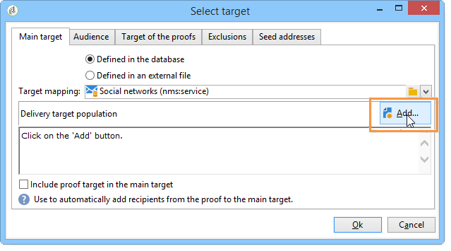

# Facebook에 게시{#publishing-on-facebook}

구성이 완료되면 Social Marketing에서 Facebook 페이지의 담벼락에 발행물을 게시할 수 있습니다.

## 제한 사항 {#limitations}

다음 제한 사항은 Facebook에 고유합니다.

* 메시지는 1,000자를 초과할 수 없습니다.
* HTML은 지원되지 않습니다.

## 배달 만들기 {#creating-the-delivery}

배달 템플릿을 사용하여 새 배달을 **[!UICONTROL Publish to a brand page]** 만듭니다.

## 기본 대상 선택 {#selecting-the-main-target}

게시를 게시할 페이지를 선택해야 합니다.

1. 링크를 **[!UICONTROL To]** 클릭합니다.

   

1. 단추를 **[!UICONTROL Add]** 클릭합니다.

   

1. 을 **[!UICONTROL A Facebook page]**&#x200B;선택합니다.

   

1. 필드에서 **[!UICONTROL Folder]** Facebook 페이지가 포함된 서비스 폴더를 선택합니다. 기본적으로 페이지는 **[!UICONTROL Facebook]** 서비스 폴더의 루트에 저장됩니다. 그런 다음 게시할 Facebook 페이지를 선택합니다.

   

## 증명 대상 선택 {#selecting-the-proof-target}

이 **[!UICONTROL Target of the proofs]** 탭에서는 전달을 전송하기 전에 테스트에 사용할 Facebook 페이지를 정의할 수 있습니다. 이를 위해 전용 비공개 Facebook 페이지를 만드는 것이 좋습니다. 비공개 Facebook 페이지 만들기에 대한 자세한 내용은 테스트 [Facebook 페이지](../../social/using/publishing-on-facebook-walls.md#creating-a-test-facebook-page)만들기를 참조하십시오. 증명 대상을 선택하려면 기본 대상과 동일한 단계를 적용합니다.기본 [대상을](#selecting-the-main-target)선택합니다.

>[!NOTE]
>
>모든 게재에 대해 동일한 Facebook 테스트 페이지를 사용하는 경우, **[!UICONTROL Publish to a brand page]** **[!UICONTROL Resources > Templates > Delivery templates]** 노드를 통해 액세스하는 전달 템플릿에 증명 대상을 저장할 수 있습니다. 증명 타겟은 각 새 게재에 대해 기본적으로 입력됩니다.

## 대상 정의 {#defining-the-audience}

로컬 세그먼트를 사용하여 발행물을 볼 수 있는 공개 유형을 세분화하려면 세그먼트당 하나의 Facebook 페이지를 만드는 것이 좋습니다(예:Adobe Campaign Paris, Adobe Campaign London 등).

그러나 Facebook에서 사용하는 대상 필터를 사용할 수도 있습니다. 오퍼의 **[!UICONTROL Audience]** 탭에는 다음 네 가지 필터가 **[!UICONTROL Select target window]** 있습니다.

* **[!UICONTROL Country]**
* **[!UICONTROL Regions]**
* **[!UICONTROL Cities]**
* **[!UICONTROL Languages]**

>[!CAUTION]
>
>이 기능을 주의해서 사용하십시오. 배달 보고서에서, **[!UICONTROL Number of fans]** 표시기는 이러한 Facebook 필터를 고려하지 않습니다.
>
>Facebook은 대상 필터 목록과 해당 값을 변경할 수 있습니다.

## 메시지 내용 정의 {#defining-message-content}

드롭다운 메뉴를 사용하여 발행물 유형을 **[!UICONTROL Content type]** 선택합니다.

다음과 같은 유형의 배달을 사용할 수 있습니다.

* a **[!UICONTROL Status]**
* a **[!UICONTROL Status with a link]**
* a **[!UICONTROL Status with a YouTube link]**
* a **[!UICONTROL Photo album]**

### 상태 게시 {#publishing-a-status}

상태 유형 배달은 아래 예와 같이 텍스트만 포함할 수 있습니다.

입력 영역에 게시 상태를 입력합니다.

### 링크가 있는 상태 게시 {#publishing-a-status-with-a-link}

링크가 있는 상태 유형 배달에는 텍스트, 이미지 및 링크가 포함될 수 있습니다. 다음 섹션에서는 게재 편집 화면의 필드와 Facebook의 최종 발행물 간의 대칭성에 대해 자세히 설명합니다.

다양한 필드를 입력합니다.

>[!CAUTION]
>
>모든 URL은 **&quot;http://&quot;** 또는 **&quot;https://&quot;로 시작해야 합니다**.

1. 필드에 페이지 이름 아래에 표시될 텍스트를 **[!UICONTROL Status]** 입력합니다.
1. 필드에 발행물 제목을 **[!UICONTROL Name]** 입력합니다.
1. 필드에 발행물이 가리키는 URL을 **[!UICONTROL Link]** 입력합니다.

   >[!NOTE]
   >
   >Facebook 애플리케이션의 URL에 **[!UICONTROL Link]** 필드를 추가하여 홍보하려면 스마트폰 표시 기준에 맞게 조정하는 것이 좋습니다.
   >
   >1. Facebook 애플리케이션 https://developers.facebook.com/apps [을](https://developers.facebook.com/apps)선택하고 **[!UICONTROL Settings > Basic]** 탭을 선택합니다.
   >1. 필드를 **[!UICONTROL Namespace]** 입력합니다.
   >1. 다음 **[!UICONTROL Mobile Site URL]** 필드를 입력합니다.사용자가 스마트폰에서 발행물 링크를 클릭하면 Facebook에서 이 필드에 정의된 URL로 자동으로 리디렉션됩니다.
   >1. Facebook 디스플레이가 사용되는 장치(스마트폰 또는 PC)의 기능으로 개인화되도록 웹 애플리케이션을 만듭니다.
   >1. Adobe Campaign 콘솔을 통해 발행물 **[!UICONTROL Link]** 필드로 이동하여 **[!UICONTROL Canvas page]** 필드의 URL을 입력합니다.

1. 발행물 왼쪽에 표시될 이미지의 URL을 **[!UICONTROL Image]** 필드에 입력합니다.

   >[!CAUTION]
   >
   >Facebook에서 이미지를 업로드하려면 공개 인터넷 사이트에서 이미지를 호스팅해야 합니다.

1. 발행물 끝에 표시될 텍스트를 **[!UICONTROL Caption]** 필드에 입력합니다.
1. 필드로 이동하여 제목 아래에 표시할 텍스트를 입력합니다 **[!UICONTROL Description]** .

### YouTube 링크를 사용하여 상태 게시 {#publishing-a-status-with-a-youtube-link}

이 유형의 콘텐트를 사용하면 YouTube 비디오에 대한 링크를 게시할 수 있습니다. 일반 링크가 있는 상태와 마찬가지로 상태, 이름, 캡션, 설명 및 추가 링크를 정의할 수 있습니다. Facebook에서 자동으로 이미지가 추가됩니다. 배달 편집 화면의 필드와 Facebook의 최종 발행물 간의 대칭은 다음과 같습니다.

다양한 필드를 입력합니다.

>[!CAUTION]
>
>모든 URL은 **&quot;http://&quot;** 또는 **&quot;https://&quot;로 시작해야 합니다**.

1. 필드에 페이지 이름 아래에 표시될 텍스트를 **[!UICONTROL Status]** 입력합니다.
1. 필드에 발행물 제목을 **[!UICONTROL Name]** 입력합니다.
1. 필드에 YouTube 비디오 코드를 **[!UICONTROL Video code]** 입력합니다. 예를 들어 &#39;http://www.youtube.com/watch?v=abc123456&#39;&#39; 링크의 경우 비디오 코드는 &#39;abc123456&#39;입니다.
1. 발행물 끝에 표시될 텍스트를 **[!UICONTROL Caption]** 필드에 입력합니다.
1. 필드로 이동하여 제목 아래에 표시할 텍스트를 입력합니다 **[!UICONTROL Description]** .

### 사진 앨범 게시 {#publishing-a-photo-album}

이러한 유형의 컨텐츠를 사용하여 사진 앨범을 게시할 수 있습니다. 앨범의 이름 및 설명과 각 사진에 대한 캡션을 추가할 수 있습니다. 배달 편집 화면의 필드와 Facebook의 최종 발행물 간의 대칭은 다음과 같습니다.

다양한 필드를 입력합니다.

1. 을 입력하여 **[!UICONTROL Album name]**&#x200B;시작합니다.
1. 그런 다음 사진 위에 **[!UICONTROL Description]** 표시할 아이콘을 입력합니다.
1. 사진을 추가하려면 **[!UICONTROL Add]** 버튼을 클릭하고 사진을 선택한 다음 을 클릭합니다 **[!UICONTROL Open]**.
1. 캡션을 각 사진에 추가할 수 있습니다.

## 미리 보기 {#previewing}

이 **[!UICONTROL Preview]** 탭에서는 발행물의 렌더링을 볼 수 있습니다.

1. 탭을 **[!UICONTROL Preview]** 클릭합니다.
1. 드롭다운 **[!UICONTROL Test personalization]** 메뉴를 클릭하고 **[!UICONTROL Service]**&#x200B;선택합니다.
1. 필드에서 **[!UICONTROL Folder]** Facebook 페이지가 포함된 서비스 폴더를 선택합니다. 기본적으로 페이지는 **[!UICONTROL Facebook]** 서비스 폴더의 루트에 저장됩니다.
1. 미리 보기를 테스트할 Facebook 페이지를 선택합니다.

>[!NOTE]
>
>미리 보기는 최종 Facebook 게시물과 약간 다를 수 있습니다. 발행물의 정확한 렌더링을 위해 최종 배포 전에 증명을 전송하는 것이 좋습니다. 증명 [보내기를](#sending-the-proof)참조하십시오.

## 추적 구성 {#configuring-tracking}

게재 보고서와 게재 및 서비스의 **[!UICONTROL Edit > Tracking]** 탭에서 추적을 볼 수 있습니다.

게시에 포함된 URL에 대한 클릭은 Adobe Campaign에 의해 측정됩니다. 단추 클릭 수, 댓글 수 및 팬 수는 Facebook에 의해 측정됩니다. **[!UICONTROL Like]**

추적 구성은 이메일 전달과 동일합니다. For more on this, refer to [this section](../../delivery/using/monitoring-a-delivery.md).

>[!NOTE]
>
>배달 **[!UICONTROL Publish to a brand page]** 템플릿에서 추적은 기본적으로 활성화되어 있습니다.

## 증명 보내기 {#sending-the-proof}

비공개 Facebook 테스트 페이지에서 발행물의 정확한 렌더링을 보려면 최종 배달 전에 발행물 증명을 보내는 것이 좋습니다. 비공개 Facebook 테스트 페이지 만들기에 대한 자세한 내용은 테스트 [Facebook 페이지](../../social/using/publishing-on-facebook-walls.md#creating-a-test-facebook-page)만들기를 참조하십시오. 대상 증명을 선택하는 단계는 증명 대상 [선택을](#selecting-the-proof-target)참조하십시오.

증명 배달은 이메일 배달과 동일합니다. 이 [섹션을](../../delivery/using/steps-validating-the-delivery.md#sending-a-proof)참조하십시오.

## 메시지 보내기 {#sending-the-message}

1. 컨텐츠가 승인되면 **[!UICONTROL Send]** 단추를 클릭합니다.
1. 단추를 **[!UICONTROL Deliver as soon as possible]** 선택하고 **[!UICONTROL Analyze]** 클릭합니다.

   >[!NOTE]
   >
   >이 **[!UICONTROL Postpone the delivery]** 옵션을 사용하면 배달을 나중 날짜로 연기할 수 있습니다.

   

1. 분석이 완료되면 결과를 확인합니다.
1. 을 **[!UICONTROL Confirm delivery]**&#x200B;클릭한 다음 을 클릭합니다 **[!UICONTROL Yes]**.

   

