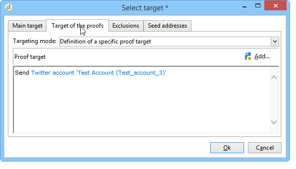
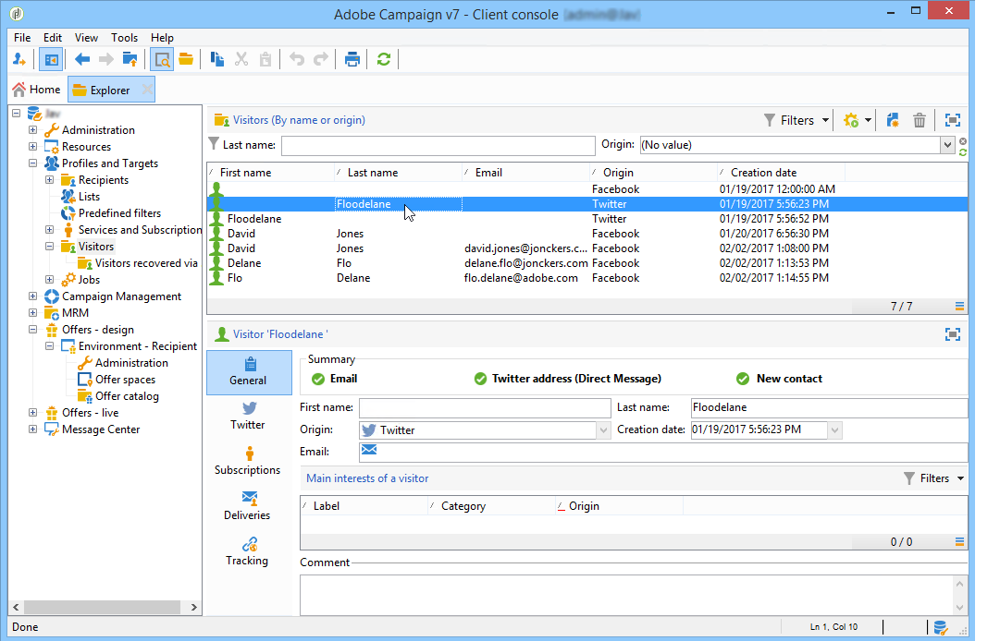

# Twitter에서 게시{#publishing-on-twitter}

## Twitter 계정에 게시 {#publishing-on-your-twitter-accounts}

구성이 완료되면 Social Marketing에서 트윗을 Twitter 계정에 보낼 수 있습니다.

### 제한 사항 {#limitations}

다음 제한 사항은 Twitter에 고유한 제한 사항입니다.

* 메시지는 140자를 초과할 수 없습니다.
* HTML 형식이 지원되지 않습니다.

### 배달 만들기 {#creating-the-delivery}

배달 템플릿을 기반으로 새 배달을 **[!UICONTROL Tweet (twitter)]** 만듭니다.

### 기본 대상 선택 {#selecting-the-main-target}

트윗을 보낼 계정을 선택합니다.

1. 링크를 **[!UICONTROL To]** 클릭합니다.

   

1. 단추를 **[!UICONTROL Add]** 클릭합니다.

   

1. 을 **[!UICONTROL A Twitter account]**&#x200B;선택합니다.

   

1. 필드에서 **[!UICONTROL Folder]** Twitter 계정이 포함된 서비스 폴더를 선택합니다. 그런 다음 트윗을 보낼 Twitter 계정을 선택합니다.

   

### 증명 대상 선택 {#selecting-the-target-of-the-proof}

이 **[!UICONTROL Target of the proofs]** 탭에서는 최종 배달 전에 테스트 배달에 사용할 Twitter 계정을 정의할 수 있습니다. 따라서 교정본을 전송하는 전용 Twitter 계정을 만드는 것이 좋습니다. 비공개 Twitter 계정을 만드는 방법에 대한 자세한 내용은 Twitter에서 [테스트 계정 만들기를 참조하십시오](../../social/using/configuring-publishing-on-twitter.md#creating-a-test-account-on-twitter). 증명 대상을 선택하는 단계는 기본 대상을 선택하는 방법과 동일합니다. Twitter [에서 테스트 계정 만들기를 참조하십시오](../../social/using/configuring-publishing-on-twitter.md#creating-a-test-account-on-twitter).

>[!NOTE]
>
>모든 게재에 대해 동일한 Twitter 테스트 계정을 사용하는 경우 노드를 통해 액세스한 증명 대상을 **[!UICONTROL Tweet]** 배달 템플릿에 저장할 수 **[!UICONTROL Resources > Templates > Delivery templates]** 있습니다. 그런 다음 각 새 게재에 대해 기본적으로 증명 대상을 입력합니다.

### 메시지 컨텐츠 정의 {#defining-the-message-content}

탭에 트윗의 컨텐츠를 **[!UICONTROL Content]** 입력합니다.

### 미리 보기 보기 {#viewing-the-preview}

이 **[!UICONTROL Preview]** 탭에서는 트윗 렌더링을 볼 수 있습니다.

1. 탭을 **[!UICONTROL Preview]** 클릭합니다.
1. 드롭다운 **[!UICONTROL Test personalization]** 메뉴를 클릭하고 **[!UICONTROL Service]**&#x200B;선택합니다.
1. 필드에서 **[!UICONTROL Folder]** Twitter 계정이 포함된 서비스 폴더를 선택합니다.
1. 미리 보기를 테스트할 Twitter 계정을 선택합니다.

>[!NOTE]
>
>미리 보기는 최종 트윗과 약간 다를 수 있습니다. 최종 배달 전에 트윗의 정확한 렌더링을 보려면 증명을 보내는 것이 좋습니다. 증명 [보내기를](#sending-the-proof)참조하십시오.

### 추적 구성 {#configuring-tracking}

게재 보고서와 게재 및 서비스의 **[!UICONTROL Edit > Tracking]** 탭에서 추적을 볼 수 있습니다.

추적 구성은 이메일 전달과 동일합니다. For more on this, refer to [this section](../../delivery/using/monitoring-a-delivery.md).

>[!NOTE]
>
>배달 **[!UICONTROL Tweet]** 템플릿에서 추적은 기본적으로 활성화되어 있습니다.

>[!IMPORTANT]
>
>트윗을 분석하는 로봇과 실제로 클릭하는 사용자의 차이는 파악할 수 없습니다.

### 증명 보내기 {#sending-the-proof}

비공개 Twitter 테스트 페이지에서 발행물의 정확한 렌더링을 얻으려면 최종 배달 전에 발행물 증명을 보내는 것이 좋습니다. 비공개 Twitter 계정 만들기에 대한 자세한 내용은 Twitter [에서 테스트 계정 만들기를 참조하십시오](../../social/using/configuring-publishing-on-twitter.md#creating-a-test-account-on-twitter). 증명 대상을 선택하는 단계는 증명 대상 [선택에서](#selecting-the-target-of-the-proof)자세히 설명합니다.

증명 배달은 이메일 배달과 동일합니다. 이 [섹션을](../../delivery/using/steps-validating-the-delivery.md#sending-a-proof)참조하십시오.

### 메시지 보내기 {#sending-the-message}

1. 컨텐츠가 승인되면 **[!UICONTROL Send]** 단추를 클릭합니다.
1. 단추를 **[!UICONTROL Deliver as soon as possible]** 선택하고 **[!UICONTROL Analyze]** 클릭합니다.

   >[!NOTE]
   >
   >이 **[!UICONTROL Postpone the delivery]** 옵션을 사용하면 배달을 나중 날짜로 연기할 수 있습니다.

   

1. 분석이 완료되면 결과를 확인합니다.
1. 을 **[!UICONTROL Confirm delivery]**&#x200B;클릭한 다음 을 클릭합니다 **[!UICONTROL Yes]**.

## 구독자에게 쪽지 보내기 {#sending-direct-messages-to-subscribers}

### 운영 원칙 {#operating-principle}

워크플로우(Twitter 계정 **[!UICONTROL Synchronize Twitter accounts]** 동기화 참조)는 Twitter 가입자에게 쪽지를 보낼 수 있도록 Twitter 가입자 목록을 복구합니다. 복구된 팔로우어는 특정 표에 저장됩니다.방문자 테이블. Twitter 팔로우어 목록을 표시하려면 **[!UICONTROL Profiles and Targets > Visitors]** 노드로 이동합니다.

>[!IMPORTANT]
>
>워크플로우가 Twitter 팔로우어 목록을 복구하려면 계정에 연결된 서비스의 편집 화면에서 **[!UICONTROL Synchronize Twitter accounts]** 상자를 선택해야 합니다. 자세한 내용은 다음을 참조하십시오.Adobe [Campaign에 대한 쓰기 액세스 권한 위임](../../social/using/configuring-publishing-on-twitter.md#delegating-write-access-to-adobe-campaign).

각 팔로워에 대해 Adobe Campaign은 다음 정보를 복구합니다.

* **[!UICONTROL Origin]**:소셜 네트워크의 이름(**이** 경우 Twitter)
* **[!UICONTROL External ID]**:사용자 식별자
* **[!UICONTROL User name]**:사용자의 계정 이름
* **[!UICONTROL Full name]**:사용자의 이름
* **[!UICONTROL Language]**:사용자 언어
* **[!UICONTROL Number of friends]**:팔로워 수
* **[!UICONTROL Time zone]**:사용자 시간대
* **[!UICONTROL Verified]**:이 필드는 사용자가 확인된 Twitter 계정을 가지고 있는지 여부를 나타냅니다.

### 제한 사항 {#limitations-1}

다음 제한 사항은 Twitter에 고유한 제한 사항입니다.

* 메시지는 140자를 초과할 수 없습니다.
* HTML은 지원되지 않습니다.
* 하루에 250개 이상의 쪽지를 보낼 수 없습니다. 이 임계값을 초과하지 않도록, 여러분은 여러 파도로 전달할 수 있습니다. 전파 배달은 이메일 배달과 같이 구성됩니다. For more on this, refer to [this section](../../delivery/using/steps-sending-the-delivery.md#sending-using-multiple-waves).

### 배달 만들기 {#creating-the-delivery-}

배달 템플릿을 기반으로 새 배달을 **[!UICONTROL Tweet (Direct Message)]** 만듭니다.

### 기본 대상 선택 {#selecting-the-main-target-1}

쪽지를 보낼 팔로우어를 선택합니다.

1. 링크를 **[!UICONTROL To]** 클릭합니다.

   

1. 단추를 **[!UICONTROL Add]** 클릭합니다.

   

1. 타깃팅 유형을 선택합니다.

   

   * 모든 계정 팔로우어에 쪽지를 **[!UICONTROL Twitter subscribers]** 보내려면 선택합니다.

      >[!IMPORTANT]
      >
      >하루에 250개 이상의 메시지를 보낼 수 없습니다. Twitter 계정에 팔로워가 250명이 넘는 경우 파도로 전달하는 것이 좋습니다. 이 프로세스에는 이메일 게재와 동일한 프로세스가 포함됩니다. 이 [섹션을](../../delivery/using/steps-sending-the-delivery.md#sending-using-multiple-waves)참조하십시오.

   * 쿼리를 **[!UICONTROL Filter conditions]** 정의하고 결과를 보려면 선택합니다. 이 옵션은 이메일 게재와 동일합니다. 자세한 내용은 [이 섹션을](../../platform/using/defining-filter-conditions.md) 참조하십시오.

      

### 증명 대상 선택 {#selecting-the-target-of-the-proof-1}

이 **[!UICONTROL Target of the proofs]** 탭에서는 쪽지 증명을 받을 팔로우어를 선택할 수 있습니다. 선택 프로세스는 기본 대상에 대한 프로세스와 동일합니다. 기본 [대상](#selecting-the-main-target)선택을 참조하십시오.

>[!NOTE]
>
>모든 직접 메시지 교정본을 동일한 Twitter 팔로우어로 보내려면 노드를 통해 액세스하는 **[!UICONTROL Tweet (Direct Message)]** 전달 템플릿에 증명 대상을 저장할 수 **[!UICONTROL Resources > Templates > Delivery templates]** 있습니다. 그런 다음 각 새 게재에 대해 기본적으로 증명 대상을 입력합니다.

### 메시지 내용 정의 {#defining-message-content-}

탭에 트윗 컨텐츠를 입력합니다 **[!UICONTROL Content]** .

개인화 필드는 이메일 게재와 같은 방법으로 사용할 수 있습니다. 예를 들어 메시지 본문에 팔로우어 이름을 추가할 수 있습니다. 콘텐츠 개인화는 [이 섹션에](../../delivery/using/about-personalization.md)자세히 설명되어 있습니다.

다음 단계는 Twitter 계정으로 트윗을 전송하는 것과 동일합니다. Twitter [계정에서](#publishing-on-your-twitter-accounts)게시를 참조하십시오.
