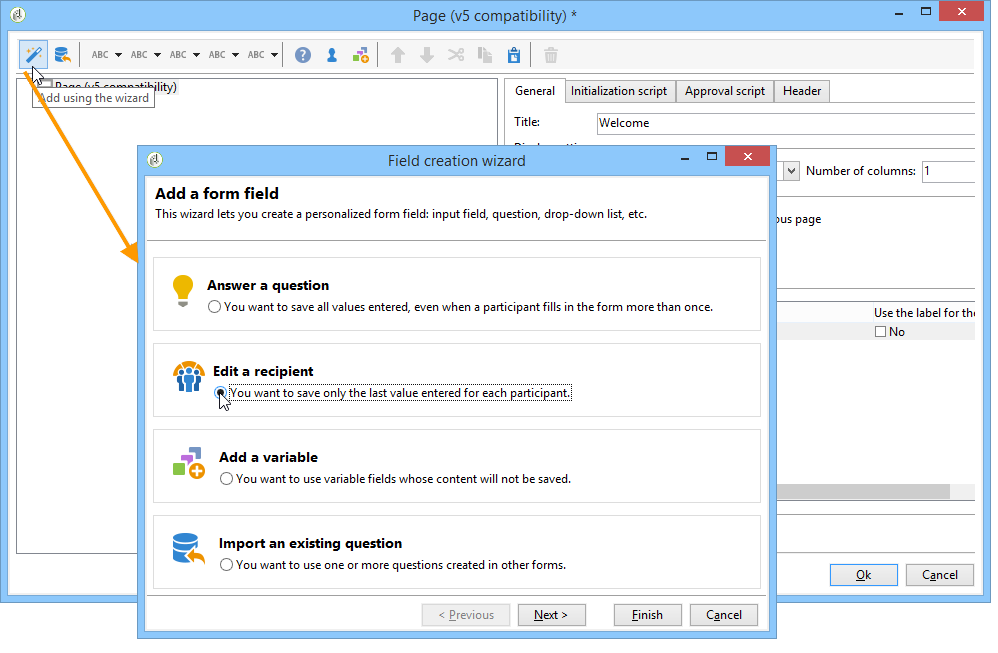

# 설문 조사 디자인{#building-a-survey}

## 새 설문 조사 만들기 {#creating-a-new-survey}

이 장에서는 의 디자인에 대해 자세히 설명합니다 **설문 조사** 사용 가능한 옵션 및 구성과 Adobe Campaign을 사용하여 양식을 입력합니다. Adobe Campaign을 사용하면 사용자가 이 설문 조사를 사용할 수 있도록 하고 데이터베이스에서 답변을 수집하고 보관할 수 있습니다.

웹 양식은 **[!UICONTROL Resources > Online > Web applications]** 트리의 노드. 설문 조사를 만들려면 **[!UICONTROL New]** 응용 프로그램 목록 위에 버튼을 클릭하거나 목록을 마우스 오른쪽 단추로 클릭하고 **[!UICONTROL New]**.

설문 조사 템플릿 선택(**[!UICONTROL newSurvey]** 기본적으로).

(텍스트) 입력 필드, 선택 필드(목록, 확인란 등)를 정의하고 구성할 수 있는 특수 편집기를 사용하여 양식의 페이지가 만들어집니다 및 정적 요소(이미지, HTML 컨텐츠 등)를 포함할 수 있습니다. &quot;컨테이너&quot;로 수집하고 요구 사항에 따라 배치할 수 있습니다. [자세히 알아보기](#adding-questions)).

>[!NOTE]
>
>웹 양식의 콘텐츠를 정의하고 화면 레이아웃을 만드는 방법에 대한 자세한 내용은 [이 문서](../../web/using/about-web-forms.md).

## 필드 추가 {#adding-fields}

양식의 필드를 사용하면 정보를 입력하고 옵션을 선택할 수 있습니다. 양식의 각 페이지에 대해 다음을 사용하여 도구 모음의 첫 번째 버튼을 통해 만들어집니다 **[!UICONTROL Add using the wizard]** 메뉴 아래의 제품에서 사용할 수 있습니다.

>[!NOTE]
>
>마우스 오른쪽 버튼을 클릭하고 입력 영역을 삽입할 수도 있습니다. 기본적으로 선택한 트리의 끝에 영역이 삽입됩니다. 도구 모음의 화살표를 사용하여 이동합니다.

### 필드 유형 {#types-of-fields}

설문에 필드를 추가할 때 필드 유형을 선택해야 합니다. 다음 옵션을 사용할 수 있습니다.

1. **[!UICONTROL Answer a question]**: 이 옵션을 사용하면 새 필드(&#39;보관된 필드&#39;라고 함)를 선언하여 답변을 저장할 수 있습니다. 이 경우, 참가자가 양식을 두 번 이상 작성하더라도 수집된 모든 값이 저장됩니다. 이 스토리지 모드는 다음에서만 사용할 수 있습니다. **설문 조사**. [자세히 알아보기](../../surveys/using/managing-answers.md#storing-collected-answers)
1. **[!UICONTROL Edit a recipient]**: 이 옵션을 사용하면 데이터베이스의 필드를 선택할 수 있습니다. 이 경우 사용자 답변은 이 필드에 저장됩니다. 각 참여자에 대해 마지막으로 저장된 값만 유지되고 프로필 데이터에 추가됩니다.
1. **[!UICONTROL Add a variable]**: 이 옵션을 사용하면 정보가 데이터베이스에 저장되지 않도록 설정을 만들 수 있습니다. 로컬 변수는 업스트림으로 선언할 수 있습니다. 필드를 만들 때 직접 추가할 수도 있습니다.
1. **[!UICONTROL Import an existing question]**: 이 옵션을 사용하면 다른 설문 조사에서 생성된 기존 질문을 가져올 수 있습니다.

   >[!NOTE]
   >
   >저장 모드 및 필드 가져오기에 대해서는 다음에서 자세히 설명합니다. [이 섹션](../../surveys/using/managing-answers.md#storing-collected-answers).

추가할 필드의 특성(드롭다운 목록, 텍스트 필드, 확인란 등) 선택한 스토리지 모드에 맞게 조정됩니다. 다음을 사용하여 변경할 수 있습니다. **[!UICONTROL Type]** 필드 **[!UICONTROL General]** 탭으로 설정되지만 데이터 유형과 일관되게 유지되어야 합니다.

사용 가능한 필드의 다양한 유형이에 자세히 설명되어 있습니다. [이 섹션](../../web/using/about-web-forms.md).

## 설문 조사 관련 요소 {#survey-specific-elements}

온라인 설문 조사는 웹 애플리케이션 기능을 기반으로 합니다. 설문 조사별 기능은 아래에 자세히 설명되어 있습니다.

### 다중 선택 {#multiple-choice}

대상 **[!UICONTROL Multiple choice]** 유형 컨트롤에서는 최소 및 최대 선택 항목 수를 정의할 수 있습니다. 예를 들어, 이 옵션을 사용하면 적어도 하나를 선택해야 합니다 **2** 값 및 최대 **4** 사용 가능한 옵션의 값:

선택 항목 수가 너무 많거나 적으면 적절한 메시지가 표시됩니다.

>[!NOTE]
>
>이 경우 확인란을 사용하여 옵션을 선택합니다. 한 가지 옵션만 가능한 경우 라디오 단추가 사용됩니다.

해당 구성은 다음과 같습니다.

또한 이 입력 필드의 저장 위치는 **[!UICONTROL Multiple values]** 유형 **보관된 필드**:

>[!CAUTION]
>
>* 이 기능은 에만 사용할 수 있습니다. **설문 조사** 양식을 입력합니다.
>* 이 옵션은 무작위 질문 표시와 호환되지 않습니다. [자세히 알아보기](#adding-questions)

### 질문 추가 {#adding-questions}

컨테이너에는 표준 및 질문의 두 가지 유형이 있습니다. 표준 컨테이너는 페이지에서 페이지 레이아웃 및 조건부 표시를 구성하는 데 사용됩니다. [자세히 알아보기](../../web/using/about-web-forms.md)

사용 **질문** 질문을 페이지에 추가하고 가능한 답변을 계층 구조에 삽입할 수 있는 컨테이너입니다. 이러한 유형의 컨테이너에 배치된 질문에 대한 사용자 응답은 보고서에서 분석할 수 있습니다.

>[!CAUTION]
>
>을(를) 삽입하지 않음 **질문** 다른 컨테이너 아래 **질문** 계층의 컨테이너.

질문의 라벨이 라벨 필드에 입력됩니다. 이 경우 양식의 스타일 시트의 스타일이 적용됩니다. 다음 항목 선택 **[!UICONTROL Enter the title in HTML format]** 개인 맞춤화 옵션. 이렇게 하면 HTML 편집기에 액세스할 수 있습니다.

>[!NOTE]
>
>을(를) 참조하십시오 [이 문서](../../web/using/about-web-forms.md) HTML 편집기 사용에 대한 자세한 내용.

예제:

위의 예에서 렌더링은 다음과 같습니다.

>[!NOTE]
>
>모든 질문에는 **질문** 유형 컨테이너입니다.

Adobe Campaign에서 무작위 질문 그리기를 활성화할 수 있습니다. 그런 다음 구성 창 하단에 있는 필드에 페이지에 표시할 질문 수를 지정할 수 있습니다.

렌더링은 다음과 같이 표시됩니다.

페이지를 새로 고칠 때 표시되는 질문이 동일하지 않습니다.

>[!CAUTION]
>
>질문을 임의로 표시할 경우(**[!UICONTROL Display randomly]** 페이지에서 옵션이 선택됨) 하나 이상의 선택이 필수인 객관식 질문을 사용하지 않도록 주의하십시오.
