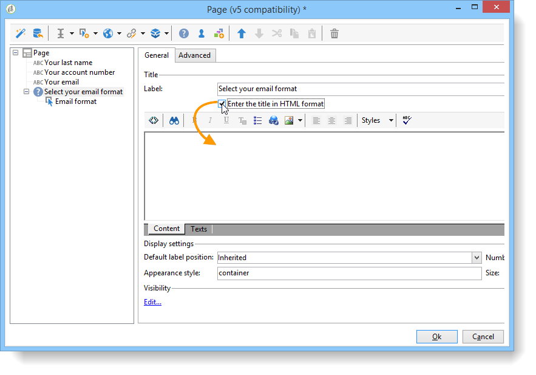

# 설문 조사 디자인{#building-a-survey}

## 새 설문 조사 만들기 {#creating-a-new-survey}

이 장에서는 Adobe Campaign을 사용한 **Survey** 형식 양식과 사용 가능한 옵션 및 구성에 대해 자세히 설명합니다. Adobe Campaign을 사용하면 이 설문 조사를 사용자가 사용할 수 있도록 하고 데이터베이스에서 답변을 수집 및 보관할 수 있습니다.

웹 양식은 트리의 **[!UICONTROL Resources > Online > Web applications]** 노드를 통해 액세스합니다. 설문 조사를 만들려면 응용 프로그램 목록 위에 있는 **[!UICONTROL New]** 단추를 클릭하거나 목록을 마우스 오른쪽 단추로 클릭하고 **[!UICONTROL New]** 을 선택합니다.

설문 조사 템플릿(**[!UICONTROL newSurvey]**)을 선택합니다.

양식의 페이지는 (텍스트) 입력 필드, 선택 필드(목록, 확인란 등)를 정의하고 구성할 수 있는 특수 편집기를 사용하여 만들어집니다. 및 정적 요소(이미지, HTML 콘텐츠 등)가 있어야 합니다. 이러한 데이터는 &quot;컨테이너&quot;에 수집되어 필요에 따라 분류될 수 있습니다. [자세히 알아보기](#adding-questions)).

>[!NOTE]
>
>웹 양식의 내용을 정의하고 화면 레이아웃을 만드는 방법에 대한 자세한 내용은 [이 문서](../../web/using/about-web-forms.md)를 참조하십시오.

## 필드 추가 {#adding-fields}

양식의 필드를 사용하면 정보를 입력하고 옵션을 선택할 수 있습니다. 양식의 각 페이지에 대해 **[!UICONTROL Add using the wizard]** 메뉴를 사용하여 도구 모음의 첫 번째 버튼을 통해 만들어집니다.

>[!NOTE]
>
>마우스 오른쪽 단추를 클릭하고 입력 영역을 삽입할 수도 있습니다. 기본적으로 선택한 트리의 끝에 영역이 삽입됩니다. 도구 모음의 화살표를 사용하여 이동합니다.

### 필드 유형 {#types-of-fields}

설문 조사에 필드를 추가할 때는 해당 유형을 선택해야 합니다. 다음 옵션을 사용할 수 있습니다.

1. **[!UICONTROL Answer a question]**: 이 옵션을 사용하면 답변을 저장할 새 필드(&#39;보관된 필드&#39;라고 함)를 선언할 수 있습니다. 이 경우 참가자가 양식을 두 번 이상 채우는 경우에도 수집된 모든 값이 저장됩니다. 이 저장소 모드는 **설문 조사**&#x200B;에서만 사용할 수 있습니다. [자세히 알아보기](../../surveys/using/managing-answers.md#storing-collected-answers)
1. **[!UICONTROL Edit a recipient]**: 이 옵션을 사용하면 데이터베이스에서 필드를 선택할 수 있습니다. 이 경우 사용자 응답이 이 필드에 저장됩니다. 각 참가자에 대해 마지막으로 저장된 값만 유지되고 프로필 데이터에 추가됩니다.
1. **[!UICONTROL Add a variable]**: 이 옵션을 사용하면 정보를 데이터베이스에 저장하지 않도록 설정을 만들 수 있습니다. 로컬 변수는 업스트림으로 선언할 수 있습니다. 필드를 만들 때 직접 추가할 수도 있습니다.
1. **[!UICONTROL Import an existing question]**: 이 옵션을 사용하면 다른 설문 조사에서 만든 기존 질문을 가져올 수 있습니다.

   >[!NOTE]
   >
   >저장소 모드 및 필드 가져오기는 [이 섹션](../../surveys/using/managing-answers.md#storing-collected-answers)에 자세히 설명되어 있습니다.

추가할 필드의 속성(드롭다운 목록, 텍스트 필드, 확인란 등)은 선택한 스토리지 모드에 맞게 조정됩니다. **[!UICONTROL General]** 탭의 **[!UICONTROL Type]** 필드를 사용하여 변경할 수 있지만 데이터 유형과 동일하게 유지되어야 합니다.

사용 가능한 여러 유형의 필드는 [이 섹션에 자세히 설명되어 있습니다](../../web/using/about-web-forms.md).

## 설문 조사 특정 요소 {#survey-specific-elements}

온라인 설문 조사는 웹 응용 프로그램 기능을 기반으로 합니다. 설문 조사 관련 기능은 아래에 자세히 설명되어 있습니다.

### 다양한 선택 {#multiple-choice}

**[!UICONTROL Multiple choice]** 유형 컨트롤의 경우 최소 및 최대 선택 횟수를 정의할 수 있습니다. 예를 들어 이 옵션을 사용하면 사용 가능한 옵션의 최소 **2** 값과 최대 **4** 값으로 선택 사항을 강제 적용할 수 있습니다.

선택 횟수가 너무 크거나 너무 작은 경우 해당 메시지가 표시됩니다.

>[!NOTE]
>
>이 경우 확인란을 사용하여 옵션을 선택합니다. 한 가지 옵션만 사용할 수 있는 경우 라디오 단추가 사용됩니다.

해당 구성은 다음과 같습니다.

또한 이 입력 필드의 저장소 위치는 **[!UICONTROL Multiple values]** 유형 **보관된 필드**&#x200B;여야 합니다.

>[!CAUTION]
>
>* 이 기능은 **Survey** 형식 양식에만 사용할 수 있습니다.
>* 이 옵션은 무작위 질문 표시와 호환되지 않습니다. [자세히 알아보기](#adding-questions)

### 질문 추가 {#adding-questions}

컨테이너에는 두 가지 유형이 있습니다. 표준 및 질문. 표준 컨테이너는 페이지에서 페이지 레이아웃 및 조건부 표시를 구성하는 데 사용됩니다. [자세히 알아보기](../../web/using/about-web-forms.md)

**질문** 컨테이너를 사용하여 페이지에 질문을 추가하고 계층 구조에서 아래의 가능한 답변을 삽입합니다. 이러한 유형의 컨테이너에 배치된 질문에 대한 사용자 응답은 보고서에서 분석할 수 있습니다.

>[!CAUTION]
>
>계층 구조의 다른 **Question** 컨테이너 아래에 **질문** 컨테이너를 삽입하지 마십시오.

문제의 레이블은 레이블 필드에 입력됩니다. 이 경우 양식의 스타일 시트의 스타일이 적용됩니다. **[!UICONTROL Enter the title in HTML format]** 옵션을 선택하여 개인화합니다. 이렇게 하면 HTML 편집기에 액세스할 수 있습니다.

>[!NOTE]
>
>HTML 편집기 사용에 대한 자세한 내용은 [이 문서](../../web/using/about-web-forms.md)를 참조하십시오.

예제:

위의 예에서 렌더링은 다음과 같습니다.

>[!NOTE]
>
>모든 질문에는 **질문** 유형 컨테이너가 있습니다.

Adobe Campaign에서 무작위 질문 그리기를 활성화할 수 있습니다. 그런 다음 구성 창 하단에 있는 필드에 페이지에 표시할 질문 수를 지정할 수 있습니다.

렌더링은 다음과 같습니다.

페이지를 새로 고치면 표시되는 질문이 같지 않습니다.

>[!CAUTION]
>
>질문을 임의로 표시할 때(**[!UICONTROL Display randomly]** 옵션이 페이지에서 선택됨), 하나 이상의 선택이 필수인 다중 선택 질문을 사용하지 않도록 주의하십시오.
