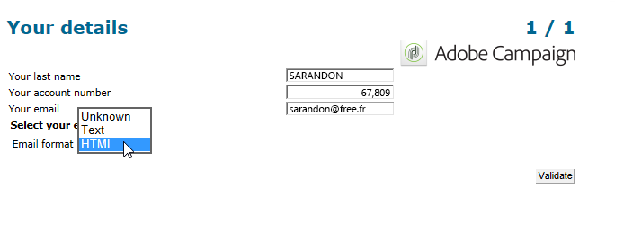
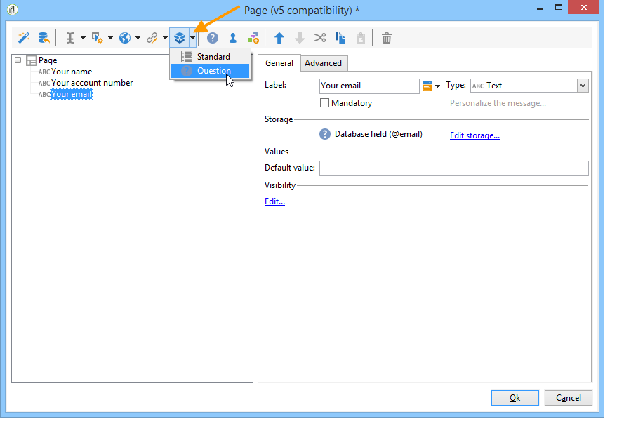
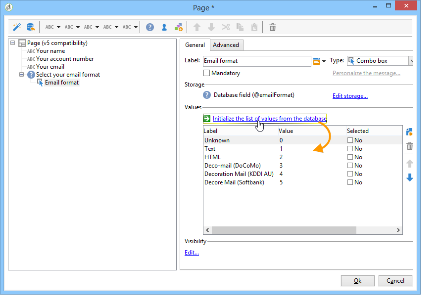
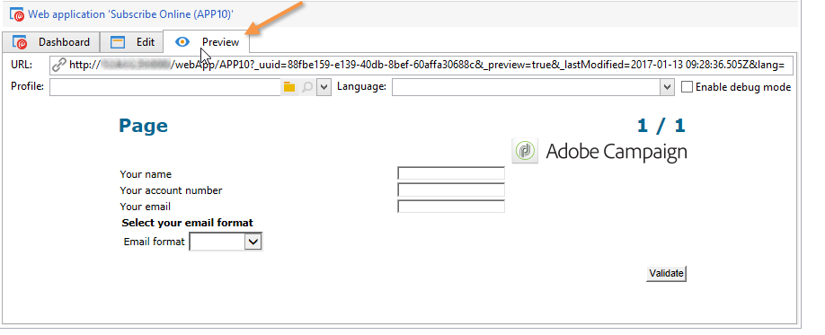

# 설문 조사 만들기의 주요 단계{#getting-started-with-surveys}

다음은 기본 제공 템플릿을 사용하여 간단한 설문 조사를 만드는 주요 단계에 대한 간략한 개요입니다.

다음 단계는 다음과 같습니다.

1. [1단계 - 설문 조사 만들기](#step-1---creating-a-survey),
1. [2단계 - 템플릿 선택](#step-2---selecting-the-template),
1. [3단계 - 설문 조사 빌드](#step-3---building-the-survey),
1. [4단계 - 페이지 컨텐츠 만들기](#step-4---creating-the-page-content),
1. [5단계 - 설문 조사 데이터 저장](#step-5---storing-the-survey-data-),
1. [6단계 - 페이지 게시](#step-6---publishing-the-pages),
1. [7단계 - 온라인 설문 조사 공유](#step-7---sharing-your-online-survey).

## 1단계 - 설문 조사 만들기 {#step-1---creating-a-survey}

새 설문 조사를 만들려면 **[!UICONTROL Campaigns]** 또는 **[!UICONTROL Profiles and targets]** 탭을 클릭하고 **[!UICONTROL Web Applications]** 메뉴 아래의 제품에서 사용할 수 있습니다. 다음을 클릭합니다. **[!UICONTROL Create]** 양식 목록 위에 있는 단추입니다.

## 2단계 - 템플릿 선택 {#step-2---selecting-the-template}

설문 조사 템플릿을 선택한 다음 설문 조사 이름을 지정합니다. 최종 사용자는 이 이름을 볼 수 없지만 Adobe Campaign 내에서 설문 조사를 식별할 수 있습니다. 클릭 **[!UICONTROL Save]** 설문 조사를 웹 응용 프로그램 목록에 추가합니다.

## 3단계 - 설문 조사 빌드 {#step-3---building-the-survey}

설문 조사는 콘텐츠가 만들어질 페이지, 데이터 미리 로드 및 저장 단계, 테스트 단계 등의 요소가 있는 다이어그램에서 빌드됩니다. 스크립트 및 쿼리를 삽입할 수도 있습니다.

차트를 작성하려면 **[!UICONTROL Edit]** 조사의 형식입니다.

설문 조사는 다음을 포함해야 합니다. **최소** 페이지, 저장소 상자 및 종료 페이지의 세 가지 구성 요소입니다.

* 페이지를 만들려면 **[!UICONTROL Page]** 다음과 같이 편집기의 왼쪽 섹션에 있는 객체를 가운데 섹션에 배치합니다.

   

* 그런 다음 **[!UICONTROL Storage]** 을 개체에 배치하고 페이지의 출력 전환 위에 놓습니다.
* 마지막으로 **[!UICONTROL End]** 객체를 저장하고 저장 상자의 출력 전환 끝에 배치하여 다음 다이어그램을 가져옵니다.

   

## 4단계 - 페이지 컨텐츠 만들기 {#step-4---creating-the-page-content}

다음 예제에서는 **[!UICONTROL Page (v5 compatibility)]** 페이지를 입력합니다. 이 유형의 페이지는 의 고급 메뉴를 통해 액세스됩니다. **[!UICONTROL Edit]** 탭.

* **입력 필드 추가**

   페이지의 콘텐츠를 만들려면 편집해야 합니다. 이렇게 하려면 다음을 두 번 클릭하십시오. **[!UICONTROL Page]** 개체. 도구 모음에서 첫 번째 아이콘을 클릭하여 필드 만들기 마법사를 엽니다. 수신자 프로필의 일치 필드에 저장할 사용자 이름에 대한 입력 필드를 만들려면 다음을 선택합니다. **[!UICONTROL Edit a recipient]**.

   

   다음을 클릭합니다. **[!UICONTROL Next]** 데이터베이스의 데이터 저장을 위한 필드를 선택하는 단추입니다. 이 경우 &#39;성&#39; 필드.

   

   클릭 **[!UICONTROL Finish]** 필드 만들기를 확인합니다.

   기본적으로 정보가 데이터베이스에 이미 있는 필드에 저장될 때 필드는 선택한 필드의 이름, 즉 이 예에서 &#39;성&#39;을 취합니다. 아래와 같이 이 레이블을 수정할 수 있습니다.

   

   이제 사용자 계정 번호에 대한 입력 필드를 만듭니다. 작업을 반복하고 &#39;계정 번호&#39;를 선택합니다. 필드.

   동일한 절차를 적용하여 사용자가 이메일 주소를 입력할 수 있는 필드를 추가합니다.

* **질문 만들기**

   질문을 만들려면 트리의 마지막 요소를 마우스 오른쪽 단추로 클릭하고 **[!UICONTROL Containers > Question]** 을 클릭하거나 **[!UICONTROL Containers]** 아이콘 및 선택 **[!UICONTROL Question]**.

   

   질문의 레이블을 입력하고 답변 필드를 질문의 하위 분기로 삽입합니다. 이렇게 하려면 답변 필드를 만들 때 질문에 연결된 노드를 선택해야 합니다. 추가 **[!UICONTROL drop-down listx]** 사용 **[!UICONTROL Selection controls]** 아래에 표시된 대로 아이콘을 클릭하거나 마우스 오른쪽 버튼으로 클릭합니다.

   

   저장소 공간 선택: 값을 자동으로 검색할 열거 필드를 선택합니다(이 경우 이메일 형식).

   

   다음에서 **[!UICONTROL General]** 탭을 클릭하고 **[!UICONTROL Initialize the list of values from the database]** 링크: 값 테이블이 자동으로 입력됩니다.

   

   클릭 **[!UICONTROL OK]** 편집기를 닫으려면 **[!UICONTROL Save]** 변경 내용을 저장합니다.

   >[!NOTE]
   >
   >각 필드 또는 질문에 대해 의 옵션 덕분에 필요에 따라 페이지 레이아웃을 조정할 수 있습니다 **[!UICONTROL Advanced]** 탭. 설문 조사 화면의 레이아웃은 다음에 자세히 설명되어 있습니다. [이 섹션](../../web/using/about-web-forms.md).

   세부 사항 화면에서 다음을 클릭합니다. **[!UICONTROL Preview]** 탭을 사용하여 방금 만든 설문 조사의 렌더링을 볼 수 있습니다.

   

## 5단계 - 설문 조사 데이터 저장 {#step-5---storing-the-survey-data-}

저장소 상자를 사용하면 사용자 응답을 데이터베이스에 저장할 수 있습니다. 데이터베이스에 이미 있는 프로필을 식별하려면 조정 키를 선택해야 합니다.

이렇게 하려면 상자를 편집하고 데이터가 저장될 때 조정 키로 사용할 필드를 선택합니다.

아래 예에서 저장(확인)이 발생할 때 프로필이 양식에 입력한 것과 동일한 계정 번호로 데이터베이스에 저장되면 프로필이 업데이트됩니다. 프로필이 존재하지 않으면 생성됩니다.

클릭 **[!UICONTROL OK]** 을(를) 확인하고 을(를) 클릭합니다. **[!UICONTROL Save]** 설문 조사를 저장하려면

## 6단계 - 페이지 게시 {#step-6---publishing-the-pages}

사용자가 HTML 페이지에 액세스할 수 있으려면 애플리케이션을 사용할 수 있어야 합니다. 더 이상 편집 단계가 아닌 프로덕션 단계여야 합니다. 프로덕션에 설문 조사를 넣으려면 설문 조사를 게시해야 합니다. 방법은 다음과 같습니다.

* 다음을 클릭합니다. **[!UICONTROL Publish]** 설문 조사 대시보드 위에 있는 단추입니다.
* 클릭 **[!UICONTROL Start]** 게시를 시작하고 마법사를 닫습니다.

   

   설문 조사 상태가 다음으로 변경됨: **온라인**.

   

## 7단계 - 온라인 설문 조사 공유 {#step-7---sharing-your-online-survey}

프로덕션에 들어가면 서버에서 설문 조사에 액세스할 수 있으며 설문 조사를 게재할 수 있습니다. 설문 조사에 액세스하기 위한 URL이 대시보드에 표시됩니다.

예를 들어 설문 조사를 게재하기 위해 대상 모집단에 대한 액세스 링크가 포함된 메시지를 보내거나 웹 페이지에 설문 조사 액세스 URL을 배치할 수 있습니다.

그런 다음 보고서와 로그를 통해 사용자 응답을 모니터링할 수 있습니다. 다음을 참조하십시오 [응답 추적](../../surveys/using/publish--track-and-use-collected-data.md#response-tracking).

>[!CAUTION]
>
>공개 URL에는 설문 조사의 내부 이름이 포함되어 있습니다. 내부 이름이 수정되면 URL이 자동으로 업데이트됩니다. 설문 조사에 대한 모든 링크도 업데이트해야 합니다.
>
>양식에 대한 링크가 포함된 게재를 이미 보낸 경우 이 링크가 더 이상 작동하지 않습니다.
