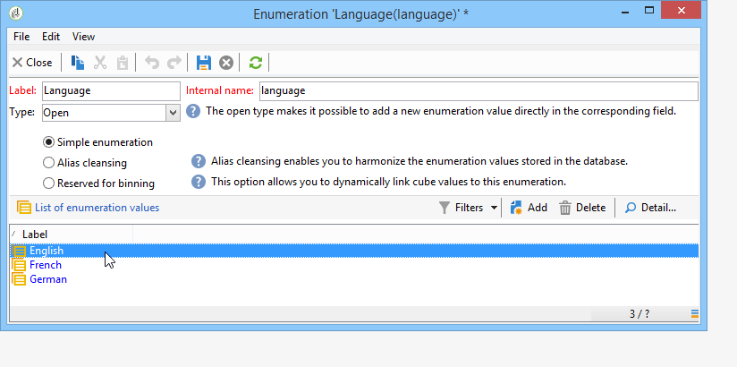
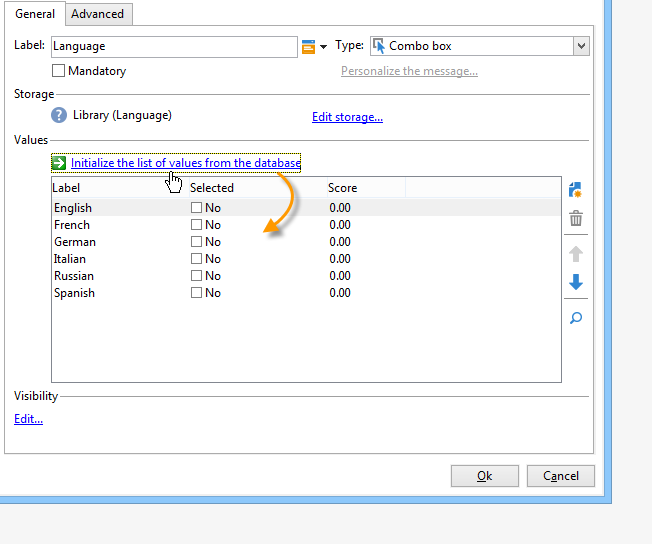

# 답변 관리{#managing-answers}

## 수집된 답변 저장 {#storing-collected-answers}

Adobe Campaign의 모든 웹 양식(데이터베이스 필드 및 로컬 변수)에 공통되는 표준 저장 모드 외에도 보관된 필드를 사용하여 데이터 모델을 동적으로 확장할 수 있습니다.

>[!CAUTION]
>
>이 옵션은 **Survey** 형식 웹 응용 프로그램에만 사용할 수 있습니다. 다른 유형의 웹 양식에는 제공되지 않습니다.

### 보관된 필드에 저장 {#storing-in-an-archived-field}

설문 조사에 제공된 응답을 저장하기 위해 새 저장소 공간을 추가하여 데이터 템플릿을 쉽게 확장할 수 있습니다. 이렇게 하려면 입력 필드를 만들 때 **[!UICONTROL Store answers to a question]** 옵션을 선택합니다. **[!UICONTROL New field...]** 링크를 클릭하고 해당 속성을 제공합니다.


필드의 레이블과 이름을 입력하고 필드 유형을 선택합니다.텍스트, 부울, 정수 또는 십진수, 날짜 등

선택한 필드 유형에는 사용자가 응답을 입력할 때 데이터 컨트롤이 포함됩니다. **text** 필드의 경우 제약 조건(대/소문자, 형식)을 추가하거나 기존 열거형에 링크하여 강제로 선택할 수 있습니다.

제약조건을 추가하려면 드롭다운 목록에서 해당 제약조건을 선택합니다. 다음과 같은 두 가지 유형의 제한이 있습니다.

1. 문자 사례

   입력한 정보는 다음 형식으로 필드에 저장할 수 있습니다.모두 대문자, 모두 소문자 또는 초기 대문자가 있습니다. 이 제약 조건에서는 사용자가 선택한 형식으로 데이터를 입력할 필요가 없지만, 필드에 입력한 컨텐츠가 저장되면 변환됩니다.

1. 데이터 형식

이 필드를 목록에 사용하면 값 목록 위에 있는 **[!UICONTROL Initialize the list of values from the database]** 링크를 사용하여 값 테이블에서 열거형 값을 자동으로 검색할 수 있습니다.

예를 들어, 사용자가 자신의 기본 언어를 선택할 수 있는 드롭다운 목록을 만들 수 있습니다. 해당 보관된 필드는 언어 목록이 포함된 **언어** 열거와 연결할 수 있습니다.


필드 오른쪽에 있는 **[!UICONTROL Edit link]** 아이콘을 사용하여 이 열거형의 내용을 편집할 수 있습니다.



필드의 **[!UICONTROL General]** 탭에서 **[!UICONTROL Initialize the list of values from the database]** 링크를 통해 제공된 레이블 목록을 자동으로 입력할 수 있습니다.



**예**:한 필드에 수신자의 계약 저장

한 필드에 서로 다른 유형의 계약을 저장하려면 **[!UICONTROL Text]** 입력 필드를 만들고 **[!UICONTROL Store answers to a question]** 옵션을 선택합니다.

**[!UICONTROL New field...]** 링크를 클릭하고 필드 속성을 입력합니다. 여러 값을 저장할 수 있도록 하려면 **[!UICONTROL Multiple values]** 옵션을 선택합니다.


다른 계약에 대한 입력 필드를 생성하고 데이터를 동일한 보관 필드에 저장합니다.


사용자가 설문 조사를 승인하면 응답이 **[!UICONTROL Contracts]** 필드에 저장됩니다.

이 예제에서 다음 답변을 확인하십시오.


응답자의 프로필에는 입력한 4개의 계약이 포함됩니다.

관련 열을 표시하여 설문 조사의 **[!UICONTROL Answers]** 탭에서 볼 수 있습니다.


답변에 따라 수신자를 필터링하여 원하는 사용자만 표시할 수도 있습니다. 이렇게 하려면 타겟팅 워크플로우를 만들고 **[!UICONTROL Survey responses]** 상자를 사용합니다.


복구할 프로필을 기반으로 쿼리를 만듭니다. 다음 예에서는 A 유형 계약을 포함하여 최소 두 개 이상의 계약이 있는 프로파일을 선택할 수 있습니다.


각 양식에 대해 제공된 답변을 필드나 레이블에 사용할 수 있습니다. 보관된 필드에 저장된 컨텐츠에 대해 다음 구문을 사용합니다.

```
<%= ctx.webAppLogRcpData.name of the archived field %
```

>[!NOTE]
>
>다른 유형의 필드의 경우 구문은 [이 섹션에 자세히 설명되어 있습니다.](../../platform/using/about-queries-in-campaign.md)

### 저장소 설정 {#storage-settings}

설문 조사에 대한 답변을 XML 형식으로 보관할 수 있습니다. 이렇게 하면 수집된 응답의 원시 복사본을 저장할 수 있습니다. 이 경우 항목별 목록에 있는 데이터를 과도하게 표준화하는 경우에 유용합니다. [자세히 알아보기](../../surveys/using/publish--track-and-use-collected-data.md#standardizing-data)

>[!CAUTION]
>
>원시 응답 아카이빙은 필요한 스토리지 공간에 영향을 줍니다. 이 옵션은 주의해서 사용하십시오.

방법은 다음과 같습니다.

* **[!UICONTROL Edit]** 탭의 **[!UICONTROL Properties]** 버튼을 통해 설문 조사 속성을 편집합니다.
* **[!UICONTROL Advanced parameters]** 링크를 클릭하고 **[!UICONTROL Save a copy of raw answers]** 옵션을 선택합니다.


모든 설문 조사에 대해 기본적으로 활성화할 수 있습니다(이 옵션은 설문 조사가 게시될 때 적용됨). 이렇게 하려면 **[!UICONTROL NmsWebApp_XmlBackup]** 옵션을 만들고 아래와 같이 값 **[!UICONTROL 1]**&#x200B;을 할당합니다.


## 점수 관리 {#score-management}

양식의 페이지에서 제공되는 옵션에 점수를 할당할 수 있습니다. 점수는 마감된 질문에만 연결할 수 있습니다.확인란, 드롭다운 목록의 값, 구독 등


점수가 누적되고 페이지가 확인될 때(예: 사용자가 **[!UICONTROL Next]** 또는 **[!UICONTROL Finish]** 단추를 클릭할 때) 서버 측에 저장됩니다.

>[!NOTE]
>
>양수 또는 음수, 정수 또는 정수가 아닌 값을 사용할 수 있습니다.

점수는 테스트나 스크립트에 사용할 수 있습니다.

>[!CAUTION]
>
>점수는 동일한 페이지에 있는 필드의 가시성 조건에서 사용할 수 없습니다. 그러나 이후 페이지에서 사용할 수 있습니다.

* 테스트에서 점수를 사용하려면 다음과 같이 테스트 계산 공식의 **[!UICONTROL Score]** 필드를 사용하십시오.

   

* 스크립트에서 점수를 사용할 수 있습니다.

**예**:점수를 계산하고 다음 페이지 표시를 위한 조건으로 사용합니다.

* 설문 조사에서 다음 페이지에서는 드롭다운 목록에서 선택한 값에 따라 사용자에게 다른 점수를 지정할 수 있습니다.

   

* 선택한 옵션에 따라 이 점수를 두 번째 값과 결합할 수 있습니다.

   

* 사용자가 **[!UICONTROL Next]** 버튼을 클릭하면 두 값이 추가됩니다.

   

* 점수에 따라 페이지를 표시하는 조건을 적용할 수 있습니다. 다음과 같이 구성됩니다.

   

   
