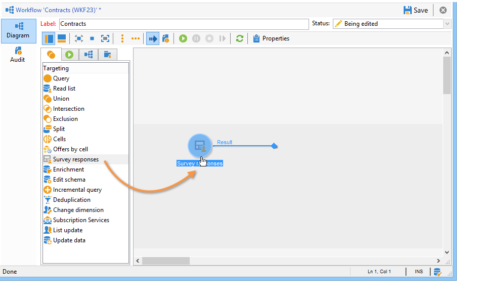

# 답변 관리{#managing-answers}


## 수집된 답변 저장 {#storing-collected-answers}

Adobe Campaign의 모든 웹 양식에 공통되는 표준 저장소 모드(데이터베이스 필드 및 로컬 변수) 외에도 설문 조사를 통해 보관된 필드를 사용하는 데이터 모델을 동적으로 확장할 수 있습니다.

>[!CAUTION]
>
>이 옵션은 다음 경우에 사용할 수 있습니다. **설문 조사** 웹 응용 프로그램만 입력하십시오. 다른 유형의 웹 양식에는 제공되지 않습니다.

### 보관된 필드에 저장 {#storing-in-an-archived-field}

설문 조사에 제공된 응답을 저장할 새 저장소 공간을 추가하여 데이터 템플릿을 쉽게 확장할 수 있습니다. 이렇게 하려면 **[!UICONTROL Store answers to a question]** 옵션을 사용하여 입력 필드를 만들 수 있습니다. 다음을 클릭합니다. **[!UICONTROL New field...]** 링크를 클릭하고 속성을 제공합니다.


필드의 레이블과 이름을 입력하고 필드 유형(텍스트, 부울, 정수 또는 십진수, 날짜 등)을 선택합니다.

선택한 필드 유형에는 사용자가 응답을 입력할 때 데이터 제어가 포함됩니다. 대상 **텍스트** 필드에서는 제약 조건(대/소문자, 형식)을 추가하거나 기존 열거형에 연결하여 강제 선택할 수 있습니다.

제약조건을 추가하려면 드롭다운 목록에서 제약조건을 선택합니다. 제한에는 두 가지 유형이 있습니다.

1. 문자 케이스

   입력한 정보는 모든 대문자, 모두 소문자 또는 초기 대문자 형식으로 필드에 저장할 수 있습니다. 이 제약 조건에서는 사용자가 선택한 형식으로 데이터를 입력할 필요가 없지만, 필드에 입력한 콘텐츠는 저장 시 변환됩니다.

1. 데이터 형식

이 필드를 목록에 사용하면 값 테이블에서 열거형의 값을 자동으로 검색할 수 있습니다 **[!UICONTROL Initialize the list of values from the database]** 값 목록 위에 연결합니다.

예를 들어 사용자가 모국어를 선택할 수 있는 드롭다운 목록을 만들 수 있습니다. 해당 보관된 필드는 **언어** 언어 목록을 포함하는 열거형:


다음 **[!UICONTROL Edit link]** 필드 오른쪽에 있는 아이콘을 사용하면 이 열거형의 콘텐츠를 편집할 수 있습니다.


다음에서 **[!UICONTROL General]** 필드의 탭, **[!UICONTROL Initialize the list of values from the database]** 링크를 사용하면 제공된 레이블 목록을 자동으로 입력할 수 있습니다.


**예**: 수신자의 계약을 한 필드에 저장

한 필드에 서로 다른 유형의 계약을 저장하려면 **[!UICONTROL Text]** 입력 필드 및 선택 **[!UICONTROL Store answers to a question]** 옵션을 선택합니다.

다음을 클릭합니다. **[!UICONTROL New field...]** 필드 속성을 연결하고 입력합니다. 다음 항목 선택 **[!UICONTROL Multiple values]** 여러 값을 저장할 수 있도록 하는 옵션입니다.


다른 계약에 대한 입력 필드를 생성하고 데이터를 동일한 보관된 필드에 저장합니다.


사용자가 설문을 승인하면 답변이 **[!UICONTROL Contracts]** 필드.

이 예에서 답은 다음과 같습니다.


응답자의 프로필에는 입력한 4개의 계약이 포함됩니다.

다음에서 볼 수 있습니다. **[!UICONTROL Answers]** 관련 열을 표시하여 설문 조사 탭.


답변을 기반으로 수신자를 필터링하여 원하는 사용자만 표시할 수도 있습니다. 이렇게 하려면 타겟팅 워크플로우를 만들고 다음을 사용합니다. **[!UICONTROL Survey responses]** 상자.



복구할 프로필을 기반으로 쿼리를 만듭니다. 다음 예에서는 쿼리를 통해 A 유형 계약을 포함하여 두 개 이상의 계약이 있는 프로필을 선택할 수 있습니다.


각 양식에 대해 제공된 답변을 필드나 레이블에 사용할 수 있습니다. 보관된 필드에 저장된 컨텐츠에 다음 구문을 사용합니다.

```
<%= ctx.webAppLogRcpData.name of the archived field %
```

>[!NOTE]
>
>다른 필드 유형의 경우 구문은에 자세히 설명되어 있습니다. [이 섹션](../../platform/using/about-queries-in-campaign.md).

### 저장소 설정 {#storage-settings}

설문 조사에 대한 답변을 XML 형식으로 보관할 수 있습니다. 이렇게 하면 수집된 답변의 원시 사본을 저장할 수 있습니다. 이는 항목별 목록에서 데이터를 과도하게 표준화한 경우에 유용합니다. [자세히 알아보기](../../surveys/using/publish--track-and-use-collected-data.md#standardizing-data)

>[!CAUTION]
>
>원시 응답 보관은 필요한 스토리지 공간에 영향을 줍니다. 이 옵션은 주의하여 사용하십시오.

방법은 다음과 같습니다.

* 를 통해 설문 조사 속성 편집 **[!UICONTROL Properties]** 의 단추 **[!UICONTROL Edit]** 탭.
* 다음을 클릭합니다. **[!UICONTROL Advanced parameters]** 링크 및 확인 **[!UICONTROL Save a copy of raw answers]** 옵션을 선택합니다.


모든 설문 조사에 대해 기본적으로 활성화할 수 있습니다(이 옵션은 설문 조사가 게시될 때 적용됨). 이렇게 하려면 다음을 만듭니다. **[!UICONTROL NmsWebApp_XmlBackup]** 옵션 및 값 할당 **[!UICONTROL 1]** 아래 표시된 대로 이 작업을 수행합니다.


## 점수 관리 {#score-management}

양식의 페이지에서 제공하는 옵션에 점수를 할당할 수 있습니다. 점수는 확인란, 드롭다운 목록의 값, 구독 등과 같은 닫힌 질문에만 연결할 수 있습니다.


페이지가 확인되면 점수가 누적되고 서버측에 저장됩니다. 즉, 사용자가 을 클릭합니다. **[!UICONTROL Next]** 또는 **[!UICONTROL Finish]** 단추를 클릭합니다.

>[!NOTE]
>
>양수 또는 음수, 정수 또는 정수가 아닌 값을 사용할 수 있습니다.

점수는 테스트 또는 스크립트에서 사용할 수 있습니다.

>[!CAUTION]
>
>같은 페이지에 있는 필드의 가시성 조건에서는 점수를 사용할 수 없습니다. 그러나 후속 페이지에서 사용할 수 있습니다.

* 테스트에 점수를 사용하려면 **[!UICONTROL Score]** 테스트 계산 공식의 필드입니다.

   

* 스크립트에서 점수를 사용할 수 있습니다.

**예**: 점수를 계산하여 다음 페이지 표시의 조건으로 사용합니다.

* 설문 조사에서 다음 페이지에서는 드롭다운 목록에서 선택한 값에 따라 사용자에게 다른 점수를 할당할 수 있습니다.

   

* 선택한 옵션에 따라 이 점수를 두 번째 값과 결합할 수 있습니다.

   

* 사용자가 **[!UICONTROL Next]** 단추를 클릭하면 두 값이 추가됩니다.

   

* 스코어에 따라 표시될 페이지에 조건을 적용할 수 있다. 이는 다음과 같이 구성됩니다.

   

   
