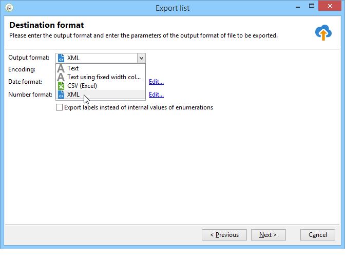
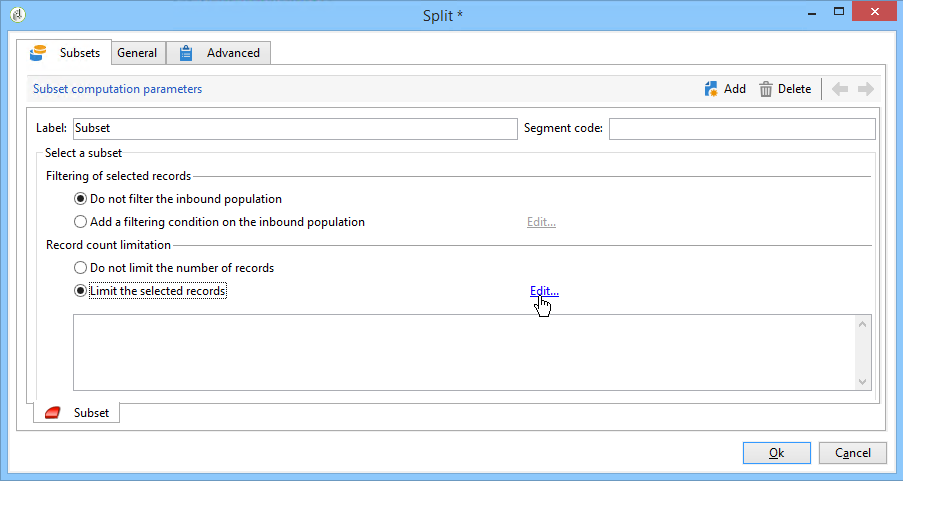

# 수집된 데이터 게시, 추적 및 사용{#publish-track-and-use-collected-data}


양식을 만들고, 구성하고, 게시하면 대상자와 링크를 공유하고 응답을 추적할 수 있습니다.

>[!NOTE]
>
>Adobe Campaign의 설문 조사 수명 주기와 게시 및 전달 모드는 웹 양식의 라이프사이클과 유사합니다. 다음 사항에 자세히 설명되어 있습니다. [이 섹션](../../web/using/about-web-forms.md).

## 설문 조사 대시보드 {#survey-dashboard}

각 설문 조사에는 상태, 설명, 공개 URL 및 가용성 일정을 볼 수 있는 자체 대시보드가 있습니다. 사용 가능한 보고서를 볼 수도 있습니다. [자세히 알아보기](#reports-on-surveys)

설문 조사의 공개 URL이 대시보드에 표시됩니다.


## 응답 추적 {#response-tracking}

로그 및 보고서에서 설문 조사에 대한 응답을 추적할 수 있습니다.

### 설문 조사 로그 {#survey-logs}

전달된 각 설문 조사에 대해 **[!UICONTROL Logs]** 탭. 이 탭에는 설문 조사를 완료한 사용자 목록과 해당 출처가 표시됩니다.


응답자가 입력한 대로 설문 조사 양식을 표시하려면 줄을 두 번 클릭합니다. 설문 조사를 완전히 탐색하고 답변에 완전히 액세스할 수 있습니다. 외부 파일로 내보낼 수 있습니다. 자세한 내용은 [답변 내보내기](#exporting-answers).

원본은 다음 문자를 추가하여 설문 조사 URL에 표시됩니다.

```
?origin=xxx
```

설문 조사를 편집하는 동안 해당 URL에 매개 변수가 포함되어 있습니다 **[!UICONTROL __uuid]**: 테스트 단계이며 아직 온라인 상태가 아님을 나타냅니다. 이 URL을 통해 설문 조사에 액세스하면 생성된 레코드가 추적(보고서)에서 고려되지 않습니다. 원본은 값에 적용됩니다 **[!UICONTROL Adobe Campaign]**.

URL 매개 변수에 대한 자세한 내용은 [이 페이지](../../web/using/defining-web-forms-properties.md#form-url-parameters).

### 설문 조사 보고서 {#reports-on-surveys}

대시보드 탭에서는 설문 조사 보고서에 액세스할 수 있습니다. 보고서 이름을 클릭하여 봅니다.


설문 조사의 구조는 **[!UICONTROL Documentation]** 보고서 세트에 대해 설명합니다.

웹 설문 조사에 대한 다른 두 보고서는 **[!UICONTROL Reports]** 설문 조사 탭: **[!UICONTROL General]** 및 **[!UICONTROL Breakdown of responses]**.

* 일반

   이 보고서에는 설문 조사에 대한 일반 정보가 포함되어 있습니다. 시간에 따라 응답 수가 변경되는 방법 및 원본 및 언어별 배포.

   일반 보고서의 예:

   

* 응답 분류

   이 보고서는 각 질문에 대한 응답 분류를 표시합니다. 이 분류는 에 저장된 필드에 제공된 응답에만 사용할 수 있습니다. **[!UICONTROL Question]** 컨테이너 유형을 입력합니다. 선택 컨트롤(예: 텍스트 필드에 대한 분류 없음)에만 사용할 수 있습니다.

   

## 답변 내보내기 {#exporting-answers}

설문 조사에 대한 답변을 외부 파일로 내보내 나중에 처리할 수 있습니다. 다음 두 가지 방법으로 데이터를 수집할 수 있습니다.

1. 보고서 데이터 내보내기

   보고서 데이터를 내보내려면 **[!UICONTROL Export]** 단추를 클릭하고 내보내기 형식을 선택합니다.

   보고서 데이터 내보내기에 대한 자세한 내용은 [이 섹션](../../reporting/using/about-reports-creation-in-campaign.md).

1. 답변 내보내기

   답변을 내보내려면 **[!UICONTROL Responses]** 설문 조사 탭에서 마우스 오른쪽 단추를 클릭합니다. **[!UICONTROL Export...]**&#x200B;을(를) 선택합니다.

   

   그런 다음 내보낼 정보와 저장 파일을 입력합니다.

   내보내기 마법사에서 출력 파일의 내용과 형식을 구성할 수 있습니다.

   이를 통해 다음을 수행할 수 있습니다.

   * 출력 파일에 열을 추가하고 수신자 정보(데이터베이스에 저장됨)를 복구합니다.
   * 내보낸 데이터 형식 지정,
   * 파일의 정보에 대한 인코딩 형식을 선택합니다.

   내보내려는 설문 조사에 몇 가지 포함된 경우 **[!UICONTROL Multi-line text]** 또는 **[!UICONTROL HTML text]** 필드에서 내보내야 합니다. **[!UICONTROL XML]** 형식 지정 이렇게 하려면 **[!UICONTROL Output format]** 아래와 같이 필드가 표시됩니다.

   

   클릭 **[!UICONTROL Start]** 내보내기를 실행하려면

   >[!NOTE]
   >
   >데이터 내보내기 및 구성 단계는 [이 섹션](../../platform/using/about-generic-imports-exports.md).

## 수집된 데이터 사용 {#using-the-collected-data}

온라인 설문 조사를 통해 수집된 정보는 타깃팅 워크플로우의 프레임워크 내에서 복구할 수 있습니다. 이렇게 하려면 **[!UICONTROL Survey responses]** 상자.

다음 예에서는 온라인 설문 조사에서 최소한 두 명의 자녀를 두고 점수가 가장 높은 5명의 수신자를 위해 특별히 웹 오퍼를 만들려고 합니다. 이 설문 조사에 대한 답변은 다음과 같습니다.


타겟팅 워크플로우에서 **[!UICONTROL Survey responses]** 은 다음과 같이 구성됩니다.


먼저 관련 설문 조사를 선택한 다음 창의 중앙 섹션에서 추출할 데이터를 선택합니다. 이 경우 점수 열은 5개의 가장 높은 점수를 복구하기 위해 분할 상자에 사용되기 때문에 최소 추출해야 합니다.

을(를) 클릭하여 응답에 대한 필터링 조건을 지정합니다. **[!UICONTROL Edit query...]** 링크를 클릭합니다.


타겟팅 워크플로우를 시작합니다. 쿼리는 8명의 수신자를 복구합니다.


컬렉션 상자의 출력 전환을 마우스 오른쪽 단추로 클릭하여 봅니다.


그런 다음 워크플로우에 분할 상자를 배치하여 점수가 가장 높은 5명의 수신자를 복구합니다.

분할 상자를 편집하여 구성:

* 에서 적절한 스키마를 선택하여 시작합니다 **[!UICONTROL General]** 탭한 다음, 하위 세트를 구성합니다.

   

* 로 이동합니다. **[!UICONTROL Sub-sets]** 탭을 선택하고 을(를) 선택합니다 **[!UICONTROL Limit the selected records]** 옵션을 클릭한 다음 **[!UICONTROL Edit...]** 링크를 클릭합니다.

   

* 을(를) 선택합니다 **[!UICONTROL Keep only the first records after sorting]** 옵션을 선택하고 정렬 열을 선택합니다. **[!UICONTROL Descending sort]** 옵션을 선택합니다.

   

* 을(를) 클릭합니다. **[!UICONTROL Next]** 단추를 누르고 레코드 수를 5로 제한합니다.

   

* 클릭 **[!UICONTROL Finish]** 그런 다음 워크플로우를 다시 시작하여 타깃팅을 승인합니다.

## 데이터 표준화 {#standardizing-data}

별칭을 사용하여 수집한 데이터에 대해 Adobe Campaign에서 표준화 프로세스를 설정할 수 있습니다. 이렇게 하면 데이터베이스에 저장된 데이터를 표준화할 수 있습니다. 이렇게 하려면 관련 정보가 포함된 항목별 목록에서 별칭을 정의합니다. [자세히 알아보기](../../platform/using/managing-enumerations.md#about-enumerations)
