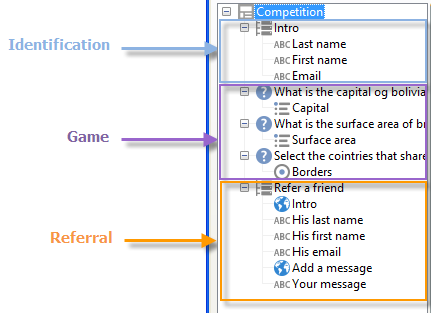
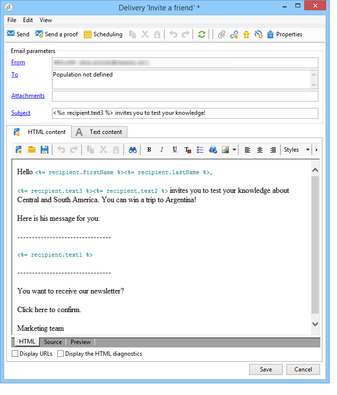

# 활용 사례: 참조 양식 만들기{#use-case-creating-a-refer-a-friend-form}


이 예제에서는 데이터베이스의 수신자에게 경쟁을 제공하려고 합니다. 웹 양식에는 답변을 입력하는 섹션이 있고 이메일 주소를 입력하여 친구를 참조하는 섹션이 있습니다.


식별 및 경쟁 블록은 이전에 설명된 프로세스를 사용하여 생성된다.

참조 블록을 구성하고 생성하려면 다음 단계를 적용합니다.

1. 질문과 친구의 연락처 정보를 입력할 수 있는 필드가 있는 경쟁 웹 양식을 아래와 같이 만듭니다.

   

   다음 **내 메시지** 필드를 사용하면 심판에 대한 메시지를 입력할 수 있습니다. 레퍼러는 또한 을 입력해야 합니다. **성**, **이름** 및 **이메일**.

   필드에 입력한 정보는 방문자 테이블이라고 하는 특정 테이블에 저장됩니다.

   >[!NOTE]
   >
   >수신자가 동의하지 않은 경우 데이터베이스에 수신자와 함께 저장할 수 없습니다. 이러한 파일은 다음에 임시로 저장됩니다. **방문자** 표 (**nms:visitor**) 바이럴 마케팅 캠페인을 위해 설계되었습니다. 다음 이유로 이 테이블은 정기적으로 삭제됩니다. **정리** 작업.
   >
   >이 예에서는 수신자를 타겟팅하여 레퍼러가 권장하는 대회에 참가하도록 제안하려고 합니다. 그러나 이 메시지에서는 당사의 정보 서비스 중 하나에 대한 구독을 제공하고자 합니다. 구독하는 경우 데이터베이스에 저장할 수 있습니다.

   

   심판과 관련된 필드의 콘텐츠는 프로필 만들기 스크립트와 심판에 전송된 메시지에 사용됩니다.

1. 레퍼러를 심판에 연결하는 스크립트를 만드는 것부터 시작합니다.

   여기에는 다음 지침이 포함되어 있습니다.

   

   ```
   ctx.recipient.visitor.@id = xtk.session.GetNewIds(1)
   ctx.recipient.visitor.@forwardUrl = "APP5"
   ctx.recipient.visitor.@referrerEmail = ctx.recipient.@email
   ctx.recipient.visitor.@referrerFirstName = ctx.recipient.@firstName
   ctx.recipient.visitor.@referrerLastName = ctx.recipient.@lastName
   ```

   페이지 식별 블록에 입력한 성, 이름 및 이메일 주소는 레퍼러의 성, 이름 및 이메일 주소로 식별됩니다. 이러한 필드는 심판에게 보내는 메시지의 본문에 다시 삽입됩니다.

   APP5 값은 웹 양식의 내부 이름과 일치합니다. 이 정보를 사용하면 심판의 출처를 파악할 수 있습니다. 즉, 방문자를 작성된 웹 양식에 연결할 수 있습니다.

1. 저장소 상자에서는 정보를 수집하여 데이터베이스에 저장할 수 있습니다.

   

1. 그런 다음 1단계에서 만든 정보 서비스에 연결된 게재 템플릿을 만듭니다. 다음에서 선택됩니다. **[!UICONTROL Choose scenario]** 정보 서비스 필드.

   추천 오퍼 메시지를 생성하는 데 사용되는 게재 템플릿에는 다음 정보가 포함됩니다.

   

   이 템플릿에는 다음과 같은 특성이 있습니다.

   * 방문자 테이블을 대상 매핑으로 선택합니다.

      

   * 레퍼러에 대한 정보뿐만 아니라 심판의 연락처 정보를 방문자 테이블에서 가져옵니다. 개인화 버튼을 사용하여 삽입됩니다.

      

   * 이 템플릿에는 뉴스레터를 구독하기 위한 심판용 구독 링크와 경쟁 양식에 대한 링크가 포함되어 있습니다.

      구독 링크는 개인화 블록을 통해 삽입됩니다. 기본적으로 프로필을에 가입할 수 있습니다. **뉴스레터** 서비스. 이 개인화 블록은 필요에 따라 변경할 수 있습니다(예: 수신자를 다른 서비스에 구독하기 위해).

   * 내부 이름(&#39;referrer&#39; here)은 아래와 같이 메시지 게재 스크립트에 사용됩니다.
   >[!NOTE]
   >
   >을(를) 참조하십시오 [이 페이지](../../delivery/using/about-templates.md) 게재 템플릿에 대한 자세한 내용을 참조하십시오.

1. 구독 메시지를 게재하는 두 번째 스크립트를 만듭니다.

   

   ```
   // Updtate visitor to have a link to the referrer recipient
   ctx.recipient.visitor.@referrerId = ctx.recipient.@id
   ctx.recipient.visitor.@xtkschema = "nms:visitor"
   ctx.recipient.visitor.@_operation = "update" 
   ctx.recipient.visitor.@_key = "@id" 
   xtk.session.Write(ctx.recipient.visitor)
   
   // Send email to friend
   nms.delivery.QueueNotification("referrer",
   <delivery>
   <targets>
     <deliveryTarget>
       <targetPart type='query' exclusion='false' ignoreDeleteStatus='false'>
         <where>
           <condition expr={'@id IN ('+ ctx.recipient.visitor.@id +')' }/>
         </where>
       </targetPart>
      </deliveryTarget>
     </targets>
    </delivery>)
   ```

1. 경쟁 양식을 게시하고 초기 대상의 수신자에게 초대를 보냅니다. 이 중 한 명이 친구를 초대할 때 다음을 기반으로 한 게재 **추천 오퍼** 템플릿이 생성됩니다.

   

   심판이 의 방문자 폴더에 추가됩니다. **[!UICONTROL Administration > Visitors node]**:

   

   프로필에는 레퍼러가 입력한 정보가 포함됩니다. 양식 스크립트에 입력한 구성을 기반으로 저장됩니다. 뉴스레터를 구독하기로 결정한 경우 수신자 표에 저장됩니다.
