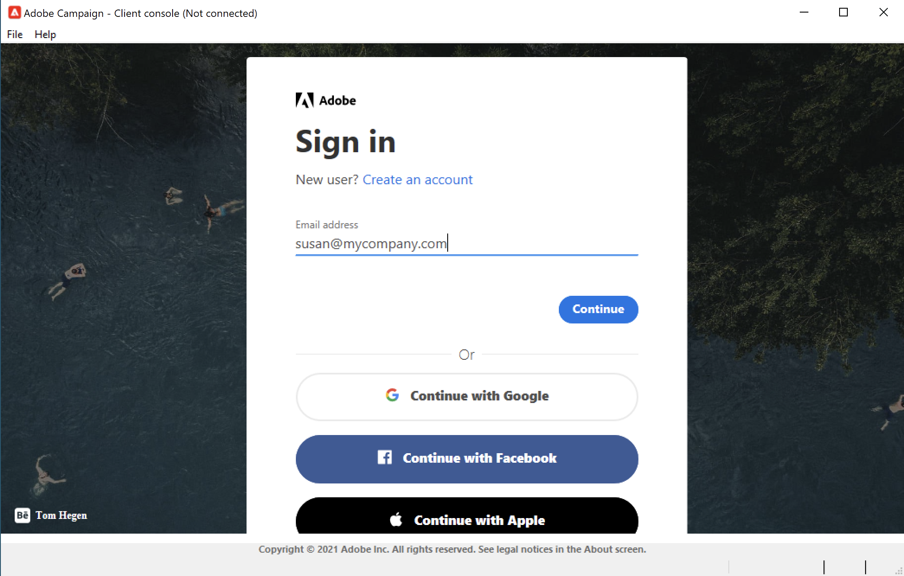
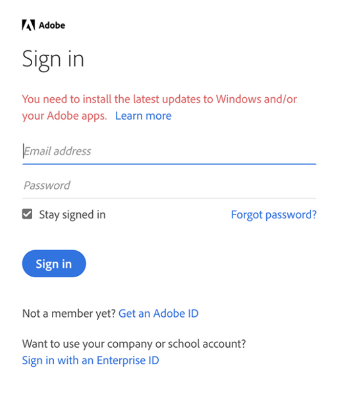

# IMS와 Adobe Campaign에 연결하기 위해 환경을 업데이트하는 방법 {#acc-ims-faq}

2021년 6월 30일에 Adobe Campaign 계속 사용 기능에 영향을 줄 수 있는 [Adobe Identity Management 시스템](https://helpx.adobe.com/enterprise/using/identity.html) (IMS) 로그인 기능이 변경됩니다. 중단 없이 Adobe Campaign Classic v7를 계속 사용하는 방법을 알아봅니다.

## 변경 사항

IMS(Adobe Identity Management Service)는 2021년 6월 30일부터 이전 Internet Explorer 버전 지원을 중단할 예정입니다&#x200B;**.** [자세히 알아보기](https://helpx.adobe.com/x-productkb/global/update-operating-system-and-browser.html)

Adobe은 2021년 6월 30일이 지난 모든 고객을 위해 IMS 기능을 보존하려고 합니다. IMS는 사용자가 클라이언트 콘솔에 로그인하여 Adobe Campaign에 사용할 수 있는 보안 프레임워크의 일부입니다.

이 기능을 유지하려면 고객이 각 사용자의 컴퓨터에서 Client Console을 업데이트하고 [Windows 버전](../rn/using/compatibility-matrix.md#ClientConsoleoperatingsystems)에 대한 최신 업데이트를 **Internet Explorer 11** 내장 이 각 사용자의 컴퓨터에 설치되어 있는지 확인해야 합니다.

## 영향을 받습니까?

Adobe ID](../integrations/using/about-adobe-id.md)을 통해 Campaign [에 연결하고, IMS(Identity Management Service)를 통해 연결하고, 아래에 나열된 버전보다 이전 버전의 Campaign을 실행하는 경우에는 영향을 받습니다.

이미 업데이트되었지만 이전 버전의 Microsoft Internet Explorer를 사용하는 경우 Internet Explorer 11로 업그레이드해야 합니다.

## 업데이트 방법

* 호스팅된 고객으로서 Adobe은 이미 인스턴스를 최신 버전으로 업그레이드했습니다.

* 온-프레미스/하이브리드 고객은 새 클라이언트 콘솔의 혜택을 받으려면 위에 나열된 최신 버전 중 하나로 업그레이드해야 하며 2021년 6월 30일 전에 **이 원활하게 전환되도록 해야 합니다**.

   아래 나열된 새 버전 중 하나로 업그레이드해야 합니다.

   * Gold Standard 11. [자세히 알아보기](../rn/using/gold-standard.md)
   * Campaign 20.3.3 릴리스. [자세히 알아보기](../rn/using/release--20-3.md)
   * Campaign 20.2.4 릴리스. [자세히 알아보기](../rn/using/release--20-2.md)
   * Campaign 20.1.4 릴리스. [자세히 알아보기](../rn/using/release--20-1.md)
   * Campaign 19.2.4 릴리스. [자세히 알아보기](../rn/using/release--19-2.md)
   * Campaign 19.1.8 릴리스. [자세히 알아보기](../rn/using/release--19-1.md)

이러한 릴리스는 새 연결 프로토콜과 함께 제공됩니다. 업그레이드는 Campaign 서버와 클라이언트 콘솔 모두에 필수입니다.모든 인스턴스가 업그레이드되면 2021년 6월 30일&#x200B;**6월 30일 이후에 Campaign에 연결할 수 있을 뿐만 아니라 클라이언트 콘솔을 이 버전으로 업그레이드해야 합니다**.

또한 **Internet Explorer 11** 내장 [Windows 버전](../rn/using/compatibility-matrix.md#ClientConsoleoperatingsystems)의 최신 업데이트가 각 사용자의 컴퓨터에 설치되어 있는지 확인하십시오.

## FAQ

**Campaign 버전을 확인하려면 어떻게 해야 합니까?**

이 섹션](../platform/using/launching-adobe-campaign.md#getting-your-campaign-version)에서 버전 [을 확인하는 방법을 알아봅니다.

**IMS를 사용하는지 어떻게 확인할 수 있습니까?**

연결 모드를 확인하려면 다음을 수행할 수 있습니다.

* Campaign 클라이언트 콘솔을 실행하고 인스턴스 연결 설정에 액세스합니다. **Adobe ID으로 연결** 옵션이 선택된 경우 Adobe IMS를 사용하는 것입니다.

   

또는

* Campaign 클라이언트 콘솔을 시작하고 연결 창을 확인합니다. 아래 화면에 표시된 대로 Adobe ID과 연결하는 경우 IMS를 사용합니다.

   

**연결 경고 메시지**

사용자가 클라이언트 콘솔을 업데이트하거나 이전 버전의 Microsoft Internet Explorer를 사용해야 하는 경우 다음 경고 메시지가 표시됩니다.**Windows 및/또는 Adobe 앱에 최신 업데이트를 설치해야 합니다.**

이러한 경고가 표시되면 사용 중인 운영 체제의 최신 업데이트를 설치하십시오. [자세히 알아보기](https://helpx.adobe.com/x-productkb/global/update-operating-system-and-browser.html)

**2021년** 6월 30일 이후에는 다음 메시지가 표시되므로 더 이상 Adobe Campaign에 연결할 수 없습니다.

>[!NOTE]
>
>이러한 변경 사항에 대한 질문이 있으면 [Adobe 고객 지원 센터](https://helpx.adobe.com/kr/enterprise/admin-guide.html/enterprise/using/support-for-experience-cloud.ug.html)에 문의하십시오.

## 유용한 링크

* [환경 업그레이드](../production/using/build-upgrade.md)
* [빌드 업그레이드 FAQ](../platform/using/faq-build-upgrade.md)
* [새 클라이언트 콘솔을 사용자가 사용할 수 있게 만들기](../installation/using/client-console-availability-for-windows.md)
* [Campaign 클라이언트 콘솔 설치](../installation/using/installing-the-client-console.md)
* [Adobe 소프트웨어 배포 액세스](https://experienceleague.adobe.com/docs/experience-cloud/software-distribution/home.html?lang=en)
* [Campaign Classic 빌드 다운로드](https://experience.adobe.com/#/downloads/content/software-distribution/en/campaign.html)