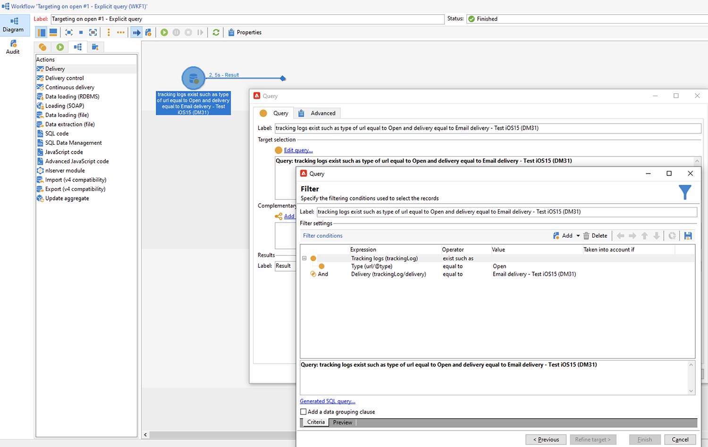
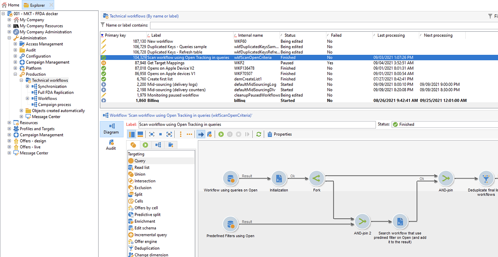
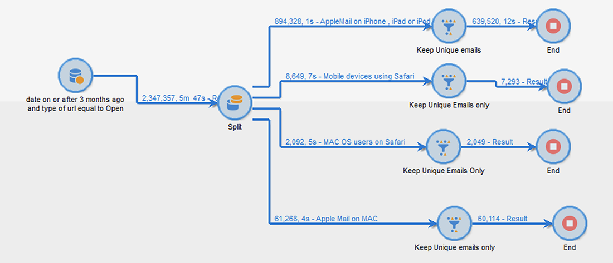

# Apple 메일 앱의 메일 개인 정보 보호


## 변경 사항

2021년 Apple은 기본 메일 앱에 새로운 개인 정보 보호 기능을 도입했습니다. 이제 이 앱에 Apple의 메일 개인 정보 보호 기능이 포함됩니다. 기본적으로 보낸 사람은 더 이상 추적 픽셀을 사용하여 Apple의 메일 개인 정보 보호 기능을 사용하도록 선택한 받는 사람에 대한 정보를 수집할 수 없습니다.

## 내 캠페인은 어떤 영향을 받습니까?

Adobe Campaign에서는 추적 픽셀을 사용하여 이메일 열기를 추적하는 기능을 제공합니다. 이 기능은 타기팅 및 캠페인뿐만 아니라 지표에도 사용할 수 있습니다. 예를 들어 이메일 열람율을 사용하여 캠페인 효과 및 사용자 참여를 측정할 수 있습니다. 즉, 캠페인에서 세그멘테이션, 타기팅 및 지표가 영향을 받을 수 있습니다.

## 어떤 조치를 취해야 합니까?

Apple의 새로운 기능은 이메일 개인 정보 보호 측면에서 업계에서 나올 수 있는 것들의 모양입니다. Adobe의 권장 사항을 따르는 것이 좋습니다.

### 캠페인 트리거에 미치는 영향 평가

이러한 변경 사항이 현재 캠페인 트리거에 미치는 영향을 평가합니다. 이메일 열기가 세분화, 타겟팅 또는 재타겟팅의 기준으로 사용되는 워크플로우를 식별합니다. 읽기 [팁과 트릭](#find-email-open-tracking).

### 데이터 유지

데이터를 보존하고 디바이스에 대한 현재 지식을 통합합니다. 사용자 에이전트에 대한 주요 성과 지표(KPI)의 기준을 지정할 수 있습니다. 예를 들어 iOS 및 Apple의 메일 앱을 사용하는 사람의 프로필에 대해 KPI를 작성할 수 있습니다. 읽기 [팁과 트릭](#preserve-tracking-data).

### 보존 기간 이후에 추적 로그 보관

Adobe Campaign의 보존 기간 이후에 추적 로그를 보관합니다.

1. 캠페인 인스턴스에서 보존 기간 기간을 확인합니다.
1. 활성 대상 매핑을 다시 확인하십시오. 기본 제공 프로필 표(`nmsRecipient`).
1. Adobe Campaign에서 추적 로그를 내보냅니다. 사용자 에이전트 및 운영 체제에 대한 데이터가 포함된 로그를 포함합니다.

### 현재 공개 비율 추세 평가

iOS 장치에서 Apple의 메일 앱을 사용하는 대상자의 비율을 결정합니다.
이 평가를 사용하여 잠재적인 예외적인 격차와 그 원인을 파악할 수 있습니다. 공백이 캠페인 성능 문제로 인한 것인지 Apple의 개인 정보 보호 기능으로 인한 것인지 확인할 수 있습니다. 읽기 [팁과 트릭](#measure-ios-footprint).

### 캠페인 전략 및 성과 지표 재평가

무엇보다 캠페인 전략 및 캠페인 성과 지표를 사전에 재평가하는 것이 좋습니다. 클릭스루, 제품 보기 및 구매 등 보다 안정적인 지표에 다시 집중할 수 있습니다.

현재 사용 가능한 데이터를 살펴보고 공개 비율과 다른 지표 간의 상관 관계를 평가하는 것이 좋습니다. 이러한 지표가 일관되게 연관되어 있으면 양호한 신뢰 수준으로 트리거를 개선할 수 있습니다.

## 팁과 트릭

### 전체 iOS 풋프린트 측정 {#measure-ios-footprint}

Adobe Campaign 데이터에서 인사이트를 수집하려면 기본 제공 보고서를 사용할 수 있습니다.

* **[!UICONTROL Operating Systems]** 보고서

  운영 체제 및 버전당 방문자 수를 파악하려면 이 보고서를 사용합니다. [자세히 보기](../../reporting/using/global-reports.md#operating-systems).

  총 방문자 수와 관련하여 운영 체제당 방문자 수 분류를 볼 수 있습니다.

  

  각 운영 체제에 대해 운영 체제 버전별 방문자 분류를 볼 수 있습니다.

  

* **[!UICONTROL Breakdown of opens]** 보고서

  운영 체제당 이메일 열람수 비율을 식별하려면 이 보고서를 사용합니다. [자세히 보기](../../reporting/using/global-reports.md#breakdown-of-opens).

  

### 이메일 열기 추적 사용 방법 결정 {#find-email-open-tracking}

이메일 열기가 세분화, 타겟팅 및 재타겟팅의 기준으로 사용되는 워크플로우를 식별할 수 있습니다.

이렇게 하려면 다음을 사용할 수 있습니다 **[!UICONTROL type]** 추적된 링크 URL의 속성(**[!UICONTROL url/@type]**). 이메일 열기의 경우 이 속성은 로 설정됩니다. **[!UICONTROL Open]**. 이 속성은 쿼리 편집기에서 사용할 수 있습니다. **[!UICONTROL Query]** 워크플로우의 활동 및 사전 정의된 필터. 이 속성을 마케팅 캠페인에 대한 타겟팅 기준으로 사용할 수 있습니다.


이 예에서는 마케터가 지난 7일 이내에 특정 게재 이메일을 열고 지난 달에 구입한 수신자에게 보상 오퍼를 보내려고 합니다. 워크플로우 쿼리에서 다양한 방법으로 이메일 열기를 사용할 수 있습니다.

* 쿼리에서 이메일 열기 를 타깃팅 기준으로 사용할 수 있습니다.

  특정 게재의 추적 로그 URL 유형을 다음으로 설정해야 함을 필터링 조건으로 지정할 수 있습니다. **[!UICONTROL Open]**.

  

* 사전 정의된 필터를 사용할 수 있습니다. [자세히 알아보기](../../workflow/using/creating-a-filter.md)

  

  워크플로우의 쿼리 활동에서 이 사전 정의된 필터를 사용할 수 있습니다.

  

  >[!NOTE]
  >
  >워크플로우에서는 사전 정의된 필터의 타겟팅 기준을 볼 수 없습니다.

이메일이 타겟팅 기준으로 사용되는 워크플로우 목록을 검색하려면 `xtk:workflow` 스키마. 워크플로우의 콘텐츠는 **[!UICONTROL XML memo (data)]** XML 형식의 필드입니다.


워크플로우에 다음 콘텐츠가 포함되도록 지정할 수 있습니다.

`expr="[url/@type] = 2"`

이 타겟팅 기준은 추적된 URL의 유형을 로 설정해야 함을 의미합니다 **[!UICONTROL Open]**.


#### 구현 및 샘플 패키지의 예

이 구현 예제를 사용하여 이메일 열기가 타겟팅 기준으로 사용되는 워크플로우를 식별하고 선택한 캠페인 운영자에게 알림을 전송할 수 있습니다. 이 구현을 다음과 같은 용도로 사용할 수 있습니다.

* 타겟팅 워크플로우에서 이메일 열람에서 다른 KPI로 전환함으로써 발생할 수 있는 영향을 측정할 수 있습니다. 이메일 열기를 사용하지 않는 경우 추가 작업이 필요하지 않습니다.
* 구현을 재평가할 때 이 예제를 사용하여 워크플로우를 건너뛸 수 있습니다.

이 예에서는 단일 기술 워크플로우의 사용자 지정 구현을 보여 줍니다.


>[!IMPORTANT]
>
>패키지는 예시로만 제공되며 Adobe에서 제품 기능으로 지원하지 않습니다.
>
>샘플 코드를 캠페인 구현에 맞게 조정해야 할 수 있습니다.
>
>최종 사용자는 이 샘플 패키지를 설치하고 사용할 책임이 있습니다.
>
>비프로덕션 환경에서 이 패키지를 테스트하고 확인하는 것이 좋습니다.

다운로드 [샘플 패키지](assets/PKG_Search_workflows_using_Opens_in_queries_V1.xml) 설치 [자세히 알아보기](../../platform/using/working-with-data-packages.md#importing-packages)

패키지를 설치한 후에는 인스턴스에 기본 제공 기술 워크플로우가 포함된 폴더에서 워크플로우에 액세스할 수 있습니다.

`/Administration/Production/Technical workflows/nmsTechnicalWorkflow`

사용자 인터페이스에서 을(를) 선택합니다 **[!UICONTROL Administration]** > **[!UICONTROL Production]** > **[!UICONTROL Technical workflows]**.



워크플로우는 다음 주요 단계로 구성됩니다.

1. 타겟팅 기준으로 이메일이 사용되는 워크플로우를 나열합니다.
1. 타겟팅 기준으로 이메일 열기가 사용되는 사전 정의된 필터를 나열합니다.
1. 이러한 사전 정의된 필터가 사용되는 워크플로우를 나열합니다.
1. 두 워크플로우 목록을 하나의 목록으로 병합합니다.
1. 지정된 운영자에게 이메일 알림을 보냅니다.

워크플로우는 다음과 같은 세부 단계로 구성됩니다.

1. 초기 활동은 의 쿼리 활동입니다 `xtk:workflow` 스키마. 이 활동은 인스턴스에서 타겟팅 기준으로 이메일을 포함하는 명시적 워크플로우 쿼리를 찾는 데 사용됩니다.

   

   

   

   그 결과 워크플로 목록이 반환됩니다.

   

   이 정보가 재사용되므로 작업 테이블의 이름이 전역 워크플로우 인스턴스 변수에 저장됩니다.

   

1. 두 번째 쿼리는 이메일 열림 수를 포함하는 사전 정의된 필터를 찾는 데 사용됩니다.

   

   

   

   결과적으로 사전 정의된 필터 목록이 반환됩니다.

   

1. 사전 정의된 이 필터 목록은 이러한 필터가 사용되는 워크플로를 찾는 데 사용됩니다.
1. 두 워크플로우 목록이 하나의 목록으로 병합됩니다.

   이러한 목적으로 JavaScript 코드가 사용됩니다.

   

   ```javascript
   const queryPredFilter = xtk.queryDef.create(
     <queryDef schema={vars.targetSchema} operation="select">
        <select>
          <node alias="@id" expr="@id" />
          <node alias="@name" expr="@name"  />
        </select>
        <where/>
     </queryDef>
       ).ExecuteQuery()
   
   var qDef =
     <queryDef schema="xtk:workflow" operation="select">
       <select>
         <node expr="@id"/>
         <node expr="@internalName"/>
         <node expr="@label"/>
       </select>
       <where>
         <condition boolOperator="OR" expr={"data like '%expr=[url/@type] = 2%'" }/>
       </where>
     </queryDef>
   
   for each (var filter in queryPredFilter) {       
   
      //logInfo (filter.@name);
      var condition;
      condition =<condition boolOperator="OR" expr={"data like '%" + filter.@name + "%'" }/>
      qDef.where.appendChild(condition);   
   
   }
   
   var queryWorkflowList = xtk.queryDef.create(qDef);
   var workflowList = queryWorkflowList.ExecuteQuery();
   
   var sWorkflowList = "";
   var iCount = 0
   for each (var workflow in workflowList) {       
   
      //logInfo ("Workflow ID: " + workflow.@id + " in " + instance.vars.mainTargetSchema);
   
      iWorkflowId = workflow.@id;
      iWorkflowName = workflow.@internaName;
      iWorkflowLabel = workflow.@label;
   
       xtk.session.Write(
             <{instance.vars.mainTargetSchema.split(':')[1]}
               _operation="insertOrUpdate"       
               _key="@id"
               xtkschema={instance.vars.mainTargetSchema}
               id={iWorkflowId}
               internaName={iWorkflowName}
               label={iWorkflowLabel}
             />
       )
   }
   ```

1. 병합된 목록에서 중복 워크플로우가 제거됩니다.

   

1. 목록이 비어 있지 않은지 확인하기 위해 테스트가 수행됩니다.

   

   목록이 비어 있지 않으면 이메일 알림을 위한 HTML 테이블에 삽입됩니다.

   

   ```js
   const queryWorkflow = xtk.queryDef.create(
       <queryDef schema={vars.targetSchema} operation="select">
           <select>
               <node alias="@id" expr="@id" />
               <node alias="@internalName" expr="@internalName"  />
               <node alias="@label" expr="@label"  />
           </select>
           <where/>
       </queryDef>
   ).ExecuteQuery()
   
   var sWorkflowList = '<table border="0" >';
   
   sWorkflowList = sWorkflowList + "<tr><th>Worklow Id</th><th>Name</th><th>Label</th></tr>";
   
   for each (var workflow in queryWorkflow) {       
   
      sWorkflowList = sWorkflowList + "<tr>" +
                       "<td>" + workflow.@id + "</td>" +
                       "<td>" + workflow.@internalName + "</td>" +
                       "<td>" + workflow.@label + "</td>" +
                       "</tr>";
   
   }
   
   sWorkflowList = sWorkflowList + "</table>";
   
   instance.vars.workflowList = sWorkflowList;
   ```

1. HTML 테이블이 알림 템플릿에 추가됩니다.

   ```js
   <%= instance.vars.workflowLIst%>
   ```

   

   이메일 알림에는 쿼리의 타겟팅 기준으로 이메일 열기가 포함된 워크플로우 목록이 포함됩니다.

   

### 현재 추적 데이터 유지 {#preserve-tracking-data}

#### 영향을 받는 데이터

프로필 데이터는 이메일 열기 및 클릭스루와 같은 작업의 추적 데이터로 보강됩니다. 또한 추적은 이 정보를 사용할 수 있을 때 사용자 에이전트를 통해 사용자 장치에 대한 주요 정보를 제공합니다.

간단히 말해, Adobe Campaign 추적 데이터는 다음 정보를 제공합니다.

* 특정 이메일 메시지를 통해 열거나 클릭한 사람과 관련된 프로필
* 오픈 날짜
* 사용된 디바이스(예: iPhone 또는 Mac)
* 운영 체제와 버전(예: iOS 15, macOS 12 또는 Windows 10)
* 메일 응용 프로그램이나 웹 브라우저와 같은 응용 프로그램과 버전(예: Outlook 2019)

#### 추적 데이터를 유지해야 하는 이유는 무엇입니까?

다음과 같은 여러 가지 이유로 이 데이터를 보존하는 것이 좋습니다.

* 이 데이터는 제한된 기간 동안 Adobe Campaign에 의해 유지됩니다. 보존 기간은 인스턴스의 구성에 따라 다릅니다.

  인스턴스의 설정을 확인합니다. [자세히 보기](../../platform/using/privacy-management.md#data-retention).

* Apple의 최근 변경 사항 외에도 추적 데이터를 사용하여 고객의 참여를 유도하는 데 큰 가치를 추가할 수 있습니다.
* Apple은 기본 메일 앱과 메일 개인 정보 보호 기능을 추가로 변경할 수 있습니다.

이러한 모든 이유로 이 데이터를 가능한 한 빨리 내보내는 것이 좋습니다. 그렇지 않으면 대상의 일부에 대한 추적 데이터가 부정적인 영향을 받을 수 있습니다.

#### 추적 데이터를 보존하려면 어떻게 해야 합니까?

추적 데이터를 유지하려면 Adobe Campaign에서 정보 시스템으로 내보내야 합니다. [자세히 보기](../../platform/using/get-started-data-import-export.md).

>[!IMPORTANT]
>
>다음 예제는 기본 제공 기능에 중점을 둡니다 `nms:Recipient` 스키마(기본 프로필 스키마) 사용자 지정 프로필에 첨부된 추가 사용자 지정 대상 매핑을 사용하는 경우 이 내보내기 전략을 모든 사용자 지정 로그 표로 확장하는 것이 좋습니다. [자세히 보기](../../configuration/using/target-mapping.md).

##### 원칙

기본적으로 `nms:Recipient` 스키마가 엑스포트해야 하는 세 개의 스키마에 연결되어 있습니다.

| 스키마 | 콘텐츠 |
| --- | --- |
| nms:trackingLogRcp | 추적 데이터, 대상, 사용자, 시간 및 관련 메시지 |
| nms:trackingUrl | 특성(예: 이메일 열기 또는 클릭스루)을 포함한 링크에 대한 세부 정보 |
| nms:userAgent | 장치에 대한 정보 |

표는 데이터 모델에서 연결됩니다.


이러한 관계를 사용하여 단일 내보내기 쿼리를 만듭니다.


연결된 스키마의 유용한 정보로 이 데이터를 보강할 수 있습니다.

| 스키마 | 콘텐츠 |
| --- | --- |
| nms:Recipient | 프로필과 관련된 세부 정보 |
| nms:Delivery | 사용자가 반응한 메시지에 대한 정보 |

Adobe Campaign에서 지원하는 외부 스토리지 솔루션으로 결과를 내보낼 수 있습니다.

* SFTP
* S3
* Azure Blob

##### 구현

이 예에서는 Adobe Campaign에서 추적 데이터를 내보내는 방법을 보여 줍니다.

1. 쿼리로 시작하는 워크플로우를 만듭니다.

   초기 쿼리는 지난 3개월 동안의 추적 로그를 검색하는 데 사용됩니다.
증분 쿼리를 사용하여 아직 내보내지 않은 레코드만 추출할 수 있습니다.

   에서 필요한 모든 정보를 추가합니다. **[!UICONTROL Additional data]** 노드.

   

1. 추가 **[!UICONTROL Data extraction (file)]** 활동. 쿼리의 모든 데이터를 추출 파일 형식에 매핑합니다.

   

   파일 형식(예: TXT 또는 CSV)을 선택합니다.

   

1. 지원되는 스토리지 솔루션에 파일 업로드에 대한 세 번째 및 마지막 활동을 추가합니다.


##### 고급 구현: iOS 디바이스별 분류

워크플로우를 사용하여 수신자가 Apple의 메일 앱을 사용하는지 여부를 결정할 수 있습니다. 추적 로그를 디바이스별로 분할할 수 있습니다. 예를 들어 쿼리 필터를 사용하여 iOS 디바이스별로 레코드를 분류할 수 있습니다.

| 애플리케이션 | 운영 체제 또는 장치  | 쿼리 필터 |
| --- | --- | --- |
| Apple 메일 | iOS 15 | `operating System (Browser) contains 'iOS 15' and browser (Browser) contains 'ApplewebKit'` |
| Apple 메일 | iOS 14 또는 iOS 13 | `browser contains 'AppleWebKit' and operating System of browser contains 'iOS 14' or operating System of browser contains 'iOS 13'` |
| Apple 메일 | iOS 모바일 장치: iPad, iPod 및 iPhone | `device (Browser) contains iPhone or device (Browser) equal to iPod or device (Browser) equal to iPad and browser (Browser) equal to 'AppleWebKit'` |
| Apple 메일 | iPhone , iPad 또는 iPod | `browser (Browser) equal to 'AppleWebKit' and device (Browser) equal to iPhone or device (Browser) equal to iPod or device (Browser) equal to iPad` |
| Apple 메일 | Mac | `browser (Browser) equal to 'AppleWebKit' and operating System (Browser) contains 'Mac'` |
| Safari | macOS | `browser (Browser) equal to 'Safari' and device (Browser) equal to PC and operating System (Browser) contains 'Mac'` |
| Safari | 모바일 장치 | `browser (Browser) equal to 'Safari' and device (Browser) equal to iPad or device (Browser) equal to iPod or device (Browser) equal to iPhone` |


다음 규칙을 다양한 용도로 사용할 수 있습니다.

* 외부 스토리지 솔루션으로 데이터 내보내기 및 아카이빙
* 프로필에 첨부할 KPI 계산
* 제외 목록 만들기
* 보고

다음 예에서는 워크플로우를 사용하여 iOS 디바이스별로 레코드를 분류하는 방법을 보여 줍니다.

* 첫 번째 예제 워크플로우는 다음 활동으로 구성됩니다.

   1. 초기 **[!UICONTROL Query]** 활동은 지난 3개월 동안 열린 모든 이메일을 선택하는 데 사용됩니다.
   1. A **[!UICONTROL Split]** 활동은 이메일 애플리케이션, 브라우저, 운영 체제 및 장치별로 선택 항목을 분할하는 데 사용됩니다.

   1. A **[!UICONTROL Deduplication]** 활동은 다음을 따릅니다. **[!UICONTROL Split]** 활동. 다음 **[!UICONTROL Deduplication]** 활동은 중복 이메일 주소를 제거하는 데 사용됩니다.

      다음 **[!UICONTROL Deduplication]** 활동은 다음 뒤에 배치됩니다. **[!UICONTROL Split]** 다양한 장치를 사용하는 수신자에 대한 정보가 손실되지 않도록 하는 활동.

   1. An **[!UICONTROL End]** 활동은 다음을 따릅니다. **[!UICONTROL Deduplication]** 활동.

  이 유형의 워크플로우는 타깃팅할 기본 제공 수신자 표에만 수신자를 저장하는 경우에 유용합니다.

  

* 두 번째 예제 워크플로우는 다음 활동으로 구성됩니다.

   1. 초기 **[!UICONTROL Query]** 활동은 지난 3개월 동안 열린 모든 이메일을 선택하는 데 사용됩니다.
   1. A **[!UICONTROL Deduplication]** 활동은 중복 이메일 주소를 제거하는 데 사용됩니다.
   1. A **[!UICONTROL Fork]** 활동이 사용됩니다.

      * 한 번의 전환에서 **[!UICONTROL Change dimension]** 활동은 추적 로그가 참조하는 수신자를 찾는 데 사용됩니다.
      * 다른 전환에서는 **[!UICONTROL Split]** 활동은 이메일 애플리케이션, 브라우저, 운영 체제 및 장치별로 선택 항목을 분할하는 데 사용됩니다.

   1. An **[!UICONTROL End]** 활동은 다음의 각 전환을 따릅니다. **[!UICONTROL Split]** 활동.

  이 유형의 워크플로우는 기본 수신자 테이블 이외의 테이블에 수신자를 저장하는 경우에 유용합니다.

  
