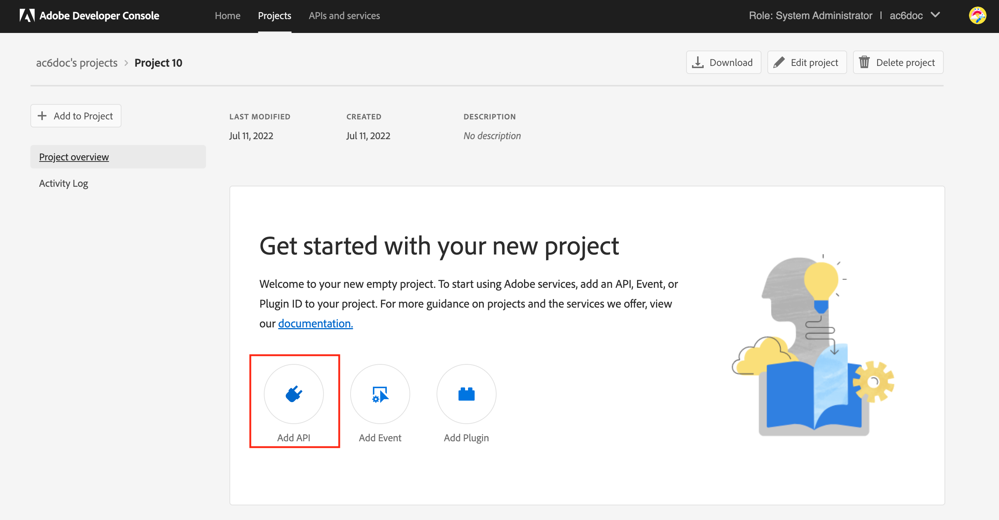

# Campaign 게재 기능 서버 {#acc-deliverability}

시작 [v7.2.1 릴리스](../../rn/using/latest-release.md#release-7-2-2), Adobe Campaign은 고가용성을 가져오고 보안 규정 준수 문제를 해결하는 새로운 게재 기능 서버를 사용합니다. 이제 Campaign Classic이 게재 가능성 규칙, 브로드로그 및 억제 주소를 새 게재 가능성 서버에서 동기화합니다. 이전 게재 가능성 서버는 2022년 8월 31일에 폐기됩니다.

Campaign Classic 고객은 새 게재 가능성 서버를 구현해야 합니다 **2022년 8월 31일 이전**.

>[!NOTE]
>
>이러한 변경 사항에 대한 자세한 내용은 [FAQ](#faq), 또는 연락처 [고객 지원 Adobe](https://helpx.adobe.com/kr/enterprise/admin-guide.html/enterprise/using/support-for-experience-cloud.ug.html){_blank}.

## 변경 사항{#acc-deliverability-changes}

Adobe은 보안 규정 준수 때문에 오래된 데이터 센터를 해체하고 있습니다. Adobe Campaign Classic 클라이언트는 Amazon 웹 서비스(AWS)에서 호스팅되는 새로운 게재 기능 서비스로 마이그레이션해야 합니다.

이 새 서버는 고가용성(99.9)을 &#x200B; 보장하고, 캠페인 서버가 필요한 데이터를 가져올 수 있도록 보안 및 인증된 끝점을 제공합니다. 모든 요청에 대해 데이터베이스에 연결하는 대신, 새 게재 기능 서버가 가능한 경우 요청을 제공하도록 데이터를 캐시합니다. 이 메커니즘은 응답 시간을 &#x200B; 개선합니다.

## 영향을 받습니까?{#acc-deliverability-impacts}

모든 고객은 영향을 받게 되며 로 업그레이드해야 합니다. [Campaign v7.2.1](../../rn/using/latest-release.md#release-7-2-2) (또는 그 이상) 환경을 구현하여 새로운 게재 가능성 서버를 활용할 수 있습니다.

## 업데이트 방법{#acc-deliverability-update}

로서의 **호스팅 고객**, Adobe은 사용자와 협력하여 인스턴스를 최신 버전으로 업그레이드하고 Adobe Developer 콘솔에서 프로젝트를 만듭니다.

로서의 **온-프레미스/하이브리드 고객**&#x200B;로 업그레이드해야 합니다. [Campaign v7.2.1](../../rn/using/latest-release.md#release-7-2-2) (또는 그 이상)을 사용하여 새로운 게재 가능성 서버를 활용할 수 있습니다. 모든 인스턴스가 업그레이드되면 다음을 수행해야 합니다 [새로운 통합 구현](#implementation-steps) 게재 기능 서버를 Adobe 하고 원활한 전환을 보장합니다.

## 구현 단계 {#implementation-steps}

새로운 게재 기능 서버 통합의 일부로 Campaign은 IMS(Identity Management Service) 기반 인증을 통해 Adobe Shared Services와 통신해야 합니다. 선호하는 방법은 Adobe Developer 기반 게이트웨이 토큰(기술 계정 토큰 또는 Adobe IO JWT라고도 함)을 사용하는 것입니다.


>[!WARNING]
>
>이러한 단계는 하이브리드 및 온-프레미스 구현에만 수행해야 합니다.

### 전제 조건{#prerequisites}

구현을 시작하기 전에 인스턴스 구성을 확인하십시오.

1. Campaign 클라이언트 콘솔을 열고 Adobe Campaign에 관리자로 로그온합니다.
1. 찾아보기 **관리 > 플랫폼 > 옵션**.
1. 을(를) 확인합니다. `DmRendering_cuid` 옵션 값이 입력되었습니다.

   * 옵션이 채워지면 구현을 시작할 수 있습니다.
   * 값을 입력하지 않은 경우 [고객 지원 Adobe](https://helpx.adobe.com/enterprise/admin-guide.html/enterprise/using/support-for-experience-cloud.ug.html){_blank} 을 입력하여 CUID를 가져옵니다.

      이 옵션은 동일한 값으로 모든 Campaign 인스턴스(MKT, MID, RT, EXEC)에 채워야 합니다. 하이브리드 고객은 Adobe에 연락하여 MID, RT 및 EXEC 인스턴스에 옵션을 설정합니다.

### 1단계: Adobe Developer 프로젝트 만들기/업데이트 {#adobe-io-project}

1. 액세스 [Adobe Developer 콘솔](https://developer.adobe.com/console/home) 조직의 개발자 액세스 권한으로 로그인합니다.

   >[!NOTE]
   >
   > 올바른 조직 포털에 로그인되어 있는지 확인하십시오.

1. **[!UICONTROL Create new project]**을(를) 선택합니다.
   


   >[!CAUTION]
   >
   >Analytics 커넥터 또는 Adobe 트리거과 같은 다른 통합에 Adobe IO JWT 인증 기능을 이미 사용하고 있다면, 다음을 추가하여 프로젝트를 업데이트해야 합니다 **Campaign API** 해당 프로젝트에 대한 업데이트입니다.

1. 선택 **[!UICONTROL Add API]**.
   
1. 에서 **[!UICONTROL Add an API]** 창, 선택 **[!UICONTROL Adobe Campaign]**.
   
1. 클라이언트 ID가 비어 있는 경우 **[!UICONTROL Generate a key pair]** 공개 및 개인 키 쌍을 만들려면
   

   그러면 기본 만료 날짜인 365일로 키가 자동으로 다운로드됩니다. 만료되면 새 키 쌍을 만들고 구성 파일에서 통합을 업데이트해야 합니다. 옵션 2를 사용하여 수동으로 을 만들고 업로드할 수 있습니다 **[!UICONTROL Public key]** 만료 날짜가 길어졌습니다.
   

   >[!CAUTION]
   >
   >을(를) 저장해야 합니다. `config.zip` 파일을 다시 다운로드할 수 없으므로 다운로드 메시지가 나타나면 파일을 다운로드하십시오.

1. **[!UICONTROL Next]**&#x200B;를 클릭합니다.
1. 기존 항목 선택 **[!UICONTROL Product profile]** 또는 필요한 경우 새 항목을 만듭니다. 이 작업에 대한 권한이 필요하지 않습니다 **[!UICONTROL Product profile]**. 자세한 내용은 **[!UICONTROL Product Profiles]**&#x200B;를 참조하려면 [이 페이지](https://helpx.adobe.com/enterprise/using/manage-developers.html){_blank}.
   

   그런 다음 **[!UICONTROL Save configured API]**.

1. 프로젝트에서 를 선택합니다. **[!UICONTROL Adobe Campaign]** 및에서 다음 정보를 복사합니다. **[!UICONTROL Service Account (JWT)]**

   

   * **[!UICONTROL Client ID]**
   * **[!UICONTROL Client Secret]**
   * **[!UICONTROL Technical account ID]**
   * **[!UICONTROL Organization ID]**

>[!CAUTION]
>
>Adobe Developer 인증서는 12개월 후에 만료됩니다. 매년 새 키 쌍을 만들어야 합니다.

### 2단계: Adobe Campaign에서 프로젝트 자격 증명 추가 {#add-credentials-campaign}

개인 키는 base64 UTF-8 형식으로 인코딩해야 합니다.

방법은 다음과 같습니다.

1. 위의 단계에서 생성된 개인 키를 사용합니다.
1. 다음 명령을 사용하여 개인 키를 인코딩합니다. `base64 ./private.key > private.key.base64`. 이렇게 하면 base64 컨텐츠가 새 파일에 저장됩니다 `private.key.base64`.

   >[!NOTE]
   >
   >개인 키를 복사/붙여넣을 때 추가 줄이 자동으로 추가되는 경우가 있습니다. 개인 키를 인코딩하기 전에 제거해야 합니다.

1. 파일에서 내용을 복사합니다. `private.key.base64`.
1. Adobe Campaign 인스턴스가 설치된 각 컨테이너에 SSH를 통해 로그인하고 다음 명령을 다음과 같이 실행하여 Adobe Campaign에 프로젝트 자격 증명을 추가합니다. `neolane` 사용자. 그러면 **[!UICONTROL Technical Account]** 인스턴스 구성 파일의 자격 증명입니다.

   ```
   nlserver config -instance:<instance name> -setimsjwtauth:Organization_Id/Client_Id/Technical_Account_ID/<Client_Secret>/<Base64_encoded_Private_Key>
   ```

1. 수정을 고려하려면 서버를 중지한 다음 다시 시작해야 합니다. 를 실행할 수도 있습니다 `config -reload` 명령.

### 3단계: 새 게재 기능 서버 활성화

이제 새 게재 기능 서버를 활성화할 수 있습니다. 다음을 수행하십시오.

1. 클라이언트 콘솔을 열고 Adobe Campaign에 관리자로 로그온합니다.
1. 찾아보기 **관리 > 플랫폼 > 옵션**.
1. 액세스 권한 `NewDeliverabilityServer_FeatureFlag` 옵션을 선택하고 값을 로 설정합니다. `1`. 이 구성은 모든 Campaign 인스턴스(MKT, MID, RT, EXEC)에서 수행해야 합니다. 하이브리드 고객은 Adobe에 연락하여 MID, RT 및 EXEC 인스턴스에 옵션을 설정합니다.

### 4단계: 구성 유효성 검사

통합이 성공했는지 확인하려면 아래 단계를 따르십시오.


1. 클라이언트 콘솔을 열고 Adobe Campaign에 로그인합니다.
1. 찾아보기 **관리 > 프로덕션 > 기술 워크플로우**.
1. 를 다시 시작합니다. **게재 능력을 위해 새로 고침** (게재 가능성 업데이트) 워크플로우입니다. 이 작업은 모든 Campaign 인스턴스(MKT, MID, RT, EXEC)에서 수행해야 합니다. 하이브리드 고객은 Adobe에 연락하여 MID, RT 및 EXEC 인스턴스에서 워크플로우를 다시 시작합니다.
1. 로그 확인: 워크플로우는 오류 없이 실행해야 합니다.


## FAQ(자주 묻는 질문) {#faq}

### 업데이트에 대한 타임라인은 무엇입니까?

이러한 향상된 기능을 추가하고 보안을 강화하는 새 게재 기능 서버로 전환하는 작업은 호스팅된 고객(Campaign Managed Services)을 위해 2022년 7월 22일부터 시작됩니다. 호스팅된 모든 고객은 8월 말까지 업데이트됩니다.

온-프레미스 및 하이브리드 고객은 동일한 시간대에 전환해야 합니다.

### 환경을 업그레이드하지 않으면 어떻게 됩니까?

8월 31일까지 업그레이드되지 않은 모든 캠페인 인스턴스는 더 이상 Campaign 게재 가능성 서버와 연결할 수 없습니다. 따라서, **게재 능력을 위해 새로 고침** (게재 가능성 업데이트) 워크플로우가 실패하여 게재 능력에 영향을 줍니다.

환경을 업그레이드하지 않으면 이메일 설정이 동기화되지 않습니다(MX 관리 규칙, 인바운드 전자 메일 규칙, 도메인 관리 규칙 및 반송 자격 규칙). 이는 게재 능력에 시간이 지남에 따라 영향을 줄 수 있습니다. 이러한 규칙에 중요한 변경이 있는 경우 이 시점부터 수동으로 적용해야 합니다.

MKT 인스턴스의 경우에만 [전역 제외 목록](../../campaign-opt/using/filtering-rules.md#default-deliverability-exclusion-rules) 이 영향을 받습니다.

