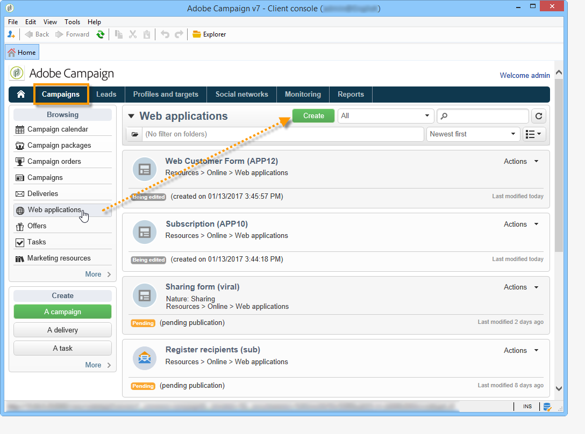

# 웹 양식 정보{#about-web-forms}

Adobe Campaign은 웹 양식을 정의하고 퍼블리싱하기 위한 그래픽 모듈을 통합하여 입력 및 선택 필드가 포함된 페이지를 만들고 데이터베이스에 데이터를 포함할 수 있습니다. 이를 통해 사용자가 정보를 보거나 입력할 수 있는 웹 페이지를 디자인하고 게시할 수 있습니다.

이 장에서는 웹 양식의 작성 및 관리, 필드 및 페이지 관리 방법, 저장 및 저장 모드에 대해 자세히 설명합니다.

>[!CAUTION]
>
>개인 정보상의 이유로 모든 외부 리소스에 대해 HTTPS를 사용하는 것이 좋습니다.

## 웹 양식 만들기 단계 {#steps-for-creating-a-web-form}

이 장에서는 Adobe Campaign에서 **webForm** 형식 양식을 디자인하는 데 필요한 단계뿐만 아니라 사용 가능한 옵션 및 구성을 자세히 설명합니다. Adobe Campaign을 사용하면 사용자가 이 웹 양식을 사용할 수 있도록 만들 수 있을 뿐만 아니라 데이터베이스에 답변을 수집 및 보관할 수 있습니다.

>[!CAUTION]
>
>웹 응용 프로그램 및 웹 양식을 구성할 때 최소 900픽셀 세로 해상도가 필요합니다(예:1600x900).

웹 양식은 캠페인 탭의 웹 애플리케이션 메뉴를 통해 **액세스할 수** 있습니다. Adobe Campaign 트리에서 **[!UICONTROL Resources > Online > Web Applications]** 노드 아래에 그룹화됩니다.

웹 양식을 만들려면 웹 응용 프로그램 목록 위의 **[!UICONTROL Create]** 단추를 클릭합니다.

웹 양식 템플릿( **[!UICONTROL newWebForm]** 기본적으로)을 선택합니다.

그러면 양식의 대시보드로 이동합니다.

이 **[!UICONTROL Edit]** 탭에서는 컨텐츠를 만들 수 있습니다.

웹 양식의 구성 및 컨텐츠를 정의하려면 다음 단계를 수행하십시오.

* 필요한 페이지 및 확인을 만들어 시작합니다.입력 필드, 드롭다운 목록, HTML 컨텐츠 등

   이 단계는 아래에 자세히 설명되어 있습니다.

* 페이지 순서 지정 및 조건을 정의합니다.

   이 단계는 웹 양식 페이지 순서 [정의에](../../web/using/defining-web-forms-page-sequencing.md)설명되어 있습니다.

* 필요한 경우 컨텐츠를 변환합니다.

   이 단계는 웹 [양식](../../web/using/translating-a-web-form.md)변환에 자세히 설명되어 있습니다.

## 웹 양식 디자인 정보 {#about-web-forms-designing}

양식의 페이지는 입력 영역(텍스트), 선택 필드(목록, 체크 상자 등)를 정의하고 구성할 수 있는 특정 편집기를 통해 만들어집니다. 정적 요소(이미지, HTML 컨텐츠 등)와 이러한 컨테이너를 컨테이너로 그룹화할 수 있으며 사용자의 요구 사항에 맞게 레이아웃을 변경할 수 있습니다(자세한 내용은 컨테이너 [만들기 참조](../../web/using/defining-web-forms-layout.md#creating-containers)).

다음 섹션에서는 양식 화면의 컨텐츠 및 레이아웃을 정의하는 방법에 대해 자세히 설명합니다.

* [웹 양식에](../../web/using/adding-fields-to-a-web-form.md)필드 추가,
* [HTML 컨텐츠](../../web/using/static-elements-in-a-web-form.md#inserting-html-content)삽입,
* [웹 양식의](../../web/using/static-elements-in-a-web-form.md)정적 요소,
* [웹 양식 레이아웃](../../web/using/defining-web-forms-layout.md)정의

>[!NOTE]
>
>* 페이지를 디자인하는 동안 **[!UICONTROL Preview]** 탭에서 최종 렌더링을 볼 수 있습니다. 변경 내용을 보려면 먼저 양식을 저장합니다. 모든 오류가 **[!UICONTROL Log]** 탭에 표시됩니다.
>* 페이지 표시 및 정보 저장소가 적절한 시퀀스에서 수행되도록 하려면 웹 양식에서 디버그 모드를 활성화합니다. 이렇게 하려면 **[!UICONTROL Preview]** 하위 탭으로 이동하여 **[!UICONTROL Enable debug mode]** 상자를 선택합니다.수집된 모든 정보 및 실행 오류는 각 페이지 하단에 표시됩니다.
>

### 도구 모음에서 아이콘 사용 {#using-the-icons-in-the-toolbar}

도구 모음의 아이콘을 사용하거나 마우스 오른쪽 단추를 클릭하여 입력 영역을 삽입할 수도 있습니다.

이 경우 추가할 필드 유형과 응답 저장소 모드를 선택하여 시작합니다.

을 **[!UICONTROL Ok]** 클릭하여 선택 항목을 승인합니다.

