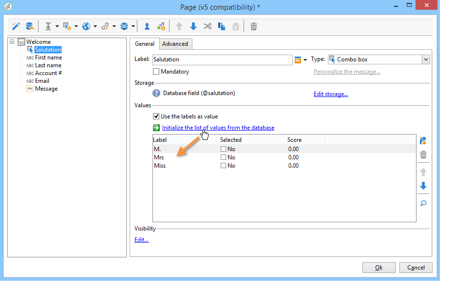
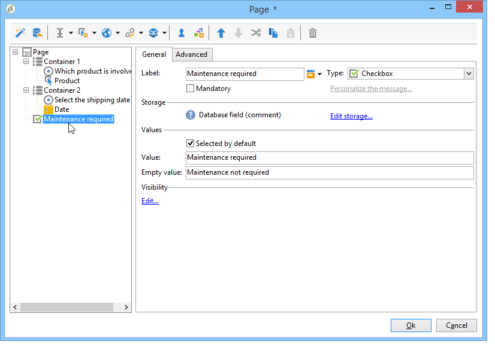
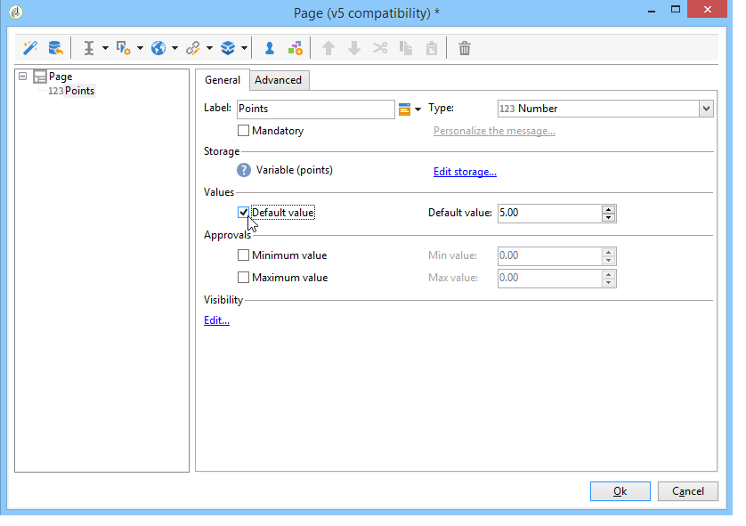

# 웹 양식에 필드 추가{#adding-fields-to-a-web-form}

웹 양식에서 필드를 사용하면 사용자가 정보를 입력하고 옵션을 선택할 수 있습니다. 웹 양식은 입력 필드, 선택 필드, 정적 및 고급 콘텐츠(captcha, 구독 등)를 제공할 수 있습니다.

마법사를 사용하여 필드를 추가하면 필드 유형은 선택한 필드 또는 저장소 변수를 기반으로 자동으로 감지됩니다. 다음을 사용하여 편집할 수 있습니다. **[!UICONTROL Type]** 드롭다운 상자 **[!UICONTROL General]** 탭.

도구 모음의 단추를 사용할 때 추가할 필드 유형을 선택합니다.

다음 유형의 필드를 사용할 수 있습니다.

* 텍스트/숫자 입력. 다음을 참조하십시오 [입력 필드 추가](#adding-input-fields).
* 드롭다운 목록 선택. 다음을 참조하십시오 [드롭다운 목록 추가](#adding-drop-down-lists).
* 확인란을 통해 다중 선택. 다음을 참조하십시오 [확인란 추가](#adding-checkboxes).
* 라디오 버튼을 통한 단독 선택. 다음을 참조하십시오 [라디오 단추 추가](#adding-radio-buttons).
* 옵션 표에서 투표합니다. 다음을 참조하십시오 [격자 추가](#adding-grids).
* 숫자 및 날짜. 다음을 참조하십시오 [날짜 및 숫자 추가](#adding-dates-and-numbers).
* 정보 서비스 구독/구독 취소. 다음을 참조하십시오 [구독 확인란](#subscription-checkboxes).
* Captcha 유효성 검사. 다음을 참조하십시오 [captcha 삽입](#inserting-a-captcha).
* 다운로드 단추. [파일 업로드](#uploading-a-file).
* 숨겨진 상수. 다음을 참조하십시오 [숨겨진 상수 삽입](#inserting-a-hidden-constant).

응답 저장 모드를 지정하십시오. 데이터베이스에서 필드를 업데이트하거나(저장한 마지막 값만 저장) 변수에 저장하십시오(답변은 저장되지 않음). 자세한 내용은 다음을 참조하십시오. [응답 스토리지 필드](web-forms-answers.md#response-storage-fields).

>[!NOTE]
>
>기본적으로 필드는 현재 트리의 맨 아래에 삽입됩니다. 도구 모음의 화살표를 사용하여 위나 아래로 이동합니다.

## 필드 만들기 마법사 {#field-creation-wizard}

양식의 각 페이지에 대해 도구 모음의 첫 번째 버튼을 통해 필드를 추가할 수 있습니다. 이렇게 하려면 **[!UICONTROL Add using the wizard]** 메뉴 아래의 제품에서 사용할 수 있습니다.

만들려는 필드 유형을 선택합니다. 데이터베이스에 필드를 추가하거나 변수를 추가하거나 다른 양식에서 만들어 컨테이너에 수집된 필드 그룹을 가져올 수 있습니다.

클릭 **[!UICONTROL Next]** 저장소 필드 또는 변수나 가져올 컨테이너를 선택합니다.

클릭 **[!UICONTROL Finish]** 을 눌러 선택한 필드를 페이지에 삽입합니다.

## 입력 필드 추가 {#adding-input-fields}

입력 필드를 추가하려면 **[!UICONTROL Input control]** 버튼을 클릭하고 추가할 필드 유형을 선택합니다.

### 입력 필드 유형 {#types-of-input-fields}

5가지 유형의 텍스트 필드를 양식 페이지에 삽입할 수 있습니다.

* **텍스트**: 사용자가 한 줄에 텍스트를 입력할 수 있습니다.

   

* **숫자**: 사용자가 한 줄에 숫자를 입력할 수 있습니다. 자세한 내용은 다음을 참조하십시오. [숫자 추가](#adding-numbers).

   페이지가 승인되면 입력한 값이 필드와 호환되는지 확인하기 위해 필드 콘텐츠를 확인합니다. 자세한 내용은 다음을 참조하십시오. [컨트롤 설정 정의](form-rendering.md#defining-control-settings).

* **암호**: 사용자가 한 줄에 텍스트를 입력할 수 있습니다. 텍스트를 입력하는 동안 문자가 마침표로 대체됩니다.

   

   >[!CAUTION]
   >
   >암호는 데이터베이스에 암호화되지 않은 상태로 저장됩니다.

* **여러 줄 텍스트**: 사용자가 여러 줄에 텍스트를 입력할 수 있습니다.

   

   >[!CAUTION]
   >
   >여러 줄 텍스트 필드는 캐리지 리턴을 포함할 수 있는 특정 필드입니다. 저장소 공간은 XML 특성이 아닌 XML 요소에 매핑된 필드와 연결되어 있어야 합니다.

* **보강된 여러 줄 텍스트**: 사용자가 HTML 형식으로 저장되는 레이아웃으로 텍스트를 입력할 수 있습니다.

   

   사용자에게 제공되는 편집기 유형을 선택할 수 있습니다. 이렇게 하려면 **[!UICONTROL HTML editor]** 의 필드 **[!UICONTROL Advanced]** 탭.

   

   표시되는 아이콘 수는 편집기 유형에 따라 다릅니다. 의 경우 **[!UICONTROL Advanced]** 편집자, 렌더링은 다음과 같습니다.

   

### 입력 필드 구성 {#configure-input-fields}

입력 필드는 모두 다음 옵션을 사용하여 동일한 모드를 기반으로 구성됩니다.

다음 **[!UICONTROL General]** 탭에서는 필드의 이름을 입력하고 필요한 경우 필드에 기본값을 지정할 수 있습니다.

응답 스토리지 모드는 **[!UICONTROL Edit storage...]** 링크를 클릭합니다. 값은 데이터베이스의 기존 필드에 저장할 수도 있고, 정보를 데이터베이스에 저장하지 않도록 선택할 수도 있습니다(로컬 변수 사용).

>[!NOTE]
>
>저장 모드는에 자세히 설명되어 있습니다. [응답 스토리지 필드](web-forms-answers.md#response-storage-fields)

다음 **[!UICONTROL Advanced]** 탭에서는 필드의 표시 매개 변수(레이블 위치, 정렬 등)를 정의할 수 있습니다. 다음을 참조하십시오 [웹 양식 레이아웃 정의](defining-web-forms-layout.md).

## 드롭다운 목록 추가 {#adding-drop-down-lists}

설문 조사 페이지에 드롭다운 목록을 삽입할 수 있습니다. 이렇게 하면 사용자가 드롭다운 메뉴의 오퍼에 있는 값에서 값을 선택할 수 있습니다.

양식 페이지에 드롭다운 상자를 추가하려면 **[!UICONTROL Selection controls > Drop-down list]** 단추를 클릭합니다.

응답 저장 모드를 선택하고 선택을 확인합니다.

아래 섹션에서 목록의 레이블과 값을 정의합니다. **[!UICONTROL General]** 탭. 정보가 데이터베이스의 기존 필드에 저장되어 있고 열거형 필드인 경우 **[!UICONTROL Initialize the list of values from the database]** , 아래와 같이 표시됩니다.

>[!NOTE]
>
>값 목록 오른쪽에 있는 화살표를 사용하여 순서를 변경합니다.

데이터가 연결된 테이블에 저장된 경우 목록에서 제안할 값이 저장된 필드를 선택할 수 있습니다. 예를 들어 국가 테이블을 선택하는 경우 **[!UICONTROL Initialize the list of values from the database...]** 원하는 필드를 선택합니다.

그런 다음 **[!UICONTROL Load]** 값을 검색하는 링크:

>[!CAUTION]
>
>목록이 업데이트될 때마다 이 작업을 반복하여 오퍼의 값을 새로 고칩니다.

## 확인란 추가 {#adding-checkboxes}

사용자가 옵션을 선택하려면 확인란을 사용해야 합니다.

양식에 확인란을 추가하려면 **[!UICONTROL Selection controls > Checkbox...]** 아이콘 을 클릭하여 제품에서 사용할 수 있습니다.

응답 저장 모드를 선택하고 선택을 확인합니다.

상자에 상자 레이블을 입력합니다. **[!UICONTROL Label]** 필드 **[!UICONTROL General]** 탭.

확인란을 선택하면 확인란의 선택 여부에 따라 저장 영역 필드(또는 값)에 값을 할당할 수 있습니다. 다음 **[!UICONTROL Values]** 섹션에서 상자를 선택한 경우 할당할 값을 입력할 수 있습니다. **[!UICONTROL Value]** 필드)와 값을 할당할 수 있습니다( **[!UICONTROL Empty value]** field). 이러한 값은 데이터 저장소 형식에 따라 다릅니다.

저장소 필드(또는 변수)가 부울이면 상자를 선택하지 않았을 때 할당할 값이 자동으로 추론됩니다. 이 경우 **[!UICONTROL Value if checked]** 아래 표시된 대로 필드가 제공됩니다.

## 예: 상자를 선택한 경우 필드에 값을 지정합니다. {#example--assign-a-value-to-a-field-if-a-box-is-checked}

아래와 같이 양식에 확인란을 삽입하여 유지 관리 요청을 전송하려고 합니다.

정보는 데이터베이스와 기존 필드(이 경우 **[!UICONTROL Comment]** field):

&quot;Maintenance required&quot; 상자를 선택하면 **[!UICONTROL Comment]** 열에는 &quot;Maintenance required&quot; 가 포함됩니다. 확인란을 선택하지 않으면 열에 &quot;유지 관리가 필요하지 않음&quot;이 표시됩니다. 이 결과를 얻으려면 양식 페이지의 확인란에 다음 구성을 적용하십시오.

## 라디오 단추 추가 {#adding-radio-buttons}

라디오 버튼을 사용하면 사용자에게 선택할 수 있는 일련의 독점적인 옵션을 제공할 수 있습니다. 이는 동일한 필드에 대해 서로 다른 값입니다.

라디오 단추를 개별적으로(단일 단추) 만들거나 다중 선택 목록을 통해 만들 수 있지만, 라디오 단추의 핵심은 한 옵션 또는 다른 옵션을 선택하는 것이므로 라디오 단추를 하나만 만드는 것이 아니라 항상 라디오 단추를 두 개 이상 만듭니다.

>[!CAUTION]
>
>선택을 필수로 만들려면 다중 선택 목록을 만들어야 합니다.

### 단일 버튼 추가 {#add-single-buttons}

양식 페이지에 라디오 단추를 추가하려면 **[!UICONTROL Selection controls > Radio button]** 메뉴 아래의 페이지 편집기 도구 모음에서 저장 모드를 선택합니다.

라디오 단추는 확인란과 유사한 방식으로 구성됩니다( 참조) [확인란 추가](#adding-checkboxes)). 그러나 옵션을 선택하지 않으면 값이 할당되지 않습니다. 여러 개의 버튼이 상호 종속되도록 하려면(즉, 하나를 선택하면 다른 버튼이 자동으로 선택 해제되도록), 동일한 필드에 저장되어야 합니다. 데이터베이스에 저장되지 않은 경우 동일한 로컬 변수를 임시 저장소에 사용해야 합니다. 다음을 참조하십시오 [응답 스토리지 필드](web-forms-answers.md#response-storage-fields).

### 단추 목록 추가 {#add-a-list-of-buttons}

목록을 통해 라디오 단추를 추가하려면 **[!UICONTROL Selection controls>Multiple choice]** 메뉴 아래의 제품에서 사용할 수 있습니다.

라디오 단추를 레이블만큼 추가합니다. 이 기능의 장점은 기존 필드(항목별 필드의 경우)에서 값을 가져와 사용자가 하나의 옵션을 선택할 수 있다는 것입니다. 하지만 버튼의 레이아웃은 유연성이 떨어집니다.

>[!NOTE]
>
>웹 응용 프로그램에서는 다중 선택을 활성화할 수 없습니다.
>그러나 를 삽입할 수 있습니다 **[!UICONTROL Multiple choice]** 웹 애플리케이션에 필드를 입력하지만 사용자가 여러 값을 선택할 수는 없습니다.

## 격자 추가 {#adding-grids}

그리드는 웹 애플리케이션에서 투표 페이지를 디자인하는 데 사용됩니다. 이렇게 하면 설문 조사 또는 평가 유형 웹 양식에 답변할 수 있는 라디오 단추 목록을 다음과 같이 제공할 수 있습니다.

양식에서 이러한 유형의 요소를 사용하려면 간단한 격자를 만들고 평가할 각 요소에 대해 줄을 추가합니다.

그리드의 각 줄에 있는 라디오 단추의 수는 단순 그리드에 정의된 값의 수와 일치합니다.

격자선당 하나의 옵션만 선택할 수 있습니다.

>[!NOTE]
>
>이 예제에서는 격자의 레이블이 숨겨집니다. 이렇게 하려면 **[!UICONTROL Advanced]** 탭, **[!UICONTROL Label position]** 디스플레이가 다음으로 정의됨 **[!UICONTROL Hidden]** . 다음을 참조하십시오 [레이블의 위치 정의](defining-web-forms-layout.md#defining-the-position-of-labels).

## 날짜 및 숫자 추가 {#adding-dates-and-numbers}

데이터베이스에 저장된 데이터와 일치하거나 특정 요구 사항을 충족하도록 양식 필드의 콘텐츠 형식을 지정할 수 있습니다. 숫자 및 날짜 입력에 적합한 필드를 생성할 수 있습니다.

### 날짜 추가 {#adding-dates}

사용자가 양식 페이지에 날짜를 입력할 수 있도록 하려면 입력 필드를 추가하고 유형을 선택합니다 **[!UICONTROL Date...]**.

필드에 대한 레이블을 입력하고 데이터 저장 모드를 구성합니다.

창의 아래 섹션에서는 이 필드에 저장된 값에 대한 날짜 및 시간 포맷을 선택할 수 있습니다.

날짜(또는 시간)를 표시하지 않도록 선택할 수도 있습니다.

날짜는 달력 또는 드롭다운 상자를 통해 선택할 수 있습니다. 필드에 직접 입력할 수도 있지만 위의 화면에 지정된 형식과 일치해야 합니다.

>[!NOTE]
>
>기본적으로 양식에 사용된 날짜는 달력을 통해 입력됩니다. 다국어 양식의 경우 사용된 모든 언어로 캘린더를 사용할 수 있는지 확인하십시오. 다음을 참조하십시오 [웹 양식 번역](translating-a-web-form.md).

그러나 경우에 따라(예: 생년월일 입력) 드롭다운 목록을 사용하는 것이 더 쉬울 수 있습니다.

이렇게 하려면 **[!UICONTROL Advanced]** 을(를) 탭하고 다음을 사용하여 입력 모드 선택 **[!UICONTROL Drop-down lists]**.

그런 다음 목록에 제공된 값에 대한 제한을 설정할 수 있습니다.

### 숫자 추가 {#adding-numbers}

숫자 입력에 적합한 필드를 생성할 수 있습니다.

숫자 필드에서는 숫자만 입력할 수 있습니다. 시작 컨트롤은 페이지가 승인될 때 자동으로 적용됩니다.

데이터베이스에 데이터가 저장되는 필드에 따라, 특별한 포맷이나 특정 제한이 적용될 수 있다. 최대값과 최소값을 지정할 수도 있습니다. 이 유형의 필드는 다음과 같이 구성됩니다.

기본값은 양식을 게시할 때 필드에 표시되는 값입니다. 사용자가 수정할 수 있습니다.

다음을 통해 숫자 필드에 접두어 및/또는 접미어를 추가할 수 있습니다. **[!UICONTROL Advanced]** 아래 표시된 대로 탭:

양식에서 렌더링은 다음과 같습니다.

## 구독 확인란 {#subscription-checkboxes}

사용자가 하나 이상의 정보 서비스(뉴스레터, 경고, 실시간 알림 등)를 구독하거나 구독을 취소할 수 있도록 하는 컨트롤을 추가할 수 있습니다. 가입하기 위해 사용자는 해당 서비스를 확인한다.

구독 확인란을 만들려면 **[!UICONTROL Advanced controls>Subscription]**.

확인란의 레이블을 지정하고 다음을 사용하여 관련 정보 서비스를 선택합니다. **[!UICONTROL Service]** 드롭다운 상자.

>[!NOTE]
>
>정보 서비스는 다음에 자세히 설명되어 있습니다. [이 페이지](../../delivery/using/managing-subscriptions.md).

사용자는 해당 옵션을 선택하여 서비스에 가입한다.

>[!CAUTION]
>
>사용자가 이미 정보 서비스를 구독하고 있고 양식을 승인할 때 이 서비스에 연결된 상자를 선택하지 않은 경우 구독이 취소됩니다.

## captcha 삽입 {#inserting-a-captcha}

의 목적 **captcha** 테스트는 웹 양식의 부정 사용을 방지하기 위한 것입니다.

>[!CAUTION]
>
>양식에 여러 페이지가 포함되어 있는 경우 보안 조치를 무시하지 않도록 Captcha를 항상 저장 상자 바로 앞의 마지막 페이지에 배치해야 합니다.

양식에 Captcha를 삽입하려면 도구 모음에서 첫 번째 단추를 클릭하고 선택 **[!UICONTROL Advanced controls>Captcha]**.

필드의 레이블을 입력합니다. 이 레이블은 Captcha 표시 영역 앞에 표시됩니다. 에서 이 레이블의 위치를 변경할 수 있습니다. **[!UICONTROL Advanced]** 탭.

>[!NOTE]
>
>대상 **[!UICONTROL captcha]** 유형 컨트롤을 사용하면 저장소 필드 또는 변수를 나타낼 필요가 없습니다.

Captcha는 시각적 개체 아래에 입력 필드가 있는 페이지에 삽입됩니다. 이 두 요소는 분리할 수 없으며 페이지 레이아웃의 목적으로 단일 항목으로 간주됩니다(단일 셀을 점유).

페이지가 확인되면 Captcha의 콘텐츠를 올바르게 입력하지 않은 경우 입력 필드가 빨간색으로 표시됩니다.

표시할 오류 메시지를 만들 수 있습니다. 이렇게 하려면 다음을 사용하십시오. **[!UICONTROL Personalize the message]** 링크 **[!UICONTROL General]** 탭.

>[!NOTE]
>
>Captcha는 항상 8자입니다. 이 값은 수정할 수 없습니다.

## 파일 업로드 {#uploading-a-file}

페이지에 업로드 필드를 추가할 수 있습니다. 이 기능은 예를 들어 인트라넷 파일 공유에 유용할 수 있습니다.

양식 페이지에 업로드 필드를 삽입하려면 **[!UICONTROL Advanced controls > File...]** 메뉴 아래의 제품에서 사용할 수 있습니다.

기본적으로 업로드된 파일은 를 통해 액세스할 수 있는 리소스 파일에 저장됩니다 **[!UICONTROL Resources > Online > Public resources]** 메뉴 아래의 제품에서 사용할 수 있습니다. 스크립트를 사용하여 이 동작을 변경할 수 있습니다. 이 스크립트는에 정의된 함수를 사용할 수 있습니다. [Campaign JSAPI 설명서](https://experienceleague.adobe.com/developer/campaign-api/api/index.html?lang=ko)파일 조작과 관련된 문서를 포함합니다.

이러한 파일에 대한 링크를 로컬 변수 또는 데이터베이스 필드에 저장할 수 있습니다. 예를 들어 수신자 스키마를 확장하여 파일 기반 리소스에 대한 링크를 추가할 수 있습니다.

>[!CAUTION]
>
>* 이 유형의 파일은 보안 액세스 권한(자격 증명 사용)이 있는 양식에 대해 예약해야 합니다.
>* Adobe Campaign은 업로드되는 리소스의 크기나 유형을 제어하지 않으므로 보안 유형 인트라넷 사이트에만 업로드 필드를 사용하는 것이 좋습니다.
>* 여러 서버가 인스턴스(로드 밸런싱 아키텍처)에 연결된 경우 웹 양식에 대한 호출이 동일한 서버에 도착하는지 확인해야 합니다.
>* 이러한 구현에는 Adobe Campaign 컨설팅 팀의 지원이 필요합니다.
>

## 숨겨진 상수 삽입 {#inserting-a-hidden-constant}

사용자가 양식의 페이지 중 하나를 확인할 때 특정 값을 해당 프로필의 필드 또는 변수로 설정할 수 있습니다.

이 필드는 사용자에게 표시되지 않지만 사용자 프로필에서 데이터를 보강하는 데 사용할 수 있습니다.

이렇게 하려면 다음을 배치합니다. **상수** 페이지에서 값과 저장 위치를 지정합니다.

다음 예제에서는 **원본** 사용자가 이 페이지를 승인할 때마다 수신자 프로필의 필드가 자동으로 채워집니다. 상수는 페이지에 표시되지 않습니다.

