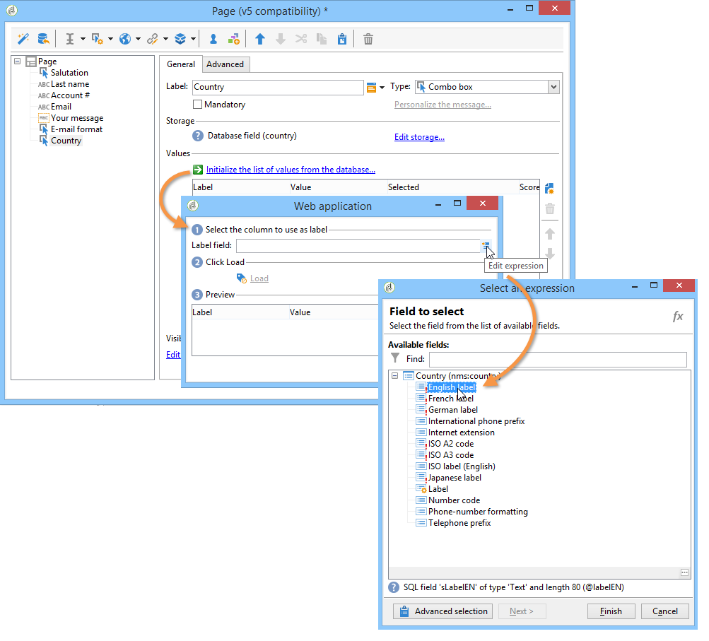
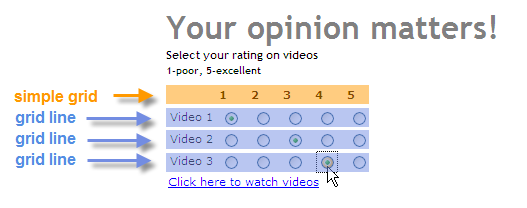
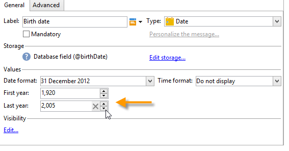
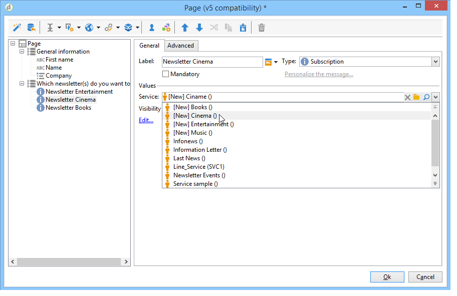
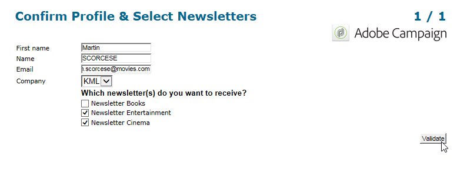

# 웹 양식에 필드 추가{#adding-fields-to-a-web-form}

웹 양식에서 필드를 사용하면 정보를 입력하고 옵션을 선택할 수 있습니다. 웹 양식은 입력 필드, 선택 필드, 정적 및 고급 컨텐츠(캡션, 구독 등)를 제공할 수 있습니다.

마법사를 사용하여 필드를 추가하면 선택한 필드나 저장소 변수에 따라 필드 유형이 자동으로 검색됩니다. 탭의 **[!UICONTROL Type]** 드롭다운 상자를 사용하여 편집할 수 **[!UICONTROL General]** 있습니다.

도구 모음에서 단추를 사용할 때 추가할 필드 유형을 선택합니다.

다음 유형의 필드를 사용할 수 있습니다.

* 텍스트/숫자 입력. 입력 필드 [추가를 참조하십시오](#adding-input-fields).
* 드롭다운 목록 선택. 드롭다운 [목록 추가를 참조하십시오](#adding-drop-down-lists).
* 확인란을 통해 다양한 선택 확인란 [추가를 참조하십시오](#adding-checkboxes).
* 라디오 버튼을 통해서만 선택할 수 있습니다. 라디오 단추 [추가를 참조하십시오](#adding-radio-buttons).
* 옵션 격자에 투표합니다. 격자 [추가를 참조하십시오](#adding-grids).
* 숫자 및 날짜 날짜 [및 번호 추가를 참조하십시오](#adding-dates-and-numbers).
* 정보 서비스 구독/구독 취소. 구독 [확인란을 참조하십시오](#subscription-checkboxes).
* Captcha 유효성 검사. 캡션 [삽입을 참조하십시오](#inserting-a-captcha).
* 다운로드 단추. [파일](#uploading-a-file)업로드
* 숨겨진 상수. 숨겨진 상수 [삽입을 참조하십시오](#inserting-a-hidden-constant).

응답 저장소 모드를 지정하십시오.데이터베이스의 필드를 업데이트하거나(마지막으로 저장된 값만 저장) 변수에 저장합니다(답변은 저장되지 않음). 자세한 내용은 [응답 저장소 필드를 참조하십시오](../../web/using/web-forms-answers.md#response-storage-fields).

>[!NOTE]
>
>기본적으로 현재 트리 아래쪽에 필드가 삽입됩니다. 도구 모음의 화살표를 사용하여 위 또는 아래로 이동합니다.

## 필드 만들기 마법사 {#field-creation-wizard}

양식의 각 페이지에 대해 도구 모음의 첫 번째 단추를 통해 필드를 추가할 수 있습니다. 이렇게 하려면 **[!UICONTROL Add using the wizard]** 메뉴로 가세요

만들 필드 유형을 선택합니다.데이터베이스에 필드, 변수를 추가하거나 다른 양식에서 만들어 컨테이너에 수집한 필드 그룹을 가져오도록 선택할 수 있습니다.

스토리지 필드 또는 변수 **[!UICONTROL Next]** 를 클릭하고 가져올 컨테이너를 선택합니다.

을 **[!UICONTROL Finish]** 클릭하여 페이지에 선택한 필드를 삽입합니다.

## 입력 필드 추가 {#adding-input-fields}

입력 필드를 추가하려면 **[!UICONTROL Input control]** 단추를 클릭하고 추가할 필드 유형을 선택합니다.

### 입력 필드 유형 {#types-of-input-fields}

양식 페이지에 5가지 유형의 텍스트 필드를 삽입할 수 있습니다.

* **텍스트**:한 줄에 텍스트를 입력할 수 있습니다.

   

* **번호**:사용자가 한 줄에 숫자를 입력할 수 있습니다. for more on this, refer to [Adding numbers](#adding-numbers).

   페이지가 승인되면 필드 컨텐츠가 확인되어 입력한 값이 필드와 호환되는지 확인합니다. For more on this, refer to [Defining control settings](../../web/using/form-rendering.md#defining-control-settings).

* **암호**:단일 행에 텍스트를 입력할 수 있습니다. 텍스트 입력 시 문자가 점으로 바뀝니다.

   

   >[!CAUTION]
   >
   >비밀번호는 데이터베이스에 암호화되지 않은 상태로 저장됩니다.

* **여러 줄 텍스트**:여러 줄에 텍스트를 입력할 수 있습니다.

   

   >[!CAUTION]
   >
   >여러 줄 텍스트 필드는 캐리지 리턴을 포함할 수 있는 특정 필드입니다. 저장소 공간은 XML 특성이 아닌 XML 요소에 매핑된 필드와 연결해야 합니다. 스키마의 데이터 유형에 대한 자세한 내용은 [이 섹션의 &quot;스키마 참조&quot; 장을 참조하십시오](../../configuration/using/about-schema-reference.md).
   >   
   >설문 조사 **** 모듈을 사용하는 경우 이 유형의 필드를 포맷에 자동으로 적용되는 보관된 필드에 저장할 수 있습니다. 이 작업에 대한 자세한 정보는 [이 섹션](../../web/using/about-surveys.md)을 참조하십시오.

* **풍부해진 여러 줄 텍스트**:HTML 형식으로 저장되는 레이아웃으로 텍스트를 입력할 수 있습니다.

   

   사용자에게 제공되는 편집기 유형을 선택할 수 있습니다. 이렇게 하려면 탭의 필드 **[!UICONTROL HTML editor]** 드롭다운 상자를 **[!UICONTROL Advanced]** 사용합니다.

   

   표시되는 아이콘의 수는 편집기 유형에 따라 다릅니다. 편집자의 경우 **[!UICONTROL Advanced]** 렌더링은 다음과 같습니다.

   

### 입력 필드 구성 {#configure-input-fields}

입력 필드는 모두 다음 옵션을 사용하여 동일한 모드를 기반으로 구성됩니다.

이 **[!UICONTROL General]** 탭에서는 필드 이름을 입력하고 필요한 경우 기본값을 지정할 수 있습니다.

응답 저장 모드는 **[!UICONTROL Edit storage...]** 링크를 통해 변경할 수 있습니다. 값은 데이터베이스의 기존 필드에 저장할 수 있습니다.또는 데이터베이스에 정보를 저장하지 않도록 선택할 수 있습니다(로컬 변수 사용).

>[!NOTE]
>
>스토리지 모드는 응답 스토리지 [필드에 자세히 나와 있습니다.](../../web/using/web-forms-answers.md#response-storage-fields)

이 **[!UICONTROL Advanced]** 탭에서는 필드의 표시 매개 변수(레이블 위치, 정렬 등)를 정의할 수 있습니다. See [Defining web forms layout](../../web/using/defining-web-forms-layout.md).

## 드롭다운 목록 추가 {#adding-drop-down-lists}

설문 조사 페이지에 드롭다운 목록을 삽입할 수 있습니다. 이렇게 하면 사용자가 드롭다운 메뉴의 오퍼에서 값을 선택할 수 있습니다.

양식 페이지에 드롭다운 상자를 추가하려면 페이지 편집기의 도구 모음에서 **[!UICONTROL Selection controls > Drop-down list]** 단추를 클릭합니다.

응답 저장 모드를 선택하고 선택을 확인합니다.

탭의 하단 섹션에서 목록의 레이블과 값을 **[!UICONTROL General]** 정의합니다. 정보가 데이터베이스의 기존 필드에 저장되고 열거형 필드인 경우 아래와 같이 을 클릭하여 값을 자동으로 입력할 수 **[!UICONTROL Initialize the list of values from the database]** 있습니다.

>[!NOTE]
>
>값 목록 오른쪽에 있는 화살표를 사용하여 시퀀스를 변경합니다.

데이터가 연결된 테이블에 저장되어 있는 경우 목록에서 제안된 값을 저장할 필드를 선택할 수 있습니다. 예를 들어 국가 테이블을 선택한 경우 을 클릭하고 원하는 필드 **[!UICONTROL Initialize the list of values from the database...]** 를 선택합니다.

다음으로, 값을 검색하려면 **[!UICONTROL Load]** 링크를 클릭합니다.

>[!CAUTION]
>
>목록이 업데이트될 때마다 이 작업을 반복하여 오퍼의 값을 새로 고칩니다.

## 확인란 추가 {#adding-checkboxes}

사용자가 옵션을 선택하려면 확인란을 사용해야 합니다.

양식에 확인란을 추가하려면 페이지 편집기의 도구 모음에서 **[!UICONTROL Selection controls > Checkbox...]** 아이콘을 클릭합니다.

응답 저장 모드를 선택하고 선택을 확인합니다.

탭의 필드 **[!UICONTROL Label]** 에 상자 레이블을 **[!UICONTROL General]** 입력합니다.

확인란을 선택하면 확인란을 선택했는지 여부에 따라 저장소 필드(또는 값)에 값을 할당할 수 있습니다. 이 **[!UICONTROL Values]** 섹션에서는 확인란을 선택한 경우(필드에서) 할당할 값을 **[!UICONTROL Value]** 입력하고 선택되지 않은 경우 할당할 값(필드에서)을 **[!UICONTROL Empty value]** 입력할 수 있습니다. 이러한 값은 데이터 저장소 형식에 따라 다릅니다.

스토리지 필드(또는 변수)가 부울이면 확인란을 선택하지 않으면 할당할 값이 자동으로 공제됩니다. 이 경우 아래와 같이 필드만 **[!UICONTROL Value if checked]** 제공됩니다.

## 예:상자를 선택하는 경우 필드에 값 할당 {#example--assign-a-value-to-a-field-if-a-box-is-checked}

아래와 같이 유지 관리 요청을 보낼 수 있는 확인란을 양식에 삽입하려고 합니다.

정보는 데이터베이스와 기존 필드(이 경우 필드)에 **[!UICONTROL Comment]** 업로드됩니다.

&quot;유지 관리 필요&quot; 상자를 선택하면 열에 &quot;유지 관리 필요&quot;가 **[!UICONTROL Comment]** 포함됩니다. 상자를 선택하지 않으면 열에 &quot;유지 관리가 필요하지 않습니다.&quot;가 표시됩니다. 이 결과를 얻으려면 양식 페이지의 확인란에 다음 구성을 적용합니다.

## 라디오 단추 추가 {#adding-radio-buttons}

라디오 단추를 사용하면 사용자에게 선택할 수 있는 일련의 전용 옵션을 제공할 수 있습니다. 동일한 필드에 대한 값이 다릅니다.

라디오 단추를 개별적으로(자동 단추) 또는 객관식 목록을 통해 만들 수 있지만 라디오 단추 지점은 한 옵션이나 다른 옵션을 선택하는 것이므로 라디오 단추 쌍을 항상 만듭니다. 단 한 단추만 만들 수는 없습니다.

>[!CAUTION]
>
>선택을 필수 항목으로 지정하려면 객관식 목록을 만들어야 합니다.

### 단일 단추 추가 {#add-single-buttons}

양식 페이지에 라디오 단추를 추가하려면 페이지 편집기의 도구 모음에 있는 **[!UICONTROL Selection controls > Radio button]** 메뉴로 이동하고 저장소 모드를 선택합니다.

라디오 버튼은 체크 박스와 유사한 방식으로 구성됩니다(확인란 [추가 참조](#adding-checkboxes)). 그러나 옵션을 선택하지 않으면 값이 할당되지 않습니다. 여러 개의 단추가 상호 종속되도록 하려면(예: 하나를 선택하면 다른 단추가 자동으로 선택 취소되지만 동일한 필드에 저장되어야 합니다.) 데이터베이스에 저장되지 않은 경우 임시 저장소에 동일한 로컬 변수를 사용해야 합니다. 응답 [저장소 필드를 참조하십시오](../../web/using/web-forms-answers.md#response-storage-fields).

### 단추 목록 추가 {#add-a-list-of-buttons}

목록을 통해 라디오 단추를 추가하려면 페이지 편집기의 도구 모음에 있는 **[!UICONTROL Selection controls>Multiple choice]** 메뉴로 이동합니다.

레이블만큼 라디오 단추를 추가합니다. 이 기능의 장점은 기존 필드(항목별 필드의 경우)에서 값을 가져와서 사용자가 하나의 옵션을 선택할 수 있도록 할 수 있다는 것입니다. 그러나 단추 레이아웃이 유연하지 않습니다.

>[!NOTE]
>
>웹 양식은 여러 값 선택을 인증하지 않습니다. 설문 조사 **** 유형 양식에 대해서만 다중 선택을 활성화할 수 있습니다. 이 작업에 대한 자세한 정보는 [이 섹션](../../web/using/about-surveys.md)을 참조하십시오.\
>그러나 웹 애플리케이션에 **[!UICONTROL Multiple choice]** 문자 필드를 삽입할 수는 있습니다.하지만 여러 값 선택을 인증하지 않은 경우:제공되는 옵션은 라디오 단추를 사용하여 선택할 수 있습니다.

## 격자 추가 {#adding-grids}

격자는 웹 애플리케이션에서 투표 페이지를 디자인하는 데 사용됩니다. 설문 조사 또는 평가 유형 웹 양식에 응답하는 라디오 단추 목록을 아래와 같이 제공할 수 있습니다.

양식에서 이러한 유형의 요소를 사용하려면 간단한 격자를 만들고 각 요소에 대한 줄을 추가합니다.

격자의 각 행에 있는 라디오 단추 수는 단순 격자에 정의된 값의 수와 일치합니다.

격자 라인당 하나의 옵션만 선택할 수 있습니다.

>[!NOTE]
>
>이 예에서는 격자 레이블이 숨겨집니다. 이렇게 하려면 **[!UICONTROL Advanced]** 탭으로 이동한 후 **[!UICONTROL Label position]** 디스플레이가 로 정의됩니다 **[!UICONTROL Hidden]** . 레이블 [위치 정의를 참조하십시오](../../web/using/defining-web-forms-layout.md#defining-the-position-of-labels).

## 날짜 및 번호 추가 {#adding-dates-and-numbers}

양식 필드의 내용은 데이터베이스에 저장된 데이터와 일치하거나 특정 요구 사항을 충족하기 위해 형식을 지정할 수 있습니다. 숫자 및 날짜 입력에 적합한 필드를 만들 수 있습니다.

### 날짜 추가 {#adding-dates}

사용자가 양식 페이지에서 날짜를 입력할 수 있도록 하려면 입력 필드를 추가하고 유형을 선택합니다 **[!UICONTROL Date...]**.

필드의 레이블을 입력하고 데이터 저장소 모드를 구성합니다.

창의 아래쪽 섹션에서는 이 필드에 저장된 값의 날짜 및 시간 형식을 선택할 수 있습니다.

날짜(또는 시간)를 표시하지 않도록 선택할 수도 있습니다.

날짜는 달력 또는 드롭다운 상자를 통해 선택할 수 있습니다. 필드에 직접 입력할 수도 있지만 위의 화면에 지정된 형식과 일치해야 합니다.

>[!NOTE]
>
>기본적으로 양식에 사용된 날짜는 달력을 통해 입력됩니다. 다국어 양식의 경우 달력이 사용되는 모든 언어로 제공되는지 확인하십시오. See [Translating a web form](../../web/using/translating-a-web-form.md).

그러나 경우에 따라(생년월일 입력 등) 드롭다운 목록을 사용하는 것이 더 쉽습니다.

이렇게 하려면 **[!UICONTROL Advanced]** 탭을 클릭하고 를 사용하여 입력 모드를 선택합니다 **[!UICONTROL Drop-down lists]**.

그런 다음 목록에 제공된 값에 대한 제한을 설정할 수 있습니다.

### 숫자 추가 {#adding-numbers}

숫자 입력에 적합한 필드를 만들 수 있습니다.

숫자 필드에 숫자만 입력할 수 있습니다. 페이지가 승인되면 시작 컨트롤이 자동으로 적용됩니다.

데이터베이스에 데이터가 저장되는 필드에 따라 특수 서식 또는 특정 제한이 적용될 수 있습니다. 최대 및 최소 값을 지정할 수도 있습니다. 이 유형의 필드는 다음과 같이 구성됩니다.

기본값은 양식이 게시될 때 필드에 표시되는 값입니다. 사용자가 수정할 수 있습니다.

아래와 같이 탭을 통해 숫자 필드에 접두어 및/또는 접미어를 추가할 수 **[!UICONTROL Advanced]** 있습니다.

양식에서 렌더링은 다음과 같습니다.

## 구독 확인란 {#subscription-checkboxes}

사용자가 하나 이상의 정보 서비스(뉴스레터, 경고, 실시간 알림 등)에 가입하거나 가입을 해지할 수 있는 컨트롤을 추가할 수 있습니다. 가입하려면 해당 서비스를 확인합니다.

구독 확인란을 만들려면 을 클릭합니다 **[!UICONTROL Advanced controls>Subscription]**.

확인란 레이블을 표시하고 드롭다운 상자를 사용하여 관련 정보 서비스를 **[!UICONTROL Service]** 선택합니다.

>[!NOTE]
>
>정보 서비스는 [이 페이지에 자세히 설명되어 있습니다](../../delivery/using/managing-subscriptions.md).

사용자가 관련 옵션을 선택하여 서비스에 가입합니다.

>[!CAUTION]
>
>사용자가 정보 서비스에 이미 가입했는데 양식을 승인할 때 이 서비스에 연결된 상자가 선택되지 않으면 해당 사용자는 구독을 취소하게 됩니다.

가입 및 레퍼러의 예는 [이 섹션에 나와 있습니다](../../web/using/about-surveys.md).

## 캡차 삽입 {#inserting-a-captcha}

Captcha **테스트의** 목적은 웹 양식의 부정 사용을 방지하는 것입니다.

>[!CAUTION]
>
>양식에 여러 페이지가 포함되어 있는 경우 보안 조치를 피할 수 있도록 항상 저장소 상자 바로 앞의 마지막 페이지에 Captcha를 배치해야 합니다.

양식에 Captcha를 삽입하려면 도구 모음에서 첫 번째 단추를 클릭하고 선택을 클릭합니다 **[!UICONTROL Advanced controls>Captcha]**.

필드의 레이블을 입력합니다. 이 레이블은 Captcha 표시 영역 앞에 표시됩니다. 탭에서 이 레이블의 위치를 변경할 수 **[!UICONTROL Advanced]** 있습니다.

>[!NOTE]
>
>유형 컨트롤의 **[!UICONTROL captcha]** 경우 저장소 필드나 변수를 표시할 필요가 없습니다.

Captcha는 시각적 아래에 입력 필드를 배치하여 페이지에 삽입됩니다. 이러한 두 요소는 분리될 수 없으며 페이지 레이아웃 용도로 단일 항목으로 간주됩니다(단일 셀을 차지함).

페이지가 확인되면 Captcha의 내용이 올바르게 입력되지 않으면 입력 필드가 빨간색으로 표시됩니다.

표시할 오류 메시지를 만들 수 있습니다. 이렇게 하려면 탭의 **[!UICONTROL Personalize the message]** 링크를 **[!UICONTROL General]** 사용합니다.

>[!NOTE]
>
>캡처는 항상 8자입니다. 이 값은 수정할 수 없습니다.

## 파일 업로드 {#uploading-a-file}

페이지에 업로드 필드를 추가할 수 있습니다. 이 기능은 인트라넷 파일 공유에 유용합니다.

양식 페이지에 업로드 필드를 삽입하려면 페이지 편집기의 도구 모음에서 **[!UICONTROL Advanced controls > File...]** 메뉴를 선택합니다.

기본적으로 업로드된 파일은 메뉴를 통해 액세스할 수 있는 리소스 파일에 **[!UICONTROL Resources > Online > Public resources]** 저장됩니다. 스크립트를 사용하여 이 동작을 변경할 수 있습니다. 이 스크립트는 파일 조작과 관련된 기능을 포함하여 [Campaign JSAPI 설명서에](https://docs.adobe.com/content/help/en/campaign-classic/technicalresources/api/index.html)정의된 함수를 사용할 수 있습니다.

이러한 파일에 대한 링크를 로컬 변수 또는 데이터베이스 필드에 저장할 수 있습니다. 예를 들어 수신자 스키마를 확장하여 파일 기반 리소스에 대한 링크를 추가할 수 있습니다.

>[!CAUTION]
>
>* 이 유형의 파일은 보안 액세스(자격 증명 사용)가 있는 양식에 대해 예약해야 합니다.
>* Adobe Campaign은 업로드된 리소스의 크기 또는 유형을 제어하지 않습니다.따라서 안전한 형식 인트라넷 사이트에만 업로드 필드를 사용하는 것이 좋습니다.
>* 여러 서버가 인스턴스에 연결된 경우(로드 밸런싱 아키텍처) 웹 양식 호출이 동일한 서버에 도달하는지 확인해야 합니다.
>* 이러한 구현을 위해서는 Adobe Campaign 컨설팅 팀의 지원이 필요합니다.

>

## 숨겨진 상수 삽입 {#inserting-a-hidden-constant}

사용자가 양식의 페이지 중 하나를 확인하면 특정 값을 프로필 필드 또는 변수에 설정할 수 있습니다.

이 필드는 사용자가 볼 수 없지만 사용자 프로필의 데이터를 향상시키는 데 사용할 수 있습니다.

이렇게 하려면 페이지에 **상수를** 배치하고 값과 저장소 위치를 지정합니다.

다음 예에서 수신자 프로필의 **원본** 필드는 사용자가 이 페이지를 승인할 때마다 자동으로 채워집니다. 페이지에 상수가 표시되지 않습니다.

