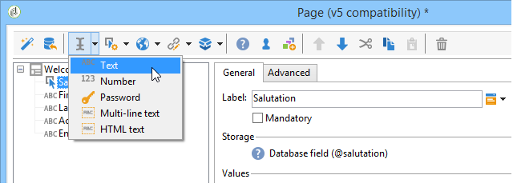
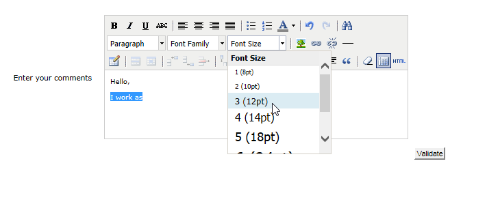
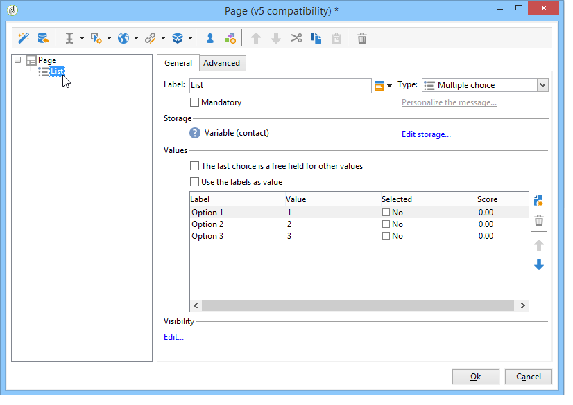
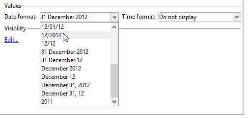
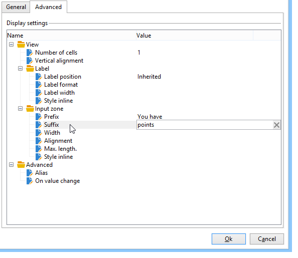
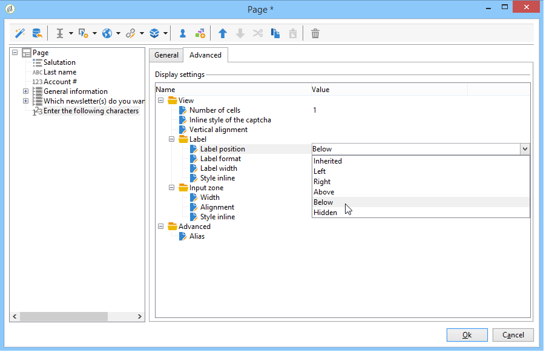
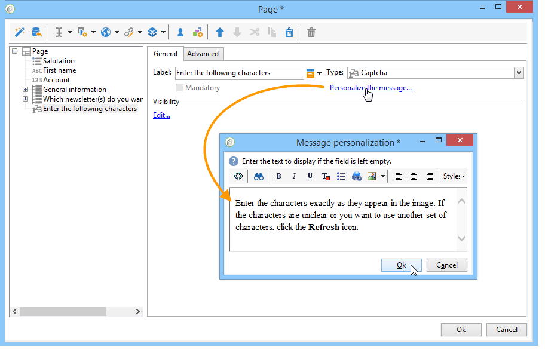

# 웹 양식에 필드 추가{#adding-fields-to-a-web-form}

웹 양식에서 필드를 사용하면 사용자가 정보를 입력하고 옵션을 선택할 수 있습니다. 웹 양식은 입력 필드, 선택 필드, 정적 및 고급 콘텐츠(캡션, 구독 등)를 제공할 수 있습니다.

마법사를 사용하여 필드를 추가하면 필드 유형이 선택한 필드나 저장소 변수에 따라 자동으로 감지됩니다. 를 사용하여 편집할 수 있습니다 **[!UICONTROL Type]** 드롭다운 상자의 **[!UICONTROL General]** 탭.

도구 모음에서 버튼을 사용할 때 추가할 필드 유형을 선택합니다.

다음 유형의 필드를 사용할 수 있습니다.

* 텍스트/숫자 입력. 자세한 내용은 [입력 필드 추가](#adding-input-fields).
* 드롭다운 목록 선택. 자세한 내용은 [드롭다운 목록 추가](#adding-drop-down-lists).
* 확인란을 통해 여러 선택 자세한 내용은 [확인란 추가](#adding-checkboxes).
* 라디오 단추를 통한 단독 선택. 자세한 내용은 [라디오 단추 추가](#adding-radio-buttons).
* 옵션 격자로 투표하십시오. 자세한 내용은 [그리드 추가](#adding-grids).
* 숫자 및 날짜. 자세한 내용은 [날짜 및 숫자 추가](#adding-dates-and-numbers).
* 정보 서비스 구독/구독 취소. 자세한 내용은 [구독 확인란](#subscription-checkboxes).
* Captcha 유효성 검사. 자세한 내용은 [Captcha 삽입](#inserting-a-captcha).
* 다운로드 단추. [파일 업로드](#uploading-a-file).
* 숨겨진 상수. 자세한 내용은 [숨겨진 상수 삽입](#inserting-a-hidden-constant).

응답 저장소 모드를 지정하십시오. 데이터베이스의 필드를 업데이트하거나(마지막 값만 저장) 변수에 저장합니다(응답이 저장되지 않음). 자세한 내용은 [응답 저장소 필드](web-forms-answers.md#response-storage-fields).

>[!NOTE]
>
>기본적으로 현재 트리의 맨 아래에 필드가 삽입됩니다. 도구 모음의 화살표를 사용하여 위 또는 아래로 이동합니다.

## 필드 만들기 마법사 {#field-creation-wizard}

양식의 각 페이지에 대해 도구 모음의 첫 번째 버튼을 통해 필드를 추가할 수 있습니다. 이렇게 하려면 로 이동합니다. **[!UICONTROL Add using the wizard]** 메뉴 아래의 제품에서 사용할 수 있습니다.

만들 필드 유형을 선택합니다. 데이터베이스에 필드, 변수를 추가하거나 다른 양식으로 작성하여 컨테이너에 수집되는 필드 그룹을 가져오도록 선택할 수 있습니다.

클릭 **[!UICONTROL Next]** 저장소 필드나 변수 또는 가져올 컨테이너를 선택합니다.

클릭 **[!UICONTROL Finish]** 을 클릭하여 선택한 필드를 페이지에 삽입합니다.

## 입력 필드 추가 {#adding-input-fields}

입력 필드를 추가하려면 **[!UICONTROL Input control]** 버튼을 클릭하고 추가할 필드 유형을 선택합니다.

### 입력 필드 유형 {#types-of-input-fields}

양식 페이지에는 다음 5가지 유형의 텍스트 필드를 삽입할 수 있습니다.

* **텍스트**: 한 줄에 텍스트를 입력할 수 있습니다.

   

* **숫자**: 사용자가 한 줄에 숫자를 입력할 수 있습니다. 자세한 내용은 [숫자 추가](#adding-numbers).

   페이지가 승인되면, 필드 컨텐츠를 확인하여 입력한 값이 필드와 호환되는지 확인합니다. 자세한 내용은 [컨트롤 설정 정의](form-rendering.md#defining-control-settings).

* **암호**: 사용자가 한 줄에 텍스트를 입력할 수 있도록 해줍니다. 텍스트 입력 중에 문자는 마침표로 바뀝니다.

   

   >[!CAUTION]
   >
   >암호는 데이터베이스에 암호화되지 않은 상태로 저장됩니다.

* **여러 줄 텍스트**: 여러 줄에 텍스트를 입력할 수 있습니다.

   

   >[!CAUTION]
   >
   >여러 줄 텍스트 필드는 캐리지 리턴을 포함할 수 있는 특정 필드입니다. 저장소 공간은 XML 특성이 아니라 XML 요소에 매핑된 필드와 연결해야 합니다.

* **여러 줄 텍스트가 보강되었습니다.**: 사용자가 HTML 형식으로 저장할 레이아웃으로 텍스트를 입력할 수 있도록 해줍니다.

   

   사용자에게 제공되는 편집기 유형을 선택할 수 있습니다. 이렇게 하려면 **[!UICONTROL HTML editor]** 의 필드 **[!UICONTROL Advanced]** 탭.

   

   표시되는 아이콘 수는 편집기 유형에 따라 달라집니다. 대상 **[!UICONTROL Advanced]** 편집자: 렌더링은 다음과 같습니다.

   

### 입력 필드 구성 {#configure-input-fields}

입력 필드는 모두 다음 옵션을 사용하여 동일한 모드를 기반으로 구성됩니다.

다음 **[!UICONTROL General]** 탭에서는 필드 이름을 입력하고 필요한 경우 기본값을 필드에 지정할 수 있습니다.

응답 스토리지 모드는 **[!UICONTROL Edit storage...]** 링크를 클릭합니다. 값은 데이터베이스의 기존 필드에 저장할 수 있습니다. 또는 데이터베이스에 정보를 저장하지 않도록 선택할 수 있습니다(로컬 변수 사용).

>[!NOTE]
>
>스토리지 모드는 [응답 저장소 필드](web-forms-answers.md#response-storage-fields)

다음 **[!UICONTROL Advanced]** 탭에서는 필드의 표시 매개 변수(레이블 위치, 정렬 등)를 정의할 수 있습니다. 자세한 내용은 [웹 양식 레이아웃 정의](defining-web-forms-layout.md).

## 드롭다운 목록 추가 {#adding-drop-down-lists}

드롭다운 목록을 설문 조사 페이지에 삽입할 수 있습니다. 이렇게 하면 사용자가 드롭다운 메뉴의 오퍼에서 값을 선택할 수 있습니다.

양식 페이지에 드롭다운 상자를 추가하려면 **[!UICONTROL Selection controls > Drop-down list]** 단추 사용

응답 저장 모드를 선택하고 선택을 확인합니다.

목록의 아래 섹션에서 레이블과 값을 정의합니다 **[!UICONTROL General]** 탭. 정보가 데이터베이스의 기존 필드에 저장되고 열거형 필드인 경우 **[!UICONTROL Initialize the list of values from the database]** 를 아래와 같이 표시합니다.

>[!NOTE]
>
>값 목록 오른쪽에 있는 화살표를 사용하여 시퀀스를 변경합니다.

데이터가 연결된 테이블에 저장된 경우 목록에서 제안하려는 값이 저장되는 필드를 선택할 수 있습니다. 예를 들어 국가 테이블을 선택한 경우 **[!UICONTROL Initialize the list of values from the database...]** 원하는 필드를 선택합니다.

그런 다음 **[!UICONTROL Load]** 링크를 클릭하여 값을 검색합니다.

>[!CAUTION]
>
>목록이 업데이트되어 오퍼의 값을 새로 고칠 때마다 이 작업을 반복합니다.

## 확인란 추가 {#adding-checkboxes}

사용자가 옵션을 선택하려면 확인란을 사용해야 합니다.

양식에 확인란을 추가하려면 **[!UICONTROL Selection controls > Checkbox...]** 아이콘 사용)을 클릭하여 제품에서 사용할 수 있습니다.

응답 저장 모드를 선택하고 선택을 확인합니다.

에 상자의 레이블을 입력합니다. **[!UICONTROL Label]** 필드 **[!UICONTROL General]** 탭.

확인란을 선택하면 상자를 선택했는지 여부에 따라 스토리지 필드(또는 값)에 값을 할당할 수 있습니다. 다음 **[!UICONTROL Values]** 섹션에서 상자를 선택하면 할당할 값을 입력할 수 있습니다. **[!UICONTROL Value]** 필드를 선택합니다. **[!UICONTROL Empty value]** 필드)만 로드하는 것입니다. 이러한 값은 데이터 저장소 형식에 따라 다릅니다.

저장소 필드(또는 변수)가 부울이면 상자를 선택하지 않은 경우 할당할 값이 자동으로 추론됩니다. 이 경우 **[!UICONTROL Value if checked]** 아래와 같이 필드가 제공됩니다.

## 예: 상자를 선택하면 필드에 값을 할당합니다 {#example--assign-a-value-to-a-field-if-a-box-is-checked}

아래와 같이 유지 관리 요청을 보내기 위한 확인란을 양식에 삽입하려고 합니다.

정보가 데이터베이스와 기존 필드(이 경우 **[!UICONTROL Comment]** 필드):

&quot;유지 관리 필요&quot; 상자를 선택하면 **[!UICONTROL Comment]** 열에는 &quot;유지 관리 필수&quot;가 포함됩니다. 상자를 선택하지 않으면 열에 &quot;유지 관리 불필요&quot;가 표시됩니다. 이 결과를 얻으려면 양식 페이지의 확인란을 선택하십시오.

## 라디오 단추 추가 {#adding-radio-buttons}

라디오 단추를 사용하면 사용자에게 선택할 수 있는 일련의 고급 옵션을 제공할 수 있습니다. 동일한 필드에 대해 다른 값입니다.

라디오 단추를 개별적으로(단일 단추) 또는 다중 선택 목록을 통해 만들 수 있지만 라디오 단추의 위치는 한 옵션 또는 다른 옵션을 선택하는 것이므로 단일 단추가 아닌 한 쌍의 라디오 단추를 항상 만듭니다.

>[!CAUTION]
>
>선택을 필수 항목으로 지정하려면 다중 선택 목록을 만들어야 합니다.

### 단일 단추 추가 {#add-single-buttons}

양식 페이지에 라디오 단추를 추가하려면 **[!UICONTROL Selection controls > Radio button]** 메뉴 아래의 페이지 편집기 도구 모음에서 저장 모드를 선택합니다.

라디오 단추는 확인란과 유사한 방식으로 구성됩니다(참조: [확인란 추가](#adding-checkboxes)). 그러나 옵션을 선택하지 않으면 값이 할당되지 않습니다. 여러 단추가 상호 종속되도록 하려면, 즉 하나를 선택하면 다른 단추가 자동으로 선택 취소되므로 동일한 필드에 저장해야 합니다. 데이터베이스에 저장되지 않은 경우 임시 저장소에 동일한 로컬 변수를 사용해야 합니다. 자세한 내용은 [응답 저장소 필드](web-forms-answers.md#response-storage-fields).

### 단추 목록 추가 {#add-a-list-of-buttons}

목록을 통해 라디오 단추를 추가하려면 **[!UICONTROL Selection controls>Multiple choice]** 메뉴 아래의 제품에서 사용할 수 있습니다.

레이블 만큼 라디오 단추를 추가합니다. 이 기능의 장점은 기존 필드(항목별 필드의 경우)에서 값을 가져와 사용자가 하나의 옵션을 선택할 수 있도록 하는 것입니다. 그러나 단추 레이아웃은 유연하지 않습니다.

>[!NOTE]
>
>웹 응용 프로그램에서 다중 선택을 활성화할 수 없습니다.
>그러나 를 삽입하는 것은 가능합니다 **[!UICONTROL Multiple choice]** 필드를 웹 응용 프로그램에 입력해도 여러 값을 선택할 수 없습니다.

## 그리드 추가 {#adding-grids}

그리드는 웹 응용 프로그램에서 투표 페이지를 디자인하는 데 사용됩니다. 다음과 같이 설문 조사 또는 평가 유형 웹 양식에 응답하기 위한 라디오 단추 목록을 제공할 수 있습니다.

양식에서 이 유형의 요소를 사용하려면 간단한 그리드를 만들고 각 요소에 대한 줄을 추가합니다.

그리드의 각 행에 있는 라디오 버튼 수는 단순 그리드에 정의된 값 수와 일치합니다.

그리드 라인당 하나의 옵션만 선택할 수 있습니다.

>[!NOTE]
>
>이 예제에서는 격자의 레이블이 숨겨집니다. 이렇게 하려면 로 이동합니다. **[!UICONTROL Advanced]** 탭, **[!UICONTROL Label position]** 디스플레이는 **[!UICONTROL Hidden]** . 자세한 내용은 [레이블 위치 정의](defining-web-forms-layout.md#defining-the-position-of-labels).

## 날짜 및 숫자 추가 {#adding-dates-and-numbers}

양식 필드의 콘텐츠는 데이터베이스에 저장된 데이터와 일치하거나 특정 요구 사항을 충족하도록 서식을 지정할 수 있습니다. 숫자 및 날짜 입력에 적합한 필드를 만들 수 있습니다.

### 날짜 추가 {#adding-dates}

사용자가 양식 페이지에 날짜를 입력할 수 있도록 하려면 입력 필드를 추가하고 유형을 선택합니다 **[!UICONTROL Date...]**.

필드에 레이블을 입력하고 데이터 저장소 모드를 구성합니다.

창의 아래 섹션에서 이 필드에 저장된 값에 대한 날짜 및 시간 형식을 선택할 수 있습니다.

날짜(또는 시간)를 표시하지 않도록 선택할 수도 있습니다.

날짜는 달력 또는 드롭다운 상자를 통해 선택할 수 있습니다. 필드에 직접 입력할 수도 있지만 위의 화면에 지정된 형식과 일치해야 합니다.

>[!NOTE]
>
>기본적으로 양식에 사용된 날짜는 달력을 통해 입력됩니다. 다국어 양식은 사용된 모든 언어로 달력을 사용할 수 있는지 확인하십시오. 자세한 내용은 [웹 양식 번역](translating-a-web-form.md).

그러나 경우에 따라(예: 생년월일 입력) 드롭다운 목록을 사용하는 것이 더 쉬워질 수 있습니다.

이렇게 하려면 **[!UICONTROL Advanced]** 탭을 선택하고 **[!UICONTROL Drop-down lists]**.

그런 다음 목록에 제공된 값에 대한 제한을 설정할 수 있습니다.

### 숫자 추가 {#adding-numbers}

숫자 입력에 적합한 필드를 만들 수 있습니다.

숫자 필드에서 사용자는 숫자만 입력할 수 있습니다. 페이지가 승인되면 시작 컨트롤이 자동으로 적용됩니다.

데이터베이스에 데이터가 저장되는 필드에 따라 특수 형식 또는 특정 제한이 적용될 수 있습니다. 최대 및 최소 값을 지정할 수도 있습니다. 이 유형의 필드는 다음과 같이 구성됩니다.

기본값은 양식이 게시될 때 필드에 표시되는 값입니다. 사용자가 수정할 수 있습니다.

를 통해 숫자 필드에 접두사 및/또는 접미사를 추가할 수 있습니다. **[!UICONTROL Advanced]** 탭합니다.

양식에서 렌더링은 다음과 같습니다.

## 구독 확인란 {#subscription-checkboxes}

컨트롤을 추가하여 사용자가 하나 이상의 정보 서비스(뉴스레터, 경고, 실시간 알림 등)에 가입하거나 가입을 해지할 수 있습니다. 가입하려면 해당 서비스를 확인합니다.

구독 확인란을 만들려면 **[!UICONTROL Advanced controls>Subscription]**.

확인란에 대한 레이블을 지정하고 **[!UICONTROL Service]** 드롭다운 상자

>[!NOTE]
>
>정보 서비스는 [이 페이지](../../delivery/using/managing-subscriptions.md).

사용자는 관련 옵션을 선택하여 서비스에 가입합니다.

>[!CAUTION]
>
>사용자가 이미 정보 서비스를 구독하고 있으며 양식을 승인할 때 이 서비스에 연결된 상자를 선택하지 않으면 이 사용자는 구독을 취소하게 됩니다.

## Captcha 삽입 {#inserting-a-captcha}

목적 **captcha** 테스트는 웹 양식의 부정 사용을 방지하기 위한 것입니다.

>[!CAUTION]
>
>양식에 여러 페이지가 포함되어 있는 경우, 보안 조치를 피할 수 있도록 스토리지 상자 바로 앞에 항상 마지막 페이지에 Captcha를 배치해야 합니다.

양식에 Captcha를 삽입하려면 도구 모음에서 첫 번째 버튼을 클릭하고 선택 을 클릭합니다 **[!UICONTROL Advanced controls>Captcha]**.

필드의 레이블을 입력합니다. 이 레이블은 Captcha 표시 영역 앞에 표시됩니다. 에서 이 레이블의 위치를 변경할 수 있습니다 **[!UICONTROL Advanced]** 탭.

>[!NOTE]
>
>대상 **[!UICONTROL captcha]** 유형 컨트롤에서는 저장소 필드나 변수를 표시할 필요가 없습니다.

Captcha는 시각적 아래에 입력 필드가 배치된 페이지에 삽입됩니다. 이 두 요소는 분리할 수 없으며 페이지 레이아웃을 위해 단일 항목으로 간주됩니다(단일 셀을 차지함).

페이지가 확인되면 Captcha의 컨텐츠가 올바르게 입력되지 않으면 입력 필드가 빨간색으로 표시됩니다.

표시할 오류 메시지를 만들 수 있습니다. 이렇게 하려면 **[!UICONTROL Personalize the message]** 링크 위치 **[!UICONTROL General]** 탭.

>[!NOTE]
>
>캡처는 항상 8자입니다. 이 값은 수정할 수 없습니다.

## 파일 업로드 {#uploading-a-file}

페이지에 업로드 필드를 추가할 수 있습니다. 이 기능은 예를 들어 인트라넷 파일 공유에 유용합니다.

양식 페이지에 업로드 필드를 삽입하려면 **[!UICONTROL Advanced controls > File...]** 메뉴 아래의 제품에서 사용할 수 있습니다.

기본적으로 업로드된 파일은 **[!UICONTROL Resources > Online > Public resources]** 메뉴 아래의 제품에서 사용할 수 있습니다. 스크립트를 사용하여 이 동작을 변경할 수 있습니다. 이 스크립트는 [Campaign JSAPI 설명서](https://experienceleague.adobe.com/developer/campaign-api/api/index.html?lang=ko)파일 조작과 관련된 항목을 포함하여

이러한 파일에 대한 링크를 로컬 변수 또는 데이터베이스 필드에 저장할 수 있습니다. 예를 들어 수신자 스키마를 확장하여 파일 기반 리소스에 링크를 추가할 수 있습니다.

>[!CAUTION]
>
>* 이 유형의 파일은 보안 액세스(자격 증명 사용)가 있는 양식에 예약해야 합니다.
>* Adobe Campaign은 업로드된 리소스의 크기 또는 유형을 제어하지 않습니다. 따라서 보안 유형 인트라넷 사이트에만 업로드 필드를 사용하는 것이 좋습니다.
>* 여러 서버가 인스턴스(로드 밸런싱 아키텍처)에 연결된 경우 웹 양식 호출이 동일한 서버에 도착하는지 확인해야 합니다.
>* 이러한 구현에는 Adobe Campaign 컨설팅 팀의 지원이 필요합니다.
>

## 숨겨진 상수 삽입 {#inserting-a-hidden-constant}

사용자가 양식 페이지 중 하나의 유효성을 확인할 때 특정 값을 해당 프로필의 필드 또는 변수로 설정할 수 있습니다.

이 필드는 사용자가 볼 수 없지만 사용자 프로필에서 데이터를 보강하는 데 사용할 수 있습니다.

이렇게 하려면 **상수** 페이지에서 값 및 저장소 위치를 지정합니다.

다음 예에서 **원본** 수신자 프로필의 필드는 사용자가 이 페이지를 승인할 때마다 자동으로 입력됩니다. 페이지에 상수가 표시되지 않습니다.

