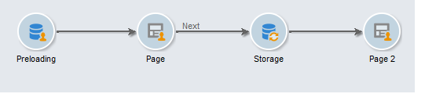
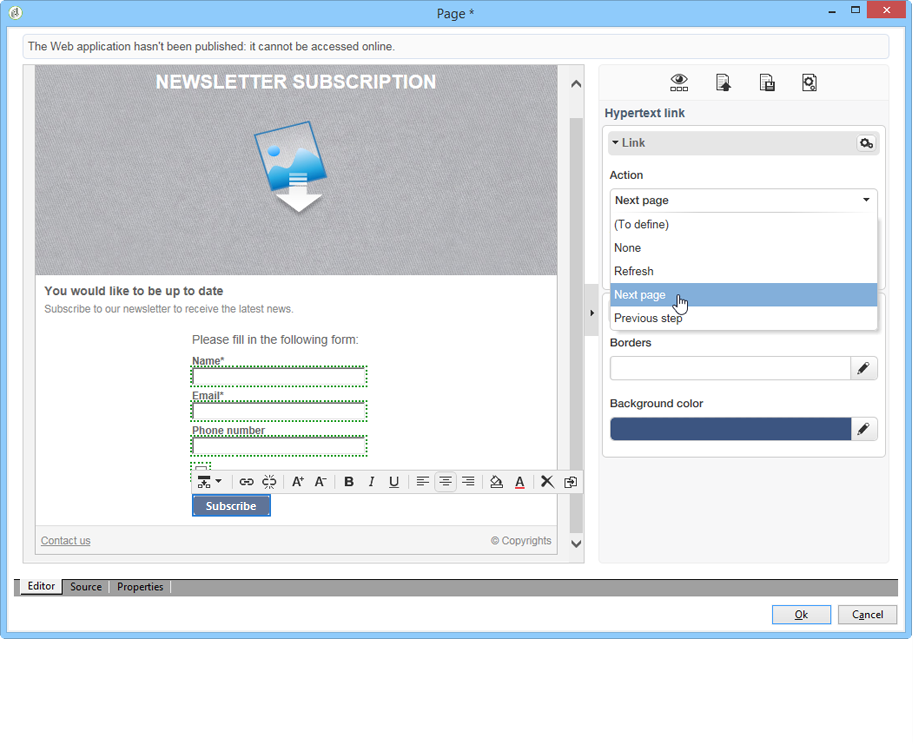

# 랜딩 페이지 만들기{#creating-a-landing-page}

## 랜딩 페이지 만들기 정보 {#about-landing-pages-creation}

이 사용 사례는 디지털 편집기를 사용하여 Adobe Campaign 콘솔에서 랜딩 페이지를 만드는 방법을 보여줍니다.

Adobe Campaign에서 랜딩 페이지 구성을 시작하기 전에 HTML 페이지를 나타내는 **하나 이상의 템플릿**&#x200B;이 있어야 합니다.

이 사용 사례의 주요 목표는 랜딩 페이지 양식 필드가 DCE의 함수를 사용하여 Adobe Campaign의 내부 필드와 일치하도록 만드는 것입니다.

## 랜딩 페이지 만들기 {#creating-the-landing-page}

새 랜딩 페이지 유형 웹 애플리케이션을 만들려면 다음 단계를 수행하십시오.

1. **[!UICONTROL Campaigns]** 탭으로 이동하여 **[!UICONTROL Web application]** 링크를 클릭한 다음 **[!UICONTROL Create]** 단추를 클릭합니다.
1. **[!UICONTROL New landing page]** 템플릿을 선택하고 레이블을 입력한 다음 **[!UICONTROL Save]** 을 클릭합니다.

   

1. **[!UICONTROL Edit]** 탭을 클릭합니다.
1. **종료** 활동을 삭제합니다.
1. **[!UICONTROL Storage]** 활동 뒤에 **[!UICONTROL Page]** 활동을 추가합니다.
1. **페이지 2** 활동을 편집한 다음 **[!UICONTROL Properties]** 탭에서 **[!UICONTROL Activate outbound transitions]** 옵션의 선택을 취소합니다.

   

1. 변경 내용을 저장합니다.

그러면 다음 시퀀스가 제공됩니다.

>[!NOTE]
>
>웹 응용 프로그램 만들기에 대한 자세한 내용은 [이 섹션](../../web/using/creating-a-new-web-application.md)을 참조하십시오.

## 1단계 - 템플릿 선택 및 로드 {#step-1---selecting-and-loading-templates}

이 섹션에서는 웹 응용 프로그램의 각 페이지에 대해 **HTML 내용**&#x200B;을 가져오는 방법을 살펴보겠습니다.

템플릿에는 다음이 포함되어야 합니다.

* **HTML** 파일(필수)
* 하나 이상의 **CSS** 파일(선택 사항)
* 하나 이상의 **이미지**(선택 사항)

첫 번째 페이지에서 템플릿을 로드하려면 다음 단계를 적용합니다.

1. 웹 응용 프로그램의 첫 번째 **[!UICONTROL Page]** 활동을 엽니다.
1. 콘텐트 템플릿을 가져오려면 **[!UICONTROL From a file]**&#x200B;을 선택합니다.

   

1. 사용할 HTML 파일을 선택합니다.
1. **열기**&#x200B;를 클릭하여 가져오기를 시작합니다.

   로드하는 동안 공유 파일 목록이 표시됩니다. 가져오기 시스템은 선택한 HTML에 연결된 모든 파일(CSS, 이미지 등)이 있는지 확인합니다.

   가져오기가 완료되면 **[!UICONTROL Close]** 단추를 클릭합니다.

   

   >[!CAUTION]
   >
   >닫기 전에 다음 메시지를 받을 때까지 기다려야 합니다.**[!UICONTROL The external resources have been successfully published]** .

1. **[!UICONTROL Properties]** 탭을 클릭합니다.
1. 각 페이지에 대해 **레이블**&#x200B;을 입력합니다(예:페이지 1= 수집, 페이지 2=감사).

   

웹 응용 프로그램에 삽입된 각 페이지에 대해 다음 단계를 적용합니다.

>[!CAUTION]
>
>**DCE는 로드된 HTML 페이지에 대한 JavaScript 코드를 실행합니다.** Adobe Campaign 인터페이스에 표시될 수 있는 HTML 템플릿의 JavaScript 오류입니다. 이러한 오류는 편집기와 관련이 없습니다. 가져온 파일에 오류가 없는지 확인하려면 DCE로 파일을 가져오기 전에 브라우저(Internet Explorer / Firefox / Chrome)에서 테스트하는 것이 좋습니다.

## 2단계 - 내용 {#step-2---configuring-the-content} 구성

이 섹션에서는 가져온 컨텐츠를 조정하고 데이터베이스의 필드를 웹 페이지의 양식에 연결합니다. 이전에 만든 웹 응용 프로그램은 다음과 같습니다.

### 내용 수정 {#modifying-content}

먼저 페이지의 색상을 변경해 보죠. 방법은 다음과 같습니다.

1. **[!UICONTROL Collection]** 페이지를 엽니다.
1. 배경을 클릭합니다.
1. 오른쪽의 **배경색**&#x200B;을 클릭합니다.
1. 새 배경색을 선택합니다.
1. **확인**&#x200B;을 클릭하여 변경을 확인합니다.

   

1. 동일한 프로세스를 적용하여 단추 색상 변경

   

### 양식 필드 연결 {#linking-form-fields}

제공된 정보를 저장하기 위해 페이지의 필드를 데이터베이스의 필드에 연결합니다.

1. 양식 필드를 선택합니다.
1. 편집기의 오른쪽에 있는 **[!UICONTROL Field]** 섹션을 편집합니다.
1. 선택한 필드에 연결할 데이터베이스 필드를 선택합니다.

   

1. 페이지의 각 필드에 대해 이 프로세스를 반복합니다.

필드를 필수 필드로 만들 수 있습니다.예를 들어 **[!UICONTROL Email]** 필드를 클릭한 다음 **필수** 옵션을 활성화합니다.

### 다음 페이지 {#creating-a-link-to-the-next-page}에 대한 링크 만들기

이 단계는 웹 응용 프로그램에서 다음 단계의 순서를 결정할 수 있도록 허용하므로 필수입니다.수집된 데이터를 데이터베이스에 저장한 다음 다음 다음 페이지를 표시합니다(**감사합니다** 페이지).

1. **[!UICONTROL Collection]** 페이지의 **[!UICONTROL Send it!]** 단추를 선택합니다.
1. **[!UICONTROL Action]** 드롭다운 메뉴를 클릭합니다.
1. **[!UICONTROL Next page]** 동작을 선택합니다.

   

### 개인화 필드 삽입 {#inserting-a-personalization-field}

이 단계를 통해 감사 페이지를 개인화할 수 있습니다. 방법은 다음과 같습니다.

1. **[!UICONTROL Thank you]** 페이지를 엽니다.
1. 수신자의 이름을 삽입할 텍스트 영역에 커서를 놓습니다.
1. 도구 모음의 **[!UICONTROL Insert]** 메뉴에서 **[!UICONTROL Personalization field]**&#x200B;을 선택합니다.
1. 이름을 선택합니다.

   

개인화 필드는 편집기에 노란색 배경이 있습니다.

## 3단계 - 내용 게시 {#step-3---publishing-content}

컨텐츠는 웹 애플리케이션 대시보드에서 게시됩니다. **[!UICONTROL Publish]** 단추를 클릭하여 실행합니다.

게시 중에 로그가 표시됩니다. 게시 시스템은 웹 응용 프로그램에 있는 모든 내용을 분석합니다.

>[!NOTE]
>
>게시 로그에서 경고 및 오류는 활동별로 정렬됩니다.

이제 양식을 사용할 수 있습니다.애플리케이션 대시보드에서 해당 URL에 액세스할 수 있으며 수신자에게 보낼 수 있습니다.
