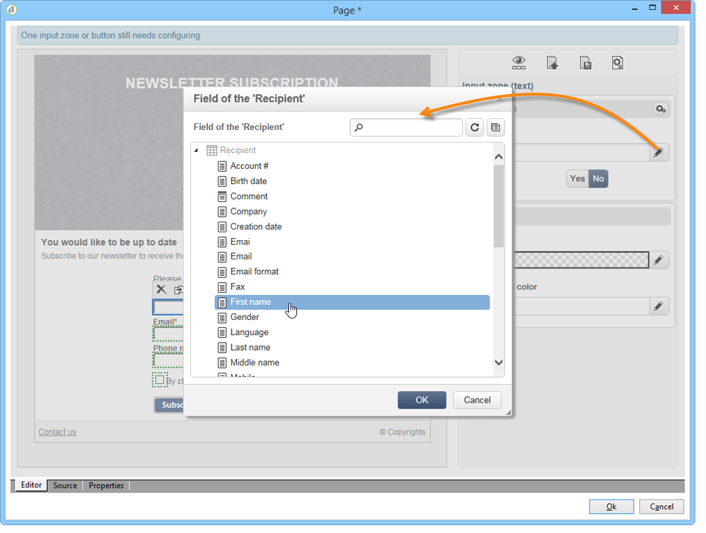

# 랜딩 페이지 만들기{#creating-a-landing-page}

## 랜딩 페이지 만들기 기본 정보 {#about-landing-pages-creation}

이 사용 사례에서는 디지털 편집기를 사용하여 Adobe Campaign 콘솔에서 랜딩 페이지를 만드는 방법을 보여줍니다.

Adobe Campaign에서 랜딩 페이지 구성을 시작하기 전에 다음을 확인하십시오. **하나 이상의 템플릿** HTML 페이지를 나타냅니다.

이 사용 사례의 주요 목적은 DCE의 기능을 사용하여 랜딩 페이지 양식 필드를 Adobe Campaign의 내부 필드와 일치시키는 것입니다.

## 랜딩 페이지 만들기 {#creating-the-landing-page}

새 랜딩 페이지 유형 웹 애플리케이션을 만들려면 다음 단계를 수행하십시오.

1. 로 이동 **[!UICONTROL Campaigns]** 탭을 클릭하고 **[!UICONTROL Web application]** 링크를 클릭한 다음 **[!UICONTROL Create]** 단추를 클릭합니다.
1. 다음 항목 선택 **[!UICONTROL New landing page]** 템플릿을 선택하고 레이블을 입력한 다음 을(를) 클릭합니다 **[!UICONTROL Save]**.

   

1. 다음을 클릭합니다. **[!UICONTROL Edit]** 탭.
1. 삭제 **종료** 활동.
1. 추가 **[!UICONTROL Page]** 다음 이후 활동 **[!UICONTROL Storage]** 활동.
1. 편집 **페이지 2** 활동 을 선택한 다음 선택을 취소합니다. **[!UICONTROL Activate outbound transitions]** 의 옵션 **[!UICONTROL Properties]** 탭.

   

1. 변경 내용 저장.

그런 다음 다음 다음 순서를 가져옵니다.

>[!NOTE]
>
>웹 응용 프로그램 만들기에 대한 자세한 내용은 [이 섹션](creating-a-new-web-application.md).

## 1단계 - 템플릿 선택 및 로드 {#step-1---selecting-and-loading-templates}

이 섹션에서는 다음 작업을 수행하는 방법에 대해 살펴보겠습니다 **HTML 컨텐츠 가져오기** 웹 응용 프로그램의 각 페이지마다.

템플릿에는 다음이 포함되어야 합니다.

* an **HTML** 파일(필수)
* 하나 이상 **CSS** 파일(선택 사항)
* 하나 이상 **이미지** (선택 사항)

첫 번째 페이지에서 템플릿을 로드하려면 다음 단계를 적용합니다.

1. 첫 번째 **[!UICONTROL Page]** 웹 애플리케이션의 활동입니다.
1. 선택 **[!UICONTROL From a file]** 콘텐츠 템플릿을 가져올 수 있습니다.

   

1. 사용할 HTML 파일을 선택합니다.
1. 클릭 **열기** 가져오기를 시작합니다.

   로드하는 동안 공유 파일 목록이 표시됩니다. 가져오기 시스템은 선택한 HTML에 연결된 모든 파일(CSS, 이미지 등)이 있는지 확인합니다.

   다음을 클릭합니다. **[!UICONTROL Close]** 가져오기가 완료되면 버튼을 누릅니다.

   

   >[!CAUTION]
   >
   >닫기 전에 다음 메시지가 나타날 때까지 기다려야 합니다. **[!UICONTROL The external resources have been successfully published]** .

1. 다음을 클릭합니다. **[!UICONTROL Properties]** 탭.
1. 입력 **레이블** 각 페이지(예: Page 1= Collect, Page 2=Thank you)의 경우

   

웹 애플리케이션에 삽입된 각 페이지에 대해 다음 단계를 적용합니다.

>[!CAUTION]
>
>**DCE는 로드된 HTML 페이지에 대한 JavaScript 코드를 실행합니다.** Adobe Campaign 인터페이스에 나타날 수 있는 HTML 템플릿의 JavaScript 오류. 이러한 오류는 편집기와 관련이 없습니다. 가져온 파일에 오류가 없는지 확인하려면 파일을 DCE로 가져오기 전에 웹 브라우저에서 테스트하는 것이 좋습니다.

## 2단계 - 콘텐츠 구성 {#step-2---configuring-the-content}

이 섹션에서는 가져온 콘텐츠를 조정하고 데이터베이스의 필드를 웹 페이지 양식에 연결합니다. 이전에 만든 웹 응용 프로그램은 다음과 같습니다.

### 콘텐츠 수정 {#modifying-content}

먼저 페이지의 색상을 변경해 보겠습니다. 방법은 다음과 같습니다.

1. 를 엽니다. **[!UICONTROL Collection]** 페이지를 가리키도록 업데이트하는 중입니다.
1. 배경을 클릭합니다.
1. 클릭 **배경색** 오른편에 있습니다.
1. 새 배경색을 선택합니다.
1. 클릭 **확인** 변경을 확인합니다.

   

1. 동일한 프로세스를 적용하여 버튼의 색상을 변경합니다

   

### 양식 필드 연결 {#linking-form-fields}

제공된 정보를 저장하기 위해 페이지의 필드를 데이터베이스의 필드에 연결합니다.

1. 양식 필드를 선택합니다.
1. 편집 **[!UICONTROL Field]** 섹션에 자세히 설명되어 있습니다.
1. 선택한 필드에 연결할 데이터베이스 필드를 선택합니다.

   

1. 페이지의 각 필드에 대해 이 프로세스를 반복합니다.

필드를 필수 항목으로 지정할 수 있습니다. 예를 들어 **[!UICONTROL Email]** 필드를 활성화한 다음 **필수** 옵션을 선택합니다.

### 다음 페이지에 대한 링크 만들기 {#creating-a-link-to-the-next-page}

이 단계는 웹 응용 프로그램에서 데이터베이스에 수집된 데이터를 저장한 다음 다음 페이지를 표시하는 다음 단계의 순서를 결정할 수 있도록 하기 때문에 필수입니다. (**감사합니다.** page).

1. 다음 항목 선택 **[!UICONTROL Send it!]** 의 단추 **[!UICONTROL Collection]** 페이지를 가리키도록 업데이트하는 중입니다.
1. 다음을 클릭합니다. **[!UICONTROL Action]** 드롭다운 메뉴.
1. 다음 항목 선택 **[!UICONTROL Next page]** 작업.

   

### 개인화 필드 삽입 {#inserting-a-personalization-field}

이 단계에서는 감사 인사 페이지를 개인화할 수 있습니다. 방법은 다음과 같습니다.

1. 를 엽니다. **[!UICONTROL Thank you]** 페이지를 가리키도록 업데이트하는 중입니다.
1. 수신자의 이름을 삽입하려는 텍스트 영역에 커서를 놓습니다.
1. 선택 **[!UICONTROL Personalization field]** 다음에서 **[!UICONTROL Insert]** 도구 모음의 메뉴
1. 이름을 선택합니다.

   

개인화 필드의 편집기에는 노란색 배경이 있습니다.

## 3단계 - 콘텐츠 게시 {#step-3---publishing-content}

웹 애플리케이션 대시보드에서 콘텐츠가 게시됩니다. 다음을 클릭합니다. **[!UICONTROL Publish]** 단추를 클릭하여 실행합니다.

게시 중에 로그가 표시됩니다. 게시 시스템은 웹 애플리케이션에서 발견되는 모든 콘텐츠를 분석합니다

>[!NOTE]
>
>게시 로그에서 경고 및 오류는 활동별로 정렬됩니다.

이제 양식을 사용할 수 있습니다. 해당 URL은 애플리케이션 대시보드에서 액세스할 수 있으며 수신자에게 전송할 수 있습니다.
