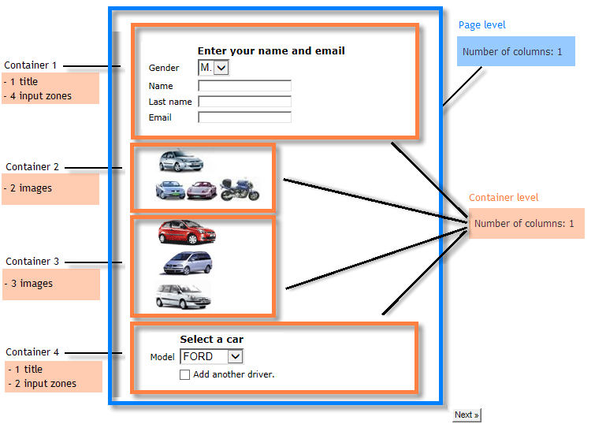

# 웹 양식 레이아웃 정의{#defining-web-forms-layout}

## 컨테이너 만들기 {#creating-containers}

컨테이너를 사용하여 페이지의 필드를 결합하고 레이아웃을 구성할 수 있습니다. 를 클릭하여 페이지에서 요소를 구성합니다.

양식의 각 페이지에 대해 컨테이너를 **[!UICONTROL Containers]** 도구 모음 단추.

최종 렌더링에 레이블을 추가하지 않고 페이지의 요소를 그룹화하려면 컨테이너를 사용합니다. 요소는 컨테이너 하위 트리로 그룹화됩니다. 표준 컨테이너를 사용하여 레이아웃을 관리할 수 있습니다.

예제:

레이블 위치는 계층 구조에서 컨테이너 아래에 배치된 요소에 적용됩니다. 필요한 경우 각 요소에 대해 오버로드될 수 있습니다. 레이아웃을 변경하려면 열을 추가하거나 제거합니다. 자세한 내용은 [페이지에 필드 배치](#positioning-the-fields-on-the-page).

위의 예에서 렌더링은 다음과 같습니다.

## 페이지에 필드 배치 {#positioning-the-fields-on-the-page}

웹 양식의 레이아웃은 각 컨테이너의 페이지로 정의되며 필요한 경우 오버로드될 수 있습니다.

페이지는 열로 분류됩니다. 각 페이지에는 특정 수의 열이 포함되어 있습니다. 페이지의 각 필드가 차지합니다 **n** 셀. 컨테이너에는 특정 수의 열이 사용되고 그 열에 포함된 필드는 특정 수의 셀이 있습니다.

기본적으로 페이지는 단일 열에 구축되고 각 요소는 하나의 셀을 차지합니다. 즉, 각 필드는 아래와 같이 전체 줄을 점유하고 있습니다.

다음 예에서는 기본 구성이 유지됩니다. 이 페이지는 네 개의 컨테이너를 포함하는 단일 열을 차지합니다.

각 컨테이너는 하나의 열을 차지하며 각 요소는 하나의 셀을 차지합니다.

렌더링은 다음과 같습니다.

표시 매개 변수를 조정하여 다음 렌더링을 얻을 수 있습니다.

위의 렌더링 예제에서 각 입력 필드, 제목 및 이미지는 컨테이너 열에서 하나의 셀을 차지합니다.

각 컨테이너에서 서식을 수정할 수 있습니다. 이 예에서는 컨테이너 4의 컨텐츠를 두 열에 분산하여 요소를 배포할 수 있습니다.

제목과 목록은 각각 하나의 셀(따라서 컨테이너의 전체 줄)을 차지하며, 확인란이 두 개 셀 위로 확장됩니다. 입력 필드에 속하는 셀 수는 **[!UICONTROL General]** 탭 또는 **[!UICONTROL Advanced]** 탭, 필드 유형에 따라

## 레이블 위치 정의 {#defining-the-position-of-labels}

양식에서 필드 및 레이블의 정렬을 정의할 수 있습니다.

기본적으로 페이지의 필드 및 기타 컨텐츠에 대한 표시 매개 변수는 양식의 일반 구성, 페이지 구성 또는 상위 컨테이너가 있는 경우 구성 시 상속됩니다.

전체 양식의 전역 표시 매개 변수는 양식 속성 상자에 지정됩니다. 다음 **[!UICONTROL Rendering]** 탭에서는 레이블 위치를 선택할 수 있습니다.

이 위치는 **[!UICONTROL Advanced]** 탭.

다음 할당이 지원됩니다.

* 상속됨: 맞춤은 상위 요소(기본값)에서 상속됩니다. 즉, 상위 컨테이너가 있는 경우 해당 컨테이너나 다른 페이지에서 상속됩니다.
* 왼쪽/오른쪽: 필드의 오른쪽 또는 왼쪽에 레이블이 배치됩니다.
* 위/아래: 레이블이 필드의 위 또는 아래에 배치됩니다.
* 숨김: 레이블이 표시되지 않습니다.
