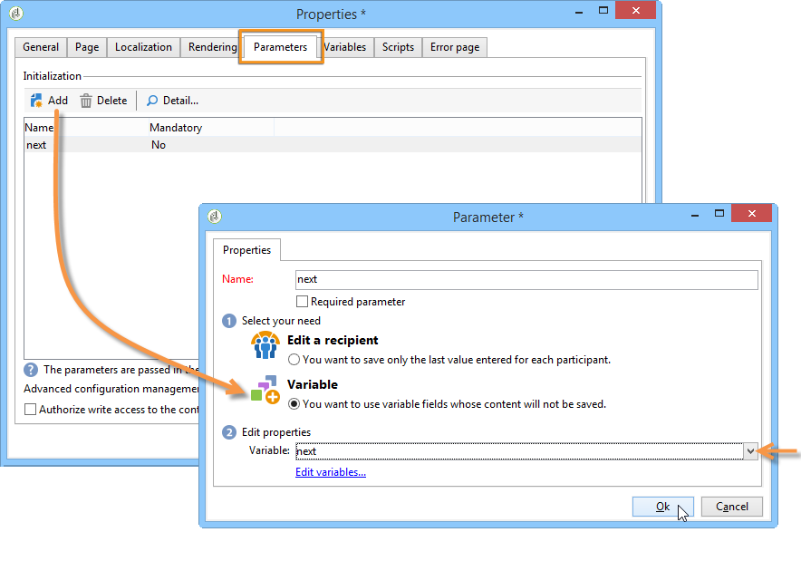

# 웹 양식 페이지 순서 정의{#defining-web-forms-page-sequencing}

양식에 하나 이상의 페이지가 포함될 수 있습니다. 페이지 시퀀스, 테스트, 스크립트 실행, 페이지 이동 및 기록 단계를 제공하는 다이어그램을 통해 구축됩니다. 글로벌 다이어그램 디자인 모드는 캠페인 워크플로와 동일합니다.

## 이전 페이지 및 다음 페이지 {#about-previous-page-and-next-page} 정보

각 페이지에 대해 **[!UICONTROL Next]** 또는 **[!UICONTROL Previous]** 단추를 삭제할 수 있습니다. 이렇게 하려면 관련 페이지를 선택하고 **[!UICONTROL Disable next page]** 또는 **[!UICONTROL Disallow returning to the previous page]** 옵션을 선택합니다.


이 단추를 링크로 바꿀 수 있습니다. [HTML 콘텐츠 삽입](../../web/using/static-elements-in-a-web-form.md#inserting-html-content)을(를) 참조하십시오.

## 이동 {#inserting-a-jump} 삽입

**[!UICONTROL Jump]** 개체는 사용자가 **[!UICONTROL Next]**&#x200B;을(를) 클릭할 때 다른 페이지나 다른 양식에 대한 액세스 권한을 제공합니다.

대상은 다음과 같습니다.

* 양식의 다른 페이지입니다. 이렇게 하려면 **[!UICONTROL Internal activity]**&#x200B;을 선택한 다음 아래에서 원하는 페이지를 지정합니다.

   

* 다른 양식. 이렇게 하려면 **[!UICONTROL Explicit]** 옵션을 선택하고 대상 양식을 지정합니다.

   

* 대상은 변수에 저장할 수 있습니다. 이 경우, 아래와 같이 드롭다운 목록에서 선택합니다.

   

* **[!UICONTROL Comment]** 탭에서는 연산자가 다이어그램에서 개체를 클릭할 때 표시되는 정보를 입력할 수 있습니다.

   

## 예:URL {#example--accessing-another-form-according-to-a-parameter-of-the-url} 매개 변수에 따라 다른 양식에 액세스

다음 예제에서는 승인 시 URL의 매개 변수에 의해 지정된 다른 양식을 표시하는 웹 양식을 구성하려고 합니다. 이렇게 하려면 다음 단계를 적용합니다.

1. 양식 끝에 점프 삽입:이 필드는 **[!UICONTROL End]** 상자를 대체합니다.

   

1. 양식 속성에서 로컬 변수(**next**)에 저장된 매개 변수(**next**)를 추가합니다. 로컬 변수는 [로컬 변수](../../web/using/web-forms-answers.md#storing-data-in-a-local-variable)에 데이터를 저장하는 방법에 자세히 설명되어 있습니다.

   

1. **[!UICONTROL Jump]** 개체를 편집하고 **[!UICONTROL Stored in a variable]** 옵션을 선택하고 드롭다운 상자에서 **next** 변수를 선택합니다.

   

1. 배달 URL에는 대상 양식의 내부 이름이 포함되어야 합니다. 예:

   ```
   https://[myserver]/webForm/APP62?&next=APP22
   ```

   사용자가 **[!UICONTROL Approve]** 단추를 클릭하면 **APP22** 양식이 표시됩니다.

## {#inserting-a-link-to-another-page-of-the-form} 양식의 다른 페이지에 링크 삽입

양식의 다른 페이지에 대한 링크를 삽입할 수 있습니다. 이렇게 하려면 페이지에 **[!UICONTROL Link]** 유형 정적 요소를 추가합니다. 자세한 내용은 [링크 삽입](../../web/using/static-elements-in-a-web-form.md#inserting-a-link)을 참조하십시오.

## 조건부 페이지 표시 {#conditional-page-display}

### 응답 {#display-based-on-responses}에 따라 표시

**[!UICONTROL Test]** 상자를 사용하면 양식의 페이지 순서를 지정할 수 있습니다. 테스트 결과에 따라 다양한 분기 라인을 정의할 수 있습니다. 이렇게 하면 사용자가 제공한 응답에 따라 다른 페이지를 표시할 수 있습니다.

예를 들어 이미 온라인으로 주문한 고객의 경우 다른 페이지를 표시하고 10개 이상의 주문을 제출한 고객의 경우 다른 페이지를 표시할 수 있습니다. 이렇게 하려면 양식의 첫 페이지에 **[!UICONTROL Number]** 입력 필드를 삽입하여 사용자가 주문한 주문 수를 표시합니다.


이 정보를 데이터베이스의 필드에 저장하거나 로컬 변수를 사용할 수 있습니다.

>[!NOTE]
>
>저장소 모드는 [응답 저장소 필드](../../web/using/web-forms-answers.md#response-storage-fields)에 자세히 설명되어 있습니다.

이 예제에서는 변수를 사용합니다.


양식 다이어그램에 조건을 정의하려면 테스트 상자를 삽입합니다. 각 조건에 대해 새 분기가 테스트 상자의 출력에 추가됩니다.


조건이 true가 아닌 경우 전환을 추가하려면 **[!UICONTROL Activate the default branching]** 옵션을 선택합니다. 가능한 모든 케이스가 정의된 조건에 따라 적용되는 경우 이 옵션은 불필요합니다.

다음, 하나 이상의 조건이 참이면 페이지 순서를 정의합니다. 예를 들면 다음과 같습니다.


### 매개 변수 {#display-based-on-parameters}에 따라 표시

웹 양식의 초기화 매개변수 또는 데이터베이스에 저장된 값에 따라 페이지 순서를 개인화할 수도 있습니다. [양식 URL 매개 변수](../../web/using/defining-web-forms-properties.md#form-url-parameters)를 참조하십시오.

## 스크립트 추가 중 {#adding-scripts}

**[!UICONTROL Script]** 객체를 사용하면 필드 값을 수정하거나 데이터베이스에서 데이터를 검색하거나 Adobe Campaign API를 호출하는 등 JavaScript 스크립트를 직접 입력할 수 있습니다.

## 끝 페이지 {#personalizing-the-end-page} 개인 설정

다이어그램 끝에 끝 페이지를 배치해야 합니다. 사용자가 웹 양식의 **[!UICONTROL Approve]** 단추를 클릭하면 끝 페이지가 표시됩니다.

이 페이지를 개인화하려면 **[!UICONTROL End]**&#x200B;을 두 번 클릭하고 페이지 컨텐츠를 중앙 편집기에 입력합니다.


* 기존 HTML 컨텐츠를 복사하여 붙여넣을 수 있습니다. 이렇게 하려면 **[!UICONTROL Display source code]**&#x200B;을 클릭하고 HTML 코드를 삽입합니다.
* 외부 URL을 사용할 수 있습니다.이렇게 하려면 해당 옵션을 선택하고 표시할 페이지의 URL을 입력합니다.

