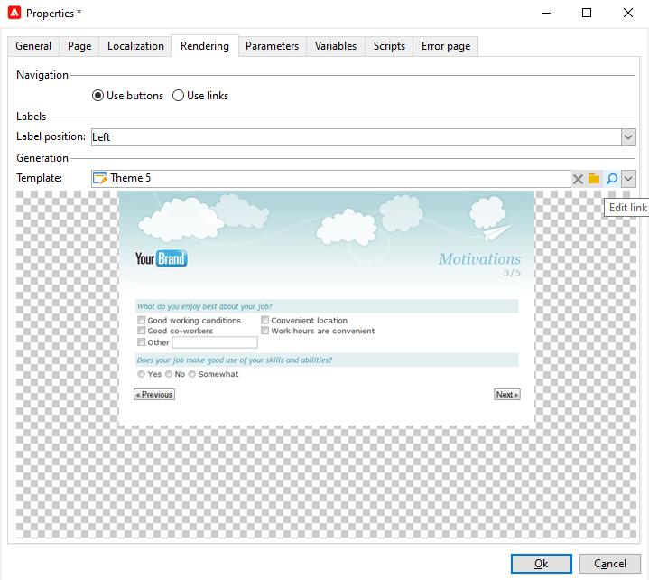

# 웹 양식 속성 정의{#defining-web-forms-properties}

웹 양식은 사용자의 요구 사항을 충족하도록 완벽하게 구성 가능하고 개인화할 수 있습니다. 매개 변수를 속성 창에 입력해야 합니다.

속성 창은 웹 양식의 도구 모음에 있는 **[!UICONTROL Properties]** 단추를 통해 액세스할 수 있습니다. 이 창을 사용하면 웹 양식과 관련된 다양한 설정에 액세스할 수 있습니다. 일부 설정은 템플릿 구성에서 비롯될 수 있습니다.

## 전체 양식 속성 {#overall-form-properties}

속성 창의 **[!UICONTROL General]** 탭에서 양식의 레이블을 수정할 **수** 있습니다. 내부 이름을 변경하지 않는 것이 **좋습니다**.

양식 템플릿은 양식을 만드는 동안 선택됩니다. 나중에 변경할 수 없습니다. 양식 템플릿 만들기 및 관리에 대한 자세한 내용은 웹 [양식 템플릿](../../web/using/using-a-web-form-template.md)사용을 참조하십시오.

## 양식 데이터 스토리지 {#form-data-storage}

웹 양식의 필드는 기본적으로 수신자 표에 저장됩니다. 필드에서 새 테이블을 선택하여 사용하는 테이블을 변경할 수 **[!UICONTROL Document type]** 있습니다. 이 **[!UICONTROL Zoom]** 아이콘을 사용하면 선택한 테이블의 컨텐츠를 볼 수 있습니다.

기본적으로 답변은 **[!UICONTROL Answer to a recipient form]** 표에 저장됩니다.

## 오류 페이지 설정 {#setting-up-an-error-page}

오류 페이지를 구성할 수 있습니다.이 페이지는 양식 실행 중 오류가 발생하는 경우 표시됩니다.

오류 페이지는 양식 속성 창의 해당 탭에 정의됩니다.

기본적으로 다음 정보가 표시됩니다.

표시되는 문자열의 내용은 속성 창의 **[!UICONTROL Error page]** 탭에 정의됩니다. 이 **[!UICONTROL HTML]** 탭에는 렌더링이 표시되고, **[!UICONTROL Texts]** 이 탭에서는 텍스트 문자열을 수정하고 필요한 경우 텍스트를 추가할 수 있습니다.

## 양식 현지화 {#form-localization}

이 **[!UICONTROL Localization]** 탭에서는 웹 양식의 디자인 및 표시 언어를 선택할 수 있습니다.

웹 [양식](../../web/using/translating-a-web-form.md)변환을 참조하십시오.

## 양식 검색 및 렌더링 {#form-browsing-and-rendering}

이 **[!UICONTROL Rendering]** 탭에서는 웹 양식의 페이지와 사용된 렌더링 템플릿 간의 검색 유형을 정의할 수 있습니다.

링크나 단추를 통해 탐색하도록 선택할 수 있습니다.

단추는 기본적으로 탐색 요소입니다. 이러한 기능을 사용하면 다음 작업을 수행할 수 있습니다.

* 현재 페이지를 승인하고 을 클릭하여 다음 페이지를 표시합니다 **[!UICONTROL Next]**. 이 단추는 마지막 페이지를 제외한 모든 페이지에 표시됩니다.
* 을 클릭하여 이전 페이지를 **[!UICONTROL Previous]**&#x200B;표시합니다. 이 단추는 첫 번째 단추를 제외한 모든 페이지에 표시됩니다.
* 단추를 클릭하여 양식 응답을 **[!UICONTROL Approve]** 저장합니다. 이 단추는 마지막 페이지에만 표시됩니다.

이러한 요소는 각 페이지 하단에 표시됩니다. 그들의 위치는 변경될 수 있습니다. 이렇게 하려면 스타일 시트를 수정해야 합니다.

>[!NOTE]
>
>일부 페이지의 **[!UICONTROL Previous]** 단추를 숨길 수 있습니다. 이렇게 하려면 관련 페이지로 이동하여 **[!UICONTROL Disallow returning to the previous page]** 옵션을 확인하십시오. 이 옵션은 페이지 트리의 루트가 선택되면 액세스할 수 있습니다.

탭의 **[!UICONTROL Template]** 필드를 사용하면 사용 가능한 테마에서 테마를 선택할 수 **[!UICONTROL Rendering]** 있습니다.

테마는 트리의 **[!UICONTROL Administration>Configuration>Form rendering]** 노드에 저장됩니다. 양식 [렌더링 템플릿 선택을 참조하십시오.](../../web/using/form-rendering.md#selecting-the-form-rendering-template)

속성 창의 아래쪽에 샘플 렌더링이 표시됩니다. 이 **[!UICONTROL Edit link]** 아이콘을 사용하면 선택한 테마에 대한 구성을 볼 수 있습니다.

## 양식의 텍스트 {#texts-in-the-form}

이 **[!UICONTROL Page]** 탭에서는 양식 머리글과 바닥글의 컨텐츠를 정의할 수 있습니다. 머리글 [및 바닥글 정의를](../../web/using/form-rendering.md#defining-headers-and-footers)참조하십시오.

또한 번역을 관리할 수 있습니다. 웹 [양식](../../web/using/translating-a-web-form.md)변환을 참조하십시오.

## 양식의 액세서빌러티 {#accessibility-of-the-form}

웹 양식이 있는 경우 **[!UICONTROL Online]** 그리고 현재 날짜가 유효 기간 내에 있는 경우 사용자가 웹 양식에 액세스할 수 있습니다. 양식 상태는 게시 단계 동안 수정됩니다(양식 [게시](../../web/using/publishing-a-web-form.md#publishing-a-form)참조). 상태는 속성 **창의** 프로젝트 **[!UICONTROL General]** 섹션에 표시됩니다.

유효 기간은 **[!UICONTROL Start]** 날짜에서 날짜까지 실행됩니다 **[!UICONTROL End date]**. 이 필드에 날짜가 지정되지 않은 경우 양식의 유효성은 영구적입니다.

>[!NOTE]
>
>양식이 닫혀 있어서 유효 기간에 도달하지 않았거나 만료되었거나, Adobe Campaign 운영자가 양식을 닫은 경우 사용자가 양식에 액세스를 시도할 때 메시지가 표시됩니다. 을 클릭하여 이 메시지를 개인화할 수 **[!UICONTROL Personalize the message displayed if the form is closed...]**&#x200B;있습니다.

## 양식 액세스 제어 {#form-access-control}

기본적으로 웹 양식에 대한 액세스는 익명 모드에서 수행됩니다.양식에 액세스하는 모든 운영자에게는 WebApp 운영자 권한이 할당됩니다.

사용자를 인증하기 위해 인트라넷 사이트에서 양식을 제공할 때와 같이 양식의 표시에 대한 액세스 제어를 활성화할 수 있습니다. 이렇게 하려면 아래 표시된 대로 관련 양식의 **[!UICONTROL Properties]** 창을 표시하고 **[!UICONTROL Enable access control]** 옵션을 클릭합니다.

페이지에 액세스하면 다음 인증 양식이 나타납니다.

로그인 및 암호는 Adobe Campaign 운영자가 사용하는 암호입니다. For more on this, refer to [this section](../../platform/using/access-management.md).

이 **[!UICONTROL Use a specific account]** 옵션을 사용하면 양식에 액세스하는 연산자의 읽기 또는 쓰기 권한을 제한할 수 있습니다. 드롭다운 상자를 사용하여 이러한 권한을 부여할 연산자 또는 연산자 그룹을 선택합니다.

## 양식 URL 매개 변수 {#form-url-parameters}

양식의 URL에 추가 매개 변수를 추가하여 컨텐츠를 개인화하고 컨텍스트(언어, 암호화된 수신자 ID, 회사, 변수에 저장된 계산된 공식 등)를 초기화할 수 있습니다. 이렇게 하면 여러 URL을 통해 하나의 양식에 액세스할 수 있고 URL에 지정된 매개 변수의 값을 기반으로 페이지 컨텐츠를 개인화할 수 있습니다.

기본적으로 Adobe Campaign은 양식을 미리 보고 오류를 확인하는 매개 변수를 제공합니다. 양식에 연결된 새 설정을 만들 수 있습니다. 이 설정은 데이터베이스 또는 로컬 변수의 필드 값을 사용할 수 있습니다.

## 표준 매개 변수 {#standard-parameters}

기본적으로 다음 매개 변수를 사용할 수 있습니다.

* **id** - 암호화된 식별자를 나타냅니다.
* **lang** - 표시 언어를 변경합니다.
* **피청구인의 출처를** 지정하는 출처.
* **_uuid** 발행물 및 오류 추적 전에 양식 보기를 활성화합니다. 이 매개 변수는 내부용(만들기 및 디버그)입니다.이 URL 파섹 원점은 **[!UICONTROL Adobe Campaign]** 값으로 강제됩니다.

   이 매개 변수는 **_preview** 매개 변수 및/또는 **_debug와**&#x200B;함께 사용됩니다.

   **마지막으로 저장한 버전을 표시하는 미리 보기** (_P) 이 매개 변수는 테스트 단계에서만 사용해야 합니다.

   **_debug** 를 사용하여 데이터 입력 또는 양식 페이지에서 계산되는 추적을 표시합니다. 양식이 게시되면 등 오류에 대한 자세한 정보를 얻는 데 사용됩니다.

   >[!CAUTION]
   >
   >URL을 통해 **_uuid** 매개 변수를 표시하면 **[!UICONTROL origin]** 매개 변수의 값이 Adobe Campaign에 **강제로 표시됩니다**.

## 매개 변수 추가 {#adding-parameters}

양식의 속성 창에서 **[!UICONTROL Parameters...]** 탭을 통해 매개 변수를 추가할 수 있습니다. 다음과 같이 강제적으로 만들 수 있습니다.

매개 변수의 값을 검색할 저장소 위치를 지정해야 합니다. 이렇게 하려면 저장소 옵션 중 하나를 선택한 다음 **[!UICONTROL Storage]** 탭을 클릭하여 해당 필드나 변수를 선택합니다. 스토리지 옵션은 응답 스토리지 [필드에](../../web/using/web-forms-answers.md#response-storage-fields)자세히 설명되어 있습니다.

그러면 응답자 상태(0, 1 또는 기타 값)를 양식에 액세스하기 위해 URL에 추가할 수 있습니다. 이 정보는 양식의 페이지 또는 테스트 상자에서 다시 사용할 수 있습니다. 표시되는 페이지는 아래와 같이 컨텍스트의 값을 기준으로 결정될 수 있습니다.

1. 고객을 위한 홈 페이지(**상태=1**):

   

1. 잠재 고객을 위한 홈 페이지(**상태=0**):

   

1. 다른 프로필의 홈 페이지(예: **상태=12**):

   

이 양식을 구성하려면 다음과 같이 테스트 상자를 만들어 다이어그램의 시작 부분에 배치합니다.

테스트 상자를 사용하여 페이지 순서 조건을 구성할 수 있습니다.

