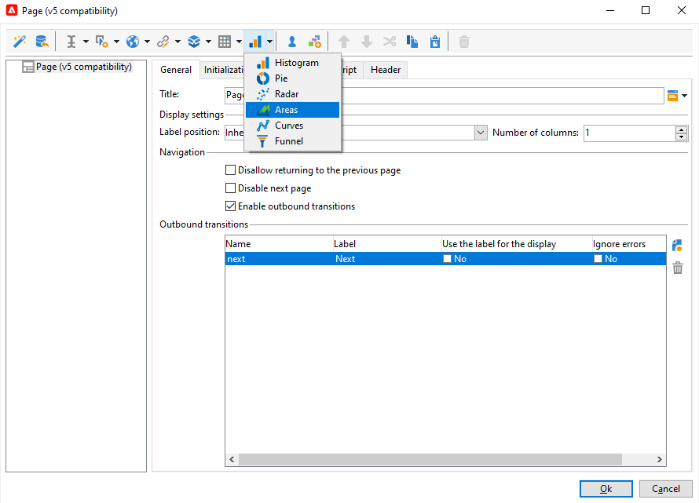

# 웹 애플리케이션 디자인{#designing-a-web-application}

웹 애플리케이션은 [온라인 설문 조사와](../../web/using/about-surveys.md)동일한 원칙에 따라 제작 및 관리됩니다.

그러나 기능 차이는 다음과 같습니다.

* 웹 애플리케이션은 보관된 필드를 사용하지 않습니다. 따라서 데이터는 데이터베이스 필드 또는 로컬 변수에만 저장할 수 있습니다.
* 웹 애플리케이션에 내장된 보고서가 없습니다.
* 표 및 차트 작성을 위한 추가 필드가 제공됩니다.

>[!CAUTION]
>
>웹 애플리케이션 구축 프로세스의 초반에 오류를 탐지하기 위해 적용된 구성을 계속 확인하는 것이 좋습니다. 수정 내용의 렌더링을 확인하려면 애플리케이션을 저장한 다음 **[!UICONTROL Preview]** 하위 탭을 클릭합니다.
>
>웹 응용 프로그램이 게시될 때까지 변경 내용을 최종 사용자가 볼 수 없습니다.

## 웹 애플리케이션에 차트 삽입 {#inserting-charts-in-a-web-application}

웹 응용 프로그램에 차트를 포함할 수 있습니다. 이렇게 하려면 작업 표시줄의 차트 드롭다운 목록을 사용하여 삽입할 차트 유형을 선택합니다.

메뉴를 선택할 수도 **[!UICONTROL Add a chart]** 있습니다.

## 웹 응용 프로그램에 표 삽입 {#inserting-tables-in-a-web-application}

테이블을 추가하려면 작업 표시줄의 표 드롭다운 목록을 사용하여 사용할 테이블 유형을 선택합니다.

드롭다운 메뉴에서 표 유형을 선택할 수도 있습니다.

## 개요 유형 웹 애플리케이션 {#overview-type-web-applications}

Adobe Campaign 인터페이스는 많은 웹 애플리케이션을 사용하여 수신자, 전달, 캠페인, 주식 등에 액세스하고 이를 관리하고 상호 작용합니다.

인터페이스에서는 한 페이지만 있는 대시보드의 형태로 표시됩니다.

기본 웹 애플리케이션은 **[!UICONTROL Administration > Configuration > Web applications]** 노드에 저장됩니다.

## 양식 유형 웹 애플리케이션 편집 {#edit-forms-type-web-applications}

엑스트라넷에 대한 양식 웹 응용 프로그램의 특징은 다음과 같습니다.

* 미리 로드 상자

   대부분의 경우 표시할 데이터를 미리 로드해야 합니다. 이러한 양식에 액세스하는 사용자는 액세스 제어를 통해 식별되므로 사전 로딩이 반드시 암호화되지는 않습니다.

* 저장 상자
* 페이지 추가

   &quot;개요&quot; 형식의 웹 응용 프로그램은 모두 단일 페이지를 가지고 있지만, 편집 양식은 특정 조건(테스트, 선택 사항, 연결된 연산자의 프로필 등)을 기반으로 일련의 페이지를 제공할 수 있습니다.

이러한 유형의 웹 응용 프로그램의 작업은 설문 조사와 유사하지만 **내역**&#x200B;관리나 필드 보관이 없습니다. 일반적으로 사용자는 자신을 식별해야 하는 로그인 페이지를 통해 액세스합니다.
