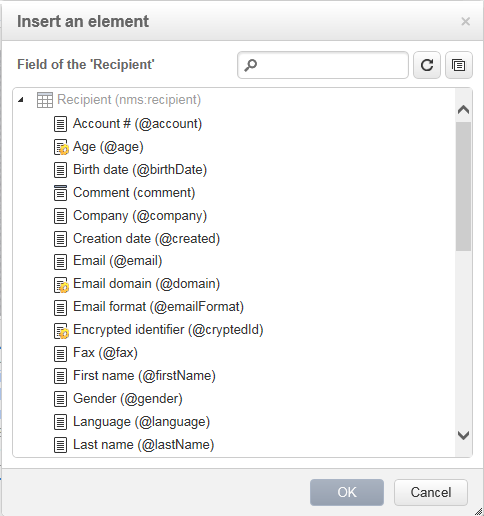

# 콘텐츠 편집{#editing-content}

## 가시성 조건 정의 {#defining-a-visibility-condition}

웹 페이지 요소에 가시성 조건을 지정할 수 있습니다.이 요소는 조건이 존중되는 경우에만 표시됩니다.

가시성 조건을 추가하려면 블록을 선택하고 표현식 편집기를 사용하여 **[!UICONTROL Visibility condition]** 필드에 조건을 입력합니다.


>[!NOTE]
>
>고급 표현식 편집은 [이 페이지](../../platform/using/defining-filter-conditions.md#list-of-functions)에 표시됩니다.


이러한 조건은 XTK 표현식 구문을 채택합니다(예: **ctx.recipient).@email != &quot;&quot;** 또는 **ctx.recipient.@status==&quot;0&quot;**). 기본적으로 모든 필드가 표시됩니다.

>[!NOTE]
>
>드롭다운 메뉴와 같이 보이지 않는 동적 블록은 편집할 수 없습니다.

## 테두리 및 배경 {#adding-a-border-and-background} 추가

선택한 블록에 **border**&#x200B;를 추가할 수 있습니다. 테두리는 다음 3가지 옵션을 사용하여 정의됩니다.스타일, 크기 및 색상.


색상 차트에서 색상을 선택하여 **배경색**&#x200B;을 정의할 수도 있습니다.


## 양식 편집 {#editing-forms}

### {#changing-the-data-properties-for-a-form} 양식의 데이터 속성 변경

데이터베이스 필드를 입력 영역, 라디오 단추 또는 확인란 유형 블록과 연결할 수 있습니다.


>[!NOTE]
>
>기본 필드는 웹 응용 프로그램 저장소 스키마의 필드입니다.

**필드** 입력 영역을 사용하면 양식 필드에 연결할 데이터베이스 필드를 선택할 수 있습니다.

기본적으로 제공된 필드는 **nms:recipient** 테이블에 있는 필드입니다.


**필수 필드** 옵션을 사용하면 사용자가 필드에 입력한 경우에만 페이지의 승인을 승인할 수 있습니다. 필수 필드를 채우지 않으면 오류 메시지가 표시됩니다.

라디오 단추 및 확인란의 경우 **추가 구성이 필요합니다**.

실제로 사용된 템플릿에 기본적으로 값이 포함되어 있지 않은 경우 편집기에서 작성해야 합니다.

방법은 다음과 같습니다.

* **[!UICONTROL Edit]** 아이콘을 클릭합니다.

   

* **[!UICONTROL Value]** 필드에 항목 목록 값(선택한 필드에 정의됨)을 입력합니다.

   

### 양식 필드 수정 {#modifying-form-fields}

라디오 단추, 입력 영역, 드롭다운 목록 등의 양식 필드 도구 모음에서 수정할 수 있습니다.

즉, 다음을 수행할 수 있습니다.

* **[!UICONTROL Delete]** 아이콘을 사용하여 양식 필드가 포함된 블록을 삭제합니다.
* **[!UICONTROL Duplicate]** 아이콘을 사용하여 새 블록을 만들어 선택한 필드를 복제합니다.
* **[!UICONTROL Edit]** 아이콘을 사용하여 데이터베이스 필드를 양식 영역에 연결하려면 **[!UICONTROL Form data]** 창을 편집합니다.

   

## 버튼 {#adding-an-action-to-a-button}에 작업 추가

사용자가 단추를 클릭하면 연결된 동작을 정의할 수 있습니다. 이렇게 하려면 드롭다운 목록에서 수행할 작업을 선택합니다.


사용 가능한 작업은 다음과 같습니다.

* **[!UICONTROL Refresh]** :현재 페이지를 새로 고칩니다.
* **[!UICONTROL Next page]** :웹 응용 프로그램에서 다음 페이지에 대한 링크를 만듭니다.
* **[!UICONTROL Previous page]** :웹 응용 프로그램에서 이전 페이지에 대한 링크를 만듭니다.

>[!NOTE]
>
>**[!UICONTROL None]** 값을 사용하면 단추를 활성화할 수 없습니다.

해당 필드의 단추에 연결된 레이블을 수정할 수 있습니다.

## 링크 {#adding-a-link} 추가

링크를 페이지 요소에 삽입할 수 있습니다.이미지, 단어, 단어 그룹, 텍스트 블록 등

이렇게 하려면 요소를 선택한 다음 팝업 메뉴에서 첫 번째 아이콘을 사용합니다.


이 아이콘을 사용하면 사용 가능한 모든 유형의 링크에 액세스할 수 있습니다.


개인화 블록과 필드는 텍스트 문자 블록에만 삽입할 수 있습니다.

>[!NOTE]
>
>각 링크 유형에 대해 열기 모드를 구성할 수 있습니다.**Target** 드롭다운 목록에서 대상 창을 선택합니다. 이 값은 **`<target>`** HTML 태그에 해당합니다.
>
>사용 가능한 **타겟**&#x200B;의 목록은 다음과 같습니다.
>
>* 기타(IFrame)
>* 위쪽 창(_top)
>* 상위 창(_parent)
>* 새 창(_blank)
>* 현재 창(_self)
>* 기본 브라우저 동작

>


### URL {#link-to-a-url} 링크

**외부 URL** 옵션에 대한 링크를 사용하면 소스 콘텐트에서 모든 URL을 열 수 있습니다.


**URL** 필드에 문제의 링크 주소를 입력합니다. URL 필드는 다음과 같이 입력해야 합니다.**https://www.myURL.com**.

### 웹 응용 프로그램 {#link-to-a-web-application} 링크

**웹 응용 프로그램에 대한 링크** 옵션을 사용하면 Adobe Campaign 웹 응용 프로그램에 액세스할 수 있습니다.


해당 필드에서 웹 애플리케이션을 선택합니다.

제안된 웹 응용 프로그램의 목록은 **[!UICONTROL Resources > Online > Web Applications]** 노드의 사용 가능한 응용 프로그램에 해당합니다.

### 작업 {#link-to-an-action}에 대한 링크

작업&#x200B;**옵션을 정의하는**&#x200B;링크를 사용하면 소스 요소를 클릭할 때 작업을 구성할 수 있습니다.


>[!NOTE]
>
>사용 가능한 작업은 [단추](#adding-an-action-to-a-button) 섹션에 작업 추가에 자세히 설명되어 있습니다.

### {#delete-a-link} 링크 삭제

링크가 삽입되면 도구 모음에는 두 개의 새 아이콘이 표시됩니다.만든 링크와 상호 작용할 수 있는 **링크** 및 **링크**&#x200B;를 중단합니다.

* **[!UICONTROL Edit link]** 링크의 모든 매개 변수를 포함하는 창을 표시할 수 있습니다.
* **[!UICONTROL Break the link]** 확인 후 링크 및 모든 관련 매개 변수를 삭제할 수 있습니다.

>[!NOTE]
>
>링크가 삭제되어도 컨텐츠는 여전히 유지됩니다.

## 글꼴 속성 {#changing-font-attributes} 변경

텍스트 요소를 선택하면 글꼴 특성(스타일, 형식)을 수정할 수 있습니다.


사용 가능한 옵션은 다음과 같습니다.

* **폰티콘** 확대:선택한 텍스트의 크기를 늘립니다(추가  `<span style="font size:">`).
* **글꼴** 줄이기:선택한 텍스트의 크기를 줄입니다(추가  `<span style="font size:">`).
* **** 볼디콘:선택한 텍스트를 굵게 표시(태그로 텍스트  `<strong> </strong>` 감싸기)
* **** 기울임체 아이콘:선택한 텍스트를 기울임체로 만들기(태그로 텍스트   `<em> </em>` 감싸기)
* **밑줄** 아이콘:선택한 텍스트에 밑줄 표시(태그를 사용하여 텍스트  `<span style="text-decoration: underline;">` 감싸기)
* **왼쪽** 아이콘 정렬:선택한 블록의 왼쪽에 텍스트를 정렬합니다(스타일 추가=&quot;text-align:left;&quot;
* **가운데** 아이콘:선택한 블록의 텍스트 가운데 맞춤(스타일 추가=&quot;text-align:center;&quot;)
* **오른쪽** 맞춤:선택한 블록의 오른쪽에 텍스트를 정렬합니다(스타일 추가=&quot;text-align:right;&quot;
* **배경** 색상 아이콘 변경:선택한 블록의 배경색을 변경할 수 있습니다(스타일 추가=&quot;background-color:rgba(170, 86, 255, 0.87)
* **텍스트** 색상 아이콘 변경:선택한 블록의 텍스트 색상을 변경하거나 선택한 텍스트만 변경할 수 있습니다(`<span style="color: #CODE">`).

>[!NOTE]
>
>* **삭제** 아이콘:블록과 모든 해당 컨텐츠를 삭제합니다.
   >
   >
* **복제** 아이콘:블록과 관련된 모든 스타일과 함께 블록과 복제합니다.


## 이미지 및 애니메이션 관리 {#managing-images-and-animations}

디지털 콘텐츠 편집기를 사용하면 브라우저와 호환되는 **모든 유형의 이미지**&#x200B;에서 작업할 수 있습니다.

DCE와 호환하려면 다음 방법으로 애니메이션&#x200B;**&quot;Flash&quot; 유형**&#x200B;을 HTML 페이지에 삽입해야 합니다.

```
<object type="application/x-shockwave-flash" data="https://www.mydomain.com/flash/your_animation.swf" width="200" height="400">
 <param name="movie" value="https://www.mydomain.com/flash/your_animation.swf" />
 <param name="quality" value="high" />
 <param name="play" value="true"/>
 <param name="loop" value="true"/> 
</object>
```

>[!CAUTION]
>
>HTML 페이지의 **script** 태그로 외부 파일을 호출해서는 안 됩니다. 이러한 파일은 Adobe Campaign 서버로 가져오지 않습니다.

### 이미지 {#adding---deleting---duplicating-an-image} 추가 / 삭제 / 복제

이미지를 삽입하려면 이미지 유형 블록을 선택하고 **이미지** 아이콘을 클릭합니다.


로컬에 저장된 이미지 파일을 선택합니다.


**삭제** 아이콘은 이미지가 포함된  태그를 삭제합니다.

**복제** 아이콘은  태그와 해당 컨텐츠를 복제합니다.

>[!CAUTION]
>
>이미지를 복제하면 새 이미지와 관련된 식별자가 삭제됩니다.

### 이미지 속성 편집 {#editing-image-properties}

이미지가 포함된 블록을 선택하면 다음 속성에 액세스합니다.

* **캡션** 을 사용하면 이미지에 연결된 캡션을 정의할 수 있습니다(altHTML 속성에  **** 해당함).
* **차원** 을 사용하여 이미지 크기를 픽셀 단위로 지정합니다.

   

## 개인화 콘텐츠 추가 중 {#adding-personalization-content}

### 개인화 필드 삽입 {#inserting-a-personalization-field}

삽입 아이콘에 대한 **개인화 필드** 옵션을 사용하면 받는 사람 이름과 같은 내용에 데이터베이스 필드를 추가할 수 있습니다. 이 옵션은 텍스트 문자 블록에만 사용할 수 있습니다.



기본적으로 제공된 필드는 **[!UICONTROL Recipient]** 테이블에서 제공됩니다. 필요한 경우 웹 응용 프로그램 속성을 편집하여 다른 표를 선택합니다.

필드 이름이 편집기에 나타나고 노란색으로 강조 표시됩니다. 개인화가 생성되면(예: 랜딩 페이지를 미리 볼 때) 타깃팅된 수신자의 프로필로 바뀝니다.

[개인화 필드 삽입](../../web/using/creating-a-landing-page.md#inserting-a-personalization-field) 섹션에 예가 있습니다.

### 개인화 블록 {#inserting-a-personalization-block} 삽입

**개인화 블록** 옵션을 사용하면 콘텐츠에 동적 및 개인화된 블록을 삽입할 수 있습니다. 예를 들어 로고 또는 인사말 메시지를 추가할 수 있습니다. 텍스트 문자 블록에는 사용할 수 없습니다.


삽입하면 개인화 블록 이름이 편집기에 나타나며 노란색으로 강조 표시됩니다. 개인화가 생성될 때 수신자 프로필에 자동으로 조정됩니다.

내장된 개인화 블록과 사용자 정의 개인화 블록을 정의하는 방법에 대한 자세한 내용은 [이 페이지](../../delivery/using/personalization-blocks.md)를 참조하십시오.
