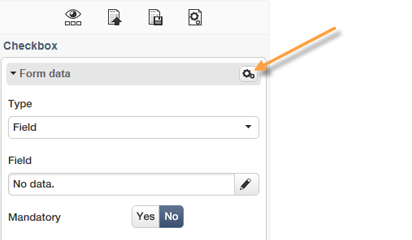

# 콘텐츠 편집{#editing-content}

## 가시성 조건 정의 {#defining-a-visibility-condition}

웹 페이지 요소에 가시성 조건을 지정할 수 있습니다. 이 요소는 조건이 준수되는 경우에만 표시됩니다.

가시성 조건을 추가하려면 블록을 선택하고 **[!UICONTROL Visibility condition]** 표현식 편집기를 사용하는 필드.

>[!NOTE]
>
>고급 표현식 편집은에 표시됩니다. [이 페이지](../../platform/using/defining-filter-conditions.md#list-of-functions).

이러한 조건은 XTK 표현식 구문을 채택합니다(예: **ctx.recipient.@이메일 != &quot;&quot;** 또는 **ctx.recipient.@status==&quot;0&quot;**). 기본적으로 모든 필드가 표시됩니다.

>[!NOTE]
>
>드롭다운 메뉴와 같이 표시되지 않는 동적 블록은 편집할 수 없습니다.

## 테두리 및 배경 추가 {#adding-a-border-and-background}

다음을 추가할 수 있습니다. **테두리** 선택한 블록에 매핑할 수 있습니다. 테두리는 스타일, 크기 및 색상의 세 가지 옵션을 사용하여 정의됩니다.

다음을 정의할 수도 있습니다. **배경색** 색상 차트에서 색상을 선택합니다.

## 양식 편집 {#editing-forms}

### 양식에 대한 데이터 속성 변경 {#changing-the-data-properties-for-a-form}

데이터베이스 필드를 입력 영역, 라디오 버튼 또는 체크박스 유형 블록과 연결할 수 있습니다.

>[!NOTE]
>
>기본 필드는 웹 애플리케이션 스토리지 스키마의 필드입니다.

다음 **필드** 입력 영역을 사용하면 양식 필드에 연결할 데이터베이스 필드를 선택할 수 있습니다.

기본적으로 제공되는 필드는 **nms:recipient** 테이블.

다음 **필수 필드** 옵션을 사용하면 사용자가 필드를 입력한 경우에만 페이지의 승인을 승인할 수 있습니다. 필수 필드를 입력하지 않으면 오류 메시지가 표시됩니다.

라디오 버튼과 확인란의 경우 **추가 구성이 필요합니다.**.

실제로, 사용된 템플릿에 기본적으로 값이 포함되어 있지 않으면 편집기에서 값을 완료해야 합니다.

방법은 다음과 같습니다.

* 다음을 클릭합니다. **[!UICONTROL Edit]** 아이콘.

   

* 선택한 필드에서 정의한 항목별 목록 값을 **[!UICONTROL Value]** 필드.

   

### 양식 필드 수정 {#modifying-form-fields}

라디오 단추, 입력 영역, 드롭다운 목록 등과 같은 양식 필드. 도구 모음에서 수정할 수 있습니다.

이는 다음을 수행할 수 있음을 의미합니다.

* 다음을 사용하여 양식 필드가 포함된 블록 삭제 **[!UICONTROL Delete]** 아이콘.
* 다음을 사용하여 새 블록을 만들어 선택한 필드 복제 **[!UICONTROL Duplicate]** 아이콘.
* 편집 **[!UICONTROL Form data]** 을 사용하여 데이터베이스 필드를 양식 영역에 연결하는 창 **[!UICONTROL Edit]** 아이콘.

   

## 단추에 작업 추가 {#adding-an-action-to-a-button}

사용자가 버튼을 클릭하면 관련 작업을 정의할 수 있습니다. 이렇게 하려면 드롭다운 목록에서 수행할 작업을 선택합니다.

사용 가능한 작업은 다음과 같습니다.

* **[!UICONTROL Refresh]** : 현재 페이지를 새로 고칩니다.
* **[!UICONTROL Next page]** : 웹 애플리케이션에서 다음 페이지에 대한 링크를 만듭니다.
* **[!UICONTROL Previous page]** : 웹 애플리케이션에서 이전 페이지에 대한 링크를 만듭니다.

>[!NOTE]
>
>다음 **[!UICONTROL None]** 값을 사용하면 버튼을 활성화할 수 없습니다.

해당 필드의 단추에 연결된 레이블을 수정할 수 있습니다.

## 링크 추가 {#adding-a-link}

이미지, 단어, 단어 그룹, 텍스트 블록 등의 모든 페이지 요소에 링크를 삽입할 수 있습니다.

이렇게 하려면 요소를 선택한 다음 팝업 메뉴에서 첫 번째 아이콘을 사용합니다.

이 아이콘을 사용하면 사용 가능한 모든 유형의 링크에 액세스할 수 있습니다.

개인화 블록 및 필드는 텍스트 유형 블록에만 삽입할 수 있습니다.

>[!NOTE]
>
>각 링크 유형에 대해 열기 모드를 구성할 수 있습니다. **Target** 드롭다운 목록입니다. 이 값은 **`<target>`** HTML 태그입니다.
>
>사용 가능한 목록 **타겟** 는 다음과 같습니다.
>
>* 기타(IFrame)
>* 위쪽 창(_top)
>* 상위 창(_parent)
>* 새 창(_blank)
>* 현재 창(_self)
>* 기본 브라우저 동작
>

### URL에 연결 {#link-to-a-url}

다음 **외부 URL에 연결** 옵션을 사용하면 소스 콘텐츠에서 모든 URL을 열 수 있습니다.

해당 링크 주소를 **URL** 필드. URL 필드는 다음과 같이 입력해야 합니다. **https://www.myURL.com**.

### 웹 애플리케이션에 대한 링크 {#link-to-a-web-application}

다음 **웹 애플리케이션에 대한 링크** 옵션을 사용하면 Adobe Campaign 웹 애플리케이션에 액세스할 수 있습니다.

해당 필드에서 웹 애플리케이션을 선택합니다.

제안된 웹 응용 프로그램 목록은 **[!UICONTROL Resources > Online > Web Applications]** 노드.

### 작업에 대한 링크 {#link-to-an-action}

다음 **작업을 정의하는 링크** 옵션을 사용하면 소스 요소를 클릭할 때 작업을 구성할 수 있습니다.

>[!NOTE]
>
>사용 가능한 작업은 다음에 자세히 설명되어 있습니다 [단추에 작업 추가](#adding-an-action-to-a-button) 섹션.

### 링크 삭제 {#delete-a-link}

링크가 삽입되면 도구 모음에 두 개의 새 아이콘이 표시됩니다. **링크 편집** 및 **링크 끊기** 을 사용하면 만들어진 링크와 상호 작용할 수 있습니다.

* **[!UICONTROL Edit link]** 링크의 모든 매개 변수가 포함된 창을 표시할 수 있습니다.
* **[!UICONTROL Break the link]** 확인 후 링크 및 모든 관련 매개 변수를 삭제할 수 있습니다.

>[!NOTE]
>
>링크가 삭제되더라도 컨텐츠는 계속 유지됩니다.

## 글꼴 속성 변경 {#changing-font-attributes}

텍스트 요소를 선택하면 글꼴 특성(스타일, 형식)을 수정할 수 있습니다.

사용 가능한 옵션은 다음과 같습니다.

* **글꼴 확대** icon: 선택한 텍스트의 크기를 늘립니다(추가). ``)
* **글꼴 감소** 아이콘: 선택한 텍스트의 크기를 줄입니다(추가). ``)
* **굵게** icon: 선택한 텍스트를 굵게 만듭니다(텍스트를 `<strong> </strong>` 태그)
* **기울임꼴** icon: 선택한 텍스트를 기울임체로 만듭니다(텍스트를 다음으로 감싸기).  `<em> </em>` 태그)
* **밑줄** icon: 선택한 텍스트에 밑줄을 긋습니다(텍스트를 `` 태그)
* **왼쪽 정렬** icon: 선택한 블록의 왼쪽으로 텍스트를 정렬합니다(style=&quot;text-align: left;&quot;).
* **가운데** icon: 선택한 블록의 텍스트를 가운데로 정렬합니다(style=&quot;text-align: center;&quot;).
* **오른쪽 정렬** icon: 선택한 블록의 오른쪽으로 텍스트를 정렬합니다(style=&quot;text-align: right;&quot;).
* **배경색 변경** icon: 선택한 블록의 배경색을 변경할 수 있도록 해줍니다(style=&quot;background-color 추가: rgba(170, 86, 255, 0.87))
* **텍스트 색상 변경** 아이콘: 선택한 블록의 텍스트 색상을 변경하거나 선택한 텍스트만 변경할 수 있습니다(``)

>[!NOTE]
>
>* **삭제** icon: 블록과 해당 콘텐츠를 모두 삭제합니다.
>
>* **복제** icon: 블록과 관련된 모든 스타일을 복제합니다.

## 이미지 및 애니메이션 관리 {#managing-images-and-animations}

디지털 콘텐츠 편집기를 사용하여 다음 작업을 수행할 수 있습니다 **모든 유형의 이미지** 브라우저와 호환됩니다.

>[!CAUTION]
>
>에서 외부 파일을 호출해서는 안 됩니다. **script** HTML 페이지의 태그입니다. 이러한 파일은 Adobe Campaign 서버로 가져오지 않습니다.

### 이미지 추가/삭제/복제 {#adding---deleting---duplicating-an-image}

이미지를 삽입하려면 이미지 유형 블록을 선택하고 **이미지** 아이콘.

로컬에 저장된 이미지 파일을 선택하십시오.

다음 **삭제** 아이콘은 이미지가 포함된 태그를 삭제합니다.

다음 **복제** 아이콘은 태그와 해당 콘텐츠를 복제합니다.

>[!CAUTION]
>
>이미지를 복제하면 새 이미지와 관련된 식별자가 삭제됩니다.

### 이미지 속성 편집 {#editing-image-properties}

이미지가 포함된 블록을 선택하면 다음 속성에 액세스합니다.

* **캡션** 이미지에 연결된 캡션을 정의할 수 있습니다( **alt** HTML 속성).
* **Dimension** 이미지 크기를 픽셀 단위로 지정할 수 있습니다.

   

## 개인화 콘텐츠 추가 {#adding-personalization-content}

### 개인화 필드 삽입 {#inserting-a-personalization-field}

다음 **개인화 필드** 삽입 아이콘 옵션을 사용하면 수신자 이름과 같은 데이터베이스 필드를 콘텐츠에 추가할 수 있습니다. 이 옵션은 텍스트 유형 블록에만 사용할 수 있습니다.

기본적으로 제공되는 필드는 **[!UICONTROL Recipient]** 테이블. 필요한 경우 웹 응용 프로그램 속성을 편집하여 다른 테이블을 선택합니다.

필드 이름이 편집기에 나타나고 노란색으로 강조 표시됩니다. 개인화가 생성되면(예: 랜딩 페이지를 미리 볼 때) 타겟팅된 수신자의 프로필로 대체됩니다.

예는 다음 위치에 나와 있습니다 [개인화 필드 삽입](creating-a-landing-page.md#inserting-a-personalization-field) 섹션.

### 개인화 블록 삽입 {#inserting-a-personalization-block}

다음 **개인화 블록** 옵션을 사용하면 동적이고 개인화된 블록을 콘텐츠에 삽입할 수 있습니다. 예를 들어 로고 또는 인사말 메시지를 추가할 수 있습니다. 텍스트 유형 블록에는 사용할 수 없습니다.

삽입되면 개인화 블록 이름이 편집기에 노란색으로 강조 표시됩니다. 개인화가 생성되면 수신자 프로필에 자동으로 조정됩니다.

기본 제공 개인화 블록 및 사용자 지정 개인화 블록을 정의하는 방법에 대한 자세한 내용은 을 참조하십시오. [이 페이지](../../delivery/using/personalization-blocks.md).
