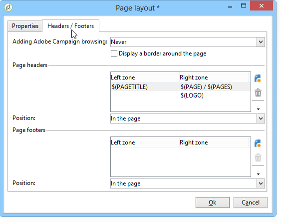

# 양식 렌더링{#form-rendering}

## 양식 렌더링 템플릿 선택 {#selecting-the-form-rendering-template}

양식 설정을 사용하면 페이지 생성에 사용되는 템플릿을 선택할 수 있습니다. 양식에 액세스하려면 양식 세부 사항 도구 모음에서 **[!UICONTROL Settings]** 단추를 클릭하고 **[!UICONTROL Rendering]** 탭을 선택합니다. 기본적으로 사용할 수 있는 템플릿(스타일 시트)은 많이 있습니다.

편집기의 하단 섹션에서는 선택한 템플릿의 렌더링을 볼 수 있습니다.

확대/축소 기능을 사용하면 선택한 템플릿을 편집할 수 있습니다.

이러한 템플릿을 수정하거나 재정의할 수 있습니다. 이렇게 하려면 링크를 클릭하고 정보를 개인화합니다. **[!UICONTROL Page layout...]**

다음 작업을 수행할 수 있습니다.

* 로고로 사용된 이미지를 변경하고 크기를 조정합니다.
* 또한 사용자가 이 렌더링 템플릿을 선택할 때 미리 보기 이미지에 액세스할 경로를 지정합니다.

이 **[!UICONTROL Headers/Footers]** 탭에서는 이 템플릿을 사용하여 각 양식 페이지의 머리글과 바닥글에 표시되는 정보를 변경할 수 있습니다.

및 섹션의 각 **[!UICONTROL Page headers]** 줄은 HTML **[!UICONTROL Page footers]** 페이지의 행에 해당합니다. 아이콘을 **[!UICONTROL Add]** 클릭하여 새 라인을 만듭니다.

기존 줄을 선택하고 **[!UICONTROL Detail]** 버튼을 클릭하여 원하는 대로 변경합니다.

선의 내용을 변경하거나 테두리를 추가하고 관련 탭을 통해 글꼴 속성을 변경할 수 있습니다. 이 변경 사항을 **[!UICONTROL OK]** 확인하려면 을 클릭합니다.

이 **[!UICONTROL Position]** 필드를 사용하면 페이지 머리글과 바닥글의 요소 위치를 정의할 수 있습니다.

>[!NOTE]
>
>렌더링 템플릿은 **[!UICONTROL Administration > Configuration > Form rendering]** 노드에 저장됩니다.\
>자세한 내용은 양식 [렌더링 맞춤화를 참조하십시오](#customizing-form-rendering)

## 양식 렌더링 사용자 정의 {#customizing-form-rendering}

### 요소의 레이아웃 변경 {#changing-the-layout-of-elements}

양식의 각 요소(입력 필드, 이미지, 라디오 단추 등)에 대한 스타일 시트를 오버로드할 수 있습니다.

이렇게 하려면 **[!UICONTROL Advanced]** 탭을 사용하십시오.

다음 속성을 정의할 수 있습니다.

* **[!UICONTROL Label position]**:레이블 [위치](../../web/using/defining-web-forms-layout.md#defining-the-position-of-labels)정의를 참조하십시오.
* **[!UICONTROL Label format]**:줄 바꿈 또는 줄 바꿈 없음,
* **[!UICONTROL Number of cells]** :페이지에 [필드](../../web/using/defining-web-forms-layout.md#positioning-the-fields-on-the-page)배치,
* **[!UICONTROL Horizontal alignment]** (왼쪽, 오른쪽, 가운데) 및 **[!UICONTROL Vertical alignment]** (높음, 낮음, 중간),
* **[!UICONTROL Width]** 영역:백분율 또는 em, 포인트 또는 픽셀(기본값)로 표현될 수 있습니다.
* 최대 **[!UICONTROL Length]**&#x200B;수:허용되는 최대 문자 수(텍스트, 숫자 및 암호 유형 컨트롤의 경우),
* **[!UICONTROL Lines]**:문자 영역에 대한 줄 수, **[!UICONTROL Multi-line text]**
* **[!UICONTROL Style inline]**:를 사용하면 추가 설정을 사용하여 CSS 스타일 시트를 오버로드할 수 있습니다. **이러한 항목은**&#x200B;다음을 사용하여 분리됩니다.아래 예제와 같이 문자가 표시됩니다.

   

### 머리글 및 바닥글 정의 {#defining-headers-and-footers}

필드는 루트의 이름이 페이지와 동일한 트리 구조에서 시퀀스가 지정됩니다. 이름을 수정하려면 선택하십시오.

창의 제목은 양식 속성 창의 **[!UICONTROL Page]** 탭에 입력해야 합니다. 페이지 머리글과 바닥글에 설정된 컨텐츠를 추가할 수도 있습니다(이 정보는 모든 페이지에 표시됩니다). 이 컨텐츠는 아래와 같이 **[!UICONTROL Texts]** 탭의 일치하는 섹션에 입력됩니다.

### HTML 헤더에 요소 추가 {#adding-elements-to-html-header}

양식 페이지의 HTML 헤더에 삽입할 추가 요소를 입력할 수 있습니다. 이렇게 하려면 관련 페이지의 **[!UICONTROL Header]** 탭에 요소를 입력합니다.

이렇게 하면 페이지의 제목 표시줄에 표시되는 아이콘을 참조할 수 있습니다.

## 컨트롤 설정 정의 {#defining-control-settings}

사용자가 양식을 채울 때 형식이나 구성에 따라 특정 필드에서 검사가 자동으로 수행됩니다. 이렇게 하면 특정 필드를 필수로 만들거나(필수 필드 [정의 참조](#defining-mandatory-fields)) 입력한 데이터의 형식을 확인할 수 있습니다(데이터 형식 [확인 참조](#checking-data-format)). 확인 작업은 페이지 승인 중에 수행됩니다(출력 전환을 가능하게 하는 링크나 단추 클릭).

### 필수 필드 정의 {#defining-mandatory-fields}

특정 필드를 필수로 만들려면 필드를 만들 때 이 옵션을 선택합니다.

사용자가 필드를 입력하지 않고 이 페이지를 승인하면 다음 메시지가 표시됩니다.

이 메시지는 **[!UICONTROL Personalize this message]** 링크를 클릭하여 개인화할 수 있습니다.

사용자가 필드를 입력하지 않고 이 페이지를 승인하면 다음 메시지가 표시됩니다.

### 데이터 형식 확인 {#checking-data-format}

데이터베이스의 기존 필드에 값이 저장되어 있는 양식 확인을 위해 저장소 필드에 대한 규칙이 적용됩니다.

값이 변수에 저장되어 있는 양식을 확인하는 경우 승인 규칙은 변수의 형식에 따라 다릅니다.

예를 들어, 아래와 같이 클라이언트 번호를 저장할 **[!UICONTROL Number]** 검사를 만드는 경우:

양식 필드에 정수를 입력해야 합니다.

## 조건부 표시 필드 정의 {#defining-fields-conditional-display}

사용자가 선택한 값을 기준으로 표시할 페이지의 필드 표시를 구성할 수 있습니다. 이는 하나의 필드 또는 필드 그룹에 적용할 수 있습니다(컨테이너로 그룹화할 때).

페이지의 각 요소에 대해 **[!UICONTROL Visibility]** 섹션을 사용하여 표시 조건을 정의할 수 있습니다.

조건은 데이터베이스 필드 또는 변수의 값에 영향을 줄 수 있습니다.

필드 선택 창에서 다음 데이터 중에서 선택할 수 있습니다.

* 기본 트리에는 양식 컨텍스트의 매개 변수가 포함되어 있습니다. 기본 매개 변수는 받는 사람의 암호화된 식별자와 일치하는 식별자, 언어 및 원본입니다.

   자세한 내용은 이 [페이지를](../../web/using/defining-web-forms-properties.md#form-url-parameters)참조하십시오.

* 하위 **[!UICONTROL Recipients]** 트리에는 양식에 삽입된 입력 필드가 들어 있으며 데이터베이스에 저장됩니다.

   자세한 내용은 데이터베이스에 [데이터 저장을 참조하십시오](../../web/using/web-forms-answers.md#storing-data-in-the-database).

* 하위 **[!UICONTROL Variables]** 트리에는 이 양식에 사용할 수 있는 변수가 포함되어 있습니다. 자세한 내용은 로컬 변수에 [데이터 저장을 참조하십시오](../../web/using/web-forms-answers.md#storing-data-in-a-local-variable).

자세한 내용은 다음 사용 사례를 참조하십시오.선택한 [값에](../../web/using/use-cases--web-forms.md#displaying-different-options-depending-on-the-selected-values)따라 다른 옵션을 표시합니다.

또한 **[!UICONTROL Test]** 객체를 사용하여 양식 페이지의 표시를 조건화할 수 있습니다. 자세한 내용은 이 [페이지를](../../web/using/defining-web-forms-page-sequencing.md#conditional-page-display)참조하십시오.

## 기존 양식에서 요소 가져오기 {#importing-elements-from-an-existing-form}

다른 웹 양식에서 필드 또는 컨테이너를 가져올 수 있습니다. 주소 블록, 뉴스레터 구독 영역 등과 같이 양식에 삽입되는 재사용 가능한 블록 라이브러리를 만들 수 있습니다.

요소를 양식으로 가져오려면 다음 단계를 적용합니다.

1. 하나 이상의 요소를 삽입할 페이지를 편집한 다음 도구 모음에서 을 클릭합니다. **[!UICONTROL Import an existing block]**

   

1. 가져올 필드가 포함된 웹 양식을 선택하고 가져올 컨테이너 및 필드를 선택합니다.

   

   >[!NOTE]
   >
   >소스 양식 이름 오른쪽에 있는 **[!UICONTROL Edit link]** 아이콘을 사용하여 선택한 웹 양식을 볼 수 있습니다.

1. 을 **[!UICONTROL Ok]** 클릭하여 삽입을 확인합니다.

   

