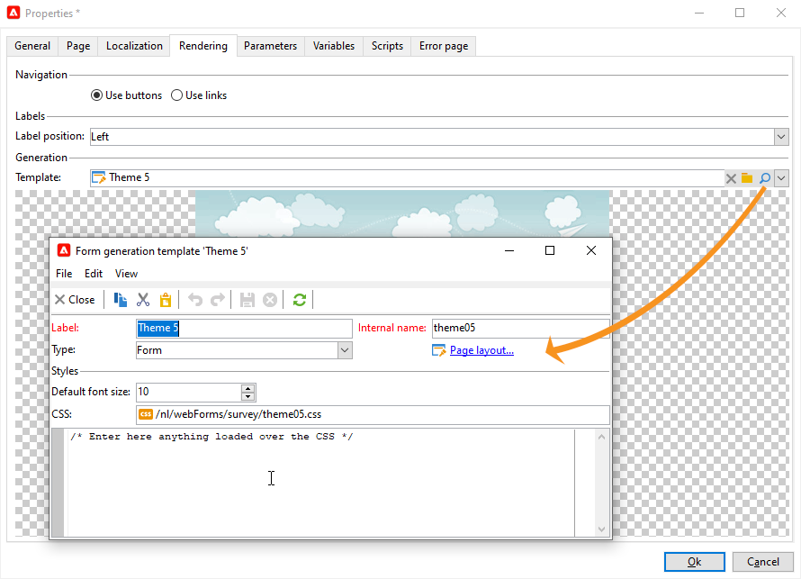
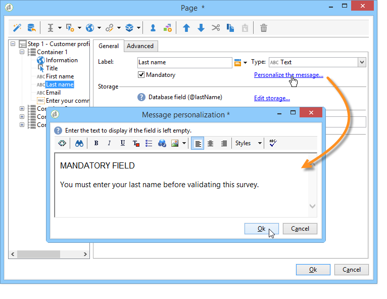

# 양식 렌더링{#form-rendering}

## 양식 렌더링 템플릿 선택 {#selecting-the-form-rendering-template}

양식 설정을 사용하여 페이지를 생성하는 데 사용되는 템플릿을 선택할 수 있습니다. 액세스하려면 다음을 클릭하십시오. **[!UICONTROL Properties]** 양식 세부 정보 도구 모음의 단추를 클릭하고 **[!UICONTROL Rendering]** 탭. 기본적으로 사용할 수 있는 템플릿(스타일 시트)이 여러 개 있습니다.

편집기의 맨 아래 섹션에서 선택한 템플릿의 렌더링을 볼 수 있습니다.

확대/축소 기능을 사용하여 선택한 템플릿을 편집할 수 있습니다.

이러한 템플릿을 수정하거나 재정의할 수 있습니다. 이렇게 하려면 **[!UICONTROL Page layout...]** 정보를 연결하고 개인화합니다.

다음을 수행할 수 있습니다.

* 로고로 사용되는 이미지를 변경하고 크기를 조정합니다.
* 또한 사용자가 이 렌더링 템플릿을 선택할 때 미리 보기 이미지에 액세스할 수 있는 경로도 지정합니다.

다음 **[!UICONTROL Headers/Footers]** 탭에서는 이 템플릿을 사용하여 각 양식 페이지의 머리글과 바닥글에 표시되는 정보를 변경할 수 있습니다.

의 각 줄 **[!UICONTROL Page headers]** 및 **[!UICONTROL Page footers]** 섹션은 HTML 페이지의 라인에 해당합니다. 클릭 **[!UICONTROL Add]** 새 줄을 만듭니다.

기존 줄을 선택하고 **[!UICONTROL Detail]** 버튼을 클릭하여 개인화합니다.

관련 탭을 통해 선의 내용을 변경하고, 테두리를 추가하고, 글꼴 속성을 변경할 수 있습니다. 클릭 **[!UICONTROL OK]** 변경 사항을 확인합니다.

다음 **[!UICONTROL Position]** 필드를 사용하면 페이지 머리글과 바닥글에서 요소의 위치를 정의할 수 있습니다.

>[!NOTE]
>
>렌더링 템플릿은에 저장됩니다 **[!UICONTROL Administration > Configuration > Form rendering]** 노드.\
>자세한 내용은 다음을 참조하십시오. [양식 렌더링 사용자 지정](#customizing-form-rendering)

## 양식 렌더링 사용자 지정 {#customizing-form-rendering}

### 요소의 레이아웃 변경 {#changing-the-layout-of-elements}

양식의 각 요소(입력 필드, 이미지, 라디오 버튼 등)에 대해 스타일시트를 오버로드할 수 있습니다.

이렇게 하려면 **[!UICONTROL Advanced]** 탭.

이를 통해 다음 속성을 정의할 수 있습니다.

* **[!UICONTROL Label position]**: 참조 [레이블의 위치 정의](defining-web-forms-layout.md#defining-the-position-of-labels),
* **[!UICONTROL Label format]**: 자동 줄 바꿈 또는 자동 줄 바꿈 안 함,
* **[!UICONTROL Number of cells]** : 참조 [페이지에서 필드 위치 지정](defining-web-forms-layout.md#positioning-the-fields-on-the-page),
* **[!UICONTROL Horizontal alignment]** (왼쪽, 오른쪽, 가운데) 및 **[!UICONTROL Vertical alignment]** (높음, 낮음, 중간),
* **[!UICONTROL Width]** 영역: 백분율로 나타내거나 ems, 포인트 또는 픽셀(기본값),
* 최대 **[!UICONTROL Length]**: 텍스트, 숫자 및 암호 유형 컨트롤의 경우 허용되는 최대 문자 수,
* **[!UICONTROL Lines]**: 의 라인 수 **[!UICONTROL Multi-line text]** 유형 영역,
* **[!UICONTROL Style inline]**: 추가 설정으로 CSS 스타일 시트를 오버로드할 수 있습니다. 다음을 사용하여 구분됩니다. **;** 아래 예와 같은 문자:

   

### 머리글 및 바닥글 정의 {#defining-headers-and-footers}

필드는 루트가 페이지와 같은 이름을 갖는 트리 구조에서 시퀀싱됩니다. 이름을 수정하려면 해당 이름을 선택합니다.

창의 제목은 **[!UICONTROL Page]** 양식 속성 창의 탭입니다. 설정된 콘텐츠를 페이지 머리글과 바닥글에 추가할 수도 있습니다(이 정보는 모든 페이지에 표시됨). 이 콘텐츠는 의 일치 섹션에 입력됩니다. **[!UICONTROL Texts]** 아래 표시된 대로 탭:

### HTML 헤더에 요소 추가 {#adding-elements-to-html-header}

양식 페이지의 HTML 헤더에 삽입할 추가 요소를 입력할 수 있습니다. 이렇게 하려면 **[!UICONTROL Header]** 관련 페이지의 탭입니다.

예를 들어 페이지의 제목 표시줄에 표시할 아이콘을 참조할 수 있습니다.

## 컨트롤 설정 정의 {#defining-control-settings}

사용자가 양식을 채울 때 형식 또는 구성에 따라 특정 필드에 대한 확인이 자동으로 수행됩니다. 이를 통해 특정 필드를 필수 항목으로 지정할 수 있습니다( 참조). [필수 필드 정의](#defining-mandatory-fields)) 또는 입력한 데이터의 형식을 확인합니다( 참조). [데이터 형식 확인](#checking-data-format)). 페이지 승인 중에(출력 전환을 활성화하는 링크 또는 버튼 클릭) 확인이 수행됩니다.

### 필수 필드 정의 {#defining-mandatory-fields}

특정 필드를 필수 항목으로 만들려면 필드를 만들 때 이 옵션을 선택합니다.

사용자가 필드에 입력하지 않고 이 페이지를 승인하면 다음 메시지가 표시됩니다.

다음을 클릭하여 이 메시지를 개인화할 수 있습니다. **[!UICONTROL Personalize this message]** 링크를 클릭합니다.

사용자가 필드에 입력하지 않고 이 페이지를 승인하면 다음 메시지가 표시됩니다.

### 데이터 형식 확인 {#checking-data-format}

값이 데이터베이스의 기존 필드에 저장된 양식 검사의 경우 저장소 필드에 대한 규칙이 적용됩니다.

값이 변수에 저장된 양식 검사의 경우 승인 규칙은 변수의 형식에 따라 다릅니다.

예를 들어 **[!UICONTROL Number]** 아래 표시된 대로 클라이언트 번호를 저장하려면 선택합니다.

양식 필드에 정수를 입력해야 합니다.

## 조건부 표시 필드 정의 {#defining-fields-conditional-display}

사용자가 선택한 값에 따라 페이지에 표시되는 필드를 구성할 수 있습니다. 한 필드 또는 필드 그룹(컨테이너로 그룹화된 경우)에 적용할 수 있습니다.

페이지의 각 요소에 대해 **[!UICONTROL Visibility]** 섹션 을 사용하면 표시 조건을 정의할 수 있습니다.

조건은 데이터베이스 필드 또는 변수의 값과 관련이 있을 수 있습니다.

필드 선택 창에서 다음 데이터 중에서 선택할 수 있습니다.

* 기본 트리에는 양식 컨텍스트의 매개 변수가 포함되어 있습니다. 기본 매개 변수는 식별자(수신자의 암호화된 식별자와 일치), 언어 및 원본입니다.

   자세한 정보는 이 [페이지](defining-web-forms-properties.md#form-url-parameters)를 참조하십시오.

* 다음 **[!UICONTROL Recipients]** 하위 트리에는 양식에 삽입되어 데이터베이스에 저장된 입력 필드가 포함됩니다.

   자세한 내용은 다음을 참조하십시오. [데이터베이스에 데이터 저장](web-forms-answers.md#storing-data-in-the-database).

* 다음 **[!UICONTROL Variables]** 하위 트리에는 이 양식에 사용할 수 있는 변수가 포함되어 있습니다. 자세한 내용은 다음을 참조하십시오. [로컬 변수에 데이터 저장](web-forms-answers.md#storing-data-in-a-local-variable).

자세한 내용은 여기에서 사용 사례를 참조하십시오. [선택한 값에 따라 다른 옵션 표시](use-cases--web-forms.md#displaying-different-options-depending-on-the-selected-values).

다음을 사용하여 양식 페이지 표시 조건을 지정할 수도 있습니다. **[!UICONTROL Test]** 개체. 자세한 정보는 이 [페이지](defining-web-forms-page-sequencing.md#conditional-page-display)를 참조하십시오.

## 기존 양식에서 요소 가져오기 {#importing-elements-from-an-existing-form}

다른 웹 양식에서 필드 또는 컨테이너를 가져올 수 있습니다. 이렇게 하면 주소 블록, 뉴스레터 구독 영역 등과 같은 양식에 삽입할 재사용 가능한 블록의 라이브러리를 만들 수 있습니다.

요소를 양식으로 가져오려면 다음 단계를 적용합니다.

1. 하나 이상의 요소를 삽입할 페이지를 편집한 다음 **[!UICONTROL Import an existing block]** 을 클릭합니다.

   

1. 가져올 필드가 포함된 웹 양식을 선택하고 가져올 컨테이너 및 필드를 선택합니다.

   

   >[!NOTE]
   >
   >다음 **[!UICONTROL Edit link]** 소스 양식 이름 오른쪽에 있는 아이콘을 사용하면 선택한 웹 양식을 볼 수 있습니다.

1. 클릭 **[!UICONTROL Ok]** 삽입을 확인합니다.

   
