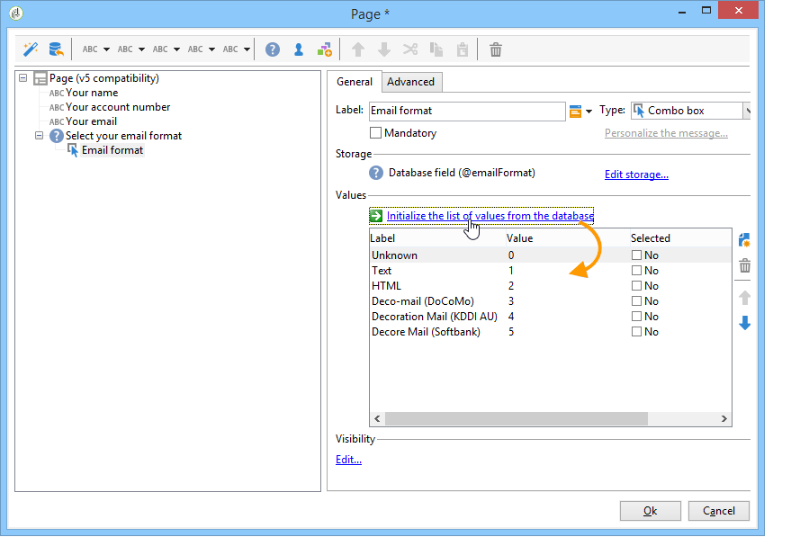

# 설문 조사를 만드는 주요 단계{#getting-started-with-surveys}

다음은 간단한 설문 조사를 만들기 위한 기본 단계에 대한 간단한 개요입니다.

다음 단계는 다음과 같습니다.

1. [1단계 - 설문 조사](#step-1---creating-a-survey)만들기,
1. [2단계 - 템플릿](#step-2---selecting-the-template)선택,
1. [3단계 - 설문 조사](#step-3---building-the-survey)작성,
1. [4단계 - 페이지 컨텐츠](#step-4---creating-the-page-content)만들기,
1. [5단계 - 설문 조사 데이터](#step-5---storing-the-survey-data-)저장,
1. [6단계 - 페이지](#step-6---publishing-the-pages)게시,
1. [7단계 - 온라인 설문 조사](#step-7---sharing-your-online-survey)공유

## 1단계 - 설문 조사 만들기 {#step-1---creating-a-survey}

새 설문 조사를 만들려면 **[!UICONTROL Campaigns]** 또는 **[!UICONTROL Profiles and targets]** 탭으로 이동한 후 **[!UICONTROL Web Applications]** 메뉴를 클릭합니다. 양식 목록 **[!UICONTROL Create]** 위의 단추를 클릭합니다.

## 2단계 - 템플릿 선택 {#step-2---selecting-the-template}

설문 조사 템플릿을 선택한 다음 설문 조사 이름을 지정합니다. 이 이름은 최종 사용자가 볼 수 없지만 Adobe Campaign 내에서 설문 조사를 식별할 수 있습니다. 웹 응용 프로그램 목록 **[!UICONTROL Save]** 에 설문 조사를 추가하려면 클릭하십시오.

## 3단계 - 설문 조사 작성 {#step-3---building-the-survey}

설문 조사는 다음 요소가 위치한 다이어그램으로 만들어집니다.컨텐츠를 만들 페이지, 데이터 미리 로드 및 저장 단계 및 테스트 단계 스크립트와 쿼리를 삽입할 수도 있습니다.

차트를 만들려면 설문 조사의 **[!UICONTROL Edit]** 양식을 클릭합니다.

설문 조사에는 다음 세 **개 이상의** 구성 요소가 포함되어야 합니다.페이지, 저장소 상자 및 끝 페이지.

* 페이지를 만들려면 편집기의 왼쪽 섹션에서 **[!UICONTROL Page]** 개체를 선택하고 아래 표시된 대로 가운데 섹션에 배치합니다.

   

* 그런 다음 개체를 **[!UICONTROL Storage]** 선택하고 페이지의 출력 전환 위에 놓습니다.
* 마지막으로 개체를 선택하고 저장소 상자의 출력 전환 끝에 **[!UICONTROL End]** 배치하여 다음 다이어그램을 얻습니다.

   

## 4단계 - 페이지 컨텐츠 만들기 {#step-4---creating-the-page-content}

다음 예제에서는 **[!UICONTROL Page (v5 compatibility)]** 문자 페이지를 사용합니다. 이 유형의 페이지는 **[!UICONTROL Edit]** 탭의 고급 메뉴를 통해 액세스합니다.

* 입력 필드 추가

   페이지의 컨텐츠를 만들려면 다음을 편집해야 합니다.이렇게 하려면 개체를 두 번 **[!UICONTROL Page]** 클릭합니다. 도구 모음에서 첫 번째 아이콘을 클릭하여 필드 만들기 마법사를 엽니다. 받는 사람 프로필의 일치하는 필드에 저장할 사용자 이름에 대한 입력 필드를 만들려면 을 선택합니다 **[!UICONTROL Edit a recipient]**.

   

   이 **[!UICONTROL Next]** 단추를 클릭하여 데이터베이스의 데이터 저장 필드를 선택합니다. 이 경우 &#39;성&#39; 필드

   

   필드 **[!UICONTROL Finish]** 를 만들려면 을 클릭합니다.

   기본적으로 정보가 데이터베이스에 이미 존재하는 필드에 저장되어 있는 경우 필드는 선택한 필드의 이름(예:이 예제의 &#39;성&#39;입니다. 아래에 표시된 대로 이 레이블을 수정할 수 있습니다.

   

   이제 사용자 계정 번호에 대한 입력 필드를 만듭니다. 작업을 반복하고 &#39;계정 번호&#39;를 선택합니다. 필드.

   동일한 절차를 적용하여 사용자가 이메일 주소를 입력할 수 있는 필드를 추가합니다.

* 질문을 만들려면 트리에서 마지막 요소를 마우스 오른쪽 단추로 클릭하고 **[!UICONTROL Containers > Question]** , 을 선택하거나 **[!UICONTROL Containers]** 아이콘을 클릭하고 선택합니다 **[!UICONTROL Question]**.

   

   질문 레이블을 입력하고 질문 하위 분기로 대답 필드를 삽입합니다. 이렇게 하려면 대답 필드를 만들 때 질문에 연결된 노드를 선택해야 합니다. 아래 **[!UICONTROL drop-down listx]** 와 같이 아이콘을 사용하거나 마우스 오른쪽 단추를 클릭하여 **[!UICONTROL Selection controls]** 추가합니다.

   

   저장소 공간 선택:값을 자동으로 검색하려면 열거형 필드를 선택합니다(이 경우에는 이메일 형식).

   

   탭에서 다음 **[!UICONTROL General]** **[!UICONTROL Initialize the list of values from the database]** 링크를 클릭합니다.값 테이블이 자동으로 입력됩니다.

   

   을 **[!UICONTROL OK]** 클릭하여 편집기를 닫고 변경 사항 **[!UICONTROL Save]** 을 저장합니다.

   >[!NOTE]
   >
   >각 필드 또는 질문에 대해 **[!UICONTROL Advanced]** 탭의 옵션 덕분에 페이지 레이아웃을 사용자의 요구 사항에 맞게 조정할 수 있습니다. 설문 조사 화면의 레이아웃은 [이 섹션에 자세히 설명되어 있습니다](../../web/using/about-web-forms.md).

   세부 사항 화면에서 탭을 클릭하여 방금 만든 설문 조사 렌더링을 확인합니다. **[!UICONTROL Preview]**

   

## 5단계 - 설문 조사 데이터 저장 {#step-5---storing-the-survey-data-}

저장소 상자를 사용하면 데이터베이스에 사용자 응답을 저장할 수 있습니다. 데이터베이스에 이미 있는 프로파일을 식별하려면 조정 키를 선택해야 합니다.

이렇게 하려면 상자를 편집하고 데이터를 저장할 때 조정 키로 사용할 필드를 선택합니다.

아래 예제에서 저장(확인)이 수행되는 경우, 프로필이 양식에 입력한 것과 동일한 계정 번호를 가진 데이터베이스에 저장된 경우 프로필이 업데이트됩니다. 프로필이 없으면 만들어집니다.

클릭하여 확인 **[!UICONTROL OK]** 을 한 다음 을 클릭하여 설문 조사 **[!UICONTROL Save]** 를 저장합니다

## 6단계 - 페이지 게시 {#step-6---publishing-the-pages}

사용자가 HTML 페이지에 액세스할 수 있도록 하려면 애플리케이션을 사용할 수 있어야 합니다. 편집 단계가 아닌 제작 단계여야 합니다. 프로덕션에 설문 조사를 게시하려면 게시해야 합니다. 방법은 다음과 같습니다.

* 설문 조사 대시보드 위에 있는 **[!UICONTROL Publish]** 단추를 클릭합니다.
* 발행물을 실행하고 마법사 **[!UICONTROL Start]** 를 닫으려면 을 클릭합니다.

   

   설문 조사 상태가 다음과 같이 변경됩니다. **온라인**.

   

## 7단계 - 온라인 설문 조사 공유 {#step-7---sharing-your-online-survey}

프로덕션에서 설문 조사는 서버에서 액세스할 수 있으며 제공할 수 있습니다. 설문 조사에 액세스하기 위한 URL이 대시보드에 표시됩니다.

설문 조사를 제공하기 위해 대상 모집단에 대한 액세스 링크가 포함된 메시지를 보내거나 설문 조사 액세스 URL을 웹 페이지에 배치할 수 있습니다.

그런 다음 보고서 및 로그를 통해 사용자 응답을 모니터링할 수 있습니다. 응답 [추적을 참조하십시오](../../web/using/publish--track-and-use-collected-data.md#response-tracking).

>[!CAUTION]
>
>공개 URL에는 설문 조사의 내부 이름이 포함됩니다. 내부 이름이 수정되면 URL이 자동으로 업데이트됩니다.설문 조사에 대한 모든 링크도 업데이트해야 합니다.
>
>양식에 대한 링크가 포함된 배달이 이미 전송된 경우 이 링크는 더 이상 작동하지 않습니다.

