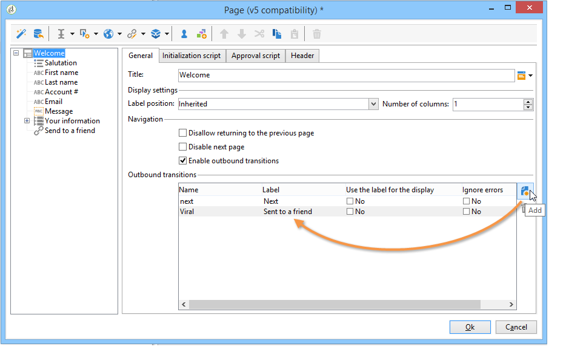
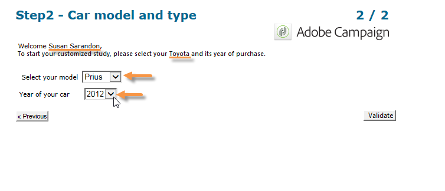

# 웹 양식의 정적 요소{#static-elements-in-a-web-form}

사용자가 양식의 페이지에 상호 작용이 없는 요소를 포함할 수 있습니다.이미지, HTML 컨텐츠, 가로 막대 또는 하이퍼텍스트 링크와 같은 정적 요소입니다. 이러한 요소는 **[!UICONTROL Add static element]** 메뉴를 클릭하여 도구 모음의 첫 번째 단추를 통해 만들어집니다.


다음 유형의 필드를 사용할 수 있습니다.

* 이전에 제공된 답변(양식의 컨텍스트)을 기반으로 하거나 데이터베이스를 기반으로 하는 값입니다.
* 하이퍼링크, HTML, 가로 막대 HTML [컨텐츠](#inserting-html-content)삽입을 참조하십시오.
* 리소스 라이브러리 또는 사용자가 액세스할 수 있는 서버에 저장된 이미지입니다. 이미지 [삽입을](#inserting-images)참조하십시오.
* 클라이언트측 및/또는 서버측에서 실행되는 스크립트 JavaScript로 작성되어야 하며 클라이언트 측에서 올바른 실행을 보장하려면 대부분의 브라우저와 호환되어야 합니다.

   >[!NOTE]
   >
   >서버측에서 스크립트는 Campaign JSAPI 설명서에 [정의된 함수를 사용할 수](http://docs.campaign.adobe.com/doc/AC/en/jsapi/index.html)있습니다.

## HTML 컨텐츠 삽입 {#inserting-html-content}

양식 페이지에 HTML 컨텐츠를 포함할 수 있습니다.하이퍼텍스트 링크, 이미지, 서식이 지정된 단락, 비디오 또는 Flash 개체 등

HTML 편집기를 사용하면 양식 페이지에 삽입할 컨텐츠를 입력할 수 있습니다. 편집기를 열려면 로 **[!UICONTROL Static elements>HTML]** 이동합니다.

컨텐츠를 직접 입력하고 포맷하거나 소스 코드 창을 표시하여 일부 외부 컨텐츠에 붙여넣을 수 있습니다. &quot;소스 코드&quot; 모드로 전환하려면 도구 모음에서 첫 번째 아이콘을 클릭합니다.


데이터베이스 필드를 삽입하려면 개인화 단추를 사용합니다.


>[!NOTE]
>
>HTML 편집기에서 입력한 문자열은 **[!UICONTROL Texts]** 하위 탭에 정의된 경우에만 변환됩니다. 그렇지 않으면 수집되지 않습니다. 자세한 내용은 웹 [양식](../../web/using/translating-a-web-form.md)번역을 참조하십시오.

### 링크 삽입 {#inserting-a-link}

다음 예와 같이 편집 창의 필드를 채웁니다.

하이퍼텍스트 링크를 추가하려면 로 **[!UICONTROL Static elements>Link]**&#x200B;이동합니다.


* 양식 **[!UICONTROL Label]** 페이지에 표시될 하이퍼텍스트 링크의 컨텐츠입니다.
* 는 **[!UICONTROL URL]** 원하는 주소(예:https://www.adobe.com [웹](https://www.adobe.com) 사이트 또는 [mailto:info@adobe.com](mailto:info@adobe.com) 메시지 보내기
* 이 **[!UICONTROL Window]** 필드를 사용하면 사이트의 경우 링크에 대한 표시 모드를 선택할 수 있습니다. 링크를 새 창, 현재 창 또는 다른 창에서 열도록 결정할 수 있습니다.
* 아래와 같이 도구 설명을 추가할 수 있습니다.

   

* 링크를 단추 또는 이미지로 표시하도록 선택할 수 있습니다. 이렇게 하려면 **[!UICONTROL Type]** 필드에서 표시 유형을 선택합니다.

### 링크 유형 {#types-of-links}

기본적으로 링크는 URL 유형 동작과 연결되어 있으므로 링크 대상 주소를 URL 필드에 입력할 수 있습니다.


사용자가 링크를 클릭하여 다음을 수행할 수 있도록 링크에 대한 다른 작업을 정의할 수 있습니다.

* 페이지 새로 고침

   이렇게 하려면 **[!UICONTROL Refresh page]** **[!UICONTROL Action]** 필드의 드롭다운 상자에서 옵션을 선택합니다.

   

* 다음/이전 페이지 표시

   이렇게 하려면 **[!UICONTROL Next page]** 필드의 드롭다운 상자에서 또는 **[!UICONTROL Previous page]** **[!UICONTROL Action]** 옵션을 선택합니다.

   

   링크로 대체하려는 경우 **[!UICONTROL Next]** 및/또는 **[!UICONTROL Back]** 단추를 숨길 수 있습니다. 이 [페이지를](../../web/using/defining-web-forms-page-sequencing.md)참조하십시오.

   이 링크는 기본적으로 사용되는 **[!UICONTROL Next]** 단추를 대체합니다.

   

* 다른 페이지 표시

   이 **[!UICONTROL Enable a transition]** 옵션을 사용하면 **[!UICONTROL Transition]** 필드에서 선택한 나가는 전환과 연관된 특정 페이지를 표시할 수 있습니다.

   

   기본적으로 페이지에는 출력 전환이 하나만 있습니다. 새 전환을 만들려면 페이지를 선택한 다음 아래 표시된 대로 **[!UICONTROL Add]** **[!UICONTROL Output transitions]** 섹션에서 버튼을 클릭합니다.

   

   다이어그램에서 이 추가는 다음과 같습니다.

   

   >[!NOTE]
   >
   >웹 양식의 페이지 시퀀스에 대한 자세한 내용은 웹 양식 [페이지 순서](../../web/using/defining-web-forms-page-sequencing.md)정의를 참조하십시오.

* Facebook 프로필에서 가져온 데이터로 양식 필드 미리 로드

   >[!CAUTION]
   >
   >이 함수는 응용 프로그램을 설치한 경우에만 사용할 수 **[!UICONTROL Social Marketing]** 있습니다. 이 옵션을 사용하려면 **[!UICONTROL Facebook Connect]** 유형 외부 계정과 함께 Facebook 애플리케이션을 만들어야 합니다. For more on this, refer to [this page](../../social/using/creating-a-facebook-application.md#configuring-external-accounts).

   이 **[!UICONTROL Preload with Facebook]** 옵션을 사용하면 Facebook 프로필 정보를 사용하여 필드를 미리 로드하는 단추를 양식에 삽입할 수 있습니다.

   

   사용자가 **[!UICONTROL Fill in automatically]** 단추를 클릭하면 Facebook 권한 요청 창이 열립니다.

   

   >[!NOTE]
   >
   >외부 계정을 구성할 때 확장 권한 목록을 변경할 수 있습니다. 확장 권한을 입력하지 않으면 Facebook은 기본적으로 기본 프로필 정보를 전달합니다.\
   >확장 권한 목록과 해당 구문을 보려면 다음을 클릭하십시오. [https://developers.facebook.com/docs/reference/api/permissions/](https://developers.facebook.com/docs/reference/api/permissions/)

   사용자가 정보를 공유하기로 동의하면 양식 필드가 미리 로드됩니다.

   

이 사용 사례에서는 다음 요소로 구성된 웹 응용 프로그램을 만들었습니다.

* 양식이 들어 있는 페이지
* 활동 **[!UICONTROL Record]** 활동
* 활동 **[!UICONTROL End]** 활동


미리 로드 단추를 추가하려면 다음 단계를 적용합니다.

1. 양식을 만듭니다.

   

1. 양식의 필드와 동일한 수준으로 이동한 다음 링크를 추가합니다.

   

1. 레이블을 입력하고 **[!UICONTROL Button]** 유형을 선택합니다.

   

1. 필드로 이동하여 **[!UICONTROL Action]** 선택합니다 **[!UICONTROL Preload with Facebook]**.

   

1. 필드로 이동하여 이전에 만든 **[!UICONTROL Application]** **[!UICONTROL Facebook Connect]** 외부 계정 유형을 선택합니다. For more on this, refer to [this page](../../social/using/creating-a-facebook-application.md#configuring-external-accounts).

   

### HTML 컨텐츠 개인화 {#personalizing-html-content}

이전 페이지에 기록된 데이터로 양식 페이지의 HTML 콘텐츠를 개인화할 수 있습니다. 예를 들어 자동차 보험 웹 양식을 만들 수 있습니다. 이 웹 양식을 통해 연락처 정보와 자동차 브랜드를 제공할 수 있습니다.


개인화 필드를 사용하여 사용자 이름과 선택한 브랜드를 다음 페이지에 다시 삽입합니다. 사용할 구문은 정보 저장소 모드에 따라 다릅니다. 자세한 내용은 수집된 정보 [사용을 참조하십시오](../../web/using/web-forms-answers.md#using-collected-information).

>[!NOTE]
>
>보안상의 이유로 수식에 입력한 값이 이스케이프 문자로 대체됩니다. **`<%=`** 이 문제를 방지하고 필요한 경우에만 다음 구문을 사용하십시오. **`<%=`** Adobe

이 예에서는 받는 사람의 이름과 성이 데이터베이스의 필드에 저장되고 자동차 브랜드가 변수에 저장됩니다. 2페이지에 개인화된 메시지의 구문은 다음과 같습니다.


```
<P>Welcome <%= ctx.recipient.@firstName %> <%= ctx.recipient.@lastName %>,</P>
<P>To start your customized study, please select your car <%=ctx.vars.marque%> and its year of purchase.</P>
```

이렇게 하면 다음과 같은 결과가 생성됩니다.



### 텍스트 변수 사용 {#using-text-variables}

이 **[!UICONTROL Text]** 탭에서는 다음 구문을 사용하여 &lt;%= 및 %> 문자 사이에 HTML에서 사용할 수 있는 변수 필드를 만들 수 있습니다. **$(식별자)**.

이 방법을 사용하여 문자열을 쉽게 현지화할 수 있습니다. 웹 [양식 번역 참조](../../web/using/translating-a-web-form.md)

예를 들어 HTML 컨텐츠에 &quot; **마지막 연락처** 날짜&quot; 문자열을 표시할 수 있는 연락처 필드를 만들 수 있습니다. 이렇게 하려면 아래 절차를 따르십시오.

1. HTML 텍스트의 **[!UICONTROL Text]** 탭을 클릭합니다.
1. 아이콘을 **[!UICONTROL Add]** 클릭합니다.
1. 열에 변수 이름을 **[!UICONTROL Identifier]** 입력합니다
1. 열에 기본값을 **[!UICONTROL Text]** 입력합니다.

   

1. HTML 콘텐츠에서 **&lt;%= $(연락처) %>** 구문을 통해 이 텍스트 변수를 삽입합니다.

   

   >[!CAUTION]
   >
   >HTML 편집기에 이러한 문자를 입력하면 **&lt;** 및 **>** 필드가 이스케이프 문자로 대체됩니다. 이 경우 HTML 텍스트 편집기의 **[!UICONTROL Display source code]** 아이콘을 클릭하여 소스 코드를 수정해야 합니다.

1. 양식의 **[!UICONTROL Preview]** 레이블을 열어 HTML에 입력한 값을 봅니다.

   

이 운영 모드를 사용하면 웹 양식의 텍스트를 계승하고 통합 번역 도구를 사용하여 번역을 관리할 수 있습니다. 자세한 내용은 웹 [양식](../../web/using/translating-a-web-form.md)번역을 참조하십시오.

## 이미지 삽입 {#inserting-images}

양식에 포함할 이미지를 외부에서 액세스할 수 있는 서버에 저장해야 합니다.

메뉴를 **[!UICONTROL Static elements>Image]** 선택합니다.

삽입할 이미지의 소스를 선택합니다.공용 리소스 라이브러리에서 가져오거나 외부에서 액세스할 수 있는 외부 서버에 저장할 수 있습니다.


라이브러리의 이미지인 경우 필드의 콤보 상자에서 선택합니다.외부 파일에 있으면 액세스 경로를 입력합니다. 이미지 위에 커서를 놓거나(HTML의 대체 필드와 일치) 이미지가 표시되지 않을 때 레이블이 표시됩니다.

이미지는 편집기의 중앙 섹션에서 볼 수 있습니다.
