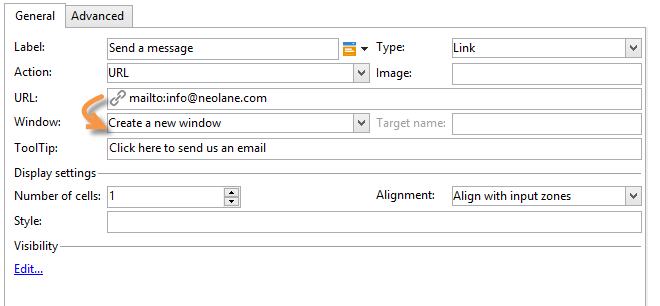

# 웹 양식의 정적 요소{#static-elements-in-a-web-form}


양식의 페이지에 사용자가 상호 작용하지 않는 요소를 포함할 수 있습니다. 이러한 요소는 이미지, HTML 컨텐츠, 가로 막대 또는 하이퍼텍스트 링크와 같은 정적 요소입니다. 이러한 요소는 도구 모음의 첫 번째 단추를 통해 **[!UICONTROL Static elements]**&#x200B;을(를) 선택하여 만듭니다.


다음 유형의 필드를 사용할 수 있습니다.

* 이전에 제공된 답변(양식 컨텍스트) 또는 데이터베이스를 기반으로 한 값.
* 하이퍼텍스트 링크, HTML, 가로 막대형 [HTML 콘텐츠 삽입](#inserting-html-content)을 참조하세요.
* 리소스 라이브러리 또는 사용자가 액세스할 수 있는 서버에 저장된 이미지입니다. [이미지 삽입](#inserting-images)을 참조하세요.
* 클라이언트측 및/또는 서버측에서 실행되는 스크립트. 클라이언트측에서 올바른 실행을 위해 JavaScript에서 작성되어야 하며 대부분의 브라우저와 호환되어야 합니다.

  >[!NOTE]
  >
  >서버측에서 스크립트는 [Campaign JSAPI 설명서](https://experienceleague.adobe.com/developer/campaign-api/api/index.html?lang=ko)에 정의된 함수를 사용할 수 있습니다.

## HTML 컨텐츠 삽입 {#inserting-html-content}

하이퍼텍스트 링크, 이미지, 서식이 지정된 단락, 비디오 등의 HTML 콘텐츠를 양식 페이지에 포함할 수 있습니다.

HTML 편집기를 사용하여 양식 페이지에 삽입할 콘텐츠를 입력할 수 있습니다. 편집기를 열려면 **[!UICONTROL Static elements]** > **[!UICONTROL HTML]** 을 클릭합니다.

콘텐츠를 직접 입력하고 서식을 지정하거나 소스 코드 창을 표시하여 일부 외부 콘텐츠에 붙여넣을 수 있습니다. &quot;소스 코드&quot; 모드로 전환하려면 도구 모음에서 첫 번째 아이콘을 클릭합니다.


데이터베이스 필드를 삽입하려면 개인화 버튼을 사용합니다.


>[!NOTE]
>
>HTML 편집기에 입력한 문자열은 **[!UICONTROL Texts]** 하위 탭에 정의된 경우에만 번역됩니다. 그렇지 않으면 수집되지 않습니다. 자세한 내용은 [웹 양식 번역](translating-a-web-form.md)을 참조하세요.

### 링크 삽입 {#inserting-a-link}

다음 예제와 같이 편집 창의 필드를 채웁니다.

하이퍼텍스트 링크를 추가하려면 **[!UICONTROL Static elements]** > **[!UICONTROL Link]**(으)로 이동합니다.


* **[!UICONTROL Label]**&#x200B;은(는) 양식 페이지에 표시되는 하이퍼텍스트 링크의 콘텐츠입니다.
* **[!UICONTROL URL]**&#x200B;은(는) 원하는 주소입니다(예: 웹 사이트의 경우 [https://www.adobe.com](https://www.adobe.com), 메시지를 보낼 경우 [info@adobe.com](mailto:info@adobe.com)).
* **[!UICONTROL Window]** 필드를 사용하면 사이트의 경우 링크에 대한 표시 모드를 선택할 수 있습니다. 새 창, 현재 창 또는 다른 창에서 링크를 열도록 결정할 수 있습니다.
* 아래와 같이 도구 설명을 추가할 수 있습니다.

  

* 링크를 버튼이나 이미지로 표시하도록 선택할 수 있습니다. 이렇게 하려면 **[!UICONTROL Type]** 필드에서 표시 유형을 선택합니다.

### 링크 유형 {#types-of-links}

기본적으로 링크는 URL 유형 작업과 연결되므로 URL 필드에 링크 대상 주소를 입력할 수 있습니다.



링크에 대한 다른 작업을 정의하여 사용자가 링크를 클릭하여 다음을 수행할 수 있습니다.

* 페이지 새로 고침

  이렇게 하려면 **[!UICONTROL Action]** 필드의 드롭다운 상자에서 **[!UICONTROL Refresh page]** 옵션을 선택합니다.

  

* 다음/이전 페이지 표시

  이렇게 하려면 **[!UICONTROL Action]** 필드의 드롭다운 상자에서 **[!UICONTROL Next page]** 또는 **[!UICONTROL Previous page]** 옵션을 선택합니다.

  

  **[!UICONTROL Next]** 및/또는 **[!UICONTROL Back]** 단추를 링크로 대체하려면 숨길 수 있습니다. 이 [페이지](defining-web-forms-page-sequencing.md)를 참조하세요.

  링크는 기본적으로 사용되는 **[!UICONTROL Next]** 단추를 대체합니다.

  

* 다른 페이지 표시

  **[!UICONTROL Enable a transition]** 옵션을 사용하면 **[!UICONTROL Transition]** 필드에서 선택한 나가는 전환과 관련된 특정 페이지를 표시할 수 있습니다.

  

  기본적으로 페이지에는 출력 전환이 하나만 있습니다. 새 전환을 만들려면 페이지를 선택한 다음 아래와 같이 **[!UICONTROL Output transitions]** 섹션에서 **[!UICONTROL Add]** 단추를 클릭합니다.

  

  다이어그램에서 이 추가는 다음과 같이 표시됩니다.

  

  >[!NOTE]
  >
  >웹 양식의 페이지 시퀀싱에 대한 자세한 내용은 [웹 양식 페이지 시퀀싱 정의](defining-web-forms-page-sequencing.md)를 참조하십시오.

### HTML 콘텐츠 개인화 {#personalizing-html-content}

이전 페이지에 기록된 데이터를 사용하여 양식 페이지의 HTML 콘텐츠를 개인화할 수 있습니다. 예를 들어, 첫 페이지에서 연락처 정보와 자동차 브랜드를 제공할 수 있는 자동차 보험 웹 양식을 만들 수 있습니다.


개인화 필드를 사용하여 사용자 이름과 선택한 브랜드를 다음 페이지에 다시 삽입합니다. 사용할 구문은 정보 저장 모드에 따라 다릅니다. 자세한 내용은 [수집된 정보 사용](web-forms-answers.md#using-collected-information)을 참조하세요.

>[!NOTE]
>
>보안상의 이유로 **`<%=`** 수식에 입력한 값이 이스케이프 처리된 문자로 바뀝니다.

이 예제에서 수신자의 이름과 성은 데이터베이스의 필드에 저장되는 반면 자동차 브랜드는 변수에 저장됩니다. 페이지 2에서 개인화된 메시지의 구문은 다음과 같습니다.


```
<P>Welcome <%= ctx.recipient.@firstName %> <%= ctx.recipient.@lastName %>,</P>
<P>To start your customized study, please select your car <%=ctx.vars.marque%> and its year of purchase.</P>
```

이렇게 하면 다음과 같은 결과가 생성됩니다.


### 텍스트 변수 사용 {#using-text-variables}

**[!UICONTROL Text]** 탭에서는 다음 구문을 사용하여 &lt;%= 및 %> 문자 사이의 HTML에서 사용할 수 있는 변수 필드를 만들 수 있습니다. **$(IDENTIFIER)**.

이 메서드를 사용하면 문자열을 쉽게 현지화할 수 있습니다. [웹 양식 번역](translating-a-web-form.md)을 참조하세요.

예를 들어 HTML 컨텐츠에 &quot;마지막 연락의 날짜:&quot; 문자열을 표시할 수 있는 **연락처** 필드를 만들 수 있습니다. 이렇게 하려면 아래 단계를 수행합니다.

1. HTML 텍스트의 **[!UICONTROL Text]** 탭을 클릭합니다.
1. **[!UICONTROL Add]** 아이콘을 클릭합니다.
1. **[!UICONTROL Identifier]** 열에 변수 이름을 입력합니다
1. **[!UICONTROL Text]** 열에 기본값을 입력합니다.

   

1. HTML 콘텐츠에서 **&lt;%= $(Contact) %>** 구문을 통해 이 텍스트 변수를 삽입합니다.

   

   >[!CAUTION]
   >
   >HTML 편집기에 이 문자를 입력하면 **&lt;** 및 **>** 필드가 이스케이프 처리된 문자로 바뀝니다. 이 경우 HTML 텍스트 편집기의 **[!UICONTROL Display source code]** 아이콘을 클릭하여 소스 코드를 수정해야 합니다.

1. 양식의 **[!UICONTROL Preview]** 레이블을 열어 HTML에 입력한 값을 확인합니다.

   

이 운영 모드에서는 웹 양식의 텍스트를 한 번만 정의하고 통합 번역 도구를 사용하여 번역을 관리할 수 있습니다. 자세한 내용은 [웹 양식 번역](translating-a-web-form.md)을 참조하세요.

## 이미지 삽입 {#inserting-images}

양식에 이미지를 포함하려면 외부에서 액세스할 수 있는 서버에 이미지를 저장해야 합니다.

**[!UICONTROL Static elements]** > **[!UICONTROL Image]** 메뉴를 선택합니다.

삽입할 이미지의 소스를 선택합니다. 이 소스는 공용 리소스 라이브러리에서 가져오거나 외부에서 액세스할 수 있는 외부 서버에 저장할 수 있습니다.


라이브러리의 이미지인 경우 필드의 콤보 상자에서 이미지를 선택하고 외부 파일에 있는 경우 액세스 경로를 입력합니다. 레이블은 이미지(HTML의 ALT 필드와 일치함) 위에 커서를 놓거나 이미지가 표시되지 않을 때 표시됩니다.

이미지는 편집기의 중앙 섹션에서 볼 수 있습니다.
