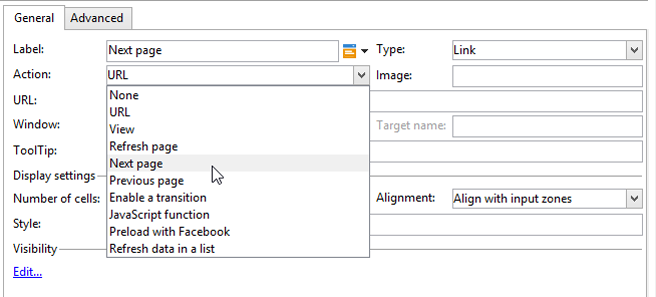
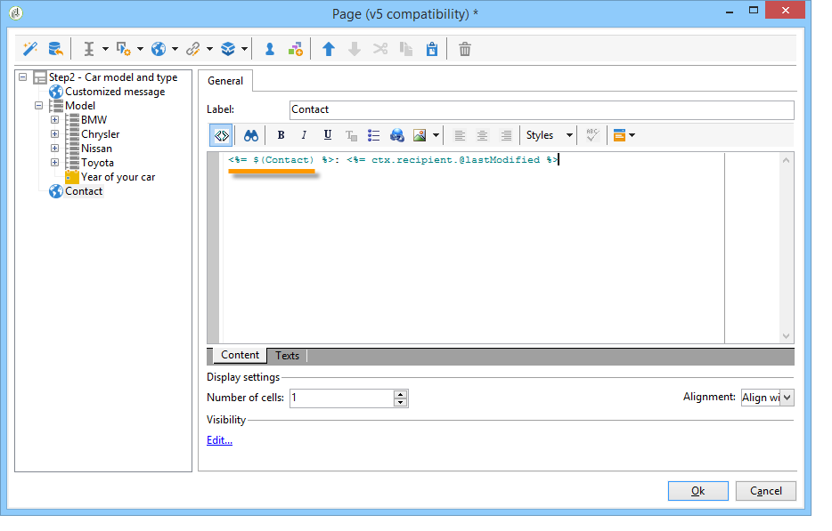

# 웹 양식의 정적 요소{#static-elements-in-a-web-form}


사용자가 양식 페이지에 상호 작용이 없는 요소를 포함할 수 있습니다. 이미지, HTML 컨텐츠, 가로 막대 또는 하이퍼텍스트 링크와 같은 정적 요소입니다. 이러한 요소는 을 선택하여 도구 모음의 첫 번째 버튼을 통해 만들어집니다 **[!UICONTROL Static elements]**.


다음 유형의 필드를 사용할 수 있습니다.

* 이전에 제공된 답변(양식 컨텍스트) 또는 데이터베이스를 기반으로 하는 값입니다.
* 하이퍼텍스트 링크, HTML, 가로 막대형 자세한 내용은 [HTML 컨텐츠 삽입](#inserting-html-content).
* 리소스 라이브러리 또는 사용자가 액세스할 수 있는 서버에 저장된 이미지입니다. 자세한 내용은 [이미지 삽입](#inserting-images).
* 클라이언트 측 및/또는 서버 측에서 실행된 스크립트. JavaScript로 작성해야 하며 클라이언트측에서 올바른 실행을 위해 대부분의 브라우저와 호환되어야 합니다.

   >[!NOTE]
   >
   >서버 측에서 스크립트는 [Campaign JSAPI 설명서](https://experienceleague.adobe.com/developer/campaign-api/api/index.html).

## HTML 컨텐츠 삽입 {#inserting-html-content}

양식 페이지에 HTML 컨텐츠를 포함할 수 있습니다. 하이퍼텍스트 링크, 이미지, 형식이 지정된 단락, 비디오 등

HTML 편집기를 사용하면 양식 페이지에 삽입할 컨텐츠를 입력할 수 있습니다. 편집기를 열려면 **[!UICONTROL Static elements]** > **[!UICONTROL HTML]** .

컨텐츠를 직접 입력 및 포맷하거나 소스 코드 창을 표시하여 일부 외부 컨텐츠에 붙여넣을 수 있습니다. &quot;소스 코드&quot; 모드로 전환하려면 도구 모음에서 첫 번째 아이콘을 클릭합니다.


데이터베이스 필드를 삽입하려면 개인화 단추를 사용합니다.


>[!NOTE]
>
>HTML 편집기에 입력한 문자열은 **[!UICONTROL Texts]** 하위 탭. 그렇지 않으면 수집되지 않습니다. 자세한 내용은 [웹 양식 번역](translating-a-web-form.md).

### 링크 삽입 {#inserting-a-link}

다음 예와 같이 편집 창의 필드를 채웁니다.

하이퍼텍스트 링크를 추가하려면 **[!UICONTROL Static elements]** > **[!UICONTROL Link]**.


* 다음 **[!UICONTROL Label]** 하이퍼텍스트 링크가 양식 페이지에 표시될 대로 컨텐트입니다.
* 다음 **[!UICONTROL URL]** 는 원하는 주소입니다(예: ). [https://www.adobe.com](https://www.adobe.com) 웹 사이트용 또는 [info@adobe.com](mailto:info@adobe.com) 메시지를 보내려면
* 다음 **[!UICONTROL Window]** 필드에서는 사이트의 경우 링크에 대한 표시 모드를 선택할 수 있습니다. 새 창, 현재 창 또는 다른 창에서 링크를 열도록 결정할 수 있습니다.
* 다음과 같이 도구 설명을 추가할 수 있습니다.

   

* 링크를 단추 또는 이미지로 표시하도록 선택할 수 있습니다. 이렇게 하려면 **[!UICONTROL Type]** 필드.

### 링크 유형 {#types-of-links}

기본적으로 링크는 URL 유형 작업과 연결되어 있으므로 링크 대상 주소를 URL 필드에 입력할 수 있습니다.


링크에 대한 다른 작업을 정의할 수 있으므로 사용자가 링크를 클릭하여 다음을 수행할 수 있습니다.

* 페이지 새로 고침

   이렇게 하려면 **[!UICONTROL Refresh page]** 옵션( **[!UICONTROL Action]** 필드.

   

* 다음/이전 페이지를 표시합니다.

   이렇게 하려면 **[!UICONTROL Next page]** 또는 **[!UICONTROL Previous page]** 옵션( **[!UICONTROL Action]** 필드.

   

   을 숨길 수 있습니다 **[!UICONTROL Next]** 및/또는 **[!UICONTROL Back]** 단추를 링크로 대체할 수 있습니다. 다음을 참조하십시오 [페이지](defining-web-forms-page-sequencing.md).

   링크가 **[!UICONTROL Next]** 기본적으로 사용되는 단추입니다.

   

* 다른 페이지 표시

   다음 **[!UICONTROL Enable a transition]** 선택 사항을 사용하면 **[!UICONTROL Transition]** 필드.

   

   기본적으로 페이지에는 출력 전환이 하나만 있습니다. 새 전환을 만들려면 페이지를 선택한 다음 **[!UICONTROL Add]** 단추 **[!UICONTROL Output transitions]** 섹션을 참조하십시오.

   

   다이어그램에서 이 추가는 다음과 같습니다.

   

   >[!NOTE]
   >
   >웹 양식의 페이지 시퀀싱에 대한 자세한 내용은 [웹 양식 페이지 순서 정의](defining-web-forms-page-sequencing.md).

### HTML 콘텐츠 개인화 {#personalizing-html-content}

이전 페이지에 기록된 데이터로 양식 페이지의 HTML 콘텐츠를 개인화할 수 있습니다. 예를 들어, 자동차 보험 웹 양식을 만들 수 있는데, 이 웹 양식에서는 자동차 회사 첫 페이지에 연락처 정보와 자동차 브랜드를 제공할 수 있습니다.


개인화 필드를 사용하여 사용자 이름과 선택한 브랜드를 다음 페이지에 다시 삽입할 수 있습니다. 사용할 구문은 정보 저장 모드에 따라 다릅니다. 자세한 내용은 [수집된 정보 사용](web-forms-answers.md#using-collected-information).

>[!NOTE]
>
>보안상의 이유로 **`<%=`** 수식은 이스케이프 처리된 문자로 바뀝니다.

이 예제에서 수신자의 이름과 성은 데이터베이스의 필드에 저장되고 차량 브랜드는 변수에 저장됩니다. 2페이지에서 개인화된 메시지의 구문은 다음과 같습니다.


```
<P>Welcome <%= ctx.recipient.@firstName %> <%= ctx.recipient.@lastName %>,</P>
<P>To start your customized study, please select your car <%=ctx.vars.marque%> and its year of purchase.</P>
```

이렇게 하면 다음 결과가 생성됩니다.


### 텍스트 변수 사용 {#using-text-variables}

다음 **[!UICONTROL Text]** 탭에서는 다음 구문을 사용하여 &lt;%= 및 %> 문자 사이에 HTML에 사용할 수 있는 변수 필드를 만들 수 있습니다. **$(식별자)**.

이 메서드를 사용하여 문자열을 쉽게 현지화할 수 있습니다. 자세한 내용은 [웹 양식 번역](translating-a-web-form.md)

예를 들어 **연락처** HTML 컨텐츠에 &quot;마지막 연락 날짜&quot; 문자열을 표시할 수 있는 필드입니다. 이렇게 하려면 아래 단계를 수행합니다:

1. 을(를) 클릭합니다. **[!UICONTROL Text]** HTML 텍스트의 탭입니다.
1. 을(를) 클릭합니다. **[!UICONTROL Add]** 아이콘.
1. 에서 **[!UICONTROL Identifier]** 열에서 변수 이름을 입력합니다
1. 에서 **[!UICONTROL Text]** 열에서 기본값을 입력합니다.

   

1. HTML 콘텐츠에서 **&lt;%= $(연락처) %>** 구문

   

   >[!CAUTION]
   >
   >HTML 편집기에 이러한 문자를 입력하면 **&lt;** 및 **>** 필드는 이스케이프 처리된 문자로 바뀝니다. 이 경우 **[!UICONTROL Display source code]** HTML 텍스트 편집기의 아이콘.

1. 를 엽니다. **[!UICONTROL Preview]** HTML에 입력한 값을 볼 양식의 레이블입니다.

   

이 운영 모드에서는 웹 양식의 텍스트를 한 번만 정의하고 통합 번역 도구를 사용하여 번역을 관리할 수 있습니다. 자세한 내용은 [웹 양식 번역](translating-a-web-form.md).

## 이미지 삽입 {#inserting-images}

양식에 포함할 이미지를 외부에서 액세스할 수 있는 서버에 저장해야 합니다.

을(를) 선택합니다 **[!UICONTROL Static elements]** > **[!UICONTROL Image]** 메뉴 아래의 제품에서 사용할 수 있습니다.

삽입할 이미지의 소스를 선택합니다. 공용 리소스 라이브러리에서 가져오거나 외부에서 액세스할 수 있는 외부 서버에 저장할 수 있습니다.


라이브러리의 이미지인 경우 필드의 콤보 상자에서 선택합니다. 외부 파일에 있는 경우 액세스 경로를 입력합니다. 이미지 위에 커서를 전달하거나(HTML의 ALT 필드와 일치함) 이미지가 표시되지 않을 때 레이블이 표시됩니다.

이미지는 편집기의 중앙 섹션에서 볼 수 있습니다.
