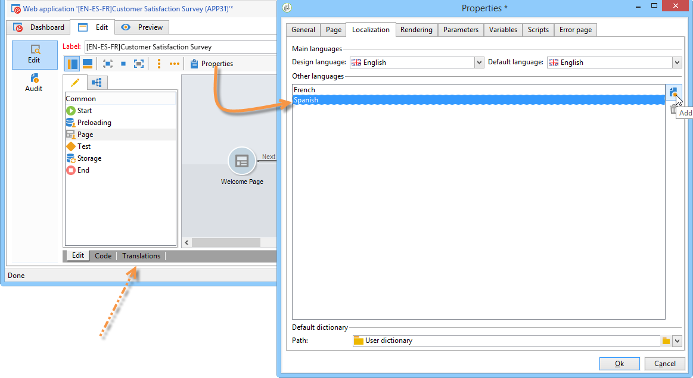
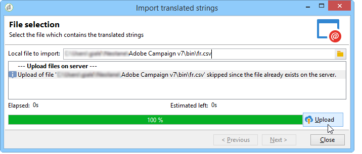
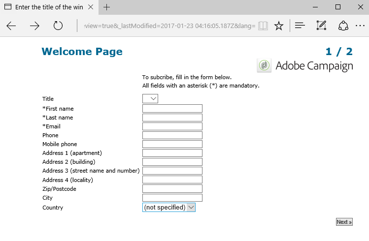
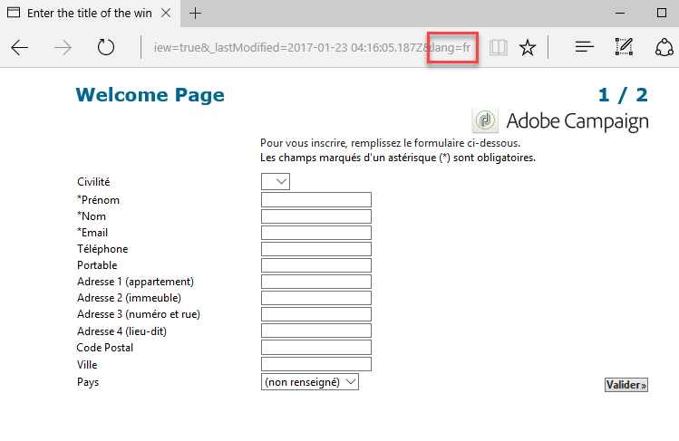

# 웹 양식 번역{#translating-a-web-form}


웹 애플리케이션을 여러 언어로 현지화할 수 있습니다.

Adobe Campaign 콘솔에서 직접 번역을 수행할 수 있습니다(참조). [편집기에서 번역 관리](#managing-translations-in-the-editor)) 또는 문자열을 내보내고 가져와서 번역을 외부화합니다( 참조). [번역 외부화](#externalizing-translation)).

기본적으로 사용할 수 있는 번역 언어 목록은 다음에 자세히 설명되어 있습니다. [양식 표시 언어 변경](#changing-forms-display-language).

웹 애플리케이션은 편집 언어로 디자인되었습니다. 번역할 레이블 및 기타 콘텐츠를 입력하는 데 사용되는 참조 언어입니다.

기본 언어는 액세스 URL에 언어 설정이 추가되지 않은 경우 웹 애플리케이션이 표시되는 언어입니다.

>[!NOTE]
>
>기본적으로 편집 언어와 기본 언어는 콘솔 언어와 동일합니다.

## 언어 선택 {#choosing-languages}

하나 이상의 번역 언어를 정의하려면 **[!UICONTROL Properties]** 웹 응용 프로그램의 단추를 클릭한 다음 **[!UICONTROL Localization]** 탭. 다음을 클릭합니다. **[!UICONTROL Add]** 단추를 클릭하여 웹 응용 프로그램의 새 번역 언어를 정의합니다.

>[!NOTE]
>
>이 창에서는 기본 언어와 편집 언어를 변경할 수도 있습니다.



웹 응용 프로그램의 번역 언어를 추가할 때(또는 기본 언어와 편집 언어가 다른 경우) **[!UICONTROL Translation]** 하위 탭이 **[!UICONTROL Edit]** 번역을 관리할 수 있습니다.

Adobe Campaign에는 다국어 번역을 번역하고 관리하는 도구가 포함되어 있습니다. 이 편집기를 사용하면 번역 또는 승인할 문자열을 보거나, 인터페이스에 직접 번역을 입력하거나, 문자열을 가져오거나 내보내서 번역을 외부화할 수 있습니다.

## 편집기에서 번역 관리 {#managing-translations-in-the-editor}

### 문자열 수집 중 {#collecting-strings}

다음 **[!UICONTROL Translations]** 탭에서는 웹 응용 프로그램을 구성하는 문자열에 대한 번역을 입력할 수 있습니다.

이 탭을 처음 열면 데이터가 포함되지 않습니다. 다음을 클릭합니다. **[!UICONTROL Collect the strings to translate]** 웹 응용 프로그램의 문자열을 업데이트하는 링크입니다.

Adobe Campaign은에 정의된 필드와 문자열의 레이블을 수집합니다. **[!UICONTROL Texts]** 모든 정적 요소의 탭: HTML 블록, Javascript 등 정적 요소는에 자세히 설명되어 있습니다. [웹 양식의 정적 요소](static-elements-in-a-web-form.md).


>[!CAUTION]
>
>이 프로세스는 처리할 데이터 볼륨에 따라 몇 분이 걸릴 수 있습니다.
> 
>일부 번역이 시스템 사전에 없다는 경고가 나타나면 [시스템 문자열 번역](#translating-the-system-strings).

문자열이 번역될 때마다 해당 번역이 번역 사전에 추가됩니다.

컬렉션 프로세스에서 번역이 이미 있음을 감지하면 이 번역이 **[!UICONTROL Text]** 문자열의 열입니다. 문자열의 상태가 (으)로 설정됩니다. **[!UICONTROL Translated]**.

번역된 적이 없는 문자 문자열의 경우 **[!UICONTROL Text]** 필드가 비어 있고 상태는 입니다. **[!UICONTROL To translate]**.

### 문자열 필터링 {#filtering-strings}

기본적으로 웹 애플리케이션의 각 번역 언어가 표시됩니다. 기본 필터에는 언어와 상태, 이렇게 두 가지가 있습니다. 다음을 클릭합니다. **[!UICONTROL Filters]** 단추를 클릭한 다음 **[!UICONTROL By language or status]** 일치하는 드롭다운 상자를 표시합니다. 고급 필터를 만들 수도 있습니다. 자세한 정보는 이 [페이지](../../platform/using/creating-filters.md#creating-an-advanced-filter)를 참조하십시오.


로 이동 **[!UICONTROL Language]** 번역 언어를 선택할 수 있는 드롭다운 상자.

번역되지 않은 문자열만 표시하려면 **[!UICONTROL To translate]** 다음에서 **[!UICONTROL Status]** 드롭다운 상자. 번역되거나 승인된 문자열만 표시할 수도 있습니다.

### 문자열 번역 {#translating-strings}

1. 단어를 번역하려면 문자열 목록에서 해당 줄을 두 번 클릭합니다.

   

   소스 문자열이 창의 위쪽 섹션에 표시됩니다.

1. 아래 섹션에 해당 번역을 입력합니다. 승인하려면 다음을 확인하십시오 **[!UICONTROL Translation approved]** 옵션을 선택합니다.

   >[!NOTE]
   >
   >번역 승인은 선택 사항이며 프로세스를 차단하지 않습니다.

   승인되지 않은 번역은 다음과 같이 표시됩니다. **[!UICONTROL Translated]**. 승인된 번역은 다음과 같이 표시됩니다. **[!UICONTROL Approved]**.

## 번역 외부화 {#externalizing-translation}

Adobe Campaign 이외의 도구를 사용하여 문자 문자열을 내보내고 가져와서 번역할 수 있습니다.

>[!CAUTION]
>
>문자열을 내보낸 후에는 통합 도구를 사용하여 번역을 수행하지 마십시오. 이렇게 하면 번역을 다시 가져올 때 충돌이 발생하고 이러한 파일은 손실됩니다.

### 파일 내보내기 {#exporting-files}

1. 내보낼 문자열을 포함하는 웹 애플리케이션을 선택하고 마우스 오른쪽 단추로 클릭한 다음 를 선택합니다 **[!UICONTROL Actions > Export strings for translation...]**

   

1. 선택 **[!UICONTROL Export strategy]** :

   * **[!UICONTROL One file per language]**: 내보내기를 수행하면 번역 언어당 하나의 파일이 생성됩니다. 각 파일은 선택한 모든 웹 애플리케이션에 공통됩니다.
   * **[!UICONTROL One file per Web application]**: 내보내기를 수행하면 선택한 웹 애플리케이션당 하나의 파일이 생성됩니다. 각 파일에는 모든 번역 언어가 포함됩니다.

      >[!NOTE]
      >
      >이 유형의 내보내기는 XLIFF 내보내기에 사용할 수 없습니다.

   * **[!UICONTROL One file per language and per Web application]**: 내보내기를 수행하면 여러 파일이 생성됩니다. 각 파일에는 웹 애플리케이션당 하나의 번역 언어가 포함됩니다.
   * **[!UICONTROL One file for all]**: 내보내기를 수행하면 모든 웹 애플리케이션에 대해 단일 다국어 파일이 생성됩니다. 선택한 모든 웹 응용 프로그램에 대한 모든 번역 언어를 포함합니다.

      >[!NOTE]
      >
      >이 유형의 내보내기는 XLIFF 내보내기에 사용할 수 없습니다.

1. 그런 다음 를 선택합니다. **[!UICONTROL Target folder]** 파일이 기록될 위치.
1. 파일 형식 선택( **[!UICONTROL CSV]** 또는 **[!UICONTROL XLIFF]** ) 및 클릭 **[!UICONTROL Start]**.


>[!NOTE]
>
>내보내기 파일의 이름은 자동으로 생성됩니다. 동일한 내보내기를 여러 번 수행하는 경우 기존 파일이 새 파일로 교체됩니다. 이전 파일을 유지해야 하는 경우 **[!UICONTROL Target folder]** 을 클릭한 다음 을 클릭합니다 **[!UICONTROL Start]** 내보내기를 다시 실행합니다.

에서 파일을 내보낼 때 **CSV 형식**, 각 언어는 상태 및 승인 상태에 연결됩니다. 다음 **승인하시겠습니까?** 열을 사용하면 번역을 승인할 수 있습니다. 이 열에는 값이 포함될 수 있습니다. **예** 또는 **아니요**. 통합 편집기에 대해서는 를 참조하십시오. [편집기에서 번역 관리](#managing-translations-in-the-editor)) 번역을 승인하는 것은 선택 사항이며 프로세스를 차단하지 않습니다.

### 파일 가져오기 {#importing-files}

외부 번역이 완료되면 번역된 파일을 가져올 수 있습니다.

1. 웹 응용 프로그램 목록으로 이동하여 마우스 오른쪽 단추를 클릭한 다음 **[!UICONTROL Actions > Import translated strings...]**

   >[!NOTE]
   >
   >번역과 관련된 웹 애플리케이션을 선택할 필요가 없습니다. 웹 애플리케이션 목록의 아무 곳에나 커서를 놓습니다.

   

1. 가져올 파일을 선택하고 **[!UICONTROL Upload]**.

   

>[!NOTE]
>
>외부 번역은 항상 내부 번역보다 우선합니다. 충돌이 발생하면 내부 번역이 외부 번역으로 덮어쓰기됩니다.

## 양식 표시 언어 변경 {#changing-forms-display-language}

웹 양식은에 지정된 기본 언어로 표시됩니다. **[!UICONTROL Localization]** 웹 응용 프로그램 속성의 탭입니다. 언어를 변경하려면 URL 끝에 다음 문자를 추가해야 합니다(여기서 **xx** 는 언어의 기호입니다).

```
?lang=xx
```

언어가 URL의 첫 번째 또는 유일한 매개 변수인 경우. 예: **https://myserver/webApp/APP34?lang=en**

```
&lang=xx
```

url의 언어 앞에 다른 매개 변수가 있는 경우. 예: **https://myserver/webApp/APP34?status=1&amp;lang=en**

기본적으로 사용할 수 있는 번역 언어 및 사전은 아래에 나열되어 있습니다.

**기본 시스템 사전**: 일부 언어에는 시스템 문자열의 번역이 포함된 기본 사전이 포함되어 있습니다. 자세한 내용은 다음을 참조하십시오. [시스템 문자열 번역](#translating-the-system-strings).

**달력 관리**: 웹 애플리케이션의 페이지에 날짜 입력을 위한 달력이 포함될 수 있습니다. 기본적으로 이 캘린더는 여러 언어(일 번역, 날짜 형식)로 제공됩니다.

<table> 
 <tbody> 
  <tr> 
   <td> <strong>언어(기호)</strong><br /> </td> 
   <td> <strong>기본 시스템 사전</strong><br /> </td> 
   <td> <strong>달력 관리</strong><br /> </td> 
  </tr> 
  <tr> 
   <td> 독일어(de)<br /> </td> 
   <td> 예<br /> </td> 
   <td> 예<br /> </td> 
  </tr> 
  <tr> 
   <td> 영어(en)<br /> </td> 
   <td> 예<br /> </td> 
   <td> 예<br /> </td> 
  </tr> 
  <tr> 
   <td> 영어(미국)(en_US)<br /> </td> 
   <td> </td> 
   <td> </td> 
  </tr> 
  <tr> 
   <td> 영어(영국)(en_GB)<br /> </td> 
   <td> </td> 
   <td> </td> 
  </tr> 
  <tr> 
   <td> 아랍어(ar)<br /> </td> 
   <td> </td> 
   <td> </td> 
  </tr> 
  <tr> 
   <td> 중국어(zh)<br /> </td> 
   <td> </td> 
   <td> </td> 
  </tr> 
  <tr> 
   <td> 한국어(ko)<br /> </td> 
   <td> </td> 
   <td> </td> 
  </tr> 
  <tr> 
   <td> 덴마크어(da)<br /> </td> 
   <td> 예<br /> </td> 
   <td> 예<br /> </td> 
  </tr> 
  <tr> 
   <td> 스페인어(es)<br /> </td> 
   <td> 예<br /> </td> 
   <td> 예<br /> </td> 
  </tr> 
  <tr> 
   <td> 에스토니아어(et)<br /> </td> 
   <td> </td> 
   <td> </td> 
  </tr> 
  <tr> 
   <td> 핀란드어(fi)<br /> </td> 
   <td> </td> 
   <td> 예<br /> </td> 
  </tr> 
  <tr> 
   <td> 프랑스어(fr)<br /> </td> 
   <td> 예<br /> </td> 
   <td> 예<br /> </td> 
  </tr> 
  <tr> 
   <td> 프랑스어(벨기에)(fr_BE)<br /> </td> 
   <td> </td> 
   <td> </td> 
  </tr> 
  <tr> 
   <td> 프랑스어(프랑스) (fr_FR)<br /> </td> 
   <td> </td> 
   <td> </td> 
  </tr> 
  <tr> 
   <td> 그리스어(el)<br /> </td> 
   <td> </td> 
   <td> 예<br /> </td> 
  </tr> 
  <tr> 
   <td> 히브리어(he)<br /> </td> 
   <td> </td> 
   <td> </td> 
  </tr> 
  <tr> 
   <td> 헝가리어(hu)<br /> </td> 
   <td> </td> 
   <td> 예<br /> </td> 
  </tr> 
  <tr> 
   <td> 인도네시아어 (id)<br /> </td> 
   <td> </td> 
   <td> </td> 
  </tr> 
  <tr> 
   <td> 아일랜드어(ga)<br /> </td> 
   <td> </td> 
   <td> </td> 
  </tr> 
  <tr> 
   <td> 이탈리아어(it)<br /> </td> 
   <td> 예<br /> </td> 
   <td> 예<br /> </td> 
  </tr> 
  <tr> 
   <td> 이탈리아어(이탈리아) (it_IT)<br /> </td> 
   <td> </td> 
   <td> </td> 
  </tr> 
  <tr> 
   <td> 이탈리아어(스위스어) (it_CH)<br /> </td> 
   <td> </td> 
   <td> </td> 
  </tr> 
  <tr> 
   <td> 일본어(ja)<br /> </td> 
   <td> </td> 
   <td> </td> 
  </tr> 
  <tr> 
   <td> 라트비아어(lv)<br /> </td> 
   <td> </td> 
   <td> 예<br /> </td> 
  </tr> 
  <tr> 
   <td> 리투아니아어(lt)<br /> </td> 
   <td> </td> 
   <td> </td> 
  </tr> 
  <tr> 
   <td> 몰타어(mt)<br /> </td> 
   <td> </td> 
   <td> </td> 
  </tr> 
  <tr> 
   <td> 네덜란드어(nl)<br /> </td> 
   <td> </td> 
   <td> 예<br /> </td> 
  </tr> 
  <tr> 
   <td> 네덜란드어(벨기에) (nl_BE)<br /> </td> 
   <td> </td> 
   <td> </td> 
  </tr> 
  <tr> 
   <td> 네덜란드어(네덜란드) (nl_NL)<br /> </td> 
   <td> </td> 
   <td> </td> 
  </tr> 
  <tr> 
   <td> 노르웨이어(노르웨이) (no_NO)<br /> </td> 
   <td> </td> 
   <td> 예<br /> </td> 
  </tr> 
  <tr> 
   <td> 폴란드어(pl)<br /> </td> 
   <td> </td> 
   <td> 예<br /> </td> 
  </tr> 
  <tr> 
   <td> 포르투갈어(pt)<br /> </td> 
   <td> </td> 
   <td> 예<br /> </td> 
  </tr> 
  <tr> 
   <td> 포르투갈어(브라질) (pt_BR)<br /> </td> 
   <td> </td> 
   <td> </td> 
  </tr> 
  <tr> 
   <td> 포르투갈어(포르투갈) (pt_PT)<br /> </td> 
   <td> </td> 
   <td> </td> 
  </tr> 
  <tr> 
   <td> 러시아어(ru)<br /> </td> 
   <td> </td> 
   <td> 예<br /> </td> 
  </tr> 
  <tr> 
   <td> 슬로베니아(sl)<br /> </td> 
   <td> </td> 
   <td> </td> 
  </tr> 
  <tr> 
   <td> 슬로바키아어(sk)<br /> </td> 
   <td> </td> 
   <td> </td> 
  </tr> 
  <tr> 
   <td> 스웨덴어(sv)<br /> </td> 
   <td> 예<br /> </td> 
   <td> 예<br /> </td> 
  </tr> 
  <tr> 
   <td> 스웨덴어(핀란드) (sv_FI)<br /> </td> 
   <td> </td> 
   <td> </td> 
  </tr> 
  <tr> 
   <td> 스웨덴어(스웨덴) (sv_SE)<br /> </td> 
   <td> </td> 
   <td> </td> 
  </tr> 
  <tr> 
   <td> 체코어(cs)<br /> </td> 
   <td> </td> 
   <td> </td> 
  </tr> 
  <tr> 
   <td> 태국어(th)<br /> </td> 
   <td> </td> 
   <td> </td> 
  </tr> 
  <tr> 
   <td> 베트남어(vi)<br /> </td> 
   <td> </td> 
   <td> </td> 
  </tr> 
  <tr> 
   <td> 와룬(wa)<br /> </td> 
   <td> </td> 
   <td> </td> 
  </tr> 
 </tbody> 
</table>

>[!NOTE]
>
>기본적으로 제공되는 언어가 아닌 다른 언어를 추가하려면 다음을 참조하십시오. [번역 언어 추가](#adding-a-translation-language)

## 예제: 웹 애플리케이션을 여러 언어로 표시 {#example--displaying-a-web-application-in-several-languages}

다음 웹 양식은 영어, 프랑스어, 독일어 및 스페인어의 4개 언어로 제공됩니다. 문자 문자열은 모두 **[!UICONTROL Translation]** 웹 양식의 탭입니다. 기본 언어가 영어이므로 설문 조사가 게시되면 표준 URL을 사용하여 영어로 표시하십시오.



추가 **?lang=fr** 를 URL 끝에 추가하여 프랑스어로 표시합니다.

>[!NOTE]
>
>각 언어의 기호 목록은 다음에 자세히 설명되어 있습니다. [양식 표시 언어 변경](#changing-forms-display-language).



다음을 추가할 수 있습니다. **?lang=es** 또는 **?lang=de** 스페인어 또는 독일어로 표시합니다.

>[!NOTE]
>
>이 웹 응용 프로그램에 다른 매개 변수가 이미 사용된 경우 **&amp;lang=**.\
>예: **https://myserver/webApp/APP34?status=1&amp;lang=en**

## 고급 번역 구성 {#advanced-translation-configuration}

>[!CAUTION]
>
>이 섹션은 전문 사용자만을 위한 것입니다.

### 시스템 문자열 번역 {#translating-the-system-strings}

시스템 문자열은 모든 웹 응용 프로그램에서 사용할 수 있는 기본 문자 문자열입니다. 예: **[!UICONTROL Next]** , **[!UICONTROL Previous]**, **[!UICONTROL Approve]** 단추, **[!UICONTROL Loading]** 메시지 등 기본적으로 일부 언어에는 이러한 문자열에 대한 번역이 포함된 사전이 포함되어 있습니다. 언어 목록은 다음에 자세히 설명되어 있습니다. [양식 표시 언어 변경](#changing-forms-display-language).

웹 애플리케이션을 시스템 사전이 번역되지 않은 언어로 번역하면 일부 번역이 누락되었음을 알리는 경고 메시지가 나타납니다.


언어를 추가하려면 다음 단계를 적용합니다.

1. Adobe Campaign 트리로 이동하여 **[!UICONTROL Administration > Configuration > Global dictionary > System dictionary]** .
1. 창의 위쪽 섹션에서 번역할 시스템 문자열을 선택한 다음 를 클릭합니다. **[!UICONTROL Add]** 아래쪽이요

   

1. 번역 언어를 선택하고 문자열에 대한 번역을 입력합니다. 다음을 확인하여 번역을 승인할 수 있습니다. **[!UICONTROL Translation approved]** 옵션을 선택합니다.

   

   >[!NOTE]
   >
   >번역 승인은 선택 사항이며 프로세스를 차단하지 않습니다.

>[!CAUTION]
>
>기본 시스템 문자열을 삭제하지 마십시오.

### 번역 언어 추가 {#adding-a-translation-language}

웹 애플리케이션을 기본 언어가 아닌 다른 언어로 번역하려면 다음을 참조하십시오. [양식 표시 언어 변경](#changing-forms-display-language)) 새 번역 언어를 추가해야 합니다.

1. 다음을 클릭합니다. **[!UICONTROL Administration > Platform > Enumerations]** Adobe Campaign 트리의 노드 및 선택 **[!UICONTROL Languages available for translation]** 목록에서 삭제할 수 있습니다. 사용 가능한 번역 목록이 창의 아래 섹션에 표시됩니다.

   

1. 다음을 클릭합니다. **[!UICONTROL Add]** 버튼을 누른 다음 **[!UICONTROL Internal name]**, **[!UICONTROL Label]** 및 이미지 식별자(플래그)입니다. 새 이미지를 추가하려면 관리자에게 문의하십시오.

   
