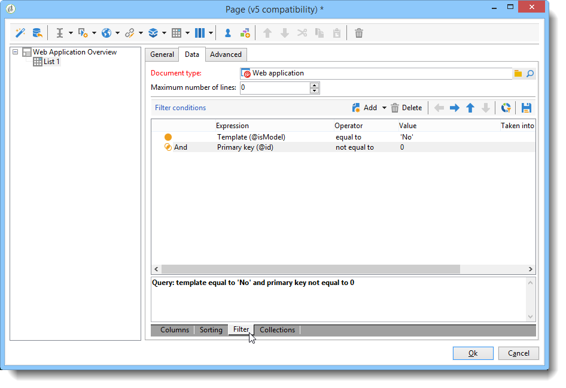
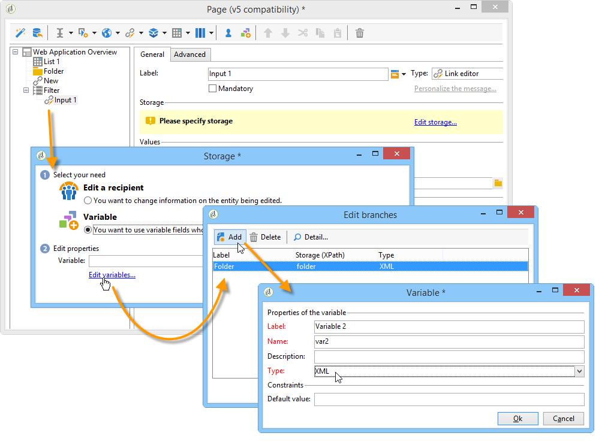

# 활용 사례:개요 만들기{#use-cases-creating-overviews}

다음 예제에서는 데이터베이스의 모든 웹 애플리케이션을 표시하는 개요 유형의 웹 애플리케이션을 만듭니다. 다음 요소를 구성합니다.

* 폴더의 필터(폴더에 [필터](#adding-a-filter-on-a-folder)추가 참조),
* 새 웹 응용 프로그램을 만들기 위한 단추( [새 웹 응용 프로그램을](#adding-a-button-to-configure-a-new-web-application)구성하려면 단추 추가 참조),
* 목록의 각 항목에 대한 세부 사항 표시(목록에 [세부 사항](#adding-detail-to-a-list)추가 참조),
* 링크 편집 도구당 필터 1개(링크 편집기를 [사용하여 필터 만들기](#creating-a-filter-using-a-link-editor)참조),
* 새로 고침 링크( [새로 고침 링크](#creating-a-refresh-link)만들기 참조).


## 단일 페이지 웹 애플리케이션 만들기 {#creating-a-single-page-web-application}

1. 단일 웹 **[!UICONTROL Page]** 애플리케이션을 만들고 다음 페이지로 전환 및 전환을 비활성화합니다.

   

1. 페이지 제목 변경.

   이 제목은 개요 머리글과 웹 애플리케이션 개요에 표시됩니다.

1. 웹 응용 프로그램 속성에서 **[!UICONTROL Single-page Web application]** 템플릿을 선택하여 응용 프로그램의 렌더링을 수정합니다.

   

1. 웹 애플리케이션의 **[!UICONTROL Page]** 활동을 열고 목록(**[!UICONTROL Static element > List]**)을 엽니다.
1. 목록 **[!UICONTROL Data]** 탭에서 **[!UICONTROL Web applications]** 문서 유형과 **[!UICONTROL Label]** 및 출력 열을 선택합니다 **[!UICONTROL Creation date]** **[!UICONTROL Type of application]** .
1. 웹 응용 프로그램만 표시하고 보기에서 템플릿을 제외하려면 **[!UICONTROL Filter]** 하위 탭에서 아래와 같이 다음 필터를 만듭니다.

   

1. 페이지의 구성 창을 닫고 을 클릭합니다 **[!UICONTROL Preview]**.

   데이터베이스에서 사용할 수 있는 웹 응용 프로그램 목록이 표시됩니다.

   

## 폴더에 필터 추가 {#adding-a-filter-on-a-folder}

개요에서는 Adobe Campaign 트리의 위치에 따라 데이터에 액세스하도록 선택할 수 있습니다. 폴더에 대한 필터입니다. 다음 프로세스를 적용하여 개요에 추가합니다.

1. 웹 애플리케이션의 **[!UICONTROL Page]** 노드에 커서를 놓고 **[!UICONTROL Select folder]** 요소(**[!UICONTROL Advanced controls > Select folder]**)를 추가합니다.
1. 표시되는 **[!UICONTROL Storage]** 창에서 **[!UICONTROL Edit variables]** 링크를 클릭합니다.
1. 필요에 맞게 변수 레이블을 변경합니다.
1. 변수 이름을 **폴더** 값으로 변경합니다.

   >[!NOTE]
   >
   >변수의 이름은 폴더에 연결된 요소(스키마에 정의됨)의 이름(이 경우 **폴더** )과 일치해야 합니다. 표를 참조할 때는 이 이름을 다시 사용해야 합니다.

1. 변수에 **[!UICONTROL XML]** 유형을 적용합니다.

   

1. 상호 작용을 **[!UICONTROL Refresh page]** 선택합니다.

   

1. 목록에 커서를 놓고 **[!UICONTROL Advanced]** 탭에서 목록의 **[!UICONTROL Folder filter XPath]** 탭에서 이전에 만든 변수를 참조합니다. 폴더 링크(예: **폴더**)에서 관련 요소의 이름을 사용해야 합니다.

   

   >[!NOTE]
   >
   >이 단계에서 웹 응용 프로그램이 응용 프로그램 컨텍스트 내에 있지 않으므로 폴더에서 필터를 테스트할 수 없습니다.

## 단추를 추가하여 새 웹 응용 프로그램 구성 {#adding-a-button-to-configure-a-new-web-application}

1. 커서를 **[!UICONTROL Page]** 요소 위에 놓고 링크(**[!UICONTROL Static elements > Link]**)를 추가합니다.
1. 개요 단추에 표시될 링크 레이블을 수정합니다.

   예제에서 레이블은 **New입니다**.

1. URL 필드에 다음 URL을 삽입합니다.xtk://open/?schema=nms:webApp&amp;form=nms:newWebApp ****.

   >[!NOTE]
   >
   >**nms:webApp** 은 웹 응용 프로그램 스키마와 일치합니다.
   >
   >**nms:newWebApp** 은 새 웹 응용 프로그램 만들기 마법사와 일치합니다.

1. 동일한 창에 URL을 표시하도록 선택합니다.
1. 이미지 필드에 웹 응용 프로그램 아이콘을 추가합니다./nms/img/webApp.png ****.

   이 아이콘은 **[!UICONTROL New]** 단추에 나타납니다.

1. 필드에 **단추를** 입력합니다 **[!UICONTROL Style]** .

   이 스타일은 이전에 선택한 **[!UICONTROL Single-page Web application]** 템플릿에서 참조됩니다.

   

## 목록에 세부 사항 추가 {#adding-detail-to-a-list}

개요에서 목록을 구성할 때 목록의 각 항목에 대한 추가 세부 정보를 표시하도록 선택할 수 있습니다.

1. 이전에 만든 목록 요소에 커서를 놓습니다.
1. 탭의 드롭다운 목록에서 **[!UICONTROL General]** **[!UICONTROL Columns and additional detail]** 표시 모드를 선택합니다.

   

1. 탭에서 **[!UICONTROL Data]** 및 **[!UICONTROL Primary key]** 열을 추가하고 각 열에 대한 **[!UICONTROL Internal name]** 옵션을 선택합니다 **[!UICONTROL Description]** **[!UICONTROL Hidden field]** .

   

   이렇게 하면 각 항목의 세부 사항에서만 이 정보가 표시됩니다.

1. 탭에서 다음 코드를 **[!UICONTROL Additional detail]** 추가합니다.

   ```
   <div class="detailBox">
     <div class="actionBox">
       <span class="action"><a title="Open" class="linkAction" href="xtk://open/?schema=nms:webApp&form=nms:webApp&pk=
       <%=webApp.id%>">Open...</a></span>
       <% 
       if( webApp.@appType == 1 ) { //survey
       %>
       <span class="action"><a target="_blank" title="Reports" class="linkAction" href="/xtk/report.jssp?_context=selection&
         _schema=nms:webApp&_selection=<%=webApp.@id%>
         &__sessiontoken=<%=document.controller.getSessionToken()%>">Reports</a></span>
       <% 
       } 
       %>
     </div>
     <div>
       Internal name: <%= webApp.@internalName %>
     </div>
     <%
     if( webApp.desc != "" )
     {
     %>
     <div>
       Description: <%= webApp.desc %>
     </div>
     <% 
     } 
     %>
   </div>
   ```

>[!NOTE]
>
>서버에서 JavaScript 라이브러리를 새로 고치는 데 5분이 걸립니다. 이 지연을 기다리지 않도록 서버를 다시 시작할 수 있습니다.

## 목록 필터링 및 업데이트 {#filtering-and-updating-the-list}

이 섹션에서는 특정 연산자가 만든 웹 응용 프로그램의 개요를 표시하는 필터를 만듭니다. 이 필터는 링크 편집기를 사용하여 만듭니다. 연산자를 선택하면 목록을 새로 고쳐 필터를 적용합니다.이렇게 하려면 새로 고침 링크를 만들어야 합니다.

이러한 두 요소는 개요에서 그래픽으로 그룹화하기 위해 동일한 컨테이너로 그룹화됩니다.

1. 커서를 **[!UICONTROL Page]** 요소 위에 놓고 선택합니다 **[!UICONTROL Container > Standard]**.
1. 링크 편집기와 링크가 서로 **인접하도록**&#x200B;열 수를 2로 설정합니다.

   

   요소 레이아웃에 대한 자세한 내용은 [이 섹션을](../../web/using/about-web-forms.md)참조하십시오.

1. dottedFilter **적용을 참조하십시오**.

   이 스타일은 이전에 선택한 **[!UICONTROL Single-page Web applicatio]** n개의 템플릿에서 참조됩니다.

   

### 링크 편집기를 사용하여 필터 만들기 {#creating-a-filter-using-a-link-editor}

1. 이전 단계에서 만든 컨테이너에 커서를 놓고 메뉴를 통해 링크 편집기를 삽입합니다. **[!UICONTROL Advanced controls]**
1. 자동으로 열리는 저장소 창에서 **[!UICONTROL Variables]** 옵션을 선택한 다음 **[!UICONTROL Edit variables]** 링크를 클릭하고 데이터를 필터링할 XML 변수를 만듭니다.

   

1. 레이블을 수정합니다.

   개요 필드 옆에 **[!UICONTROL Filter]** 표시됩니다.

1. 연산자 테이블을 응용 프로그램 스키마로 선택합니다.

   

1. 목록 요소에 커서를 놓고 **[!UICONTROL Data > Filter]** 탭을 통해 필터를 만듭니다.

   * **** 표현식:&#39;작성자&#39; 링크의 외래 키
   * **** 연산자:같음
   * **** 값:변수(변수)
   * **** 다음의 경우 고려됨&#39;$(var2/@id)&#39;!=&quot;
   

>[!CAUTION]
>
>웹 애플리케이션 사용자는 해당 Adobe Campaign 권한을 가진 식별된 운영자여야 정보에 액세스할 수 있습니다. 이러한 유형의 구성은 익명 웹 응용 프로그램에 대해 작동하지 않습니다.

### 새로 고침 링크 만들기 {#creating-a-refresh-link}

1. 컨테이너에 커서를 놓고 메뉴를 **[!UICONTROL Link]** 통해 **[!UICONTROL Static elements]** 삽입합니다.
1. 레이블을 수정합니다.
1. 을 **[!UICONTROL Refresh data in a list]**&#x200B;선택합니다.
1. 이전에 만든 목록을 추가합니다.

   

1. 필드에 새로 고침 아이콘을 **[!UICONTROL Image]** 추가합니다.**/xtk/img/refresh.png **.
1. 정렬 순서 화살표를 사용하여 아래와 같이 웹 애플리케이션의 다양한 요소를 다시 구성합니다.

   

이제 웹 응용 프로그램이 구성됩니다. 탭을 클릭하여 미리 볼 수 **[!UICONTROL Preview]** 있습니다.


