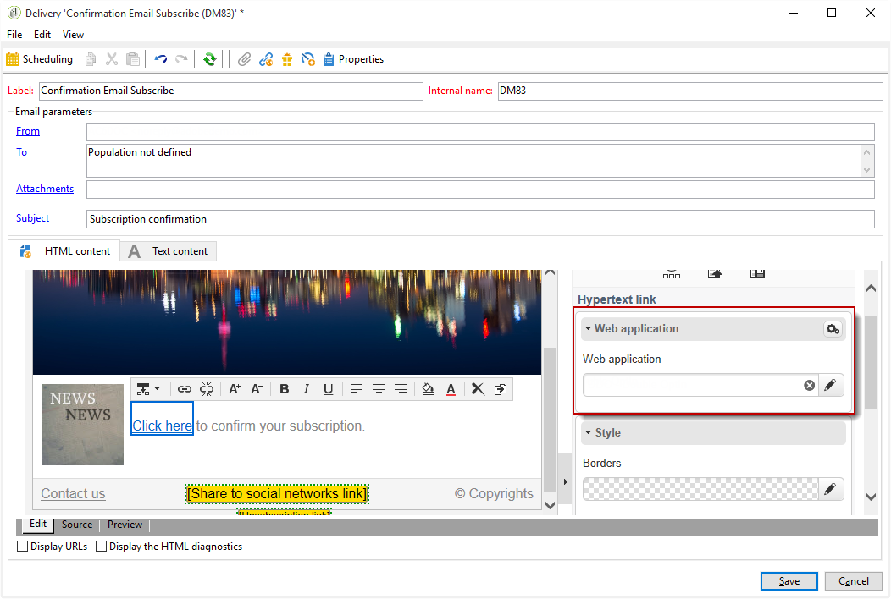
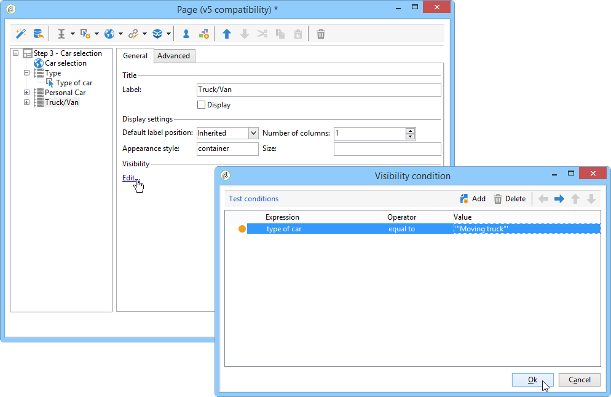

# 활용 사례: 웹 양식{#use-cases-web-forms}


## 이중 옵트인으로 구독 양식 만들기 {#create-a-subscription--form-with-double-opt-in}

정보 서비스를 제공하는 경우 수신자는 연결된 모든 커뮤니케이션을 수신하기 위해 가입해야 합니다. 부적절한 통신을 방지하고 수신자가 의도적으로 구독했는지 확인하려면 구독 확인 요청을 보내 이중 옵트인을 만드는 것이 좋습니다. 구독은 사용자가 확인 메시지에 포함된 링크를 클릭해야 적용됩니다.

이 예는 다음 시나리오를 기반으로 합니다.

1. 임시 서비스를 구독하기 위한 확인란이 포함된 웹 사이트에 뉴스레터 구독 양식을 만듭니다. 이 서비스를 통해 구독 확인 메시지를 전달할 수 있습니다.
1. 웹 양식에 연결된 게재 템플릿을 사용하여 구독 확인 게재 만들기 뉴스레터 가입에 대한 양식을 호출하고 구독 승인 메시지를 표시하는 확인 링크가 포함되어 있습니다.

### 1단계 - 정보 서비스 만들기 {#step-1---creating-information-services}

1. 수신자에게 제공할 뉴스레터 구독 서비스를 만듭니다. 뉴스레터를 만드는 방법에 대한 자세한 내용은 [이 섹션](../../delivery/using/about-services-and-subscriptions.md)을 참조하십시오.

   

1. 구독 확인 메시지를 보내기 위해 게재 템플릿에 연결된 임시 서비스인 두 번째 정보 서비스를 만듭니다.

   

### 2단계 - 확인 메시지 만들기 {#step-2---creating-confirmation-messages}

확인 메시지는 임시 서비스 수준에서 참조되는 전용 게재 템플릿을 통해 전송됩니다.

1. **[!UICONTROL Explorer]**&#x200B;에서 **[!UICONTROL Resources > Templates > Delivery templates]** 을 선택합니다.
1. 구독 확인 메시지를 전송할 게재 템플릿을 만듭니다.
1. **[!UICONTROL Email parameters]**&#x200B;에서 **[!UICONTROL To]** 단추를 클릭하여 게재 템플릿을 수신자 대신 구독 대상 매핑과 연결합니다.

   

1. 이 게재의 수신자가 승인을 확인하지 않았기 때문에 여전히 데이터베이스에 차단 목록 있습니다. 경영진 사용자가 이 커뮤니케이션을 수신하려면 이 템플릿을 기반으로에서 수신자를 타겟팅하도록 게재를 승인해야 차단 목록 합니다.

   이렇게 하려면 **[!UICONTROL Exclusions]** 탭을 클릭합니다.

1. **[!UICONTROL Edit...]** 링크를 클릭하고 **[!UICONTROL Exclude recipients who no longer want to be contacted]** 옵션을 선택 취소합니다.

   <!-- -->

   >[!IMPORTANT]
   >
   >이 선택 사항은 이 유형의 컨텍스트에서만 비활성화할 수 있습니다.

1. 게재를 개인화하고 확인 링크를 메시지 콘텐츠에 삽입합니다. 이 링크를 사용하면 웹 양식에 액세스하여 구독 확인을 기록할 수 있습니다.

   

1. DCE를 사용하여 웹 양식에 URL을 연결합니다. 웹 양식이 아직 만들어지지 않았으므로 만드는 즉시 값을 바꾸십시오.

   

1. 마지막으로 이 템플릿을 이전에 만든 임시 서비스에 연결합니다.

   

### 3단계 - 구독 양식 만들기 {#step-3---creating-the-subscription-form}

웹 양식을 사용하면 수신자 구독과 구독 확인을 모두 사용할 수 있습니다.

웹 양식 워크플로우에는 다음 활동이 포함됩니다.


이렇게 하려면 아래 단계를 수행합니다:

1. 웹 양식을 만들고 **[!UICONTROL Newsletter subscription (subNewsletter)]** 템플릿을 선택합니다.

   

1. **[!UICONTROL Edit]** 탭에서는 가입하려는 수신자에게 확인 메시지를 추가하려 하므로 기존 워크플로우를 구성해야 합니다.

   이렇게 하려면 **[!UICONTROL Preloading]** 상자를 두 번 클릭하고 다음과 같이 구성합니다.

   

   즉, 사용자가 확인 메시지의 링크를 통해 이 양식에 액세스하면 프로필 정보가 로드됩니다. 웹 사이트의 페이지를 통해 웹 양식에 액세스하면 정보가 로드되지 않습니다.

1. 워크플로우에 **[!UICONTROL Test]** 활동을 추가합니다.

   

   **[!UICONTROL Test]** 활동은 수신자 이메일과 관련이 있을 수 있습니다. 이 경우 다음과 같이 구성합니다.

   

1. 워크플로우에 두 개의 **[!UICONTROL Script]** 활동을 추가합니다.

   

   첫 번째 **[!UICONTROL Script]** 활동은 뉴스레터 구독을 확인할 차단 목록 때까지 수신자를 추가합니다. 컨텐츠는 다음과 같아야 합니다.

   ```
   ctx.recipient.@blackList=1
   ```

   

   두 번째 **[!UICONTROL Script]** 활동은 사용자에게 전송할 게재를 승인하고 뉴스레터에 가입합니다. 마지막 두 줄의 스크립트를 사용하여 수신자를 임시 폴더에서 다른 폴더로 전송하고 구독을 확인하는 즉시 기존 프로필과 조정할 수 있습니다.

   ```
   ctx.recipient.@blackList=0
   nms.subscription.Subscribe("INTERNAL_NAME_OF_THE_NEWSLETTER", ctx.recipient, false)
   ctx.recipient.folder = <folder name="nmsRootRecipient"/>
   nms.subscription.Unsubscribe("TEMP", ctx.recipient)
   ```

   >[!NOTE]
   >
   >또한 워크플로우를 사용하여 **[!UICONTROL Temp]** 파티션을 정기적으로 제거할 수 있습니다.

   

1. **[!UICONTROL Subscription]** 활동을 두 번 클릭하여 구독 양식을 개인화하고 이전에 만든 임시 서비스와 확인란을 연결합니다.

   

1. 양식 페이지에 입력한 정보를 저장하도록 **[!UICONTROL Storage]** 활동을 구성합니다.

   이 활동을 사용하면 전용 임시 폴더에 수신자 프로필을 만들어 데이터베이스의 프로필과 별도로 설정할 수 있으며, 이 프로필은 통신을 전송할 수 있습니다.

   

   >[!NOTE]
   >
   >조정 옵션을 정의하지 않아야 합니다.

1. 사용자를 위한 메시지를 표시하려면 두 개의 **[!UICONTROL End]** 활동을 추가하십시오.

   구독이 완료되면 두 번째 **[!UICONTROL End]** 상자에 확인 메시지가 표시됩니다.

   

1. 이제 웹 양식을 만들고 구성하고 나면 게재 템플릿에서 참조하여 확인 메시지를 보낼 수 있습니다.

   

### 4단계 - 양식 게시 및 테스트 {#step-4---publishing-and-testing-the-form}

이제 양식을 게시하여 사용자가 액세스할 수 있도록 할 수 있습니다.


뉴스레터 가입에는 다음 단계가 포함됩니다.

1. 웹 사이트 사용자가 구독 페이지에 로그인하여 양식을 승인합니다.

   

   이들은 브라우저에서 요청이 고려되었다는 메시지를 통해 알림을 받습니다.

   

   사용자가 **[!UICONTROL Temp]** 폴더의 Adobe Campaign 데이터베이스에 추가되고, 이메일에 대한 구독을 확인할 차단 목록 때까지 프로필이 중입니다.

   

1. 구독 승인을 위한 링크가 포함된 확인 메시지가 해당 고객에게 전송됩니다.

   

1. 이 링크를 클릭하면 브라우저에 승인 페이지가 표시됩니다.

   

   Adobe Campaign에서 사용자 프로필이 업데이트됩니다.

   * 더 이상에 차단 목록 있지 않습니다
   * 그들은 정보 서비스에 가입하고 있다.

      

## 선택한 값에 따라 다른 옵션 표시 {#displaying-different-options-depending-on-the-selected-values}

다음 예에서는 사용자에게 차량 유형을 선택하라는 메시지가 표시됩니다. 선택한 유형에 따라 사용 가능한 차량 범주를 표시할 수 있습니다. 즉, 오른쪽 열에 표시되는 항목은 사용자의 선택에 따라 다릅니다.


* 사용자가 &#39;개인 차량&#39;을 선택하면 &quot;소형화&quot;와 &quot;미니밴&quot; 중 하나를 선택할 수 있습니다.

   

* 사용자가 &#39;상업용 차량&#39;을 선택하면 선택 항목이 드롭다운 목록에 표시됩니다.

   

이 예제에서 차량 유형은 데이터베이스에 저장되지 않습니다. 드롭다운 목록은 다음과 같이 구성됩니다.


이 정보는 로컬 변수에 저장됩니다.

오른쪽 열의 조건부 표시에 컨테이너가 구성됩니다.


* 개인 차량에 대한 조건부 표시:

   

* 상업용 차량 필드의 조건부 표시:

   
