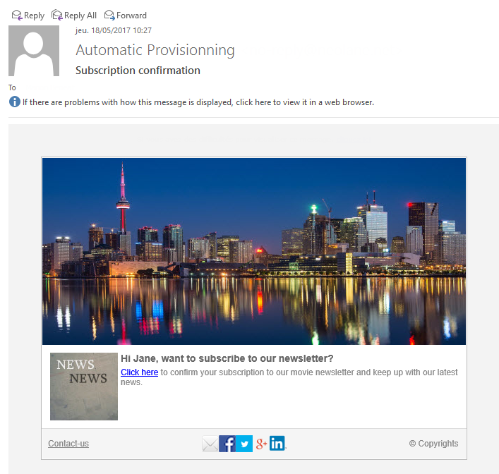

# 활용 사례:웹 양식{#use-cases-web-forms}

## 이중 옵트인 기능을 사용하여 구독 양식 만들기 {#create-a-subscription--form-with-double-opt-in}

정보 서비스를 제공하는 경우 수신자는 모든 연결된 커뮤니케이션을 수신하려면 가입해야 합니다. 부적절한 통신을 방지하고 수신자가 의도적으로 구독했는지 확인하려면 구독 확인 요청을 보내 이중 옵트인을 만드는 것이 좋습니다. 가입은 사용자가 확인 메시지에 포함된 링크를 클릭해야만 적용됩니다.

이 예는 다음 시나리오를 기반으로 합니다.

1. 임시 서비스 가입 확인란이 포함된 웹 사이트에서 뉴스레터 구독 양식을 만듭니다. 이 서비스를 사용하면 구독 확인 메시지를 제공할 수 있습니다.
1. 웹 양식에 연결된 배달 템플릿으로 구독 확인 배달 만들기 여기에는 뉴스레터 가입에 대한 양식을 호출하고 구독 승인 메시지를 표시하는 확인 링크가 포함되어 있습니다.

### 1단계 - 정보 서비스 만들기 {#step-1---creating-information-services}

1. 수신자에게 제공할 뉴스레터 구독 서비스를 만듭니다. 뉴스레터를 만드는 방법에 대한 자세한 내용은 [이 섹션을](../../delivery/using/about-services-and-subscriptions.md)참조하십시오.

   

1. 구독 확인 메시지를 보내기 위해 배달 템플릿에 연결된 임시 서비스인 두 번째 정보 서비스를 만듭니다.

   

### 2단계 - 확인 메시지 만들기 {#step-2---creating-confirmation-messages}

확인 메시지는 임시 서비스 수준에서 참조되는 전용 배달 템플릿을 통해 전송됩니다.

1. 에서 **[!UICONTROL Explorer]** 을 **[!UICONTROL Resources > Templates > Delivery templates]**&#x200B;선택합니다.
1. 구독 확인 메시지를 보내기 위한 배달 템플릿을 만듭니다.
1. 수신자가 아닌 구독 대상 매핑과 배달 템플릿을 연결하려면 **[!UICONTROL To]** **[!UICONTROL Email parameters]** 에서 단추를 클릭합니다.

   

1. 이 배달을 받는 사람이 승인을 확인하지 않았기 때문에 여전히 데이터베이스에 블랙리스트에 추가됩니다. 이 통신이 수신되도록 하려면 차단된 수신자를 대상으로 이 템플릿을 기반으로 전달을 승인해야 합니다.

   이렇게 하려면 **[!UICONTROL Exclusions]** 탭을 클릭합니다.

1. 링크를 클릭하고 **[!UICONTROL Edit...]** **[!UICONTROL Exclude recipients who no longer want to be contacted (blacklist)]** 옵션의 선택을 취소합니다.

   

   >[!CAUTION]
   >
   >이 옵션은 이 유형의 컨텍스트에서만 사용할 수 없습니다.

1. 전달을 개인화하고 메시지 컨텐츠에 확인 링크를 삽입합니다. 이 링크를 사용하면 웹 양식에 액세스하여 구독 확인을 기록할 수 있습니다.

   

1. DCE를 사용하여 웹 양식에 URL을 연결합니다. 웹 양식이 아직 만들어지지 않았으므로 만든 대로 값을 바꾸십시오.

   

1. 마지막으로 이 템플릿을 이전에 만든 임시 서비스에 연결합니다.

   

### 3단계 - 구독 양식 만들기 {#step-3---creating-the-subscription-form}

웹 양식을 통해 수신자의 구독 및 구독 확인을 모두 수행할 수 있습니다.

웹 양식 워크플로우에는 다음 활동이 포함됩니다.


이렇게 하려면 아래 절차를 따르십시오.

1. 웹 양식을 만들고 템플릿을 선택합니다 **[!UICONTROL Newsletter subscription (subNewsletter)]**.

   

1. 구독을 원하는 수신자에게 확인 메시지를 추가하려는 경우 **[!UICONTROL Edit]** 탭에서 기존 워크플로우를 구성해야 합니다.

   이렇게 하려면 **[!UICONTROL Preloading]** 상자를 두 번 클릭하고 다음과 같이 구성합니다.

   

   즉, 사용자가 확인 메시지의 링크를 통해 이 양식에 액세스하는 경우 프로필 정보가 로드됩니다. 웹 사이트의 페이지를 통해 웹 양식에 액세스하는 경우 정보가 로드되지 않습니다.

1. 워크플로우에 **[!UICONTROL Test]** 활동 추가

   

   이 **[!UICONTROL Test]** 활동은 수신자 이메일에 영향을 줄 수 있습니다. 이 경우 다음과 같이 구성합니다.

   

1. 워크플로우에 두 가지 **[!UICONTROL Script]** 활동을 추가합니다.

   

   첫 번째 **[!UICONTROL Script]** 활동은 뉴스레터에 대한 구독을 확인할 때까지 수신자에게 블랙 리스트 역할을 합니다. 컨텐츠는 다음과 같아야 합니다.

   ```
   ctx.recipient.@blackList=1
   ```

   

   두 번째 **[!UICONTROL Script]** 활동은 사용자에게 보낼 배달을 승인하고 뉴스레터에 가입합니다. 마지막 두 줄의 스크립트를 사용하면 수신자가 임시 폴더에서 다른 폴더로 전송할 수 있으며, 수신자가 구독을 확인하는 즉시 기존 프로필과 조정할 수 있습니다.

   ```
   ctx.recipient.@blackList=0
   nms.subscription.Subscribe("INTERNAL_NAME_OF_THE_NEWSLETTER", ctx.recipient, false)
   ctx.recipient.folder = <folder name="nmsRootRecipient"/>
   nms.subscription.Unsubscribe("TEMP", ctx.recipient)
   ```

   >[!NOTE]
   >
   >워크플로우를 사용하여 정기적으로 **[!UICONTROL Temp]** 파티션을 제거할 수도 있습니다.

   

1. 활동을 두 번 클릭하여 구독 양식을 개인화하고 이전에 만든 임시 서비스에 확인란을 연결합니다. **[!UICONTROL Subscription]**

   

1. 양식 페이지에 입력된 정보를 저장하도록 **[!UICONTROL Storage]** 활동을 구성합니다.

   이 활동을 사용하면 수신자 프로필을 전용 임시 파일로 만들어 통신문을 보낼 수 있는 데이터베이스의 프로필과 별도로 설정할 수 있습니다.

   

   >[!NOTE]
   >
   >조정 옵션을 정의하지 않아야 합니다.

1. 사용자를 위한 메시지를 표시하는 두 개의 **[!UICONTROL End]** 활동을 추가합니다.

   두 번째 **[!UICONTROL End]** 상자에는 구독이 완료되면 확인 메시지가 표시됩니다.

   

1. 이제 웹 양식이 만들어지고 구성되면 배달 템플릿에서 이를 참조하여 확인 메시지를 보낼 수 있습니다.

   

### 4단계 - 양식 게시 및 테스트 {#step-4---publishing-and-testing-the-form}

이제 사용자가 액세스할 수 있도록 양식을 게시할 수 있습니다.


뉴스레터 가입에는 다음 단계가 포함됩니다.

1. 웹 사이트 사용자가 구독 페이지에 로그인하여 양식을 승인합니다.

   

   이러한 사용자는 자신의 요청이 고려되었다는 메시지를 브라우저에서 수신합니다.

   

   사용자는 **[!UICONTROL Temp]** 폴더의 Adobe Campaign 데이터베이스에 추가되며, 해당 프로필은 이메일로 구독을 확인할 때까지 블랙리스트에 추가됩니다.

   

1. 구독을 승인하는 링크가 포함된 확인 메시지가 해당 사용자에게 전송됩니다.

   

1. 이 링크를 클릭하면 승인 페이지가 브라우저에 표시됩니다.

   

   Adobe Campaign에서 사용자 프로필이 업데이트됩니다.

   * 그들은 더 이상 블랙리스트에 오르지 않고
   * 그들은 정보 서비스에 가입되어 있다.

      

## 선택한 값에 따라 다른 옵션 표시 {#displaying-different-options-depending-on-the-selected-values}

다음 예제에서는 차량 유형을 선택하라는 메시지가 표시됩니다. 선택한 유형에 따라 사용 가능한 차량 범주를 표시할 수 있습니다. 즉, 오른쪽 열에 표시되는 항목은 사용자의 선택에 따라 달라집니다.


* 사용자가 개인 차량을 선택하면 &quot;축소&quot;와 &quot;미니밴&quot; 중에서 선택할 수 있습니다.

   

* 사용자가 &#39;상용 차량&#39;을 선택하면 선택 사항이 드롭다운 목록에 표시됩니다.

   

이 예에서 차량 유형은 데이터베이스에 저장되지 않습니다. 드롭다운 목록은 다음과 같이 구성됩니다.


이 정보는 로컬 변수에 저장됩니다.

오른쪽 열의 조건부 표시는 컨테이너에 구성됩니다.


* 개인 차량에 대한 조건부 가시성:

   

* 상업용 차량에 대한 조건부 가시성:

   

