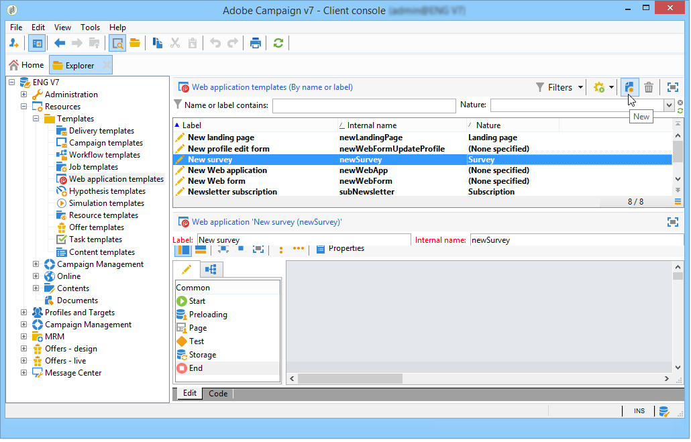

# 웹 양식 템플릿 사용{#using-a-web-form-template}

양식 템플릿은 새 양식을 만들 수 있는 재사용 가능한 구성입니다. 기본적으로 양식 템플릿은 **[!UICONTROL Resources > Templates > Web application templates]** 노드에 웹 응용 프로그램 템플릿과 함께 저장됩니다.

여기에서 새 템플릿을 만들거나 기존 양식을 템플릿으로 변환할 수 있습니다.

## 기존 양식을 템플릿으로 변환 {#convert-an-existing-form-into-a-template}

양식을 템플릿으로 변경하여 해당 구성을 다시 사용할 수 있습니다. 이렇게 하려면 양식을 선택하고 마우스 오른쪽 단추를 클릭한 후 선택합니다 **[!UICONTROL Actions > Save as template...]**.

이 작업을 수행하면 웹 응용 프로그램 만들기 창이 열립니다. 템플릿의 이름과 설명을 입력하고 저장할 폴더를 선택할 수 있습니다.

## 새 양식 템플릿 만들기 {#create-a-new-form-template}

웹 양식 템플릿을 만들려면 웹 응용 프로그램 템플릿 목록을 마우스 오른쪽 단추로 클릭하고 을 **[!UICONTROL New]**&#x200B;선택합니다. 템플릿 목록 위의 **[!UICONTROL New]** 단추를 사용할 수도 있습니다.

템플릿의 이름을 입력합니다. 필드에서 **[!UICONTROL Instance folder]** 이 템플릿을 기반으로 만든 웹 양식이 저장되는 폴더를 선택합니다. 이 **[!UICONTROL Nature]** 필드를 사용하면 다양한 웹 애플리케이션 템플릿을 정렬 및/또는 필터링할 수사적 정보를 추가할 수 있습니다.

단추를 클릭하여 템플릿을 만든 다음 이 템플릿의 컨텐츠를 작성하고 해당 매개 변수를 정의합니다. **[!UICONTROL Save]**

이제 새 양식을 만들 때 이 템플릿을 선택할 수 있습니다.
