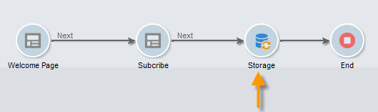

# 웹 양식 답변{#web-forms-answers}


## 응답 저장소 필드 {#response-storage-fields}

양식에 대한 답변은 데이터베이스의 필드에 저장하거나 로컬 변수에 임시로 저장할 수 있습니다. 응답을 위한 스토리지 모드는 필드를 생성하는 동안 선택됩니다. 를 통해 편집할 수 있습니다 **[!UICONTROL Edit storage...]** 링크를 클릭합니다.

양식의 각 입력 필드에 대해 다음 저장소 옵션을 사용할 수 있습니다.


* **[!UICONTROL Edit a recipient]**

   데이터베이스의 필드를 선택할 수 있습니다. 사용자의 답변이 이 필드에 저장됩니다. 각 사용자에 대해 입력한 마지막 값만 저장됩니다. 프로필에 추가됩니다. 을(를) 참조하십시오. [데이터베이스에 데이터 저장](#storing-data-in-the-database).

* **[!UICONTROL Variable]**

   데이터베이스에 정보를 저장하지 않으려는 경우 변수를 사용할 수 있습니다. 로컬 변수는 업스트림으로 선언할 수 있습니다. 을(를) 참조하십시오. [로컬 변수에 데이터 저장](#storing-data-in-a-local-variable).

### 데이터베이스에 데이터 저장 {#storing-data-in-the-database}

데이터베이스의 기존 필드에 데이터를 저장하려면 **[!UICONTROL Edit expression]** 아이콘을 클릭하고 사용 가능한 필드 목록에서 해당 아이콘을 선택합니다.


>[!NOTE]
>
>기본 참조 문서는 **nms:recipient** 스키마. 보거나 새 양식을 선택하려면 목록에서 양식을 선택하고 **[!UICONTROL Properties]** 버튼을 클릭합니다.

### 로컬 변수에 데이터 저장 {#storing-data-in-a-local-variable}

로컬 변수를 사용하여 데이터가 데이터베이스에 저장되지 않더라도 페이지 또는 다른 페이지에서 다시 사용할 수 있습니다. 예를 들어 필드 표시에 조건을 배치하거나 메시지를 개인화할 수 있습니다.

즉, 저장하지 않은 필드 값을 사용하여 페이지에서 옵션 그룹 표시를 승인할 수 있습니다. 아래 페이지에서는 차량 유형이 데이터베이스에 저장되지 않습니다.


이 변수는 드롭다운 상자를 만들 때 선택해야 하는 변수 또는 **[!UICONTROL Edit storage...]** 링크를 클릭합니다.


기존 변수를 표시하고 를 통해 새 변수를 만들 수 있습니다 **[!UICONTROL Edit variables...]** 링크를 클릭합니다. 을(를) 클릭합니다. **[!UICONTROL Add]** 새 변수를 만드는 단추입니다.


추가된 변수는 페이지의 입력 필드를 만들 때 로컬 변수 목록에서 사용할 수 있습니다.

>[!NOTE]
>
>각 양식에 대해 업스트림에 변수를 만들 수 있습니다. 이렇게 하려면 양식을 선택하고 **[!UICONTROL Properties]** 버튼을 클릭합니다. 다음 **[!UICONTROL Variables]** 탭에는 양식의 로컬 변수가 포함되어 있습니다.

**공조용 로컬 저장소의 예**

위의 예에서, 개인 차량에 대한 데이터가 포함된 컨테이너는 **[!UICONTROL Private]** 선택 사항은 가시성 조건에 표시된 대로 드롭다운 목록에서 선택됩니다.


사용자가 개인 차량을 선택하면 웹 양식에서는 다음 옵션을 제공합니다.


Professional 옵션을 선택하면 가시성 조건에 명시된 대로 상용 차량에 대한 데이터를 포함하는 컨테이너가 표시됩니다.


즉, 사용자가 상업용 자동차를 선택하는 경우 양식에서 다음 옵션을 제공합니다.


## 수집된 정보 사용 {#using-collected-information}

각 양식에 대해 제공된 답변을 필드나 레이블에서 다시 사용할 수 있습니다. 다음 구문을 사용해야 합니다.

* 데이터베이스의 필드에 저장된 컨텐츠의 경우:

   ```
   <%=ctx.recipient.@field name%
   ```

* 로컬 변수에 저장된 컨텐츠의 경우:

   ```
   <%= ctx.vars.variable name %
   ```

* HTML 텍스트 필드에 저장된 컨텐츠의 경우:

   ```
   <%== HTML field name %
   ```

   >[!NOTE]
   >
   >다른 필드와 달리 `<%=` 문자는 이스케이프 문자로 대체되며 HTML 컨텐츠는 그대로 저장됩니다. `<%==` 구문

## 웹 양식 답변 저장 {#saving-web-forms-answers}

양식의 페이지에 수집된 정보를 저장하려면 다이어그램에 저장 상자를 배치해야 합니다.



이 상자를 사용하는 방법에는 두 가지가 있습니다.

* 전자 메일로 전송된 링크를 통해 웹 양식에 액세스한 경우, 응용 프로그램에 액세스하는 사용자가 데이터베이스에 이미 있는 경우, **[!UICONTROL Update the preloaded record]** 선택 사항입니다. 자세한 내용은 [이메일을 통해 양식 제공](publishing-a-web-form.md#delivering-a-form-via-email).

   이 경우 Adobe Campaign은 Adobe Campaign에서 각 프로필에 할당된 고유 식별자인 사용자 프로필의 암호화된 기본 키를 사용합니다. 사전 로드 상자를 통해 미리 로드하도록 정보를 구성해야 합니다. 자세한 내용은 [양식 데이터 미리 로드](publishing-a-web-form.md#pre-loading-the-form-data).

   >[!CAUTION]
   >
   >이 옵션은 입력할 필드가 있는 경우 이메일 주소를 포함하여 사용자 데이터를 무시합니다. 새 프로필을 만드는 데 사용할 수 없으며 양식에서 미리 로드할 상자를 사용해야 합니다.

* 데이터베이스에서 수신자의 데이터를 보강하려면 저장소 상자를 편집하고 조정 키를 선택합니다. 내부 사용(일반적으로 인트라넷 시스템)이나 예를 들어 새 프로필을 만드는 데 사용되는 양식의 경우 조정 필드를 선택할 수 있습니다. 이 상자는 웹 응용 프로그램의 여러 페이지에서 사용되는 데이터베이스의 모든 필드를 제공합니다.

   

기본적으로 데이터는 **[!UICONTROL Update or insertion]** 작업: 데이터베이스에 있으면 요소가 업데이트됩니다(예: 선택한 뉴스레터 또는 입력한 이메일 주소). 존재하지 않으면 정보가 추가됩니다.

그러나 이 동작을 변경할 수 있습니다. 이렇게 하려면 요소의 루트를 선택하고 드롭다운 목록에서 수행할 작업을 선택합니다.


조정 검색 폴더를 선택하고 새 프로필에 대한 만들기 폴더를 선택할 수 있습니다. 이러한 필드가 비어 있으면 연산자의 기본 폴더에서 프로필을 검색하고 만듭니다.

>[!NOTE]
>
>가능한 작업은 다음과 같습니다. **[!UICONTROL Simple reconciliation]**, **[!UICONTROL Update or insertion]**, **[!UICONTROL Insertion]**, **[!UICONTROL Update]**, **[!UICONTROL Deletion]**.\
>연산자의 기본 폴더는 연산자에 쓰기 권한이 있는 첫 번째 폴더입니다.\
>[이 섹션](../../platform/using/access-management.md)을 참조하십시오.
