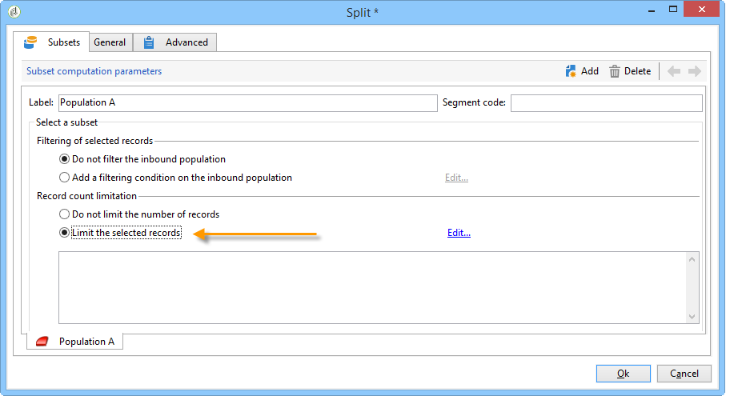
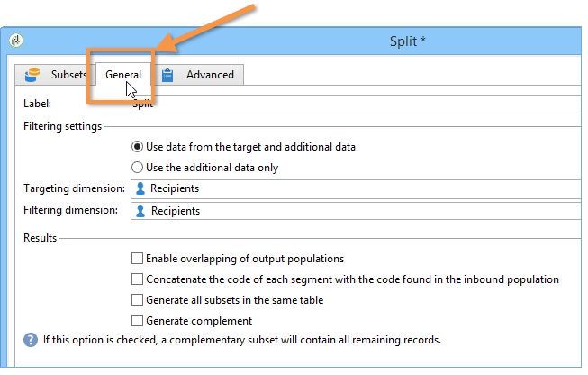
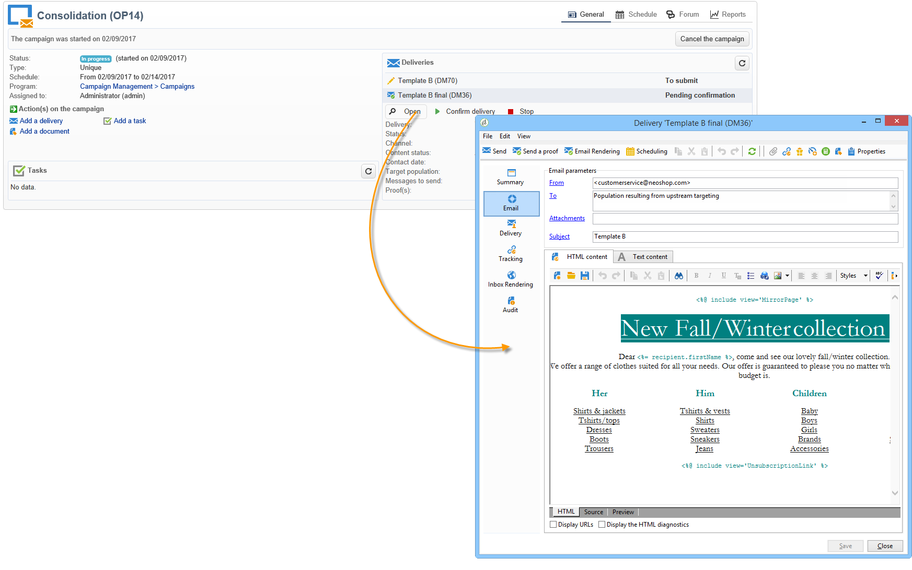

# A/B 테스트{#a-b-testing}

이메일 전달에 대한 컨텐츠가 여러 개 있고 타깃팅된 모집단에게 가장 큰 영향을 미치는 버전을 확인하려면 다른 버전을 일부 수신자에게 보낸 다음 성공률이 가장 높은 버전을 선택하여 나머지 수신자에게 보낼 수 있습니다.

이 사용 사례에서는 타깃팅 워크플로우를 통해 두 개의 이메일 배달 컨텐츠를 비교하려고 합니다. 메시지와 텍스트는 두 전달 모두에서 동일합니다.레이아웃만 변경됩니다.

타깃팅된 인구는 다음 세 개로 나눠집니다.두 개의 테스트 그룹과 나머지 모집단. 다른 버전의 배달이 각 테스트 그룹에 전송됩니다. 배달을 수행한 후 최적의 공개 비율의 결과를 수집하기 전에 5일 대기 기간이 구성됩니다. 점수가 가장 높은 게재 컨텐츠는 스크립트에서 복구되고 테스트 그룹으로 사용되지 않은 모집단으로 전송됩니다.

가장 적합한 배달을 결정하는 기준은 귀하의 요구 사항에 맞게 변경될 수 있습니다. 개방 비율, 클릭스루 비율, 구독 비율, 재활동 등이 가능합니다.

또한 이 사용 사례에 자세히 설명된 테스트는 두 개의 전달에만 해당되지만 필요한 만큼의 버전을 테스트할 수 있습니다. 워크플로우에 활동을 추가하면 됩니다.

A/B 테스트를 만들려면 다음 단계를 적용합니다.

* [1단계:타깃팅 워크플로우 만들기](#step-1--creating-a-targeting-workflow)
* [2단계:모집단 샘플 구성](#step-2--configuring-population-samples)
* [3단계:두 개의 배달 템플릿 만들기](#step-3--creating-two-delivery-templates)
* [4단계:워크플로우에서 배달 구성](#step-4--configuring-the-deliveries-in-the-workflow)
* [5단계:스크립트 만들기](#step-5--creating-the-script)
* [7단계:워크플로우 시작](#step-7--starting-the-workflow)
* [8단계:결과](#step-8--analyzing-the-result)분석

## 1단계:타깃팅 워크플로우 만들기 {#step-1--creating-a-targeting-workflow}

캠페인의 **[!UICONTROL Targeting and Workflows]** 탭에서 워크플로우를 만들어야 합니다. 이것은 **[!UICONTROL Query]** 활동, 두 개의 활동, **[!UICONTROL Split]** 활동, **[!UICONTROL Email delivery]** 활동 및 **[!UICONTROL Wait]** **[!UICONTROL JavaScript code]** **[!UICONTROL Delivery]** 활동에 연결된 활동으로 구성됩니다.

1. 아직 캠페인을 만들지 않은 경우 캠페인을 만드십시오(자세한 내용은 이 [섹션을](../../campaign/using/setting-up-marketing-campaigns.md#creating-a-campaign)참조하십시오).

   

1. 탭으로 **[!UICONTROL Targeting and Workflows]** 이동합니다.

   

1. 기존 워크플로우의 레이블을 변경하거나 클릭하여 새 워크플로우를 **[!UICONTROL Add]** 만듭니다(자세한 내용은 이 [섹션을](../../campaign/using/marketing-campaign-deliveries.md#selecting-the-target-population)참조하십시오).

   

1. 마우스를 사용하여 **[!UICONTROL Query]** (**[!UICONTROL Target]** 탭), **[!UICONTROL Split]** (**[!UICONTROL Target]** 탭), **[!UICONTROL Email deliveries]** (**[!UICONTROL Deliveries]** 탭), ( **[!UICONTROL Wait]** 탭),**[!UICONTROL Flow Control]** 활동( **[!UICONTROL JavaScript code]** 탭), 활동(탭), 활동(**[!UICONTROL Actions]** **[!UICONTROL Delivery]****[!UICONTROL Actions]** 탭), 활동, 활동(탭), 활동(탭), 활동 및 활동(활동) 탭), 활동(활동 탭), 활동(활성 상태 탭)을 포함한 워크플로우 다이어그램에 활동을 드래그하여 놓습니다.


## 2단계:모집단 샘플 구성 {#step-2--configuring-population-samples}

### 쿼리 활동 구성 {#configuring-the-query-activity}

* 활동을 두 번 **[!UICONTROL Query]** 클릭합니다.

   

* 링크를 클릭하고 타깃팅할 수신자를 선택합니다. **[!UICONTROL Edit query]**

   

* 활동을 **[!UICONTROL Query]** 활동에 **[!UICONTROL Split]** 연결합니다.

   

### 분할 활동 구성 {#configuring-the-split-activity}

이 활동을 통해 다음과 같은 여러 모집단을 만들 수 있습니다.배달 A를 받는 사람, 배달 B를 받는 사람 및 나머지 모집단을 말합니다. 임의 선택을 사용하면 각 게재의 모집단의 일부만 타깃팅할 수 있습니다.

1. 모집단 A 만들기:

   * 활동을 두 번 **[!UICONTROL Split]** 클릭합니다.

      

   * 기존 탭에서 레이블을 인구 A로 변경합니다.

      

   * 옵션을 **[!UICONTROL Limit the selected records]** 선택합니다.

      

   * 링크를 클릭하고 **[!UICONTROL Edit]** 선택한 다음 **[!UICONTROL Activate random sampling]****[!UICONTROL Next]**&#x200B;을 클릭합니다.

      

   * 임계값을 10%로 설정한 다음 을 **[!UICONTROL Finish]**&#x200B;클릭합니다.

      

1. 모집단 B 생성:

   * 모집단 B **[!UICONTROL Add]** 에 대한 새 탭을 만들려면 을 클릭합니다.

      

   * 모집단 수를 이전 버전처럼 10%로 제한합니다.

      

1. 나머지 채우기 만들기:

   * 탭으로 **[!UICONTROL General]** 이동합니다.

      

   * 을 **[!UICONTROL Generate complement]**&#x200B;선택합니다.

      

   * 레이블을 변경하여 이 모집단에 A와 B가 포함되지 않도록 지정하고 을 클릭하여 활동을 **[!UICONTROL OK]** 닫습니다.

      

## 3단계:두 개의 배달 템플릿 만들기 {#step-3--creating-two-delivery-templates}

이제 두 개의 전달 템플릿을 만들고 싶습니다. 각 템플릿은 활동에 연결된 **[!UICONTROL Email delivery]** 활동에서 참조됩니다 **[!UICONTROL Split]** . For more on this, refer to this [section](../../delivery/using/about-templates.md).

1. 폴더로 **[!UICONTROL Resources > Delivery template]** 이동합니다.
1. 배달 **[!UICONTROL Email]** 템플릿을 복제합니다.

   

1. 배달 A에 사용할 컨텐츠를 만듭니다.

   

1. 배달 B에 대한 템플릿을 만들려면 이 프로세스를 반복합니다.

   

## 4단계:워크플로우에서 배달 구성 {#step-4--configuring-the-deliveries-in-the-workflow}

다음 단계는 배달을 구성하는 것입니다. 이전 단계에서 생성된 세 개의 모집단:2 [단계:모집단 샘플](#step-2--configuring-population-samples)구성을 참조하십시오. 처음 두 게시는 여러 컨텐츠를 모집단 A와 B로 보낼 수 있도록 합니다.세 번째 배달은 A도 B도 받지 못한 인구를 위한 운명이다.컨텐츠는 스크립트로 계산되며 가장 높은 공개 비율을 기록한 A 또는 B와 동일합니다. 세 번째 배달을 위해 배달 A와 B의 결과를 확인하려면 대기 기간을 구성해야 합니다.이것이 세 번째 배달이 **[!UICONTROL Wait]** 활동을 포함하는 이유입니다.

1. 활동 A로 **[!UICONTROL Split]** 이동하고 전환 A를 워크플로우에 이미 있는 이메일 배달 중 하나에 연결합니다.

   

1. 배달을 두 번 클릭하여 엽니다.
1. 드롭다운 목록을 사용하여 배달 A의 템플릿을 선택합니다.

   

1. 배달을 **[!UICONTROL Continue]** 보려면 을 클릭하고 저장합니다.

   

1. 인구 B로 지정되는 **[!UICONTROL Split]** 활동의 전환을 두 번째 이메일 배달에 연결합니다.

   

1. 배달을 열고 배달 B에서 템플릿을 선택한 다음 배달을 저장합니다.

   

1. 나머지 모집단에 대한 전환을 **[!UICONTROL Wait]** 활동에 연결합니다.

   

1. 활동을 **[!UICONTROL Wait]** 열고 5일 대기 기간을 구성합니다.

   

1. 활동을 **[!UICONTROL Wait]** 활동에 **[!UICONTROL JavaScript code]** 연결합니다.

   

## 5단계:스크립트 만들기 {#step-5--creating-the-script}

나머지 모집단에 대한 배달 컨텐츠 선택은 스크립트로 계산됩니다. 이 스크립트는 가장 높은 열기 비율로 게재와 관련된 정보를 복구하고 컨텐츠를 최종 배달에 복사합니다.

### 스크립트 예 {#example-of-a-script}

다음 스크립트는 타깃팅 워크플로우에 있는 그대로 사용할 수 있습니다. 자세한 내용은 구현을 [참조하십시오](#implementation).

```
 // query the database to find the winner (best open rate)
   var winner = xtk.queryDef.create(
     <queryDef schema="nms:delivery" operation="get">
       <select>
         <node expr="@id"/>
         <node expr="@label"/>
         <node expr="[@operation-id]"/>
         <node expr="[@workflow-id]"/>
       </select>
       <where>
         <condition expr={"@FCP=0 and [@workflow-id]= " + instance.id}/>
       </where>
       <orderBy>
         <node expr="[indicators/@estimatedRecipientOpenRatio]" sortDesc="true"/>
       </orderBy>
     </queryDef>).ExecuteQuery()
   
   // create a new delivery object and initialize it by doing a copy of
   // the winner delivery
   var delivery = nms.delivery.create()
   delivery.Duplicate("nms:delivery|" + winner.@id)

   // append 'final' to the delivery label
   delivery.label = winner.@label + " final"

   // link the delivery to the operation to make sure it will be displayed in
   // the campaign dashboard. This attribute needs to be set manually here since 
   // the Duplicate() method has reset it to its default value => 0
   delivery.operation_id = winner.@["operation-id"]
   delivery.workflow_id = winner.@["workflow-id"]

   // adjust some delivery parameters to make it compatible with the 
   // "Prepare and start" option selected in the Delivery tab of this activity
   delivery.scheduling.validationMode = "manual"
   delivery.scheduling.delayed = 0
 
   // save the delivery in database
   delivery.save()
 
   // store the new delivery Id in event variables
   vars.deliveryId = delivery.id
```

스크립트에 대한 자세한 설명은 [스크립트의](#details-of-the-script)세부 사항을 참조하십시오.

### 구현 {#implementation}

1. 활동을 **[!UICONTROL JavaScript code]** 엽니다.
1. 스크립트 [예제에 제공된 스크립트를](#example-of-a-script) **[!UICONTROL JavaScript code]** 창에 복사합니다.

   

1. 필드에 스크립트 이름(예: **[!UICONTROL Label]**

   ```
   <%= vars.deliveryId %>
   ```

   

1. 활동을 **[!UICONTROL JavaScript code]** 닫습니다.
1. 워크플로우 저장

### 스크립트 세부 사항 {#details-of-the-script}

이 섹션에서는 스크립트의 다양한 부분과 해당 운영 모드에 대해 자세히 설명합니다.

* 스크립트의 첫 번째 부분은 쿼리입니다. queryDef **명령을 사용하면** 타깃팅 워크플로우를 실행하여 만든 **** 배달을 NmsDelivery 테이블에서 복구할 수 있으며 예상 열률을 기준으로 배달을 정렬하면 가장 높은 열률을 갖는 게재의 정보가 복구됩니다.

   ```
   // query the database to find the winner (best open rate)
      var winner = xtk.queryDef.create(
        <queryDef schema="nms:delivery" operation="get">
          <select>
            <node expr="@id"/>
            <node expr="@label"/>
            <node expr="[@operation-id]"/>
          </select>
          <where>
            <condition expr={"@FCP=0 and [@workflow-id]= " + instance.id}/>
          </where>
          <orderBy>
            <node expr="[indicators/@estimatedRecipientOpenRatio]" sortDesc="true"/>
          </orderBy>
        </queryDef>).ExecuteQuery()
   ```

* 열림 비율이 가장 높은 배달은 중복됩니다.

   ```
    // create a new delivery object and initialize it by doing a copy of
    // the winner delivery
   var delivery = nms.delivery.create()
   delivery.Duplicate("nms:delivery|" + winner.@id)
   ```

* 복제된 게재의 레이블이 수정되고 **final** 이라는 단어가 추가됩니다.

   ```
   // append 'final' to the delivery label
   delivery.label = winner.@label + " final"
   ```

* 게재가 캠페인 대시보드로 복사됩니다.

   ```
   // link the delivery to the operation to make sure it will be displayed in
   // the campaign dashboard. This attribute needs to be set manually here since 
   // the Duplicate() method has reset it to its default value => 0
   delivery.operation_id = winner.@["operation-id"]
   delivery.workflow_id = winner.@["workflow-id"]
   ```

   ```
   // adjust some delivery parameters to make it compatible with the 
   // "Prepare and start" option selected in the Delivery tab of this activity
   delivery.scheduling.validationMode = "manual"
   delivery.scheduling.delayed = 0
   ```

* 배달이 데이터베이스에 저장됩니다.

   ```
   // save the delivery in database
   delivery.save()
   ```

* 중복된 배달의 고유 식별자는 워크플로 변수에 저장됩니다.

   ```
   // store the new delivery Id in event variables
   vars.deliveryId = delivery.id
   ```

### 기타 선택 기준 {#other-selection-criteria}

위의 예에서는 이메일 열기의 비율에 따라 배달을 선택할 수 있습니다. 다음과 같은 전달 특정 지표를 기반으로 하여 자신을 조정할 수 있습니다.

* 최고의 클릭 처리량: `[indicators/@recipientClickRatio]`,
* 최대 재활동 비율(이메일 열기 및 메시지 클릭): `[indicators/@reactivity]`,
* 최저 불만 비율: `[indicators/@refusedRatio]` (sortDesc 속성에 대해 false 값 사용),
* 최고 전환율: `[indicators/@transactionRatio]`,
* 메시지 수신 후 방문한 페이지 수: `[indicators/@totalWebPage]`,
* 가장 낮은 구독 취소 비율: `[indicators/@optOutRatio]`,
* 거래 금액: `[indicators/@amount]`Adobe

## 6단계:최종 배달 정의 {#step-6--defining-the-final-delivery}

스크립트를 만들어 A/B 테스트 우승자를 선택하면 최종 전달의 매개 변수를 정의할 수 있습니다.

1. 활동을 나머지 **[!UICONTROL JavaScript code]** **[!UICONTROL Delivery]** 활동에 연결합니다.
1. 활동을 **[!UICONTROL Delivery]** 엽니다.
1. 이 **[!UICONTROL Generate an outbound transition]** 활동으로 워크플로우를 완료하려면 옵션의 선택을 취소하십시오.
1. 다른 옵션을 기본값으로 둡니다.

   

전환(활동을 통해 정의됨)에 지정된 배달을 준비하면 다음 단계에 설명된 대로 이를 승인하고 전송을 시작할 수 있습니다. **[!UICONTROL Javascript Code]**

## 7단계:워크플로우 시작 {#step-7--starting-the-workflow}

1. 워크플로우를 **[!UICONTROL Start]** 클릭합니다.

   

1. 캠페인 대시보드를 통해 게재 A 및 B에 대한 타겟 및 컨텐츠를 승인합니다.
1. 배달 확인
1. 5일 기간이 끝날 때까지 기다렸다가 전달 시작 결과 후 계산된 컨텐츠를 확인합니다.

   

   이 경우 템플릿 B가 선택되었습니다.

1. 세 번째 게재의 컨텐츠가 결정되면 타겟과 컨텐츠를 승인합니다.

## 8단계:결과 분석 {#step-8--analyzing-the-result}

테스트 배달을 전송한 후에는 발송된 받는 사람과 해당 배달을 열지 여부를 확인할 수 있습니다.

* 타깃팅된 수신자를 확인하려면 캠페인 대시보드를 통해 배달을 열고 **[!UICONTROL Delivery]** 탭을 클릭합니다.

   

* 배달을 열었는지 확인하려면 **[!UICONTROL Tracking]** 탭으로 이동합니다.

   

* 다른 게재와 비교해 보십시오.

   

우리의 예에서, 배달 B가 가장 높은 공개 비율을 기록했습니다. 즉, 컨텐츠 B가 최종 전달에 사용됩니다.


