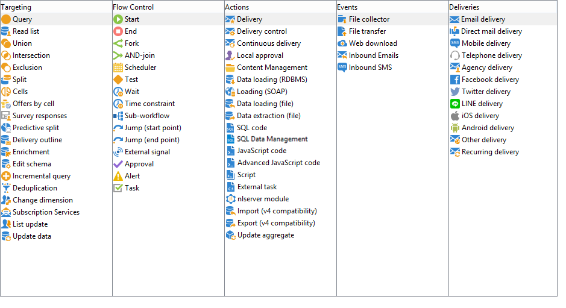

# 활동 정보{#about-activities}

이 섹션에서는 사용 가능한 모든 활동에 대해 설명합니다. 워크플로우가 생성/편집되는 노드 또는 컨텍스트에 따라 사용 가능한 활동이 달라질 수 있습니다. 예를 들어 캠페인에서 만든 워크플로우에는 채널별 게재 활동이 있습니다.

워크플로우 활동은 범주별로 그룹화됩니다. 동시에 4개의 탭을 사용할 수 있습니다.

캠페인 워크플로우에서 **[!UICONTROL Events]** 탭이 탭으로 바뀝니다 **[!UICONTROL Deliveries]** . 이 탭의 활동은 작업 [활동](#action-activities) 섹션에 자세히 설명되어 있습니다.

자세한 내용:

* [타깃팅 활동 정보](../../workflow/using/about-targeting-activities.md)
* [데이터 가져오기](../../workflow/using/importing-data.md)
* [워크플로우 실행](../../workflow/using/executing-a-workflow.md)
* [워크플로우 모범 사례](../../workflow/using/workflow-best-practices.md)
