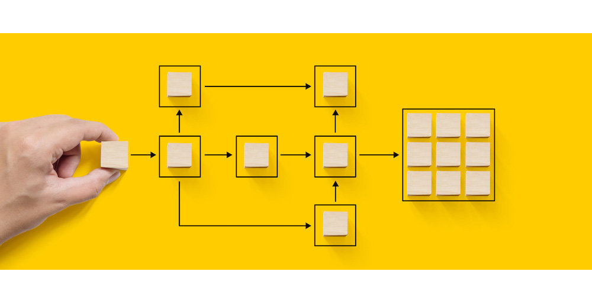

# 워크플로로 자동화 {#gs-workflows}

Adobe Campaign에는 애플리케이션 서버의 여러 모듈에 걸쳐 전체 프로세스 및 작업을 오케스트레이션할 수 있는 워크플로 모듈이 포함되어 있습니다. 이 포괄적인 그래픽 환경을 사용하면 세분화, 캠페인 실행, 파일 처리, 인력 참여 등의 프로세스를 디자인할 수 있습니다. 워크플로 엔진은 이러한 프로세스를 실행하고 추적합니다.

예를 들어 워크플로에서 서버에서 파일을 다운로드하고 압축을 해제한 다음 Adobe Campaign 데이터베이스에 포함된 레코드를 가져올 수 있습니다.

{width="40%" align="center"}

>[!BEGINTABS]

>[!TAB 워크플로 설명서]

워크플로우 관리에 대한 자세한 내용은 [Campaign v8 설명서](https://experienceleague.adobe.com/docs/campaign/automation/workflows/introduction/build-a-workflow.html?lang=ko){target=_blank}를 참조하세요.

{target=_blank}

>[!TAB 유용한 링크]

워크플로우 관리와 관련된 주요 단계는 Campaign v8 설명서에서 확인할 수 있습니다.

* [워크플로우 활동](https://experienceleague.adobe.com/docs/campaign/automation/workflows/wf-activities/activities.html?lang=ko){target=_blank}: 활동이 작업 템플릿을 설명합니다. 워크플로우에는 타겟팅, 흐름 제어, 작업 및 이벤트 활동이 포함됩니다.

* [워크플로우 구축](https://experienceleague.adobe.com/docs/campaign/automation/workflows/introduction/build-a-workflow.html?lang=ko){target=_blank}: 타깃팅, 캠페인 및 기술 워크플로우를 만들고 실행하는 방법을 알아봅니다.

* [모범 사례](https://experienceleague.adobe.com/docs/campaign/automation/workflows/introduction/workflow-best-practices.html){target=_blank}: Campaign 워크플로 성능을 최적화하고, 워크플로 디자인을 개선하고, 올바른 설정을 선택하는 지침에 대해 알아봅니다.

* [워크플로우 모니터링](https://experienceleague.adobe.com/docs/campaign/automation/workflows/monitoring-workflows/monitor-workflow-execution.html){target=_blank}: 모든 것이 올바르게 실행되고 있는지 확인하기 위해 워크플로우 실행을 모니터링하는 방법을 알아봅니다.

* [워크플로우 사용 사례](https://experienceleague.adobe.com/docs/campaign/automation/workflows/use-cases/workflow-use-cases.html){target=_blank}: 워크플로우를 사용할 수 있는 다양한 컨텍스트와 엔드 투 엔드 사용 사례를 통해 워크플로를 구현하는 방법을 알아봅니다.

>[!ENDTABS]

<!--

Adobe Campaign uses workflows to:

* Carry out targeting campaigns. [Learn more](building-a-workflow.md#implementation-steps-)
* Build campaigns: for each campaign, the **[!UICONTROL Workflow]** tab lets you build the target and create the deliveries. [Learn more](building-a-workflow.md#campaign-workflows)
* Perform technical processes: cleanup, collecting tracking information or provisional calculations. [Learn more](building-a-workflow.md#technical-workflows)

A workflow can mean both a process definition (the workflow model, which is a representation of what is supposed to happen) and an instance of this process (a workflow instance, which is a representation of what is actually happening).

The workflow template describes the various tasks to be performed and how they are linked together. The task templates are called activities and are represented by icons. They are linked together by transitions.

Each workflow contains:

* **[!UICONTROL Activities]**

  An activity describes a task template. The various activities available are represented on the diagram by icons. Each type has common properties and specific properties. For example, while all activities have a name and label, only the **[!UICONTROL Approval]** activity has an assignment.

  In a workflow diagram, a given activity can produce multiple tasks, in particular when there is a loop or recurrent (periodic) actions.

  All workflow activities are listed in [this section](about-activities.md), including use cases and samples.

* **[!UICONTROL Transitions]**

  Transitions enable you to link activities and to define their sequence. A transition links a source activity to a destination activity. There are several sorts of transitions, which depend on the source activity. Some transitions have additional parameters such as a duration, a condition or a filter.

  A transition which is not linked to a destination activity is colored orange and the arrow head is shown as a diamond.

  >[!NOTE]
  >
  >A workflow containing unterminated transitions can still be executed: a warning message will be generated and the workflow will pause once it reaches the transition but it will not generate an error. It is thus possible to start a workflow without it being finished and to add to it as you go along.

  For more information about how to build a workflow, refer to [this section](building-a-workflow.md).

* **[!UICONTROL Worktables]**

  The worktable contains all the information carried by the transition. Each workflow uses several worktables. The data conveyed in these tables can be accelerated and used throughout the workflow's life cycle, as long as it is not purged. Indeed, unneeded tables are purged each time the workflow is passivated, and possibly during the execution of the largest workflows to avoid overloading the server.

  Learn more on workflow data and tables in [this section](how-to-use-workflow-data.md).

## Key principles and best practices{#principles-workflows}

Refer to these sections to find guidance and best practices to automate processes with workflows:

* Learn more about workflow activities in [this page](how-to-use-workflow-data.md).
* Learn how to build a workflow in [this section](building-a-workflow.md).
* Discover how to use workflows to import data in Campaign in [this section](../../platform/using/import-export-workflows.md).
* Workflow best practices are detailed in [this page](workflow-best-practices.md).
* Find guidance about workflow execution in [this section](starting-a-workflow.md).
* Learn how to monitor workflows in [this page](monitoring-workflow-execution.md).
* Learn how to grant access to users to use workflows in [this page](managing-rights.md).

-->