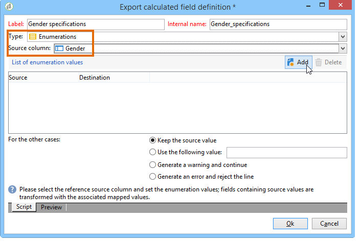

# 열거형 유형 계산 필드 추가 {#adding-an-enumeration-type-calculated-field}

여기에서 **[!UICONTROL Enumerations]** 계산된 필드가 있는 쿼리를 만듭니다. 이 필드는 데이터 미리 보기 창에서 추가 열을 생성합니다. 이 열은 각 수신자에 대한 결과로 반환되는 숫자 값을 지정합니다(0, 1 및 2). 새 열의 각 값에 성별을 지정합니다.&quot;Male&quot;, &quot;1&quot;의 경우 &quot;Female&quot;, &quot;2&quot;의 경우 &quot;Female&quot; 또는 &quot;Not indiced&quot;의 값이 &quot;0&quot;인 경우

* 어떤 표를 선택해야 합니까?

   받는 사람 테이블(nms:recipient)

* 출력 열에서 선택할 필드를 선택하십시오.

   성, 이름, 성별

* 정보를 기준으로 필터링할 기준

   수신자 언어

다음 단계를 적용합니다.

1. 일반 쿼리 편집기를 열고 수신자 테이블(**[!UICONTROL nms:recipient]**)을 선택합니다.
1. 창에서 **[!UICONTROL Data to extract]****[!UICONTROL Last name]**&#x200B;및 **[!UICONTROL First name]** **[!UICONTROL Gender]**&#x200B;을 선택합니다.

   

1. 창에서 다음을 **[!UICONTROL Sorting]** 클릭합니다 **[!UICONTROL Next]**.이 예에는 no sort가 필요하지 않습니다.
1. 에서 **[!UICONTROL Data filtering]**&#x200B;을 선택합니다 **[!UICONTROL Filtering conditions]**.
1. 창에서 **[!UICONTROL Target element]** 필터 조건을 설정하여 영어를 말하는 수신자를 수집합니다.

   

1. 창에서 **[!UICONTROL Data formatting]** 을 클릭합니다 **[!UICONTROL Add a calculated field]**.

   

1. 창의 **[!UICONTROL Type]** 창으로 **[!UICONTROL Export calculated field definition]** 이동하여 선택합니다 **[!UICONTROL Enumerations]**.

   새 계산된 필드가 참조할 열을 정의합니다. 이렇게 하려면 **[!UICONTROL Gender]** **[!UICONTROL Source column]** 필드의 드롭다운 메뉴에서 열을 선택합니다.대상 값은 **[!UICONTROL Gender]** 열과 일치합니다.

   

   소스 및 **대상** 값을 **정의합니다** .대상 값을 사용하면 쿼리 결과를 쉽게 읽을 수 있습니다. 이 쿼리는 받는 사람 성별을 반환해야 하며 결과는 0, 1 또는 2입니다.

   입력할 각 &quot;소스 대상&quot; 줄에 대해 다음을 **[!UICONTROL Add]** 클릭합니다 **[!UICONTROL List of enumeration values]**.

   * 열에 **[!UICONTROL Source]** 새 줄에 성별(0,1,2)의 소스 값을 입력합니다.
   * 열에 값을 **[!UICONTROL Destination]** 입력합니다.라인 &quot;0&quot;의 경우 &quot;지정되지 않음&quot;, 라인 &quot;1&quot;의 경우 &quot;남성&quot;, 라인 &quot;2&quot;의 경우 &quot;여성&quot;입니다.
   함수를 **[!UICONTROL Keep the source value]** 선택합니다.

   을 **[!UICONTROL OK]** 클릭하여 계산된 필드를 승인합니다.

   

1. 창에서 **[!UICONTROL Data formatting]** 을 클릭합니다 **[!UICONTROL Next]**.
1. 미리 보기 창에서 **[!UICONTROL start the preview of the data]**&#x200B;다음을 수행합니다.

   추가 열은 0, 1 및 2의 성별을 정의합니다.

   * 0 - &quot;지정되지 않음&quot;
   * 1 for &quot;Male&quot;
   * &quot;여성&quot;의 경우 2
   

   예를 들어, 에 성별 &quot;2&quot;를 입력하지 **[!UICONTROL List of enumeration values]**&#x200B;않고 필드의 **[!UICONTROL Generate a warning and continue]** 함수가 선택되면 경고 **[!UICONTROL In other cases]** 로그가 표시됩니다. 이 로그는 성별 &quot;2&quot;(여성)을 입력하지 않았음을 나타냅니다. 데이터 미리 보기 창의 **[!UICONTROL Logs generated during export]** 필드에 표시됩니다.

   

   다른 예를 들어 &quot;2&quot; 열거형 값이 입력되지 않았다고 가정해 보겠습니다. 다음 **[!UICONTROL Generate an error and reject the line]** 함수를 선택합니다.모든 성별 &quot;2&quot; 수신자는 예외 항목 및 기타 라인(이름과 성 등)의 정보를 발생시킵니다. 내보내지 않습니다. 데이터 미리 보기 창의 **[!UICONTROL Logs generated during export]** 필드에 오류 로그가 표시됩니다. 이 로그는 열거 값 &quot;2&quot;를 입력하지 않았음을 나타냅니다.

   
