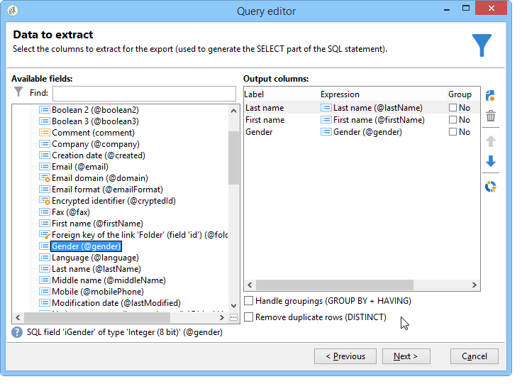

# Adding an Enumeration type calculated field {#adding-an-enumeration-type-calculated-field}

여기에서 계산된 필드가 있는 쿼리를 **[!UICONTROL Enumerations]** 만듭니다. 이 필드는 데이터 미리 보기 창에 추가 열을 생성합니다. 이 열은 각 받는 사람(0, 1 및 2)의 결과로 반환되는 숫자 값을 지정합니다. 새 열의 각 값에 성별을 지정합니다.&quot;Male&quot;, &quot;2&quot;의 경우 &quot;Female&quot;, &quot;Not indicated&quot;의 경우 값이 &quot;0&quot;일 경우

* 어떤 표를 선택해야 합니까?

   받는 사람 테이블(nms:recipient)

* 출력 열에서 선택할 필드를 선택하십시오.

   성, 이름, 성별

* 정보를 기준으로 필터링할 기준

   받는 사람 언어

다음 단계를 적용합니다.

1. 일반 쿼리 편집기를 열고 수신자 테이블(**[!UICONTROL nms:recipient]**)을 선택합니다.
1. 창에서 **[!UICONTROL Data to extract]** 를 선택하고 **[!UICONTROL Last name]**&#x200B;을 **[!UICONTROL First name]** **[!UICONTROL Gender]**&#x200B;선택합니다.

   

1. 창에서 **[!UICONTROL Sorting]** 다음을 클릭합니다 **[!UICONTROL Next]**.이 예에는 no sort가 필요합니다.
1. **[!UICONTROL Data filtering]**&#x200B;에서 **[!UICONTROL Filtering conditions]**&#x200B;을(를) 선택합니다.
1. 창에서 **[!UICONTROL Target element]** 영어로 말하는 수신자를 수집하도록 필터 조건을 설정합니다.

   

1. In the **[!UICONTROL Data formatting]** window, click **[!UICONTROL Add a calculated field]**.

   

1. 창의 **[!UICONTROL Type]** 창으로 **[!UICONTROL Export calculated field definition]** 이동하여 선택합니다 **[!UICONTROL Enumerations]**.

   새 계산된 필드가 참조하는 열을 정의합니다. 이렇게 하려면 필드의 드롭다운 메뉴에서 **[!UICONTROL Gender]** 열을 **[!UICONTROL Source column]** 선택합니다.대상 값은 열과 **[!UICONTROL Gender]** 일치합니다.

   

   소스 **및 대상** 값을 **정의합니다** .대상 값을 사용하면 쿼리 결과를 쉽게 읽을 수 있습니다. 이 쿼리는 받는 사람 성별을 반환해야 하며 결과는 0, 1 또는 2입니다.

   각 &quot;소스 대상&quot; 줄을 입력하려면 다음을 클릭하십시오. **[!UICONTROL Add]** **[!UICONTROL List of enumeration values]**

   * 열에 **[!UICONTROL Source]** 새 줄에 성별(0,1,2)의 소스 값을 입력합니다.
   * 열에 **[!UICONTROL Destination]** 값을 입력합니다.라인 &quot;0&quot;에 대해 &quot;Not indicated&quot;, 라인 &quot;1&quot;에 대해 &quot;Male&quot;, 라인 &quot;2&quot;에 대해 &quot;Female&quot;.

   함수를 **[!UICONTROL Keep the source value]** 선택합니다.

   을 **[!UICONTROL OK]** 클릭하여 계산된 필드를 승인합니다.

   

1. In the **[!UICONTROL Data formatting]** window, click **[!UICONTROL Next]**.
1. 미리 보기 창에서, **[!UICONTROL start the preview of the data]**

   추가 열은 0, 1 및 2의 성별을 정의합니다.

   * 0의 경우 &quot;지정되지 않음&quot;
   * &quot;남성&quot;의 경우 1
   * &quot;여성&quot;의 경우 2

   

   예를 들어, 필드에 성별 &quot;2&quot;를 입력하지 **[!UICONTROL List of enumeration values]**&#x200B;않고 필드의 **[!UICONTROL Generate a warning and continue]** 기능이 선택되면 **[!UICONTROL In other cases]** 경고 로그가 표시됩니다. 이 로그는 성별 &quot;2&quot;(여성)을 입력하지 않았음을 나타냅니다. 데이터 미리 보기 창의 **[!UICONTROL Logs generated during export]** 필드에 표시됩니다.

   

   다른 예를 들어 &quot;2&quot; 열거형 값이 입력되지 않았다고 가정해 보겠습니다. 다음 **[!UICONTROL Generate an error and reject the line]** 함수를 선택합니다.모든 성별 &quot;2&quot; 수신자는 예외 항목 및 기타 라인(이름과 성 등)의 정보를 발생시킵니다. 내보낼 수 없습니다. 데이터 미리 보기 창의 **[!UICONTROL Logs generated during export]** 필드에 오류 로그가 표시됩니다. 이 로그는 열거형 값 &quot;2&quot;을(를) 입력하지 않았음을 나타냅니다.

   
