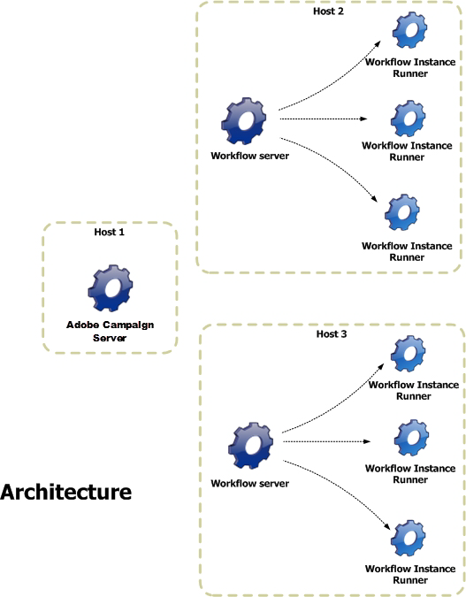

# 아키텍처 {#architecture}

워크플로우는 특정 모듈에 의해 처리됩니다. 이 모듈은 처리 로드를 공유하기 위해 여러 서버에서 시작할 수 있습니다.

* 워크플로 인스턴스 실행자(runwf) 프로세스는 주어진 워크플로 인스턴스의 모든 작업을 실행합니다. 당분간 실행할 작업이 없으면 &#39;수동&#39;이 됩니다. 즉, 데이터베이스에 상태를 저장한 다음 중지합니다.
* &#39;워크플로 서버&#39;(wfserver) 모듈은 현재 워크플로 인스턴스를 모니터링합니다. 수행할 작업이 있는 경우 이 모듈은 해당 인스턴스를 활성화(또는 재활성화)하는 프로세스를 만듭니다.
