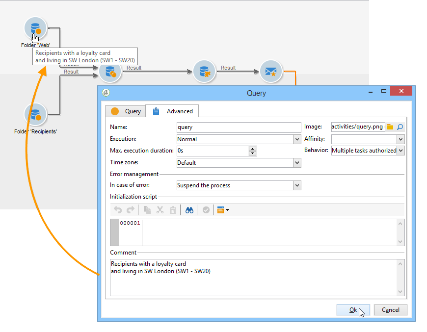
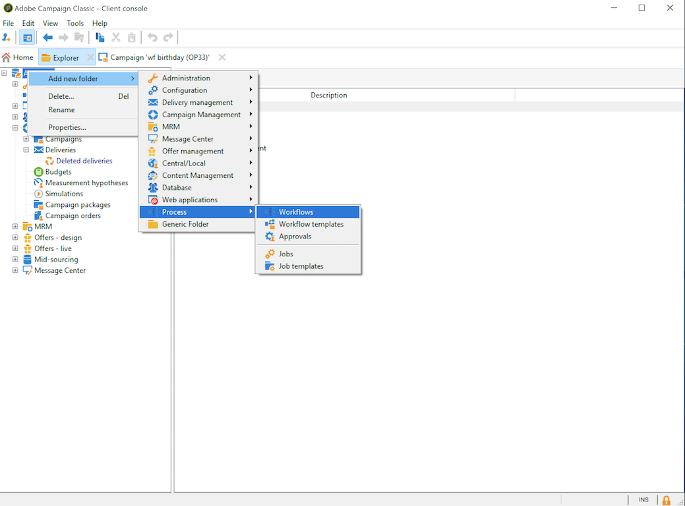

# 워크플로우 구축 {#building-a-workflow}

이 섹션에서는 Campaign에서 워크플로우를 구축하기 위한 주요 원칙과 우수 사례에 대해 자세히 설명합니다.

* 워크플로우 만들기를 참조하십시오. 새 [워크플로우 만들기](#creating-a-new-workflow)
* 워크플로우 다이어그램 디자인, 활동 [추가 및 연결을 참조하십시오.](#adding-and-linking-activities)
* 활동의 매개 변수 및 속성에 액세스하려면 활동 [구성을 참조하십시오.](#configuring-activities)
* 타깃팅 워크플로우 디자인, 타깃팅 [워크플로우 참조](#targeting-workflows)
* 워크플로우를 사용하여 캠페인을 실행합니다. 캠페인 [워크플로우를 참조하십시오](#campaign-workflows)
* 기술 워크플로우 액세스 및 제작. 기술 [워크플로우 참조](#technical-workflows)
* 템플릿을 사용하여 워크플로우 만들기, 워크플로우 [템플릿 참조](#workflow-templates)

## 새 워크플로우 만들기 {#creating-a-new-workflow}

에서 **[!UICONTROL Explorer]**&#x200B;워크플로우 폴더에 액세스합니다. 기본적으로 **[!UICONTROL Profiles and Targets]** > **[!UICONTROL Jobs]** > **[!UICONTROL Targeting workflows]**&#x200B;를 사용할 수 있습니다.

워크플로우 목록 위에 있는 **[!UICONTROL New]** 단추를 클릭합니다.

또는 워크플로우 개요( **[!UICONTROL Create]** >**[!UICONTROL Monitoring]** **[!UICONTROL Workflow]** 링크)의 단추를 사용할 수도 있습니다.

레이블을 입력하고 을 클릭합니다 **[!UICONTROL Save]**.

>[!NOTE]
>
>워크플로우 활동 또는 워크플로우 자체의 내부 이름을 수정할 때 새 내부 이름이 올바르게 고려되도록 워크플로우를 닫기 전에 저장해야 합니다.

## 활동 추가 및 연결 {#adding-and-linking-activities}

이제 다양한 활동을 정의하고 다이어그램에서 함께 연결해야 합니다. 구성의 이 단계에서는 다이어그램 레이블과 워크플로우 상태(편집 중)를 볼 수 있습니다. 창의 아래쪽 섹션은 다이어그램만 편집하는 데 사용됩니다. 도구 모음, 활동 팔레트(왼쪽)와 다이어그램 자체(오른쪽)가 포함되어 있습니다.

>[!NOTE]
>
>팔레트가 표시되지 않으면 도구 모음에서 첫 번째 단추를 클릭하여 표시합니다.

활동은 팔레트의 다른 탭 내에서 범주별로 그룹화됩니다. 사용 가능한 탭 및 활동은 워크플로우 유형(기술, 타깃팅 또는 캠페인 워크플로우)에 따라 달라질 수 있습니다.

* 첫 번째 탭에는 타깃팅 및 데이터 조작 활동이 포함됩니다. 이러한 활동은 타깃팅 활동에 [자세히 설명되어](../../workflow/using/about-targeting-activities.md)있습니다.
* 두 번째 탭에는 다른 활동을 조정하는 데 주로 사용되는 예약 활동이 포함되어 있습니다. 이러한 활동은 흐름 [제어 활동에](../../workflow/using/about-flow-control-activities.md)자세히 설명되어 있습니다.
* 세 번째 탭에는 워크플로우에서 사용할 수 있는 도구 및 작업이 포함되어 있습니다. 이러한 활동은 작업 활동에 [자세히 설명되어](../../workflow/using/about-action-activities.md)있습니다.
* 네 번째 탭에는 이메일 수신 또는 서버에 파일 도착과 같은 주어진 이벤트에 의존하는 활동이 포함되어 있습니다. 이러한 활동은 이벤트 활동에 [자세히 설명되어](../../workflow/using/about-event-activities.md)있습니다.

다이어그램을 만들려면

1. 팔레트에서 활동을 선택하고 드래그 앤 드롭 작업을 사용하여 다이어그램으로 이동하여 활동을 추가합니다.

   시작 **활동을** 추가한 다음 다이어그램에 **배달** 활동을 추가합니다.

   

1. 시작 활동 전환을 드래그하여 **배달** 활동에 놓아 활동을 함께 **연결합니다** .

   

   전환 끝에 새 활동을 배치하여 활동을 이전 활동에 자동으로 연결할 수 있습니다.

1. 필요한 활동을 추가하고 아래 다이어그램과 같이 함께 연결합니다.

   

>[!CAUTION]
>
>동일한 워크플로우 내에서 활동을 복사하고 붙여넣을 수 있습니다. 그러나 다른 워크플로우에서는 붙여넣기 활동을 복사하는 것이 좋습니다. 게재 및 스케줄러와 같은 활동에 첨부된 일부 설정은 대상 워크플로우를 실행하는 동안 충돌과 오류를 초래할 수 있습니다. 대신 워크플로우 복제를 **권장합니다** . 자세한 내용은 워크플로우 [복제를 참조하십시오](#duplicating-workflows).

### 추가 레이아웃 옵션 {#additional-layout-options}

다음 요소를 사용하여 차트의 표시 및 레이아웃을 변경할 수 있습니다.

* **도구 모음 사용**

   다이어그램 편집 도구 모음을 사용하면 워크플로우의 레이아웃 및 실행 기능에 액세스할 수 있습니다.

   

   이렇게 하면 편집 도구의 레이아웃을 조정할 수 있습니다.팔레트의 표시 및 그래픽 개체의 개요, 크기 및 정렬.

   

   고급 타깃팅 워크플로우 추적 및 실행과 관련된 아이콘은 이 [섹션에서](../../campaign/using/marketing-campaign-deliveries.md#creating-a-targeting-workflow)자세히 설명합니다.

* **개체 정렬**

   아이콘을 정렬하려면 아이콘을 선택하고 **[!UICONTROL Align vertically]** 또는 **[!UICONTROL Align horizontally]** 아이콘을 클릭합니다.

   Ctrl **키를 사용하여** 여러 개의 분산된 활동을 선택하거나 하나 이상의 활동을 선택 취소합니다. 다이어그램 배경을 클릭하여 모든 항목을 선택 취소합니다.

* **이미지 관리**

   다이어그램의 배경 이미지 및 다양한 활동과 관련된 이미지를 사용자 지정할 수 있습니다. 활동 [이미지](../../workflow/using/managing-activity-images.md)관리를 참조하십시오.

## 활동 구성 {#configuring-activities}

활동을 두 번 클릭하여 구성하거나 마우스 오른쪽 단추를 클릭하고 **[!UICONTROL Open...]**&#x200B;선택합니다.

>[!NOTE]
>
>캠페인 워크플로우 활동은 [이 섹션에](../../workflow/using/about-activities.md)자세히 설명되어 있습니다.

첫 번째 탭에는 기본 구성이 포함되어 있습니다. 이 **[!UICONTROL Advanced]** 탭에는 오류가 발생할 때 동작을 정의하고, 활동에 대한 실행 기간을 지정하고, 초기화 스크립트를 입력하는 데 특별히 사용되는 추가 매개 변수가 포함되어 있습니다.

활동을 더 잘 이해하고 워크플로우 가독성을 향상시키려면 활동에 주석을 입력할 수 있습니다.연산자가 활동을 스크롤할 때 자동으로 표시됩니다.

## 타깃팅 워크플로우 {#targeting-workflows}

타깃팅 워크플로우를 사용하면 여러 전달 대상을 만들 수 있습니다. 워크플로우 활동 덕분에 쿼리를 만들고, 특정 기준에 따라 조합 또는 제외를 정의하고, 예약을 추가할 수 있습니다. 이 타깃팅의 결과는 배달 작업의 대상이 될 수 있는 목록으로 자동 전송될 수 있습니다

이러한 활동 외에도 데이터 관리 옵션을 사용하면 데이터를 조작하고 고급 기능에 액세스하여 복잡한 타깃팅 문제를 해결할 수 있습니다. 자세한 내용은 데이터 [관리를 참조하십시오](../../workflow/using/targeting-data.md#data-management).

이러한 모든 활동은 첫 번째 워크플로우 탭에서 찾을 수 있습니다.

>[!NOTE]
>
>타깃팅 활동은 [이 섹션에](../../workflow/using/about-activities.md)자세히 설명되어 있습니다.

타깃팅 워크플로우는 Adobe Campaign 트리의 **[!UICONTROL Profiles and Targets > Jobs > Targeting workflows]** 노드 또는 홈 페이지의 **[!UICONTROL Profiles and Targets > Targeting workflows]** 메뉴를 통해 만들고 편집할 수 있습니다.

캠페인 프레임워크 내의 타깃팅 워크플로우는 모든 캠페인 워크플로우와 함께 저장됩니다.

### 구현 단계 {#implementation-steps-}

타깃팅 데이터 작성 단계는 다음과 같습니다.

1. 데이터베이스의 데이터를 식별하는 방법은 쿼리 [만들기를 참조하십시오](../../workflow/using/targeting-data.md#creating-queries).
1. 전달 요구 사항에 맞게 데이터를 준비하는 방법은 데이터 [강화 및 수정을 참조하십시오](../../workflow/using/targeting-data.md#enriching-and-modifying-data).
1. 데이터를 사용하여 업데이트를 수행하거나 배달 내에서 업데이트를 수행하려면 데이터베이스 [업데이트를 참조하십시오](../../workflow/using/how-to-use-workflow-data.md#updating-the-database).

타깃팅하는 동안 수행된 모든 컨텐츠 개발의 결과와 모든 핸들링은 개인화 필드에 저장되고 액세스할 수 있으며, 특히 개인화된 메시지를 만들 때 사용할 수 있습니다. 자세한 내용은 Target [데이터를 참조하십시오.](../../workflow/using/executing-a-workflow.md#target-data)

### 차원 타깃팅 및 필터링 {#targeting-and-filtering-dimensions}

데이터 세분화 작업 중에 타깃팅 키가 필터링 차원에 매핑됩니다. 타깃팅 차원을 사용하면 공정에 의해 타깃팅된 인구를 정의할 수 있습니다.수신자, 계약 수혜자, 운영자, 가입자 등 필터링 차원을 사용하면 특정 기준을 기반으로 모집단 선택을 할 수 있습니다.계약자, 뉴스레터 가입자 등

예를 들어 5년 이상 생명 보험 계약을 보유한 클라이언트를 선택하려면 다음 타깃팅 차원을 선택합니다.클라이언트 **** 및 다음 필터링 차원:계약자 ****. 그런 다음 쿼리 활동 내에서 필터링 조건을 정의할 수 있습니다

타깃팅 차원 선택 단계 중에는 호환 가능한 필터링 차원만 인터페이스에 제공됩니다.

이 두 차원은 관련이 있어야 합니다. 따라서 목록의 컨텐츠는 첫 번째 필드에 지정된 타깃팅 차원에 따라 달라집니다. **[!UICONTROL Filtering dimension]**

예를 들어 받는 사람(**받는 사람**)의 경우 다음 필터링 차원을 사용할 수 있습니다.

웹 응용 **프로그램의**&#x200B;경우 목록에 다음 필터링 차원이 포함됩니다.

## 캠페인 워크플로우 {#campaign-workflows}

각 캠페인에 대해 **[!UICONTROL Targeting and workflows]** 탭에서 실행할 워크플로우를 만들 수 있습니다. 이러한 워크플로우는 캠페인에만 적용됩니다.

이 탭에는 모든 워크플로우와 동일한 활동이 포함되어 있습니다. 구현 단계 [섹션에](#implementation-steps-) 표시됩니다.

캠페인 워크플로우에서는 캠페인 타깃팅 외에도 사용 가능한 모든 채널에 대해 게재를 만들고 구성할 수 있습니다. 워크플로우에서 만들어진 후에는 캠페인의 대시보드에서 이러한 배달을 사용할 수 있습니다.

모든 캠페인 워크플로우는 **[!UICONTROL Administration > Production > Objects created automatically > Campaign workflows]** 노드 아래에 중앙에서 관리합니다.

캠페인 워크플로우 및 구현 예는 이 [페이지에서](../../campaign/using/marketing-campaign-deliveries.md#building-the-main-target-in-a-workflow)자세히 설명합니다.

## 기술 워크플로우 {#technical-workflows}

기술 워크플로우는 Adobe Campaign과 함께 즉시 제공됩니다. 서버에서 주기적으로 실행되도록 예약된 작업 또는 작업입니다. 이러한 기능을 통해 데이터베이스에 대한 유지 관리를 수행하고, 전달에 대한 추적 정보를 전달하며, 게재에 대한 임시 프로세스를 설정할 수 있습니다. 기술 워크플로우는 **[!UICONTROL Administration > Production > Technical workflows]** 노드를 통해 구성됩니다.

기본 템플릿은 기술 워크플로우를 만드는 데 사용할 수 있습니다. 필요에 맞게 구성할 수 있습니다.

하위 **[!UICONTROL Campaign process]** 폴더는 캠페인 내에서 프로세스를 실행하는 데 필요한 워크플로우를 중앙 집중화합니다.태스크 통지, 재고 관리, 원가 계산 등

>[!NOTE]
>
>각 모듈과 함께 설치되는 기술 워크플로우의 목록은 [전용 섹션에](../../workflow/using/about-technical-workflows.md)있습니다.

트리 구조의 **[!UICONTROL Administration > Production > Technical workflows]** 노드에서 다른 기술 워크플로우를 만들 수 있습니다. 그러나 이 프로세스는 전문가 사용자용으로 예약되어 있습니다.

제공되는 활동은 타깃팅 워크플로우와 동일합니다. 자세한 내용은 구현 [단계를](#implementation-steps-)참조하십시오.

## 워크플로우 템플릿 {#workflow-templates}

워크플로우 템플릿에는 속성의 전체 구성과 다이어그램 내에 연결된 활동 범위가 포함되어 있습니다. 이 구성은 사전 구성된 특정 수의 요소를 포함하는 새 워크플로우를 만드는 데 재사용할 수 있습니다

기존 템플릿을 기반으로 새 워크플로우 템플릿을 만들거나 워크플로우를 템플릿으로 직접 변경할 수 있습니다.

워크플로우 템플릿은 Adobe Campaign 트리의 **[!UICONTROL Resources > Templates > Workflow templates]** 노드에 저장됩니다.

템플릿 속성을 사용하면 일반적인 워크플로우 속성 외에도 이 템플릿을 기반으로 만든 워크플로우의 실행 파일을 지정할 수 있습니다.

## 워크플로우 복제 {#duplicating-workflows}

다양한 유형의 워크플로우를 복제할 수 있습니다. 워크플로우가 복제되면 워크플로우의 수정 사항이 워크플로우의 복사본으로 전달되지 않습니다.

>[!CAUTION]
>
>복사-붙여넣기는 워크플로우에서 사용할 수 있지만 복제를 사용하는 것이 **좋습니다**. 활동이 복사되면 전체 구성이 유지됩니다. 배달 활동(이메일, SMS, 푸시 알림...)의 경우 활동에 첨부된 배달 개체가 복사되어 충돌이 발생할 수 있습니다.

1. 워크플로우를 마우스 오른쪽 버튼으로 클릭합니다.
1. 복제를 **클릭합니다**.

   

1. 워크플로우 창에서 워크플로우 레이블을 변경합니다.
1. 저장을 **클릭합니다**.

중복 기능은 캠페인 보기에서 직접 사용할 수 없습니다.

그러나 뷰를 만들어 인스턴스에 모든 워크플로우를 표시할 수 있습니다. 이 보기에서는 [복제 대상]을 사용하여 워크플로우를 복제할 **수**&#x200B;있습니다.

**먼저, 보기를 만듭니다.**

1. Explorer **에서**&#x200B;뷰를 생성해야 하는 폴더로 이동합니다.
1. 마우스 오른쪽 버튼을 클릭하고 새 폴더 **추가 >** 프로세스로 **이동하여**&#x200B;워크플로우를 ****&#x200B;선택합니다.

   

새 폴더 **워크플로우가** 만들어집니다.

1. 마우스 오른쪽 단추를 클릭하고 속성을 **선택합니다**.
1. [ **제한**]에서 **폴더가 보기인지** 확인한 후 [저장]을 **클릭합니다**.

   

이제 폴더가 인스턴스의 모든 워크플로우로 채워집니다.

**캠페인 워크플로우 복제**

1. 워크플로우 보기에서 캠페인 워크플로우를 선택합니다.
1. 복제를 마우스 오른쪽 단추로 **클릭합니다**.
   
1. 레이블을 변경합니다.
1. 저장을 **클릭합니다**.

워크플로우 보기에서 중복된 워크플로우를 볼 수 있습니다.
