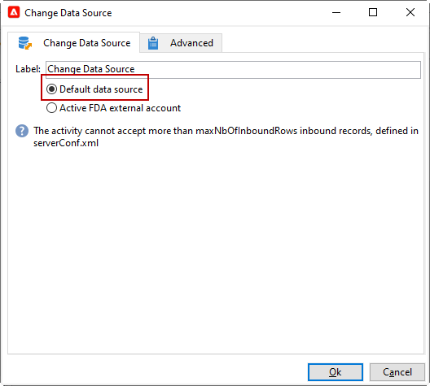

# 데이터 소스 변경 {#change-data-source}

>[!NOTE]
>
> **[!UICONTROL Change data source]** 활동은 **[!UICONTROL Access to external data (Federated Data Access)]** 패키지만 사용할 수 있습니다. Adobe Campaign Classic 기본 제공 패키지에 대한 자세한 내용은 이 [page](../../installation/using/installing-campaign-standard-packages.md)을 참조하십시오.

**[!UICONTROL Change data source]** 활동을 사용하면 워크플로우 **[!UICONTROL Working table]**&#x200B;의 데이터 소스를 변경할 수 있습니다. 이렇게 하면 FDA, FFDA 및 로컬 데이터베이스와 같은 다양한 데이터 소스에서 데이터를 관리할 수 있는 유연성이 높아집니다.

Adobe Campaign Classic 워크플로우에서는 **[!UICONTROL Working table]**을(를) 통해 데이터를 처리하고 워크플로우 활동과 데이터를 공유할 수 있습니다.
기본적으로 **[!UICONTROL Working table]**&#x200B;은(는) 우리가 쿼리하는 데이터의 소스와 동일한 데이터베이스에 만들어집니다.

예를 들어 클라우드 데이터베이스에 저장된 **[!UICONTROL Profiles]** 테이블을 쿼리할 때 동일한 클라우드 데이터베이스에 **[!UICONTROL Working table]**을(를) 만듭니다.
이를 변경하려면 **[!UICONTROL Change Data Source]** 활동을 추가하여 **[!UICONTROL Working table]** 의 다른 데이터 소스를 선택할 수 있습니다.

**[!UICONTROL Change Data Source]** 활동을 사용할 때는 워크플로우 실행을 계속하려면 클라우드 데이터베이스로 다시 전환해야 합니다.

**[!UICONTROL Change Data Source]** 활동을 사용하려면

1. 워크플로우 만들기.

1. **[!UICONTROL Query]** 활동을 사용하여 타겟팅된 수신자를 쿼리합니다.

   **[!UICONTROL Query]** 활동에 대한 자세한 내용은 이 [page](../../workflow/using/query.md#creating-a-query)를 참조하십시오.

1. **[!UICONTROL Targeting]** 탭에서 **[!UICONTROL Change data source]** 활동을 추가합니다.

   

1. **[!UICONTROL Change data source]** 활동을 두 번 클릭하여 **[!UICONTROL Default data source]** 을 선택합니다.

   쿼리 결과가 포함된 작업 테이블이 기본 PostgreSQL 데이터베이스로 이동합니다.

   

1. **[!UICONTROL Actions]** 탭에서 **[!UICONTROL JavaScript code]** 활동을 끌어다 놓아 작업 테이블에서 단일 작업을 수행합니다.

   **[!UICONTROL JavaScript code]** 활동에 대한 자세한 내용은 [JavaScript 코드 및 고급 JavaScript 코드](../../workflow/using/sql-code-and-javascript-code.md#javascript-code) 페이지를 참조하십시오.

1. 다른 **[!UICONTROL Change data source]** 활동을 추가하여 클라우드 데이터베이스로 다시 전환합니다.

1. 활동을 두 번 클릭하고 **[!UICONTROL Active FDA external account]** 을 선택한 다음 해당 **[!UICONTROL External database]** 외부 계정을 선택합니다.

   

1. 이제 워크플로우를 시작할 수 있습니다.
