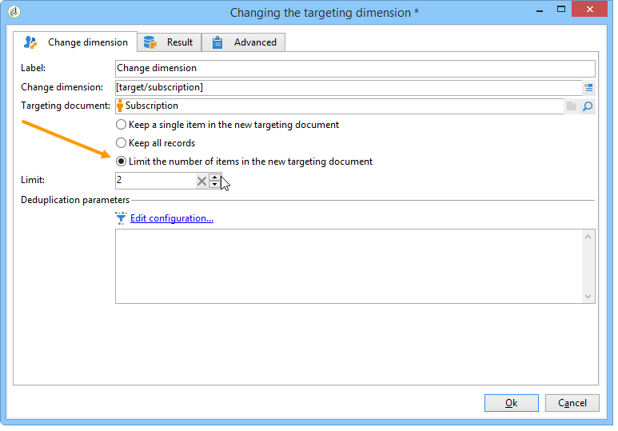

# 차원 변경{#change-dimension}

변경 차원 활동을 사용하면 대상 구성 주기 동안 타깃팅 차원을 변경할 수 있습니다. 축 이동은 데이터 템플릿 및 입력 차원에 따라 다릅니다. 예를 들어 &quot;계약&quot; 차원에서 &quot;고객&quot; 차원으로 전환할 수 있습니다.

이 활동을 사용하여 새 대상의 추가 열을 정의할 수도 있습니다.

데이터 중복 제거 기준을 정의할 수 있습니다.

## 구성 모드 {#configuration-mode}

차원 변경 활동을 구성하려면 다음 단계를 적용합니다.

1. 필드를 통해 새 타깃팅 차원을 **[!UICONTROL Change dimension]** 선택합니다.

   

1. 치수 변경 중에 모든 요소를 유지하거나 출력에서 유지할 요소를 선택할 수 있습니다. 다음 예에서 최대값입니다. 중복 수는 2로 설정됩니다.

   

   한 개의 레코드만 유지하도록 선택하면 작업 스키마에 컬렉션이 표시됩니다.이 컬렉션은 하나의 레코드만 보관되므로 최종 결과에서 타깃팅되지 않는 모든 레코드를 나타냅니다. 다른 모든 컬렉션과 마찬가지로 이 컬렉션도 합계를 계산하거나 열의 정보를 복구할 수 있습니다.

   예를 들어 **[!UICONTROL Customers]** 차원을 **[!UICONTROL Recipients]** 차원으로 변경하는 경우 특정 스토어의 고객을 타깃팅하고 구매 수를 추가할 수 있습니다.

1. 이 정보를 모두 보존하지 않도록 선택한 경우 복제 관리 모드를 구성할 수 있습니다.

   

   파란색 화살표를 사용하면 중복 처리 우선 순위를 정의할 수 있습니다.

   위의 예에서, 수신자는 먼저 이메일 주소에 대한 중복을 제거한 다음, 필요한 경우 계정 번호로 중복 제거됩니다.

1. 이 **[!UICONTROL Result]** 탭에서는 추가 정보를 추가할 수 있습니다.

   예를 들어, Substring 유형 함수를 사용하여 우편 번호를 기반으로 하는 군을 복구할 **수** 있습니다. 이렇게 하려면:

   * 링크를 클릭하고 **[!UICONTROL Add data...]** 선택합니다 **[!UICONTROL Data linked to the filtering dimension]**.

      

      >[!NOTE]
      >
      >추가 열 만들기 및 관리에 대한 자세한 내용은 데이터 [추가를 참조하십시오](../../workflow/using/query.md#adding-data).

   * 이전 타깃팅 차원(축 전환 전)을 선택하고 **[!UICONTROL Zip Code]** 수신자의 **[!UICONTROL Location]** 하위 트리에서 을 선택한 다음 을 클릭합니다 **[!UICONTROL Edit expression]**.

      

   * 을 **[!UICONTROL Advanced selection]** 클릭하고 **[!UICONTROL Edit the formula using an expression]**&#x200B;선택합니다.

      

   * 목록에 제공된 함수를 사용하고 수행할 계산을 지정합니다.

      

   * 마지막으로 방금 만든 열의 레이블을 입력합니다.

      

1. 워크플로우를 실행하여 이 구성의 결과를 봅니다. 다음 예에서 보듯이 차원 변경 활동 전후의 표의 데이터를 비교하고 워크플로우 테이블의 구조를 비교합니다.

   

   

