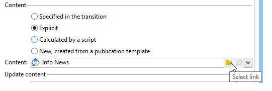

# 컨텐츠 관리{#content-management}

컨텐츠 **관리** 활동을 사용하면 컨텐츠를 만들고 조작하며 이 컨텐츠를 기반으로 파일을 생성할 수 있습니다. 그런 다음 이 컨텐츠를 &#39;배달&#39; 활동을 통해 전달할 수 있습니다.

>[!CAUTION]
>
>컨텐츠 관리는 선택 사항인 Adobe Campaign 모듈입니다. 사용권 계약을 확인하십시오.

활동의 속성은 다음 세 단계로 구분됩니다.

* **컨텐츠 선택**:컨텐츠는 이전에 만들어졌거나 활동을 통해 만들 수 있습니다.
* **컨텐츠 업데이트**:작업은 컨텐츠의 제목을 수정하거나 모든 XML 컨텐츠를 가져올 수 있습니다.
* **작업**:결과 컨텐츠를 저장하거나 생성할 수 있습니다.

   

   Adobe Campaign에서 컨텐츠 관리 구성 및 사용에 대한 자세한 내용은 이 [섹션을](../../delivery/using/about-content-management.md)참조하십시오.

1. **컨텐츠**

   * **[!UICONTROL Specified in the transition]**

      이 옵션을 사용하면 변환에 지정된 컨텐츠(예: 컨텐츠 관리를 활성화하는 이벤트에 **[!UICONTROL contentId]** 변수 포함)를 사용할 수 있습니다. 이 변수는 이전 컨텐츠 관리 또는 스크립트에서 설정할 수 있습니다.

   * **[!UICONTROL Explicit]**

      이 옵션을 사용하면 **[!UICONTROL Content]** 필드를 통해 이미 만든 컨텐츠를 선택할 수 있습니다. 이 필드는 **[!UICONTROL Explicit]** 옵션을 선택한 경우에만 표시됩니다.

      

   * **[!UICONTROL Calculated by a script]**

      컨텐츠 식별자는 스크립트로 계산됩니다. 이 **[!UICONTROL Script]** 필드를 사용하면 컨텐츠의 식별자(기본 키)를 평가하는 JavaScript 템플릿을 정의할 수 있습니다. 이 필드는 **[!UICONTROL Calculated by a script]** 옵션을 선택한 경우에만 표시됩니다.

      

   * **[!UICONTROL New, created from a publication template]**

      게시 템플릿에서 새 컨텐츠를 만듭니다. 이 새 컨텐츠는 **[!UICONTROL String]** 필드에 지정된 파일에 저장됩니다. 이 **[!UICONTROL Template]** 필드는 컨텐츠를 만드는 데 사용할 게시 템플릿을 지정합니다.

      

1. **콘텐츠 업데이트**

   * **[!UICONTROL Subject]**

      이 필드를 사용하면 컨텐츠의 제목을 수정할 수 있습니다.

   * **[!UICONTROL Access to data from an XML feed]**

      이 옵션을 사용하면 XSL 스타일시트를 통해 다운로드한 XML 문서에서 컨텐츠를 만들 수 있습니다. 이 옵션을 선택하면 이 **[!UICONTROL URL]** 필드는 XML 내용 다운로드 URL을 지정합니다. 를 **[!UICONTROL XSL stylesheet]** 사용하면 다운로드한 XML 문서를 변형하는 데 사용할 스타일시트를 지정할 수 있습니다. 이 속성은 선택 사항입니다.

      

1. **실행할 작업**

   * **[!UICONTROL Save]**

      이 옵션을 사용하면 만들거나 수정한 컨텐츠가 저장됩니다.

      아웃바운드 전환은 한 번만 활성화되며, 컨텐츠는 **[!UICONTROL contentId]** 변수에 매개 변수로 저장됩니다.

   * **[!UICONTROL Generate]**

      이 옵션을 사용하면 컨텐츠를 저장한 다음 &#39;파일&#39; 형식 게시를 사용하여 각 변형 템플릿의 출력 파일을 생성합니다.

      

      아웃바운드 전환은 변수에 저장된 컨텐츠의 식별자로 생성된 각 파일에 대해 **[!UICONTROL contentId]** 매개 변수 및 **[!UICONTROL filename]** 변수의 파일 이름으로 활성화됩니다.

## 입력 매개 변수 {#input-parameters}

* contentId

옵션이 활성화된 경우 사용할 컨텐츠의 **[!UICONTROL Specified in the transition]** 식별자입니다.

## 출력 매개 변수 {#output-parameters}

* contentId

   콘텐츠 식별자.

* 파일

   선택한 작업이 있는 경우 생성된 파일의 전체 이름입니다 **[!UICONTROL Generate]**.

## 예 {#examples}

예는 이 [섹션에](../../delivery/using/automating-via-workflows.md#examples)있습니다.
