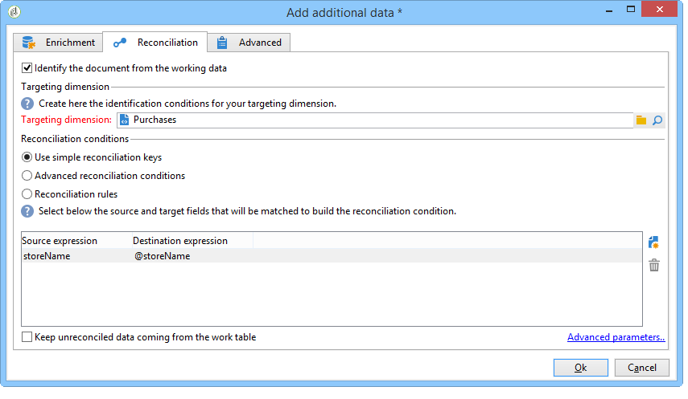
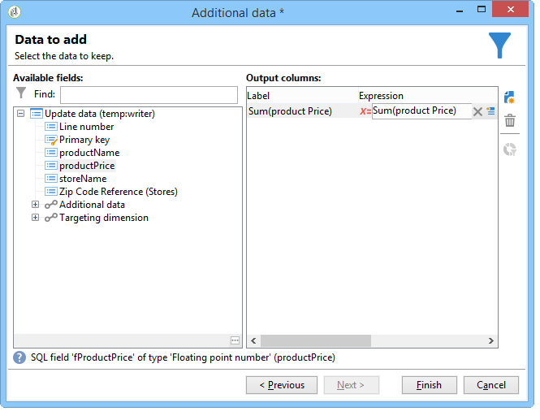

# 요약 목록 만들기{#creating-a-summary-list}

이 사용 사례에서는 파일을 수집하고 여러 가지 추가 작업을 수행한 후 요약 목록을 만들 수 있는 워크플로우 작성을 자세히 설명합니다. 이 예제는 스토어에서 구매한 연락처 목록을 기반으로 합니다.


다음 데이터 구조가 사용됩니다.


그 목적은 다음과 같다.

* 농축활동의 다양한 옵션을 사용하려면
* 조정 후 데이터베이스의 데이터를 업데이트하려면
* 농축된 데이터의 전역 &quot;보기&quot;를 만들려면

요약 목록을 만들려면 다음 단계를 따라야 합니다.

1. 워크플로우의 작업 테이블에서 &quot;구매&quot; 파일 수집 및 로드
1. 참조 테이블에 대한 링크를 만들어 가져온 데이터 강화
1. &quot;구매&quot; 테이블을 더 많은 데이터로 업데이트
1. &quot;구매&quot; 테이블의 집계 계산으로 &quot;연락처&quot; 데이터 달성
1. 요약 목록 만들기

## 1단계:파일 로드 및 가져온 데이터 조정 {#step-1--loading-the-file-and-reconciling-the-imported-data}

로드할 데이터는 다음과 같은 형식의 &quot;구매&quot; 관련 데이터입니다.

```
Product Name;Product price;Store
Computer;2000;London 3
Tablet;600;Cambridge
Computer;2000;London 5
Comptuer;2000;London 8
Tablet;600;Cambridge
Phone;500;London 5
```

이 데이터는 &quot;Purchases.txt&quot; 텍스트 파일에 포함되어 있습니다.

1. 파일 **수집기** 및 데이터 **로드(파일)** 활동을 워크플로우에 추가합니다.

   파일 **수집** 활동을 사용하면 Adobe Campaign 서버에서 파일을 수집하고 전송할 수 있습니다.

   데이터 **로드(파일)** 활동을 사용하면 워크플로우의 작업 테이블을 수집한 데이터로 보완할 수 있습니다.

   이 활동에 대한 자세한 내용은 [파일에서](../../workflow/using/importing-data.md#loading-data-from-a-file)데이터 로드를 참조하십시오.

1. 선택한 **디렉토리에서 텍스트(*.txt) 유형 파일을 수집하도록 파일 수집** 활동을 구성합니다.

   

   파일 **수집** 작업을 사용하면 소스 디렉토리에 파일이 없는 것을 관리할 수 있습니다. 이렇게 하려면 **[!UICONTROL Process file nonexistence]** 옵션을 선택합니다. 이 워크플로우에서 **다른 파일** 컬렉션이 컬렉션 시 디렉터리에서 누락된 경우 다른 파일 컬렉션을 시도하기 위해 대기 활동이 추가되었습니다.

1. 가져올 **데이터와 동일한 형식의 샘플 파일을 사용하여 데이터 로드(파일)** 활동을 구성합니다.

   

   &quot;구매&quot; 테이블의 내부 이름 및 레이블을 사용하여 열 이름을 변경하려면 이 **[!UICONTROL Click here to change the file format...]** 링크를 클릭합니다.

   

데이터를 가져오면 &quot;Stores&quot; 스키마와 일치하는 참조 테이블에 대한 링크를 만들어 데이터 농축이 수행됩니다.

추가 활동을 추가하고 다음과 같이 구성합니다.

1. 데이터 로드(파일) **활동에서 데이터로 구성된 기본 세트를 선택합니다** .

   

1. 을 **[!UICONTROL Add data]**&#x200B;클릭한 다음 **[!UICONTROL A link]** 옵션을 선택합니다.

   

1. 옵션을 **[!UICONTROL Define a collection]** 선택합니다.
1. &quot;Stores&quot; 스키마를 대상으로 선택합니다.

   

다양한 유형의 링크에 대한 자세한 내용은 데이터 [강화 및 수정을 참조하십시오](../../workflow/using/targeting-data.md#enriching-and-modifying-data).

다음 창에서 소스 필드(기본 세트에서)와 대상 필드(&quot;스토어&quot; 스키마에 속함)를 선택하여 연결 조건을 만들어야 데이터 조정을 구성할 수 있습니다.


이제 링크가 만들어지면 &quot;스토어&quot; 스키마에서 워크플로우의 작업 테이블에 열을 추가합니다.&quot;ZipCode Reference&quot; 필드.

1. 농축 활동 공개
1. 클릭 **[!UICONTROL Edit additional data]**.
1. &quot;ZipCode Reference&quot; 필드를 에 **[!UICONTROL Output columns]**&#x200B;추가합니다.


이 데이터 추가 후 워크플로우의 작업 표에 있는 데이터는 다음과 같습니다.


## 2단계:&#39;구매&#39; 표에 농축된 데이터 쓰기 {#step-2--writing-enriched-data-to-the--purchases--table}

이 단계에서는 &quot;구매&quot; 테이블에 가져온 및 상위 데이터를 작성하는 방법에 대해 자세히 설명합니다. 이렇게 하려면 데이터 업데이트 **활동을** 사용해야 합니다.

Purchases 테이블의 데이터가 업데이트되기 전에 워크플로우의 작업 **테이블** 데이터와 구매 타깃팅 차원의 데이터 **간** 조정이수행되어야 합니다.

1. 농축 활동의 **[!UICONTROL Reconciliation]** 탭을 클릭합니다.
1. 이 경우 타깃팅 차원인 &quot;구매&quot; 스키마를 선택합니다.
1. 워크플로 테이블의 데이터에 대해 &quot;소스 식&quot;을 선택합니다(이 경우 &quot;storeName&quot; 필드).
1. &quot;구매&quot; 테이블(이 경우 &quot;storename&quot; 필드)에서 데이터에 대한 &quot;대상 표현식&quot;을 선택합니다.
1. 옵션을 **[!UICONTROL Keep unreconciled data coming from the work table]** 선택합니다.



데이터 **업데이트** 활동에서 다음 구성이 필요합니다.

1. 파일이 수집될 때마다 새 레코드가 생성되지 않도록 하려면 **[!UICONTROL Insert or update]** **[!UICONTROL Operation type]** 필드에서 옵션을 선택합니다.
1. 옵션의 **[!UICONTROL By directly using the targeting dimension]** 값을 선택합니다 **[!UICONTROL Record identification]** .
1. &quot;구매&quot; 스키마를 **[!UICONTROL Document type]**&#x200B;선택합니다.
1. 업데이트할 필드 목록을 지정합니다. 이 **[!UICONTROL Destination]** 열을 사용하여 &quot;구매&quot; 스키마의 필드를 정의할 수 있습니다. 이 **[!UICONTROL Expression]** 열을 사용하면 작업 테이블에서 매핑을 수행할 필드를 선택할 수 있습니다.
1. 옵션을 **[!UICONTROL Generate an outbound transition]** 클릭합니다.


## 3단계:&#39;연락처&#39; 데이터 강화 {#step-3--enriching--contact--data-}

&quot;연락처&quot; 스키마는 물리적으로 &quot;구매&quot; 스키마에 연결됩니다. 즉, &quot;강화&quot; 옵션의 다른 옵션을 사용할 수 있습니다.필터링 차원에 연결된 데이터 추가

이 두 번째 데이터 농축의 목적은 구매 스키마에서 합계를 만들어 식별된 각 연락처의 총 구매 금액을 계산하는 것입니다.

1. 저장된 모든 연락처를 복구할 수 있는 **쿼리** 유형 활동을 **추가합니다** .
1. 추가 **활동을** 추가한 다음 이전 질의의 결과 기본 세트를 선택합니다.
1. 추가를 **[!UICONTROL Data]**&#x200B;클릭합니다.
1. 옵션을 **[!UICONTROL Data linked to the targeting dimension]** 클릭합니다.
1. 창에서 **[!UICONTROL Data linked to the filtering dimension]** 옵션을 **[!UICONTROL Select fields to add]** 클릭합니다.
1. 노드를 **[!UICONTROL Purchases]** 선택한 다음 을 클릭합니다 **[!UICONTROL Next]**.

   

1. 옵션을 선택하여 **[!UICONTROL Collected data]** 필드를 **[!UICONTROL Aggregates]** 변경합니다.

   

1. 클릭 **[!UICONTROL Next]**.
1. 다음 표현식을 추가하여 각 연락처에 대한 구매 합계를 계산합니다.&quot;Sum(@prodprice)&quot;.

   

요약 목록을 준비하려면 &quot;구매&quot; 필드와 첫 번째 자료 획득 필드에서 필드를 추가해야 합니다.&quot;ZipCode Reference&quot; 필드.

1. 농축활동의 링크를 **[!UICONTROL Edit additional data...]** 클릭합니다.
1. &quot;스토어 이름&quot; 및 &quot;구매/우편번호 참조&quot; 필드를 추가합니다.

   

1. 탭을 **[!UICONTROL Properties]** 클릭합니다.
1. 두 번째 링크를 변경하여 한 줄만 만듭니다.

   

## 4단계:요약 목록 만들기 및 추가 {#step-4--creating-and-adding-to-a-summary-list}

마지막 단계는 모든 풍부해진 데이터를 목록에 쓰는 것입니다.

1. 워크플로우에 **목록 업데이트** 활동을 추가합니다. 이 활동은 두 번째 농축 활동의 아웃바운드 전환과 연결되어 있어야 합니다.
1. 옵션을 **[!UICONTROL Create the list if necessary (Calculated name)]** 선택합니다.
1. 계산된 이름의 값을 선택합니다. 목록에 대해 선택한 레이블은 현재 날짜입니다.&lt;%= formatDate(new Date(), &quot;%2D/%2M/%2Y&quot;) %>

워크플로우가 실행되면 목록에 다음이 포함됩니다.

* 연락처 목록,
* &quot;총 구매&quot; 열,
* &quot;스토어 이름&quot; 열,
* 저장소 참조 스키마에 들어 있는 모든 저장소에 대해 입력한 &quot;우편번호 참조&quot; 열.


