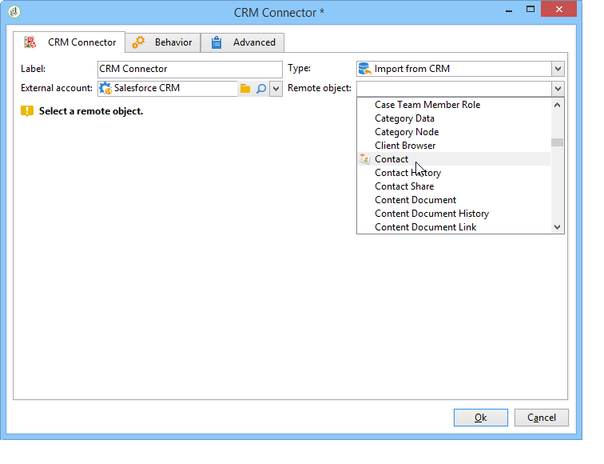

# CRM 커넥터{#crm-connector}

**CRM 커넥터** 활동을 사용하면 Adobe Campaign과 CRM 시스템 간의 데이터 동기화를 구성할 수 있습니다.

Adobe Campaign의 CRM 커넥터에 대한 자세한 내용은 이 [섹션](../../platform/using/crm-connectors.md)을 참조하십시오.

이 활동을 사용하여 다음을 수행할 수 있습니다.

* CRM에서 가져오기
* CRM으로 내보내기
* CRM에서 삭제된 개체 가져오기
* CRM에서 개체 삭제

동기화를 구성할 CRM과 일치하는 외부 계정을 선택한 다음 동기화할 개체(계정, 기회, 연락처 등)를 선택합니다.

이 활동의 구성은 수행하는 프로세스에 따라 달라집니다. 다양한 구성이 이 페이지](../../platform/using/crm-data-sync.md)에 자세히 설명되어 있습니다.[
