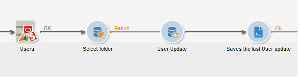

# CRM 커넥터{#crm-connector}

CRM **커넥터를** 사용하면 Adobe Campaign과 CRM 간의 데이터 동기화를 구성할 수 있습니다.

Adobe Campaign의 CRM 커넥터에 대한 자세한 내용은 이 [섹션을](../../platform/using/crm-connectors.md)참조하십시오.

즉, 다음을 수행할 수 있습니다.

* CRM에서 가져오기(CRM에서 [가져오기 참조](#importing-from-the-crm)),
* CRM으로 내보내기(CRM으로 [내보내기 참조](#exporting-to-the-crm)),
* CRM에서 삭제된 개체 가져오기(CRM [에서 삭제된 개체 가져오기 참조](#importing-objects-deleted-in-the-crm)),
* CRM에서 개체를 삭제합니다(CRM [에서 개체 삭제 참조](#deleting-objects-in-the-crm)).


동기화를 구성할 CRM과 일치하는 외부 계정을 선택한 다음 동기화할 객체(계정, 기회, 연락처 등)를 선택합니다.


이 활동의 구성은 수행할 프로세스에 따라 달라집니다. 다양한 구성은 아래에 자세히 설명되어 있습니다.

## CRM에서 가져오기 {#importing-from-the-crm}

Adobe Campaign에서 CRM을 통해 데이터를 가져오려면 다음 유형의 워크플로우를 만들어야 합니다.



가져오기 작업의 경우 CRM 커넥터 **활동** 구성 단계는 다음과 같습니다.

1. 작업을 **[!UICONTROL Import from the CRM]** 선택합니다.
1. 드롭다운 **[!UICONTROL Remote object]** 목록으로 이동하여 프로세스에 해당하는 객체를 선택합니다. 이 개체는 커넥터 구성 중에 Adobe Campaign에서 만든 테이블 중 하나와 일치합니다.
1. 섹션으로 **[!UICONTROL Remote fields]** 이동하여 가져올 필드를 입력합니다.

   필드를 추가하려면 도구 모음에서 **[!UICONTROL Add]** 단추를 클릭한 다음 **[!UICONTROL Edit expression]** 아이콘을 클릭합니다.

   

   필요한 경우 **[!UICONTROL Conversion]** 열의 드롭다운 목록을 통해 데이터 형식을 변경합니다. 가능한 전환 유형은 이 [페이지에](../../platform/using/crm-connectors.md#data-format)자세히 설명되어 있습니다.

   >[!CAUTION]
   >
   >CRM과 Adobe Campaign에서 개체를 연결하려면 CRM의 레코드 식별자가 필수적입니다. 활동이 승인되면 자동으로 추가됩니다.
   > 
   >CRM 측의 마지막 수정 날짜도 증분 데이터 가져오기에 필수입니다.

1. 필요에 따라 가져올 데이터를 필터링할 수도 있습니다. 이렇게 하려면 **[!UICONTROL Edit the filter...]** 링크를 클릭합니다.

   다음 예에서 Adobe Campaign은 2012년 7월 31일 이후 일부 활동이 기록된 연락처만 가져옵니다.

   

   데이터 필터링 모드에 연결된 제한 사항은 데이터 [](#filter-on-data) 필터링 섹션에서 자세히 설명합니다.

1. 이 **[!UICONTROL Use automatic index]** 옵션을 사용하면 날짜와 마지막 수정 사항에 따라 CRM과 Adobe Campaign 간의 증분 객체 동기화를 자동으로 관리할 수 있습니다.

   자세한 내용은 변수 관리를 [참조하십시오](#variable-management).

## 변수 관리 {#variable-management}

이 **[!UICONTROL Automatic index]** 옵션을 활성화하면 마지막 가져오기 이후 수정된 개체만 수집할 수 있습니다.


마지막 동기화 날짜는 기본적으로 구성 창에 지정된 옵션에 저장됩니다.

```
LASTIMPORT_<%=instance.internalName%>_<%=activityName%>
```

가장 최근 변경 사항을 식별하기 위해 고려할 원격 CRM 필드를 지정할 수 있습니다.

기본적으로 다음 필드가 지정된 순서로 사용됩니다.

* Microsoft Dynamics: **수정**&#x200B;사항,
* Oracle On Demand의 경우마지막 **업데이트**, **수정**&#x200B;날짜, **마지막 로그인**,
* Salesforce.com의 경우:LastModifiedDate **,** SystemMostamp ****.

옵션을 활성화하면 **[!UICONTROL Automatic index]** **[!UICONTROL JavaScript code]** 유형 활동을 통해 동기화 워크플로우에 사용할 수 있는 세 가지 변수가 생성됩니다. 이러한 활동은 다음과 같습니다.

* **varscrmOptionName**:마지막 가져오기 날짜가 포함된 옵션의 이름을 나타냅니다.
* **vars.crmStartImport**:마지막 데이터 복구의 시작 날짜(포함)를 나타냅니다.
* **vars.crmEndDate**:마지막 데이터 복구의 종료 날짜(제외)를 나타냅니다.

   이러한 날짜는 다음 형식으로 표시됩니다.yyyy/ **MM/dd hh:mm:ss**.

## 데이터 필터링 {#filter-on-data}

다양한 CRM을 사용하여 효율적으로 작업하려면 다음 규칙을 사용하여 필터를 만들어야 합니다.

* 각 필터링 수준에는 논리 연산자 하나만 사용할 수 있습니다.
* EXCEPT(AND NOT) 연산자는 지원되지 않습니다.
* 비교는 null 값(&#39;is empty&#39;/&#39;is not empty&#39; type) 또는 숫자만 고려해야 할 수 있습니다. 즉, 열(오른쪽 열)을 **[!UICONTROL Value]** 평가한 후 이 평가의 결과는 숫자여야 합니다.
* 열의 데이터는 **[!UICONTROL Value]** JavaScript로 평가됩니다.
* JOIN 비교는 지원되지 않습니다.
* 왼쪽 열의 표현식은 필드여야 합니다. 여러 표현식, 숫자 등의 조합일 수 없습니다.

예를 들어, 다음과 같은 이유로 아래 설명된 필터링 조건은 CRM을 가져올 때 유효하지 않습니다.

* OR 연산자는 AND 연산자와 동일한 수준에 배치됩니다.
* 텍스트 문자열에서 비교가 수행됩니다.


## 정렬 기준 {#order-by}

Microsoft Dynamics 및 Salesforce.com에서는 가져올 원격 필드를 오름차순이나 내림차순으로 정렬할 수 있습니다.

이렇게 하려면 **[!UICONTROL Order by]** 링크를 클릭하고 열을 목록에 추가합니다.

목록의 열 순서는 정렬 순서입니다.


## 기록 식별 {#record-identification}

CRM에 포함된(및 필터링될 수 있는) 요소를 가져오는 대신 워크플로우에서 미리 계산된 모집단을 사용할 수 있습니다.

이렇게 하려면 **[!UICONTROL Use the population calculated upstream]** 옵션을 선택하고 원격 식별자가 들어 있는 필드를 지정합니다.

그런 다음 가져올 인바운드 모집단의 필드를 다음과 같이 선택합니다.


## CRM으로 내보내기 {#exporting-to-the-crm}

Adobe Campaign 데이터를 CRM으로 내보내면 전체 컨텐츠를 CRM 데이터베이스에 복사할 수 있습니다.

데이터를 CRM으로 내보내려면 다음 유형의 워크플로우를 만들어야 합니다.


내보내기의 경우 다음 구성을 CRM 커넥터 **활동에 적용합니다** .

1. 작업을 **[!UICONTROL Export to CRM]** 선택합니다.
1. 드롭다운 **[!UICONTROL Remote object]** 목록으로 이동하여 프로세스에 해당하는 객체를 선택합니다. 이 개체는 커넥터 구성 중에 Adobe Campaign에서 만든 테이블 중 하나와 일치합니다.

   >[!CAUTION]
   >
   >CRM 커넥터 **작업의** 내보내기 기능은 CRM 측에서 필드를 삽입하거나 업데이트할 수 있습니다. CRM에서 필드 업데이트를 활성화하려면 원격 테이블의 기본 키를 지정해야 합니다. 키가 없으면 데이터가 삽입됩니다(업데이트되는 대신).

1. 섹션에서 내보낼 필드와 CRM에서 해당 매핑을 **[!UICONTROL Mapping]** 지정합니다.

   

   필드를 추가하려면 도구 모음에서 **[!UICONTROL Add]** 단추를 클릭한 다음 **[!UICONTROL Edit expression]** 아이콘을 클릭합니다.

   지정된 필드의 경우, CRM 측에 일치하는 항목이 정의되지 않은 경우 값을 업데이트할 수 없습니다.CRM에 바로 삽입됩니다.

   필요한 경우 **[!UICONTROL Conversion]** 열의 드롭다운 목록을 통해 데이터 형식을 변경합니다. 가능한 전환 유형은 이 [섹션에](../../platform/using/crm-connectors.md#data-format)자세히 설명되어 있습니다.

   내보낼 레코드 목록과 내보내기 결과는 워크플로우가 완료되거나 다시 시작될 때까지 액세스할 수 있는 임시 파일에 저장됩니다. 이렇게 하면 동일한 레코드를 여러 번 내보내거나 데이터를 잃을 위험이 없는 경우 오류가 발생하는 경우 프로세스를 다시 시작할 수 있습니다.

## 데이터 형식 및 오류 처리 {#data-format-and-error-processing}

CRM으로 또는 CRM에서 데이터 형식을 가져올 때 신속하게 변환할 수 있습니다.

이렇게 하려면 일치하는 열에 적용할 변환을 선택합니다.


이 **[!UICONTROL Default]** 모드는 자동 데이터 변환을 적용하며, 대부분의 경우 데이터의 복사/붙여넣기와 같습니다. 그러나 시간대 관리는 적용됩니다.

기타 가능한 변환은 다음과 같습니다.

* **[!UICONTROL Date only]**:이 모드에서는 날짜 + 시간 유형 필드가 삭제됩니다.
* **[!UICONTROL Without time offset]**:이 모드는 기본 모드에 적용된 표준 시간대 관리를 취소합니다.
* **[!UICONTROL Copy/Paste]**:이 모드에서는 문자열(변환 없음)과 같은 원시 데이터를 사용합니다.


데이터 가져오기 또는 내보내기 프레임워크 내에서 특정 프로세스를 오류 및 거부에 적용할 수 있습니다. 이렇게 하려면 **[!UICONTROL Process rejects]** 탭에서 **[!UICONTROL Process errors]** 및 **[!UICONTROL Behavior]** 옵션을 선택합니다.

이러한 옵션은 일치하는 아웃바운드 전환을 가져옵니다.


그런 다음 적용하려는 프로세스와 관련된 활동을 배치합니다.

인스턴스에 대한 오류를 처리하려면 대기 활동을 추가하고 워크플로우 재시도를 예약할 수 있습니다.

거부는 오류 코드와 관련 메시지와 함께 수집되므로 거부 추적을 설정하여 동기화 프로세스를 최적화할 수 있습니다.

이 **[!UICONTROL Process rejects]** 옵션이 활성화되지 않은 경우에도 오류 코드와 메시지와 함께 거부된 각 열에 대한 경고가 생성됩니다.

아웃바운드 **[!UICONTROL Reject]** 전환을 사용하면 오류 메시지 및 코드와 관련된 특정 열을 포함하는 출력 스키마에 액세스할 수 있습니다. 이러한 열은 다음과 같습니다.

* Oracle On Demand의 경우 **errorFilename** (Oracle 측의 로그 파일 이름), **errorCode** (오류 코드), **errorSymbol** (오류 기호, 오류 코드와 다름), **** errorMessage (오류 컨텍스트의 설명)
* Salesforce.com의 경우:error **기호** (오류 기호, 오류 코드와 다름), **errorMessage** (오류 컨텍스트에 대한 설명).

## CRM에서 삭제된 개체 가져오기 {#importing-objects-deleted-in-the-crm}

광범위한 데이터 동기화 프로세스를 설정하려면 CRM에서 삭제된 개체를 Adobe Campaign으로 가져올 수 있습니다.

이렇게 하려면 다음 단계를 적용합니다.

1. 작업을 **[!UICONTROL Import objects deleted in the CRM]** 선택합니다.
1. 드롭다운 **[!UICONTROL Remote object]** 목록으로 이동하여 프로세스에 해당하는 객체를 선택합니다. 이 개체는 커넥터 구성 중에 Adobe Campaign에서 만든 테이블 중 하나와 일치합니다.
1. 및 필드에서 고려할 삭제 기간을 **[!UICONTROL Start date]** 지정합니다 **[!UICONTROL End date]** . 이 날짜는 기간에 포함됩니다.

   

   >[!CAUTION]
   >
   >요소 삭제 기간은 CRM에 대한 제한 사항과 일치해야 합니다. 즉, Salesforce.com의 경우 30일 전에 삭제된 요소는 복구할 수 없습니다.

## CRM에서 개체 삭제 {#deleting-objects-in-the-crm}

CRM 측에서 개체를 삭제하려면 삭제할 원격 요소의 기본 키를 지정해야 합니다.


이 **[!UICONTROL Behavior]** 탭에서는 거부 처리를 활성화할 수 있습니다. 이 옵션은 **[!UICONTROL CRM connector]** 활동에 대한 두 번째 출력 전환을 생성합니다. For more on this, refer to this [section](../../platform/using/crm-connectors.md#error-processing).

이 옵션이 비활성화되어 있더라도 거부된 각 열에 대한 경고가 생성됩니다. **[!UICONTROL Process rejects]**

## 연락처 가져오기를 구성하는 방법의 예 {#example-of-how-to-configure-a-contact-import}

다음 예에서는 활동이 Oracle On Demand CRM에서 연락처를 가져오도록 구성됩니다. 가져오기 전에 CRM 필드가 Adobe Campaign 데이터베이스에 이미 존재하는 필드와 일치하도록 선택되었습니다.


