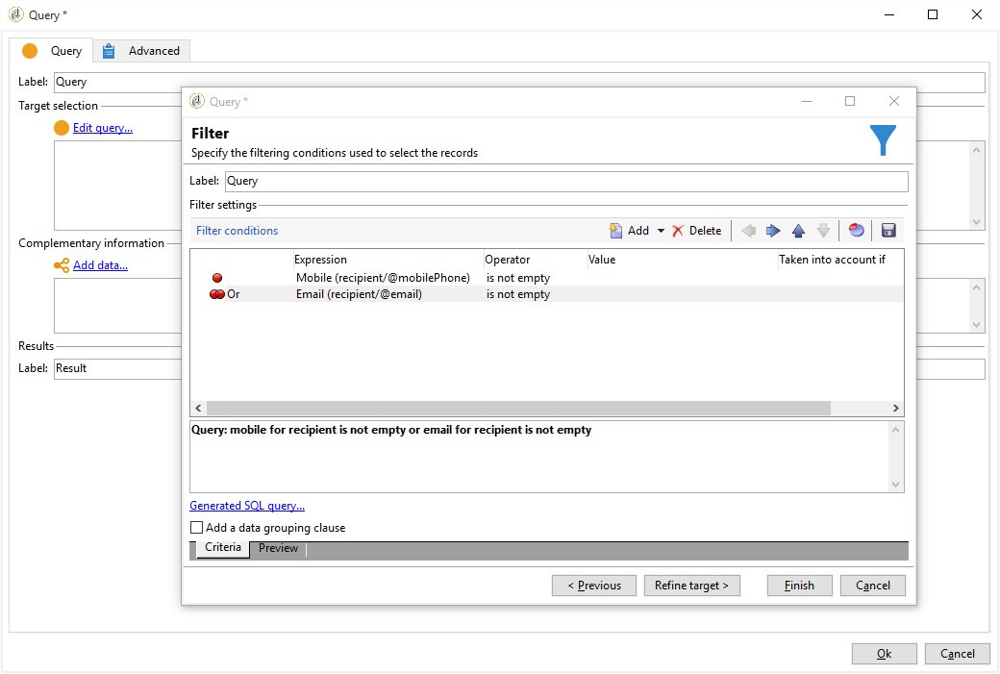

# 크로스 채널 게재{#cross-channel-deliveries}

크로스 채널 배달은 캠페인 워크플로우 활동의 **[!UICONTROL Deliveries]** 탭에서 사용할 수 있습니다.

특정 채널에 맞는 배달을 만들 수 있습니다. 클래식 배달 마법사와 같은 방법으로 배달을 기반으로 할 템플릿과 컨텐츠를 지정할 수 있습니다.

사용할 수 있는 다양한 채널은 다음과 같습니다.

* [이메일](../../delivery/using/about-email-channel.md)
* [DM](../../delivery/using/about-direct-mail-channel.md)
* [모바일](../../delivery/using/sms-channel.md)
* [Twitter](../../social/using/publishing-on-twitter.md)
* [Facebook](../../social/using/publishing-on-facebook.md)
* [iOS](../../delivery/using/creating-notifications.md#sending-notifications-on-ios)
* [Android](../../delivery/using/creating-notifications.md#sending-notifications-on-android)

다른 타깃팅 활동을 사용하여 워크플로우의 게재 업스트림에 대한 대상을 지정할 수 있습니다.

예를 들어 여기서는 푸시 알림 가입자를 위한 이메일 또는 SMS를 발송하는 워크플로우를 만든 다음 1주일 후에 푸시 알림을 전송하게 됩니다. 방법은 다음과 같습니다.

1. 캠페인 만들기.
1. 캠페인의 **[!UICONTROL Targeting and workflows]** 탭에서 작업 과정 **[!UICONTROL Query]** 에 아이콘을 추가합니다.
1. 쿼리를 구성합니다. 예를 들어, 여기에서 푸시 알림에 가입된 수신자를 대상 차원으로 선택합니다.

   >[!NOTE]
   >
   >푸시 알림의 경우 **가입자 애플리케이션** 대상 차원을 사용해야 합니다.

   

1. 쿼리에 필터 조건을 추가합니다. 이 경우 모바일 번호나 이메일 주소를 가진 수신자를 선택할 것입니다.

   

1. 워크플로우에 **[!UICONTROL Split]** 활동을 추가하여 모바일 번호가 있는 수신자와 이메일 주소가 있는 수신자를 나눌 수 있습니다.
1. 탭에서 **[!UICONTROL Delivery]** 각 대상에 대한 배달을 선택합니다.

   워크플로우에서 배달 활동을 두 번 클릭하여 클래식 배달 마법사와 같은 방식으로 배달을 만듭니다. 자세한 정보는 이 [페이지](../../delivery/using/about-email-channel.md)를 참조하십시오.

   

1. 받는 사람이 한 번에 너무 많은 배달을 받지 않도록 **[!UICONTROL Wait]** 활동을 추가하고 구성합니다.
1. iOS 또는 Android 모바일 애플리케이션의 가입자를 나누는 활동을 추가합니다. **[!UICONTROL Split]**

   각 운영 체제에 대한 서비스를 선택합니다. For more on service creation, refer to this [page](../../delivery/using/configuring-the-mobile-application.md).

   

1. 각 운영 체제에 대해 모바일 애플리케이션 제공을 선택하고 구성합니다.

   
